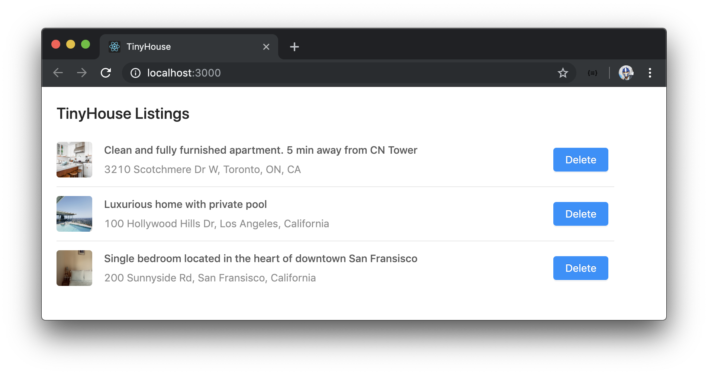

# TinyHouse Welcome

Welcome to **TinyHouse** - Newline's first Masterclass! In this Masterclass, we'll learn how to build production web apps using [**React**](http://reactjs.org), [**GraphQL**](https://graphql.org), [**Node**](https://nodejs.org), [**MongoDB**](https://www.mongodb.com), and [**TypeScript**](http://www.typescriptlang.org). The Masterclass is geared to be a hand's on, project-based experience and we're incredibly excited to have you with us!

We're your instructors for this course - Hassan and Jing. Between us, we've authored [Fullstack Vue](https://www.newline.co/vue), published a [series of different publications under the Fullstack/Newline umbrella](https://www.newline.co/30-days-of-vue/), worked on our own start-ups, and have built large-scale production apps with React, GraphQL, and TypeScript.

## Part I & Part II

We've broken the course down into two parts. In Part I, we introduce all of the core technologies we'll need to develop a full-stack web app. We'll learn about Node, TypeScript, GraphQL & Apollo, MongoDB, and React Hooks. We'll use these technologies to build a web app that presents listing data that is kept in a MongoDB database and accessed through a GraphQL API.

In Part II, we take everything we've learned from Part I to focus on building an actual production-ready application. We maintain and use all the things we learned in Part I but instead focus on building the **TinyHouse** application. We discuss the relationships and flow within our app as well as handle topics like [Google OAuth for Sign In](https://developers.google.com/identity/sign-in/web/backend-auth), [Google's Geocode ](https://developers.google.com/maps/documentation/geocoding/start) to resolve location-based searches, image storage with [Cloudinary](https://cloudinary.com), [Stripe](https://stripe.com/) for handling payments, [deployment](https://heroku.com) and more.

> Part II is currently under progress and is slated for completion in Q1 2020 ❄️!

## Newline

We're excited to launch our Masterclass on the [Newline](http://newline.co) platform. The Newline platform provides access to source code, screencast videos, and detailed manuscripts.

To reinforce learning material, the Masterclass also contains supplementary learning material such as quizzes, project challenges, lecture slides, and a lot more!

We're incredibly excited to have you and we'll see you in the course!

\--

**Hassan**, **Jing**, and **Nate**
