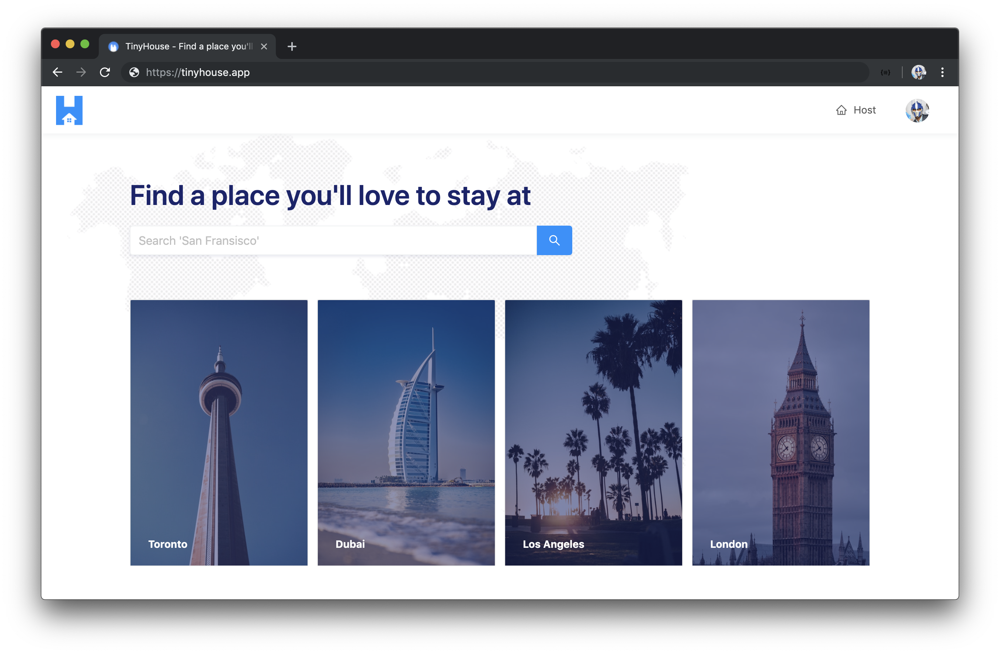

# Syllabus

Welcome to Newline's first Masterclass - **TinyHouse**.

TinyHouse is a structured, self-paced, online learning course designed to help you build a Universal JavaScript application. We'll be working with a variety of different technologies such as **React**, **GraphQL**, and **TypeScript** to learn how we can build a real home-sharing app including authentication, data persistence, payments, and deployment.

## Technologies

In this course, we learn how to build a full-stack JavaScript application with some of the most popular technologies being used today.

### React

We use [**React**](http://reactjs.org) extensively to build dynamic client UI and take a deep dive and use [**React Hooks**](https://reactjs.org/docs/hooks-intro.html) to manage _all_ component logic.

### Node

We create a web server with [**Node**](https://nodejs.org) and [**Express**](http://expressjs.com) to serve our GraphQL API and handle API requests by querying and manipulating data from the MongoDB database.

### GraphQL

We build a robust [**GraphQL**](https://graphql.org/) API within the Node environment. We first highlight the benefits of GraphQL over traditional REST APIs before using and implementing the GraphQL JavaScript library, the GraphQL Schema Language, GraphQL Scalar Types, Resolvers, etc.

### Apollo

With the help of the [**Apollo**](https://www.apollographql.com/) platform, we build a well documented, production-ready GraphQL API with the [**Apollo Server**](https://www.apollographql.com/docs/apollo-server/) package. We utilize [**React Apollo**](https://www.apollographql.com/docs/react/) (i.e. the Apollo Client utility) to have our React client request and cache data from the API and update the UI.

### MongoDB

We construct a [**MongoDB**](https://www.mongodb.com/) cluster and database with the database as a service, [**MongoDB Atlas**](https://www.mongodb.com/cloud/atlas). Querying and manipulation of data is done with the help of the official [**Node Mongo Driver**](https://mongodb.github.io/node-mongodb-native/).

### TypeScript

[**TypeScript**](http://www.typescriptlang.org/) is used extensively both on the client and the server to build a robust and type-safe application. We learn how to configure a project's TypeScript compiler, use basic types and advanced types, use the DefinitelyTyped repository, and see how TypeScript can be used within a JSX environment.

### Ant Design

We leverage and use the [**Ant Design**](https://ant.design/) React UI framework to help build presentable and beautiful React components.

## Part I

The TinyHouse course is broken down into **two parts**.

In **Part I**, we take an introductory approach to introduce all the different tools we'll need to build the TinyHouse application. We'll:

- Build our server with [Node](https://nodejs.org) & [Express](http://expressjs.com).
- Introduce and use [TypeScript](http://www.typescriptlang.org/).
- Set up a [GraphQL](https://graphql.org/) API with [Apollo Server](https://www.apollographql.com/docs/apollo-server/).
- Persist data with [MongoDB](https://www.mongodb.com/).
- Create a [React](http://reactjs.org) project with [`create-react-app`](https://github.com/facebook/create-react-app).
- Introduce and use [React Hooks](https://reactjs.org/docs/hooks-intro.html).
- Use [Apollo Client](https://apollographql.com/docs/react/) to make our GraphQL requests.
- Finally, use the [Ant Design UI](https://ant.design/) framework to help style our client application.

By the end of Part I, we'll have our React client application present a list of listings where the data is to live in a MongoDB collection. Our Node server will set up a GraphQL API where our client application will be able to query for listings or trigger a mutation to delete a certain listing.

Part I of the course contains:

- **65+ screencast videos** (over **7hrs of recorded material**).
- Detailed manuscript (and code) for **every single screencast** video.
- **110+** multiple choice quiz questions.
- In-depth challenge projects.
- **8+** PDF cheat sheets

## Part II

> Part II is currently under progress and is slated for completion in Q1 2020!

In **Part II**, we take everything we've learned from Part I of the course and focus our efforts on building the TinyHouse home sharing application. We'll:

- Establish client-side routing with [React Router](https://reacttraining.com/react-router/web/guides/quick-start).
- Handle authentication with [Google Sign In (and OAuth 2.0)](https://developers.google.com/identity/sign-in/web/sign-in).
- Permit persistent login sessions with cookies and session storage.
- Handle payments with [Stripe](http://stripe.com/).
- Enable location searching with [Google's Geocode API](https://developers.google.com/maps/documentation/geocoding/start).
- Handle image uploads with [Cloudinary](https://cloudinary.com/).
- Deploy with [Heroku](https://www.heroku.com/).

By the end of Part II, we'll have a fully functioning home-sharing application where users will be able to sign in, create a listing, and book other listings.

> **Markup (i.e. HTML) and CSS/styling is not a primary lesson of this course**. In Part II, we'll provide all the custom CSS we'll need from the beginning and move a little quicker in areas where we spend our time creating the HTML (i.e JSX) markup.

## Prerequisites

Students should have an understanding of HTML, CSS, and JavaScript. Prior development experience working with a newer front-end technology (e.g. React) and Git/NPM is preferable.

Students are assumed to understand spoken and written English.

## Course Material

Each part of the TinyHouse Masterclass is broken down into modules that each govern a section of the course that is to be addressed and learned. Course material contains the following:

- Screencast videos
- Manuscript
- Code samples
- Quiz questions
- Project challenges
- Cheatsheets
- Lecture slides

For every lesson, students are expected to proceed through the screencast video, survey the lesson manuscript, run code samples, and answer the lesson quiz questions to reinforce specific lesson topics.

## How we help

We've structured this course to be more than just screencast videos by providing a detailed manuscript, live code samples, and more.

- **Proceed at your own time**: We understand everyone has their own schedule which is why we've provided all the material for the course the moment you've enrolled. Feel free to venture through the material as fast as possible or to take your time.

- **Live online community**: Feel stuck somewhere or need guidance on a certain topic? Hop on to the **#tinyhouse** channel in our Discord organization where you'll be able to find help (and help others!). We (the instructors) will be on the channel as well.

While we've made every effort to be clear, precise, and accurate; you may find that when you're writing your code, you may find an inaccuracy in how we describe something or feel a concept can be made more clear. If so, email us at [us@fullstack.io](us@fullstack.io)! Similarly, if you've found a bug in our code we want to hear about it.

## Part I Structure

In Part I, we introduce and learn all the patterns and concepts we’ll need to know to build the TinyHouse application. We'll focus our efforts to build a simple page that surfaces a list of rental listings kept in a MongoDB database and available through a GraphQL API.

### Module 1: Getting Started With Our Server

Node is a JavaScript runtime environment that was first introduced in 2009 by Ryan Dahl as a response to how slow web servers were at the time. We'll learn how to set up a Node web server with the help of the Express framework.

- Learn what Node is.
- Run JavaScript with Node.
- Create a minimal Node/Express server.
- Enable automatic reloading with Nodemon.
- Introduce TypeScript.
- Add TypeScript to our server.
- Compile our TypeScript project.
- Lint our code with ESLint.
- Introduce mock listings.
- Create GET and POST Express routes.

### Module 2: Comparing GraphQL/REST APIs

GraphQL is a powerful query language for APIs that allow client applications to request the specific data they need. In this module, we explain and introduce GraphQL and some of its core concepts.

- Learn what GraphQL is.
- Compare Github's REST & GraphQL APIs.
- Learn some of the core concepts of GraphQL.

### Module 3: Using Apollo Server

GraphQL, as a specification, can be implemented in many different programming languages. We'll create a GraphQL API with the Apollo Server package to interact with the mock data in our app.

- Install Apollo Server and GraphQL JS library.
- Create a GraphQL Schema with the GraphQL JS library.
- Query and mutate listings data with GraphQL.
- Recreate the Schema with the GraphQL Schema Language.

### Module 4: Storing Data with MongoDB

We move away from handling mock data and use a database to contain any data we want to be persisted in our application. We establish this database with MongoDB and use a database as a service known as MongoDB Atlas.

- Learn what MongoDB is and how non-relational databases work.
- Set up a new MongoDB Cluster with MongoDB Atlas.
- Connect the Node server with MongoDB with the official Node Mongo driver.
- Learn how TypeScript Generics can help add types to our database collections.
- Set up environment variables.
- Seed mock data to the database.
- Modularize our GraphQL Resolvers.

### Module 5: Getting Started with React

React is a JavaScript library for building interactive user interfaces. React changes the way we do front-end development by allowing us to build UI in a declarative manner, with reusable components, and the JSX syntax.

- Learn important React concepts.
- Use the `create-react-app` command line to scaffold a new Webpack bundled React application.
- Walkthrough the files and folder structure of a `create-react-app` scaffolded project.

### Module 6: Building out Listings

With our new React project created, we'll work towards having our React client app make API requests to our server through GraphQL.

- Create a functional `<Listings>` component.
- Investigate how we can type check for `props` in a component.
- Investigate how we can define the type of a functional component.
- Create a POST request to query listings information from the API.
- Abstract the type of data being requested with the help of Generics.
- Have the client be able to trigger the mutation to delete a listing.

### Module 7: GraphQL and React Hooks

React Hooks have been one of the biggest paradigm changes to the React ecosystem and are essentially functions that allow components to hook into specific features.

- Introduce and understand how React Hooks work.
- Use the `useState` Hook to track state in our component.
- Use the `useEffect` Hook to have our GraphQL query be made when our component first renders.
- Create and use a custom `useQuery` Hook to consolidate how components can execute GraphQL queries.
- Extrapolate the capability to refetch a query from the `useQuery` Hook.
- Have loading and error information be returned from the `useQuery` Hook.
- Create and use a custom `useMutation` Hook to consolidate how components can execute GraphQL mutations.
- Investigate and use React's `useReducer` Hook to handle state and state changes in a more controlled manner.

### Module 8: Introducing React Apollo

Though our custom Hooks implementation for interacting with the GraphQL API works, there are limitations for performing more complicated functionality which is why we'll switch over to using Apollo. Apollo Client from the Apollo ecosystem provides a declarative API and intelligent caching to help client applications query GraphQL fields in a predictable and declarative manner.

- Create our Apollo Client.
- Utilize and use React Apollo's Hooks to conduct GraphQL requests.
- Autogenerate TypeScript definitions with the Apollo CLI.

### Module 9: Styling with Ant Design

UI/CSS frameworks are packages containing pre-written, standardized, and often well-tested template and CSS code to help speed up development in providing a consistent UI experience. We introduce and use the Ant Design React UI framework to make our client look a lot more presentable.

- Discuss how certain UI/CSS frameworks work and introduce Ant Design.
- Utilize components from the Ant Design framework to style our client application.

## Part II Structure

> Part II is currently under progress and is slated for completion in Q1 2020!
