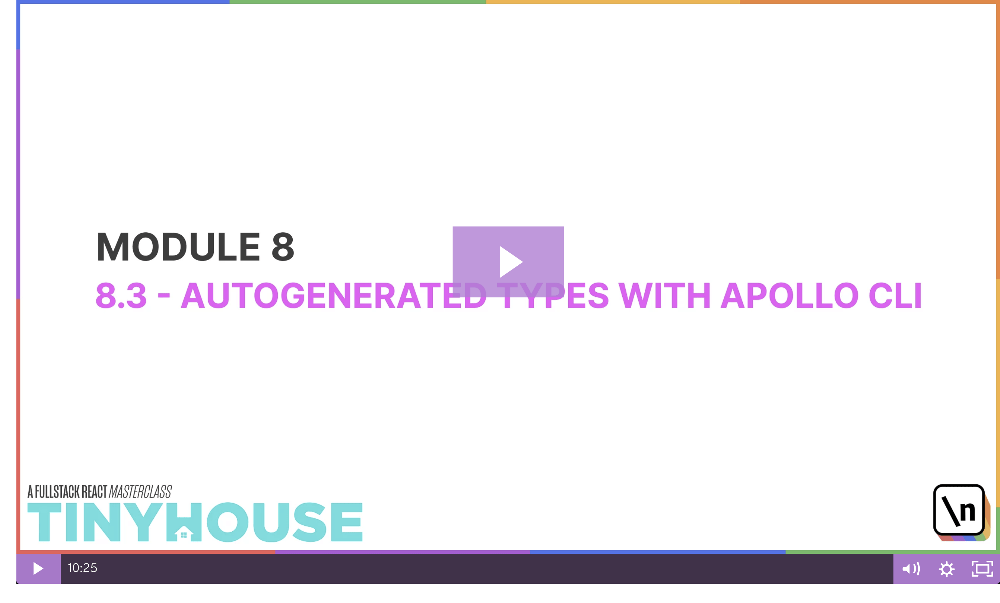
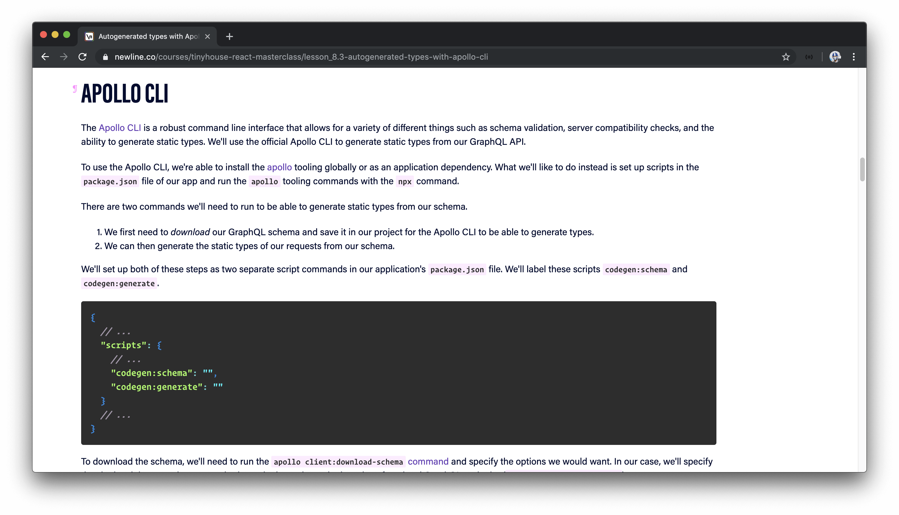
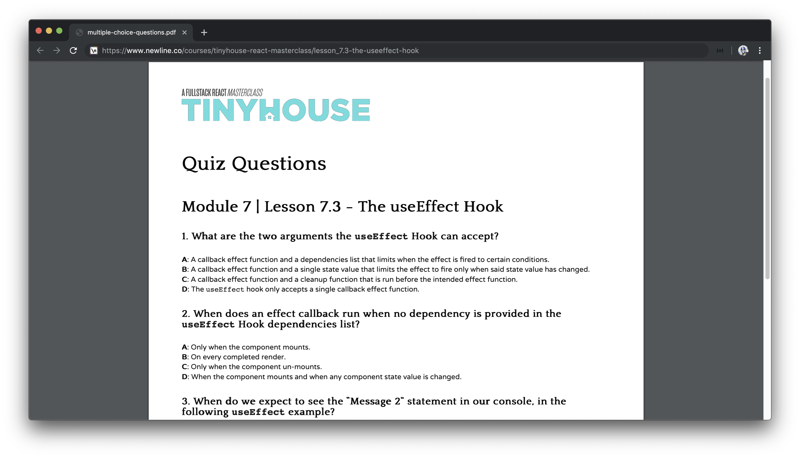
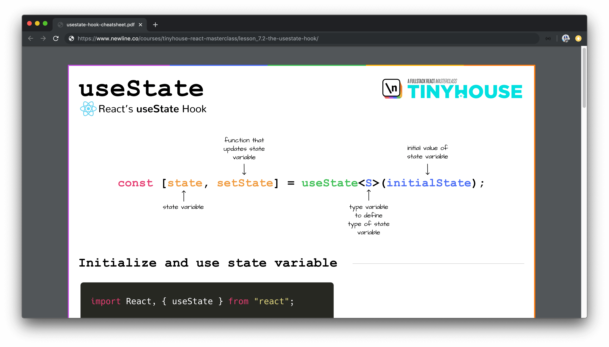
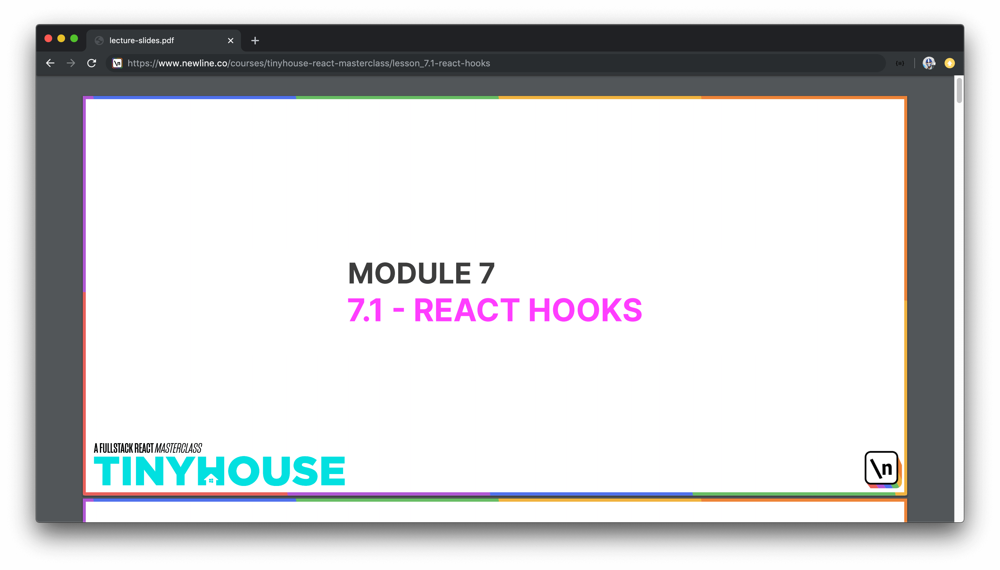
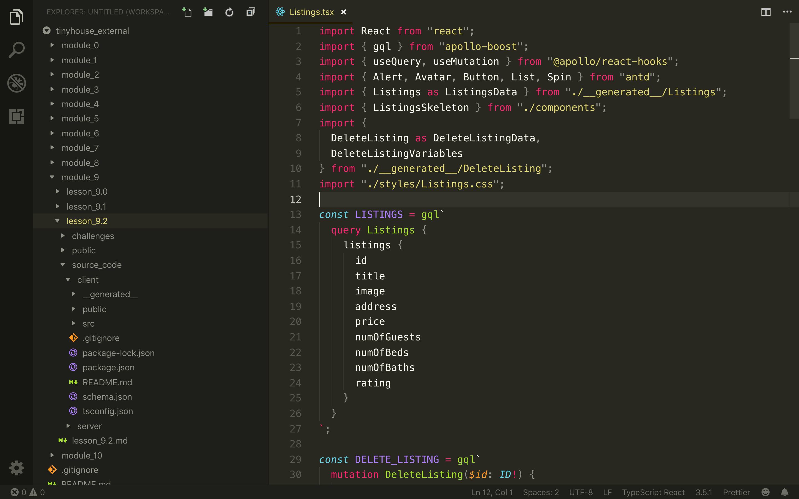
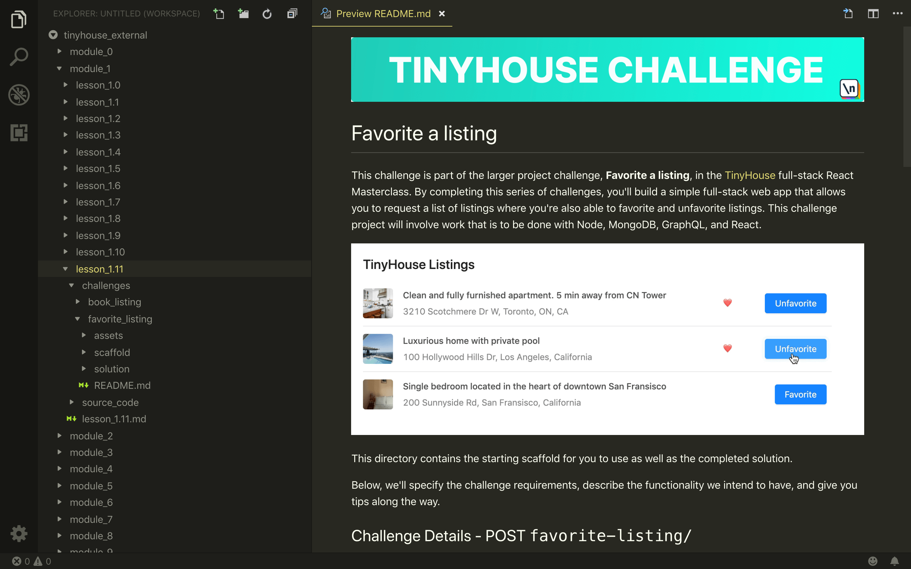
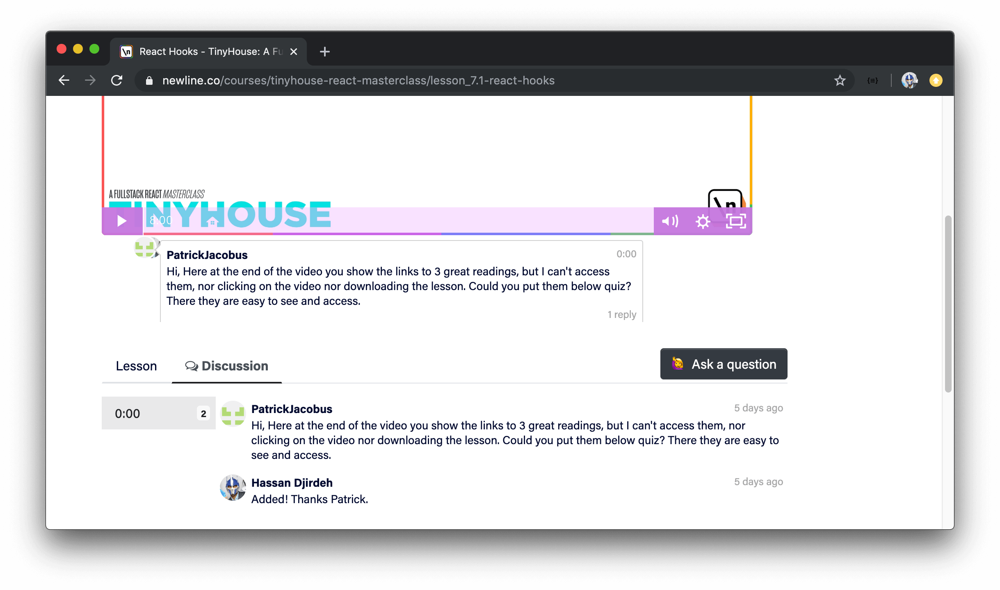
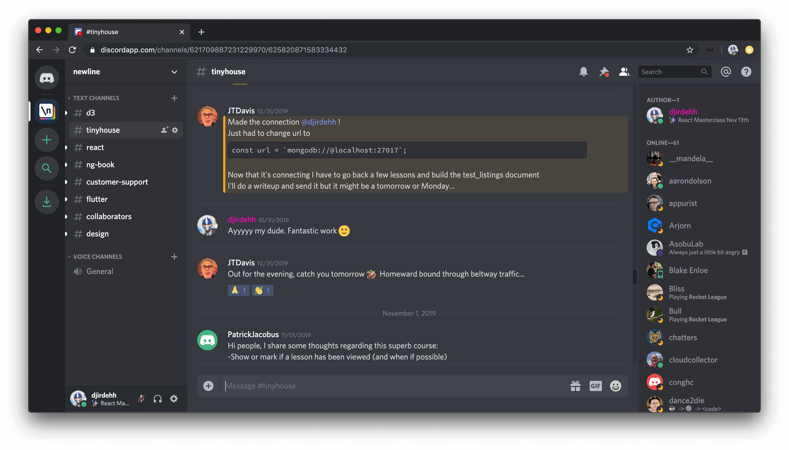

# How To Go Through The Course

### Newline Platform

The Newline Platform is where you'll be able to access the vast majority of material available in the TinyHouse course. The Newline platform is newly built and TinyHouse is the first Masterclass and course to be part of it. It's where you'll find the **screencast videos**, **lesson manuscript**, **links to accompanying course material**, and **other course material**.

I> When enrolled in the course, you should be able to find TinyHouse as an available course in your account's library dashboard.

### Lesson Videos

The lesson videos are a core component of the TinyHouse course. Every single lesson contains a clear recorded screencast video where every line of code is explained and shown for you to follow along.

There are a few different types of lecture videos.

**Module Introductions**

At the beginning of every module, you'll see a video of us (the instructors) summarizing the gameplan of that respective module. In these lecture videos, we'll discuss what we might have learned from the previous module, what we intend to learn from the upcoming module, and the steps we're going to take to complete the module.

**Lectures**

When we introduce a new technology or concept, we might explain the technology (or concept) in a lecture video. These lecture videos take a more informative approach where we'll go through lecture slides that will be used to explain the topic.

**Writing Code**

The videos where we write code to build the applications in the course make up the majority of lesson videos. Each of these lesson videos is broken down into a concise format whereby the end of the lesson video, we'll have a sample of runnable code that conveys what we intended to do in the lesson.

**Module Conclusions**

For the larger modules in the course, we'll have a conclusion video at the end of the module that will summarize what we've done to complete the module.

### Lesson Manuscript

A big piece of this course is the lesson manuscript. Every lesson comes with a complete transcript alongside the video.

Within the manuscript, we've embedded concise code samples as we proceed through the lesson. If interested, you can treat the manuscript with all the code samples as a Newline book of its own!

### Quiz Questions (and Solutions)

For the vast majority of lessons, multiple-choice quiz questions (and their solutions) are available to you.

The quiz questions aren't intended to be very difficult (or tricky) but are intended to reaffirm important concepts within lessons.

### Cheat Sheets

For a few lessons within the course, we've provided cheat sheets to summarize certain topics/patterns we'll notice in our code.

Note that the cheat sheets provided _are not_ intended to cover every single use case of a particular topic but are geared towards documenting repetitive patterns that we might refer to often.

### Lecture Slides

For the lesson videos that have lecture slides, we'll share those lecture slides as downloadable assets as well.

### Complete Code Project

The code project directory, shared with you in the first lesson of the course, contains the complete code samples for every lesson where code is written.

In the project code directory, every lesson folder also contains the assets and material for that lesson such as the lesson manuscript, lecture slides, quizzes, etc.

### Project Challenges

Project challenges can only be found in the project code directory shared with you and are intended to be structured code problems that allow you to try your skills in a new domain.

In the `README.md` file located within the root of the shared project code directory, a summary section will be provided highlighting the challenges and where they can be found in the project directory.

### Asking Questions

Within every lesson in the Newline platform exists a `Discussion` tab where you're able to ask a question at a certain timestamp within a video.

A notification system is currently being built within the platform to handle being notified when a question might have been asked and/or answered. In the meantime, we'll be keeping our eyes peeled for anything that might have been asked through the `Discussion` section of the lesson videos.

The other area where you'll be able to ask questions is the live online community we have in our Discord organization. In the `#tinyhouse` channel, you'll be able to find help and even help others! (We, the instructors will also be in the channel as well).

### How to go through the course

You're welcome to proceed through the course as you see fit but we do encourage you to:

- 🍿 Watch the lecture videos.
- 👩‍💻 Build the code samples.
- 📝 Compare your results.
- 🎓 Answer quiz questions.
- 👀 Take a look through the cheat sheets.
- 🏃‍ Tackle challenges when available.
- 🎉 And share your journey!

We're interested in hearing any feedback you might have as you proceed through the course. Do let us know if there are certain things you liked, other things you might have preferred, etc. We're committed to making this course _as robust as possible_ so we'll be happy to hear everything you might want to share!
