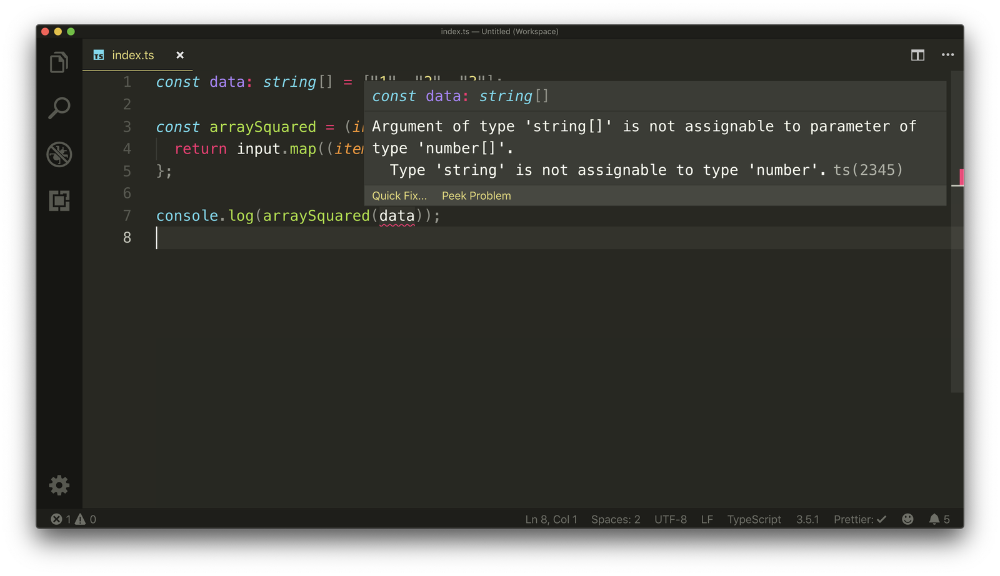
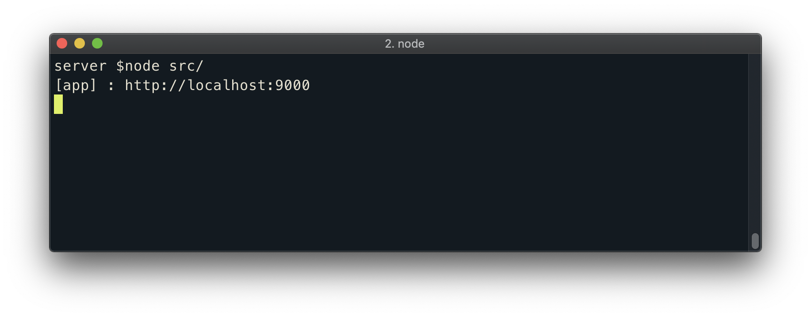

# Environment Setup

We recognize everyone has their own development working environment and set-up. In this lesson, we'll discuss some of the tools and items we'll use in this course for you to either follow along with or find an appropriate replacement.

## VSCode

The code editor we'll be using in this course is [VSCode (otherwise known as Visual Studio Code)](https://code.visualstudio.com/). Though you're welcome to use any code editor of your choice, we encourage using VSCode for some of the [useful features it provides with minimal configuration changes](https://code.visualstudio.com/#meet-intellisense). As an example, [VSCode includes TypeScript language support](https://code.visualstudio.com/docs/languages/typescript) out of the box to help display TypeScript compiler errors and warnings right in our editor.

As we proceed through the course, we'll periodically be installing [extensions](https://code.visualstudio.com/docs/editor/extension-gallery) to plug additional and useful functionality in our editor workspace. We'll have two extensions installed from the get-go with others we'll install at other points of the course.

- More importantly, we'll have the [Prettier](https://marketplace.visualstudio.com/items?itemName=esbenp.prettier-vscode) extension installed. Prettier is a code formatter that helps enforce a consistent style throughout our code.
- We'll have the [Monokai Pro](https://marketplace.visualstudio.com/items?itemName=monokai.theme-monokai-pro-vscode) extension installed which provides the editor/color scheme you see in the screencast videos.

## iTerm2

You can use your workspace terminal or any terminal emulator you would like to help navigate through project directories, run commands, etc. In the screencast videos, we'll be using the [iTerm2](https://iterm2.com/) terminal emulator available in macOS.

## Google Chrome

We'll be using [Google Chrome](https://www.google.com/chrome/) as our browser to survey the client applications we'll build. You're welcome to use any browser you prefer but our preference will be either using [Chrome](https://www.google.com/chrome/) or [Firefox](https://www.mozilla.org/en-CA/firefox/new/) for their great development tools.

## Secure internet connection

As you proceed through the course, you'll need a valid and working Internet connection. Throughout the course, we'll be working with tools available externally whether we're installing packages, interacting with our database on the cloud, or working with remote APIs. To avoid having any issues, **do ensure that you work with a secure internet connection**.
