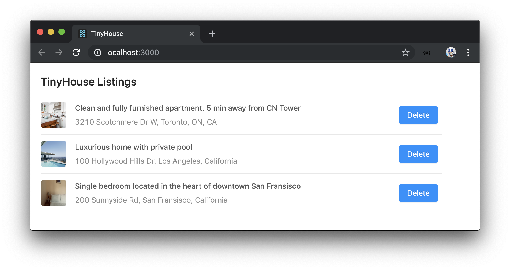
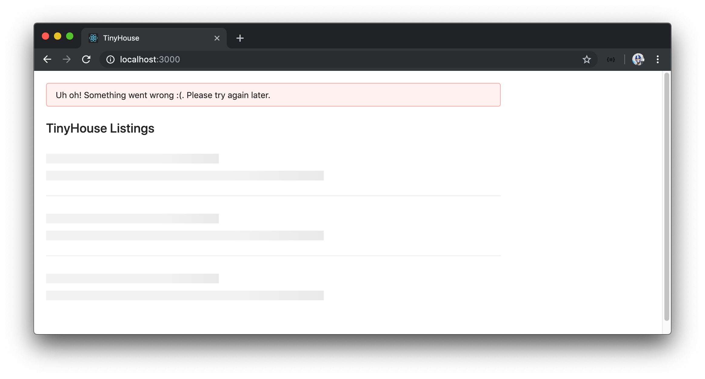
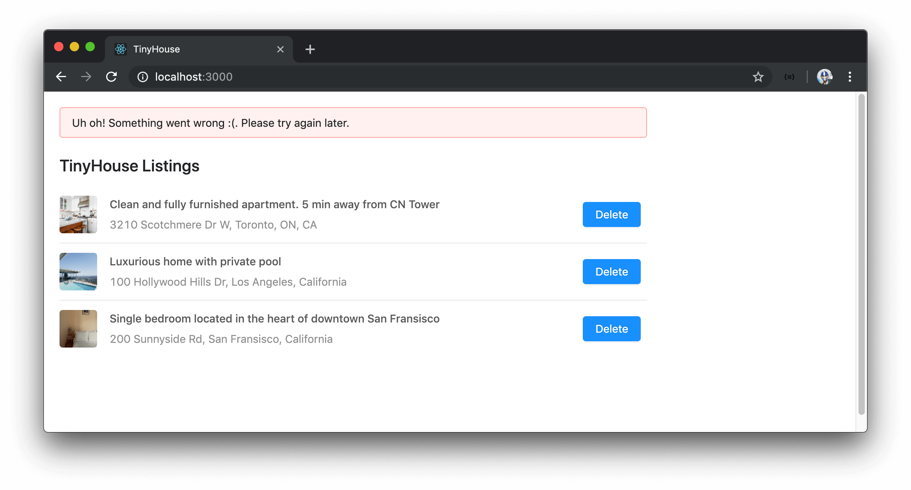
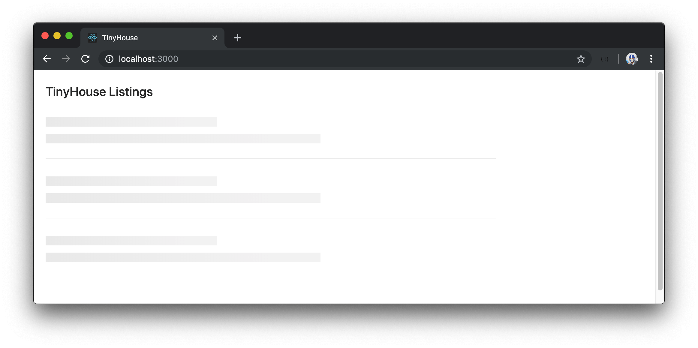

# Part One Welcome

Welcome to Part I of the course! We've broken the course down to two parts and in Part I, we discuss all the things we'll need to know before we start building the TinyHouse application. Part I can be treated as a course of its own since we discuss a lot of different topic within a [React](https://reactjs.org), [TypeScript](https://www.typescriptlang.org/), and [GraphQL](https://graphql.org/) environment.

In Part I, we'll build an app that surfaces a single web page responsible in displaying a list of listings.

When the page loads, a query is made to surface the listings to the user. If interested, the user is able to delete a listing by clicking the delete button in the list item. When a listing is deleted, a refetch is made to query the updated list of listings and the deleted listing is now removed from the list.

If the query for the list of listings fails, the user is presented with an error message that states something went wrong.

If an error occurs while a user is attempting to delete a mutation, they'll be notified that something has gone wrong as well.

When a query or mutation is in-flight, loading statuses are displayed to convey that the information is being requested or the action is being conducted.

The app we build in Part I is fairly simple. However, we spend as much time as we can introducing and learning important patterns and concepts before we build the TinyHouse application.

In more detail, for Part I of the course we'll:

- Create a [Node](https://nodejs.org/en/) server.
- Integrate Typescript into our Node server.
- Introduce GraphQL by investigating [GitHub's API](https://developer.github.com/v4/).
- Deploy our GraphQL API using [Apollo](https://www.apollographql.com/).
- Persist data with [MongoDB](https://www.mongodb.com/).
- Bootstrap a React project.
- Integrate TypeScript into our React project.
- Have our client interact with our server using GraphQL.
- Introduce [React Hooks](https://reactjs.org/docs/hooks-intro.html), and even make some of our custom Hooks.
- Install [React Apollo](https://github.com/apollographql/react-apollo) and use Apollo's official Hooks to make GraphQL requests.
- Use the Apollo CLI to auto-generate TypeScript definitions from our GraphQL API.
- Finally, introduce and use the [Ant Design](https://ant.design/) UI framework to quickly build a more presentable UI.

There's a lot of things to talk about so we're incredibly excited to get things started!
