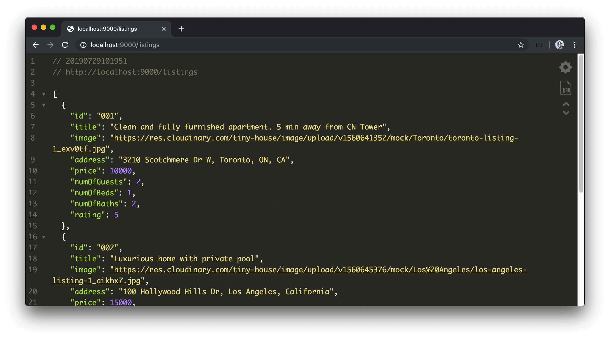
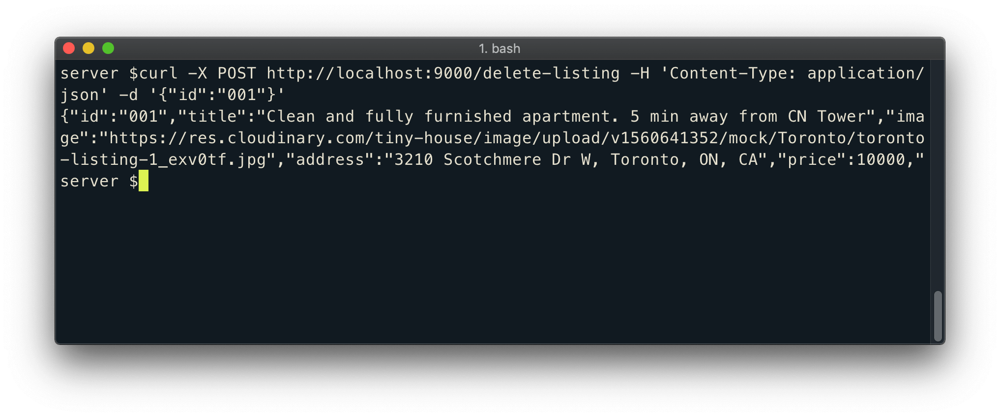

# Creating GET and POST Express routes

With our mock `listings` array defined, we'll attempt to have our Express server give us the capability to GET and POST changes to this mock data array.

Like we've seen for the index route (`/`) in the `src/index.ts` file, Express gives us the capability to creates [_routes_ which refer to how different endpoints respond to client requests](https://expressjs.com/en/guide/routing.html). We're going to create two new separate routes:

- A `/listings` route with which we can retrieve the listings collection.
- A `/delete-listing` route with which we can delete a specified listing.

### Get listings

To GET the listings information in an Express route, we can do just like what we've done when we sent the `'hello world'` message for the index route. We'll first import the `listings` array in our `src/index.ts` file.

```typescript
import { listings } from "./listings";
```

Then use the [`app.get()`](http://expressjs.com/en/5x/api.html#app.get.method) method to create a new `/listings` route that is to simply return the `listings` array.

```typescript
app.get("/listings", (_req, res) => {
  res.send(listings);
});
```

With the server being run, if we head to the browser and navigate to the `/listings` route, we'll be presented with our mock listings data array.



> We're using the [JSON Viewer Chrome Extension](https://chrome.google.com/webstore/detail/json-viewer/gbmdgpbipfallnflgajpaliibnhdgobh) to humanize this data and make it more readable.

### Delete a listing

We'll now create functionality to help delete a listing from our mock data.

In a standard REST API, the GET method is often used to request data. Though many other methods exist, we'll use the POST method to specify a route that can have data be sent to the server to conduct an action. In this case, we'll look to have the `id` of a listing be passed in which will be used to delete that particular listing. For our server to access the data in our POST request, we'll install a middleware to help parse the request body. We'll use the popular [`bodyParser`](https://github.com/expressjs/body-parser) library which can be installed alongside its type declaration file.

We'll first install `body-parser` as a dependency.

```shell
server $: npm install body-parser
```

Then install its type declaration file as a development dependency.

```shell
server $: npm install -D @types/body-parser
```

We'll then import the `bodyParser` module in our `index.ts` file.

```typescript
import bodyParser from "body-parser";
```

To use middleware in our Express server, we'll use the [.use()](https://expressjs.com/en/api.html#app.use) function in our `app` server instance where we can mount specific middleware functionality. In our middleware function, we'll pass in `bodyParser.json()` to help parse incoming requests as JSON and expose the resulting object on `req.body`.

```typescript
app.use(bodyParser.json());
```

> Express now provides a [built-in middleware](https://expressjs.com/en/api.html#express.json) to parse incoming requests with JSON payloads that is based on `bodyParser`. Instead of using the `bodyParser` package, we can achieve the same results with:
>
> `app.use(express.json())`

We'll now set up the POST request to a `/delete-listing` route. We'll declare the callback function and specify the `req` and res parameters we'll need.

```typescript
app.post('/delete-listing', (req, res) => {}
```

Though the `req` type is inferred to be of type `Request` from the Express package, the `req.body` property is defined as `any`, so we'll annotate the `id` field that we expect to retrieve from the `req.body` to be of type `string`.

```typescript
app.post('/delete-listing', (req, res) => {
  const id: string = req.body.id;
}
```

To delete a listing, we'll use a simple `for` loop to iterate through the `listings` array and use the array [`splice`](https://developer.mozilla.org/en-US/docs/Web/JavaScript/Reference/Global_Objects/Array/splice) method to remove a listing where its `id` matches the `id` value from the `req` body. If a `listing` is found, we remove the item from the array and we'll send the deleted listing item as the response.

```typescript
app.post('/delete-listing', (req, res) => {
  const id: string = req.body.id;

  for (let i = 0; i < listings.length; i++) {
    if (listings[i].id === id) {
      return res.send(listings.splice(i, 1));
    }
  }
}
```

If we're unable to find a listing to delete, we'll simply return text stating `'failed to delete listing'`.

```typescript
app.post("/delete-listing", (req, res) => {
  const id: string = req.body.id;

  for (let i = 0; i < listings.length; i++) {
    if (listings[i].id === id) {
      return res.send(listings.splice(i, 1)[0]);
    }
  }

  return res.send("failed to deleted listing");
});
```

There are a few ways we can try and make this POST command happen from building a client to interact with the server to using tools like [Postman](https://www.getpostman.com/). For now, we'll use [curl](https://curl.haxx.se/) to test this POST request in our command line.

> `curl` is installed by default on many systems and is an easy way for us to interact with APIs.
>
> OSX users should already have curl installed. Windows users can download and install curl here: <https://curl.haxx.se/download.html>

We can delete a listing with curl by running the following command in our terminal.

```shell
curl -X POST http://localhost:9000/delete-listing \
    -H 'Content-Type: application/json' \
    -d '{"id":"001"}'
```

> Pasting the entire block above may cause some formatting issues in your terminal. To appropriately run the command, paste each line one by one or type it out.
>
> In the above `curl` command, we've picked the first item in the listings array to be deleted by passing a `req.body` of `{"id":"001"}`.

When successful, the deleted listing item will be sent as the response of the request.



When we head to the browser and retrieve the listings collection from the `/listings` route, we can see that the listing object we've just deleted isn't part of the collection any longer. However, this change _isn't_ being persisted. When we restart our server, we see the entire list once again.

Since we no longer need the `hello world` message that is sent with the index route (`/`), we'll remove the originally introduced `app.get()` method for the index route and the `const` variables `one` and `two`.
