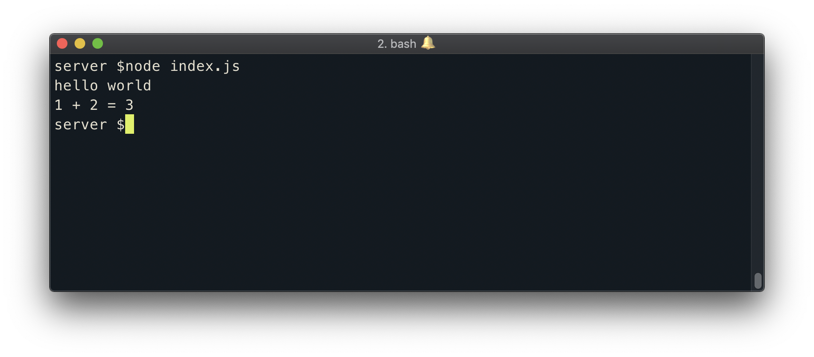

# Running JavaScript with Node

We have our Visual Studio Code Editor and our terminal available to us in our workspace.

To begin, we'll start with an empty folder labeled `tinyhouse_v1/` in our editor workspace.

```shell
tinyhouse_v1/
```

`tinyhouse_v1/` would be the directory where we build the app for the first part of our course. To get things started we're going to create a subfolder called `server` within the `tinyhouse_v1/` project that would host the server portion of our app. We'll also go ahead and have an `index.js` file be created within this `server` subfolder.

```shell
tinyhouse_v1/
  server/
    index.js
```

## The node command

For our very first attempt, we're going to see how we could use `node` to run some JavaScript code and the first code we're going to write is a simple `console.log` message.

We're going to attempt to log something into our terminal console and the first thing we're going to look to log is a simple string that says `'hello world'`.

```javascript
console.log("hello world");
```

Next, we're going to create two constant variables. We're going to create a variable called `one` and another called `two` and assign them numerical values according to the variable name.

```javascript
const one = 1;
const two = 2;
```

We're using the [`const` keyword](https://developer.mozilla.org/en-US/docs/Web/JavaScript/Reference/Statements/const) to create our constant variables. `const` is one of the preferred ES6 ways to define a variable and states that the variable can't be changed through reassignment.

Finally we're going to fire off another `console.log` message and in this case, we're going to display an interpolated string. We'll state that we want to see `1` plus `2` is equal to the sum of the values of the variables we've defined.

```javascript
console.log("hello world");

const one = 1;
const two = 2;

console.log(`1 + 2 = ${one + two}`);
```

We're using [back-ticks (i.e ES6 template literals)](https://developer.mozilla.org/en-US/docs/Web/JavaScript/Reference/Template_literals) to create our interpolated string which allows us to embed expressions within our strings.

In our terminal, let's run the javascript code we've written in the `index.js` file with the `node` command. The `node` command can take an argument for the location of the file in which we'd want the code to run. Since we're already within the `tinyhouse_v1/` directory in our terminal, we'll want to run the `index.js` file within the `server` folder so we'll specify the following command in our terminal.

```shell
server $: node server/index.js
```

By running the above command, we can see the two `console.log` messages we've prepared!


