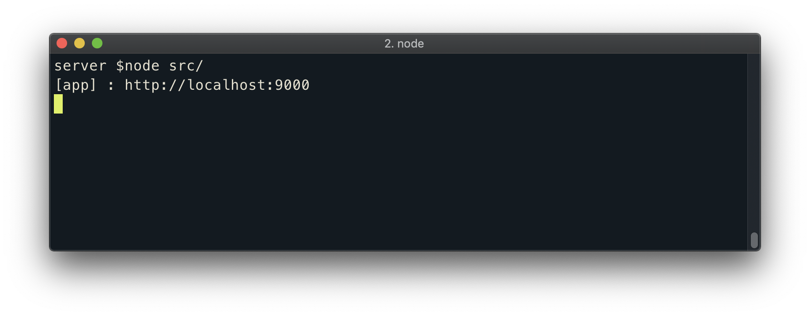
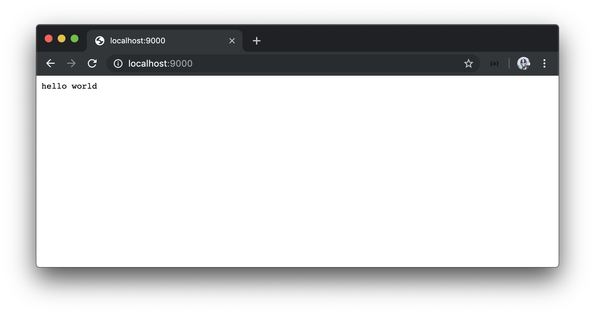

# Creating a minimal Node:Express Server

What we've done so far is use Node to run a simple JavaScript file. Now, we'll look to create a Node server.

A server is software or even hardware that aims to provide functionality for client requests. Large scale applications we use day to day such as Airbnb, Uber, Instagram, and YouTube all have servers that _serve_ data to the respective client apps. Client applications could be running on phones and computers to display this data to users.

Node has a built-in [HTTP module](https://nodejs.org/api/http.html#http_http) that provides the capability to create a server. We'll create a very simple Node server and if you haven't done so before you'll notice how surprisingly little code is needed to make this happen.

### package.json

The first thing we'll do is create a [`package.json`](https://docs.npmjs.com/files/package.json) file. The `package.json` file is an important element of the Node ecosystem and is where one can provide metadata about an app, list the packages the app depends on, and create scripts to run, build, or test the app.

We'll create this `package.json` file at the root of our server project directory.

```shell
tinyhouse_v1
  server/
    index.js
    package.json
```

A `package.json` file must contain a `name` and `version` field. `name` and `version` dictate the name of the application package being built and the version of that particular package respectively. We'll name our application package `tinyhouse-v1-server` and label the version as `0.1.0`.

    {
      "name": "tinyhouse-v1-server",
      "version": "0.1.0"
    }

To help us prepare a Node server, we'll install a third-party library known as [Express](https://expressjs.com/). Express is an incredibly popular framework for Node designed for building servers and APIs. To install Express, we'll run the `npm install command` followed by the name of the Express package (`express`).

```shell
server $: npm install express
```

When complete, `npm` will fetch Express from its repository and place the `express` module in a folder called `node_modules` in our server directory. When we now run our Node application, Node will look for modules that are required in the `node_modules` folder before looking into parent directories and global installs.

We'll also notice that the `package.json` file has been updated to include `express` as a dependency.

```json
{
  "name": "tinyhouse-v1-server",
  "version": "0.1.0",
  "dependencies": {
    "express": "^4.17.1"
  }
}
```

For anyone else downloading our directory, all they need to do is run `npm install` to install all the modules listed in the `package.json` file.

### package-lock.json

We may also notice a [`package-lock.json`](https://docs.npmjs.com/files/package-lock.json) file be automatically generated in our project directory. The `package-lock.json` file stores a dependency tree that highlights the dependencies installed from the `package.json` file at a certain moment in time.

`package-lock.json` was first introduced in `npm` version `5` and serves to ensure teammates and deployment processes are all guaranteed to always install the same dependencies as well as aim to convey greater visibility to changes that are being made to an app's dependencies.

The `package-lock.json` file should always be committed alongside other files to source code, but we'll never actually directly touch this file.

> If we were to use [`yarn`](https://yarnpkg.com/) (another dependency management tool) instead of `npm`, a `yarn.lock` file would be autogenerated.

### Express

We'll now use Express to instantiate a Node server. We'll first move our `index.js` file within a `src/` folder which would be where we'll write all our server source code. With the auto-generated files and folders, our `tinyhouse_v1/` project directory will now look like the following:

```shell
tinyhouse_v1/
  server/
    node_modules/
    src/
      index.js
    package-lock.json
    package.json
```

In the `src/index.js` file, we'll remove everything we've written before and require the `express` module in our app and assign it to a constant called `express`.

```javascript
const express = require("express");
```

We'll create an express server instance by running the express function and assigning that instance to a `const` variable labeled `app`.

```javascript
const app = express();
```

We'll create a `port` `const` variable and assign a port number that we'd want the server to run. We'll state this port number to be `9000`.

```javascript
const port = 9000;
```

With `app` being the server instance, we can take advantage of express routing and use the [`app.get()`](http://expressjs.com/en/5x/api.html#app.get.method) function to associate a path with an endpoint. We'll say when we receive an HTTP GET request to the index route - denoted by `'/'`, we'll respond by sending a `'hello world'` string. The endpoint function provides `req` and `res` objects as parameters. `req` is an object containing information about the HTTP request while `res` is how we send back the desired response.

```javascript
app.get("/", (req, res) => res.send("hello world"));
```

We'll finally use the [`app.listen()`](http://expressjs.com/en/5x/api.html#app.listen) function from the express app instance to create the Node server at a certain port - with which we'll use the port constant variable we've set up.

```javascript
app.listen(port);
```

For convenience, we'll place a `console.log` message at the end of our file to tell us that our app is successfully being run in the appropriate port. With all the above changes, the `src/index.js` file will now look like the following:

```javascript
const express = require("express");
const app = express();
const port = 9000;

app.get("/", (req, res) => res.send("hello world"));
app.listen(port);

console.log(`[app] : http://localhost:${port}`);
```

Like we've seen in the previous lesson, we can run this JavaScript code by using the `node` command in our terminal.

```shell
server $: node src/
```

To know that our Node Server is running successfully, we'll be able to see the generated `console.log` message in our terminal logs.



By heading to <http://localhost:9000/> on our web browser, the text `'hello world'` should be displayed! This is because we've navigated to the index route (i.e. we attempt to _GET_ information from this route) and we've specified the response for this route should return a string of `'hello world'`.


