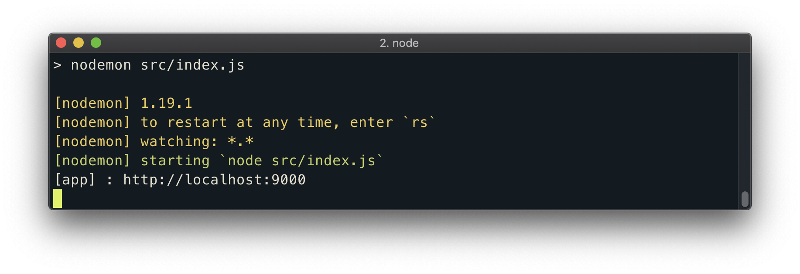

# Automatic Reloading Using Nodemon

When developing our server application, there are going to be **a lot** of changes we're going to make to our code. We probably don't want to stop our running server and restart it every single time we make an update. Wouldn't it be nice if there was a third-party tool that did that for us? Well, there is, and it's called [Nodemon](https://nodemon.io/)!

Nodemon is a tool that will monitor for any changes in our source code and automatically restart our Node server when a change is detected. To install Nodemon, we'll run the `npm install` command but this time use the `-D` flag which is a shorthand version of `--save-dev`. This indicates that the package to be installed is a [_development_ dependency](https://docs.npmjs.com/specifying-dependencies-and-devdependencies-in-a-package-json-file). Development dependencies are packages that are only needed for local development.

```shell
server $: npm install -D nodemon
```

After `nodemon` is installed, our `package.json` file will list `nodemon` in the `devDependencies` list:

```json
{
  "name": "tinyhouse-v1-server",
  "version": "0.1.0",
  "dependencies": {
    "express": "^4.17.1"
  },
  "devDependencies": {
    "nodemon": "^1.19.1"
  }
}
```

### start script

We'll look create a script in our application that can run the server with the `nodemon` utility. In Node applications, we're able to define script commands that can be run in an app within a `scripts` section of the `package.json` file. Having scripts helps us avoid repetitively typing long commands manually in the terminal.

We'll create a `start` script that is responsible in using `nodemon` to start our Node server:

```json
  "scripts": {
    "start": "nodemon src/"
  }
```

To run our code with Nodemon, all we have to do now is type the `npm run start` command in our terminal:

```shell
server $: npm run start
```

Nodemon will output some messages to the console telling us the version of `nodemon` being used as well as other messages such as the ability to restart at any time and the location of files being watched.



If any changes are made in our server project, these changes will be detected and `nodemon` will restart the server for us!
