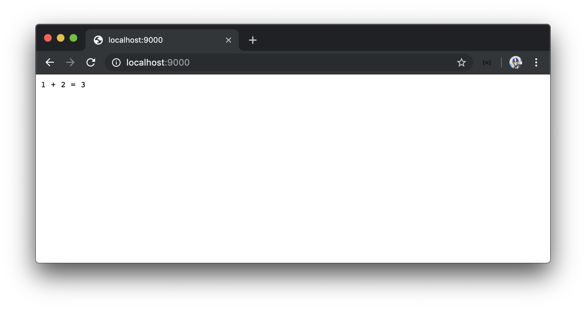
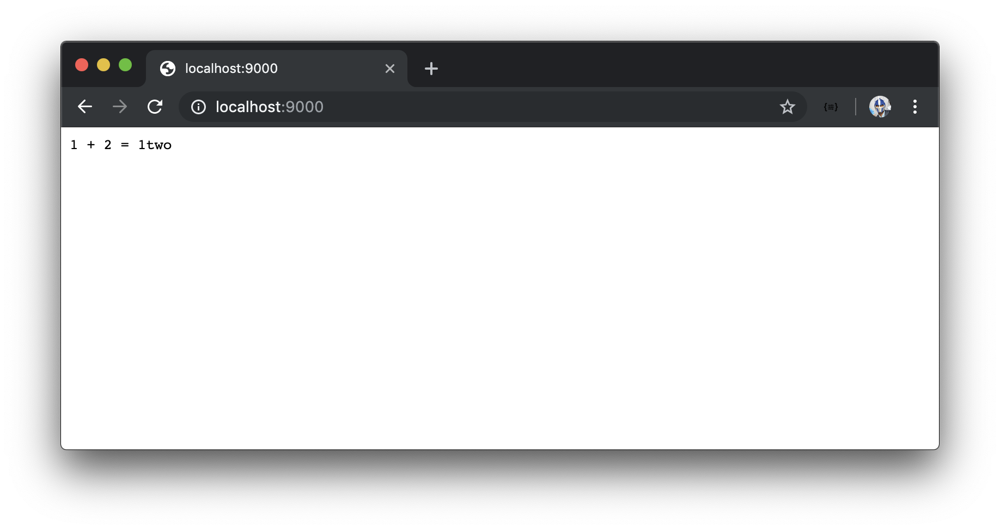

# Introducing TypeScript

JavaScript is considered a weakly typed language which means that in JavaScript, we have the ability to assign one data type to a variable and later on assign _another_ data type to that same variable.

Let's see an example of this in our `index.js` file. We'll look to replicate what we've done before by creating two variables, `one` and `two`, and attempt to show the summation of these two variables.

In the `src/index.js` of our server project, we'll create constant variables labeled `one` and `two` and provide numerical values of `1` and `2` respectively.

```javascript
const one = 1;
const two = 2;
```

In the callback function of our `app.get()` method for the index route, we'll send an interpolated string that says `1` plus `2` is equal to the sum of the variables `one` and `two`.

```javascript
app.get("/", (req, res) => res.send(`1 + 2 = ${one + two}`));
```

When we launch our app in <http://localhost:9000/>, we'll see an output of 1 + 2 = 3.



What if shortly after we've instantiated our constant variables, we decide to reassign the `two` variable to be a string with a value of 'two'. Since we're reassigning the value of a variable - we'll change how we instantiate the variable by using the [`let` keyword](https://developer.mozilla.org/en-US/docs/Web/JavaScript/Reference/Statements/let).

```javascript
const one = 1;
let two = 2;

two = "two";
```

Heading back to our browser we can see the output with the following text: `1 + 2 = 1two`.



Though this isn't what we want, it makes sense. JavaScript is unable to sum two different data types so it adds these two values by simply placing them side by side within a string.

We've defined the variable `one` to be equal to the number `1` and the variable `two` to be equal to the number `2`. We've redefined variable `two` to instead become a string value of `'two'`. Though we did this on purpose, we can assume that this could also happen accidentally since we don't guard for the fact that the variables `one` and `two` **have to be number values**.

In this case, the JavaScript code executed without any errors or warnings. In other cases, our code could error if we manipulated and used a variable without recognizing that it had an incorrect type. If we deployed code like this to a production app, this could lead to production issues.

### TypeScript

This is why [TypeScript](https://www.typescriptlang.org/) was created. TypeScript is a **strongly-typed** superset of JavaScript that was introduced in 2012 by Microsoft. It is designed to:

- make code easier to read and understand.
- avoid painful bugs that developers commonly run into when writing JavaScript.
- ultimately save developers time and effort.

It's important to note that TypeScript isn't a completely different language. It's a typed _extension_ of JavaScript. The key difference between Static vs. Dynamic typing (i.e. JavaScript vs. TypeScript) has to do with _when_ the types of the written program are checked. In statically-typed languages (TypeScript), types are checked at **compile-time** (i.e. when the code is being compiled). In dynamically-typed languages (JavaScript), types are checked at **run-time** (when the code is being run).

TypeScript is a development tool. Clients and servers don't recognize TypeScript code when run. This is why the static types that can be specified in TypeScript are _stripped away_ during a compilation process that transforms TypeScript code into valid JavaScript.

Adding types is like keeping units consistent when performing a math equation. Without TypeScript, you have to mentally keep track of units (i.e. types). Assigning values to the wrong units have big consequences (e.g. [NASA crashed its 125 million dollar probe in 1999 because of incorrect unit conversions between the English Unit Measurement and the Metric System](http://www.cnn.com/TECH/space/9909/30/mars.metric.02/)). Though not a perfect analogy, it does go to show that consistency is incredibly important.
