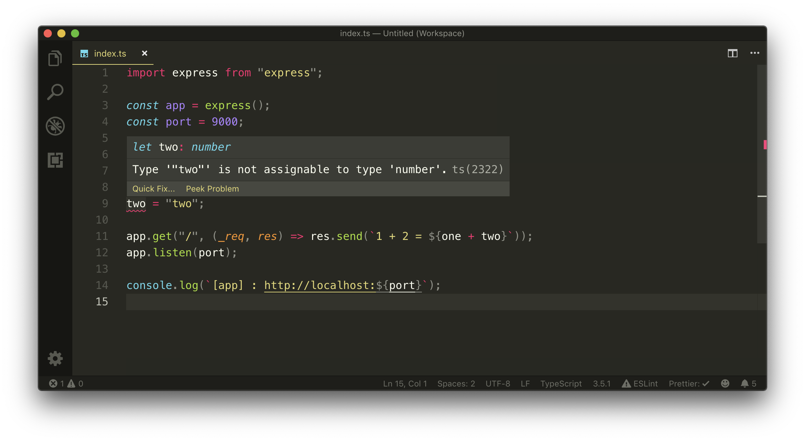
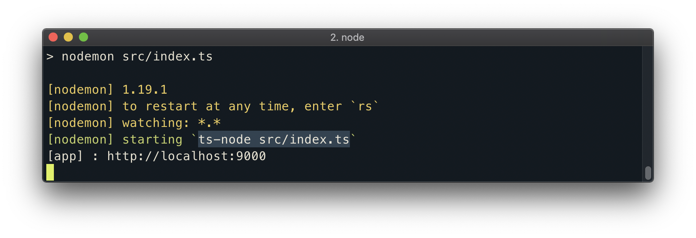

# Adding TypeScript to our Server

To configure our Node server into a TypeScript project, we'll need to install and use certain TypeScript packages. We'll install the latest versions of the `typescript` and `ts-node` libraries as development dependencies.

- [`typescript`](https://github.com/Microsoft/TypeScript) is the core Typescript library that will help us compile our TypeScript code to valid JavaScript.
- [`ts-node`](https://github.com/TypeStrong/ts-node) is a utility library that helps us run TypeScript programs in Node.

```shell
server $: npm install -D typescript ts-node
```

### tsconfig.json

The first thing we'll do to introduce TypeScript into our Node server project is create a [TypeScript configuration file](https://www.typescriptlang.org/docs/handbook/tsconfig-json.html) (`tsconfig.json`). The `tsconfig.json` file is a JSON file that should be created at the root of a TypeScript project and indicates the parent directory is a TypeScript project. `tsconfig.json` is where we can customize our TypeScript configuration and guide our TypeScript compiler with options required to compile the project.

```shell
server /
  // ...
  tsconfig.json
```

To customize and edit the options of the TypeScript compiler, we'll specify a `compilerOptions` key in our `tsconfig.json` file.

```json
{
  "compilerOptions": {}
}
```

There are a large number of options we can dictate and control in our compiler of which all can be seen in the [TypeScript handbook](https://www.typescriptlang.org/docs/handbook/compiler-options.html). We're not going to go through all the different possible options but instead dictate the ones we'll use for our app.

#### `target`

We'll declare the `target` option which specifies the target JavaScript version the compiler will output. Here we'll declare a target output of `es6` since Node supports a vast majority of ES6 features.

```json
"target": "es6",
```

#### `module`

We'll declare the `module` option which refers to the module manager to be used in the compiled JavaScript output. Since CommonJS is the standard in Node, we'll state `commonjs` as the module option.

```json
"module": "commonjs",
```

#### `rootDir`

To specify the location of files for where we want to declare TypeScript code, we'll use the `rootDir` option and give a value of `src/` to say we want our compiler to compile the Typescript code in the `src/` folder.

```json
"rootDir": "./src",
```

#### `outDir`

We can use the `outDir` option to specify where we'd want to output the compiled code when we attempt to compile our entire TypeScript project into JavaScript. We'll dictate that we'll want this output code to be in a folder called `build/`.

```json
"outDir": "./build",
```

#### `esModuleInterop`

To help compile our CommonJS modules in compliance with ES6 modules, we'll need to introduce the `esModuleInterop` option and give it a value of `true`.

```json
"esModuleInterop": true,
```

#### `strict`

Finally, we'll apply the `strict` option which enables a series of strict type checking options such as `noImplicitAny`, `noImplicitThis`, `strictNullChecks`, and so on.

```json
"strict": true
```

The `tsconfig.json` file of our server project in its entirety will look like the following:

```json
{
  "compilerOptions": {
    "target": "es6",
    "module": "commonjs",
    "rootDir": "./src",
    "outDir": "./build",
    "esModuleInterop": true,
    "strict": true
  }
}
```

### @types

For us to use third-party libraries (e.g. \`express) and have the full power of TypeScript, these libraries should also have dynamic types. Unfortunately, a lot of third party libraries we might want to use can be written in native JavaScript (e.g. [express](https://github.com/expressjs/express) or with an extension of JavaScript (e.g. CoffeeScript).

This is where TypeScript allows for the creation and use of [_declaration_ files](https://www.typescriptlang.org/docs/handbook/declaration-files/introduction.html) that describe the shape of existing JavaScript code. In the TypeScript community exists a [DefinitelyTyped repository](https://github.com/DefinitelyTyped/DefinitelyTyped) that holds TypeScript declaration files for a large number of packages and is entirely community-driven.

> If you ever find yourself using a package that doesn't have a declaration file publicly available, [you can contribute to DefinitelyTyped](https://github.com/DefinitelyTyped/DefinitelyTyped#how-can-i-contribute)!

Since Express and Node aren't TypeScript libraries, we'll need to install type definitions from TypeScript declaration files for the `express` and `node` packages. We'll install these type definitions as development dependencies.

`@types/` refers to the TypeScript declaration file packages that come from the DefinitelyTyped Github Repository.

```shell
server $: npm install -D @types/node @types/express
```

With the type definition packages of `node` and `express` installed, we can start to modify our code. First, let's rename our `src/index.js` file to `src/index.ts` file. `.ts` is the file extension used to denote TypeScript files that will be compiled to JavaScript.

```shell
server/
  // ...
  src/
    index.ts
  // ...
```

In our `index.ts` file, we can begin to utilize [ES6 `import`](https://developer.mozilla.org/en-US/docs/Web/JavaScript/Reference/Statements/import) to import the `express` package. Node doesn't currently support the capability to use the `import` statement to import modules. This is a great advantage of TypeScript - the capability to use and access ES6 (and newer) features that might not be natively supported in Node (or older browsers).

```json
import express from "express";
```

We'll now notice an error in our code. Our IDE Intellisense warns us that the TypeScript compiler will recognize that assigning the string 'two' to the variable `two` is incorrect because the variable `two` was originally defined to be a `number`.



Just from the simple changes we've made, we can already begin to take advantage of Typescript. With that said, let's remove the reassignment of variable `two` and keep both constant variables as numbers.

```typescript
const one = 1;
const two = 2;

app.get("/", (_req, res) => res.send(`1 + 2 = ${one + two}`));
```

### Static Typing

The headline feature of TypeScript is **static typing**. Instead of having our variables be _inferred_ as numbers, we can statically annotate the type of our variables as `number` with the syntax `: number`.

```json
const one: number = 1;
const two: number = 2;
```

TypeScript allows us to use and annotate many different [basic types](https://www.typescriptlang.org/docs/handbook/basic-types.html).

```typescript
const three: boolean = false;

const three: string = "one";

const three: null = null;

const three: undefined = undefined;

const three: any = {};
```

There are other basic types as well such as the [array type](https://www.typescriptlang.org/docs/handbook/basic-types.html#array), the [enum type](https://www.typescriptlang.org/docs/handbook/basic-types.html#enum), the [void type](https://www.typescriptlang.org/docs/handbook/basic-types.html#void), etc. We'll investigate many of these different types as we proceed through the course.

When we explicitly define the type of variable, we have to provide a value that matches that type. The `any` type in TypeScript is unique since it allows us to define a variable with _any_ type. Variables with the `any` type don't give us the capability TypeScript provides and should be used sparingly.

### Starting our TypeScript Node Server

In the `package.json` file of our project, we can see that `nodemon` was being used to start our Node server from the `index.js` file in our `src/` folder.

```json
  "scripts": {
    "start": "nodemon src/"
  }
```

The `nodemon src/` command will by default look for JavaScript files in our `src/` folder. Since our index file is now a TypeScript file (`index.ts`), we'll be more explicit here and state that we want to run the code in the `src/index.ts` file.

```json
  "scripts": {
    "start": "nodemon src/index.ts"
  }
```

When we run the `start` script in our command line, our project will run despite us doing any other changes! In our console logs, we can see the message `ts-node src/index.ts` which tells us the `ts-node` package is now being used to run the TypeScript app directly from our terminal.



This is in thanks to `nodemon` invoking `ts-node` whenever a `.ts` file has been changed. Any time there's a change in our TypeScript code, `nodemon` will re-run our server and execute `ts-node`. `ts-node` under the hood does a bunch of checks to verify all our TypeScript code is good by attempting to compile our TypeScript code to valid JavaScript. If there's ever a TypeScript error, nodemon will crash.
