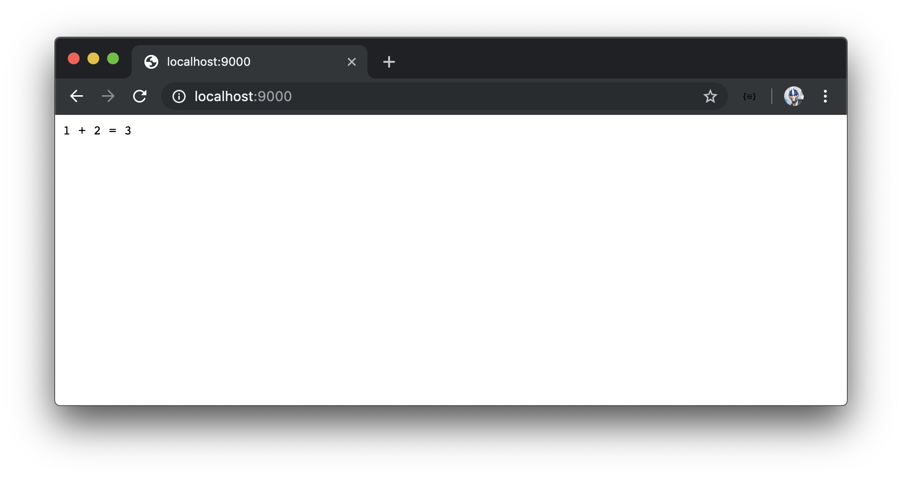

# Compiling our TypeScript project

Though our application is now suited for TypeScript development; to have our code be ready for production, it first must be built (i.e. compiled) as a JavaScript project. This is perfectly ok because TypeScript was only created to help developers during the development phase. Once the app is in production, known bugs should have all been fixed!

To achieve the compiling of our entire TypeScript project, we're going to create a new script in the `package.json` file which we'll call the `build/` script.

```json
"scripts": {
  "start": "nodemon src/index.ts",
  "build": ""
}
```

### tsc

`build/` will be responsible in building (i.e. compiling) the TypeScript code in our project to valid JavaScript. We can achieve this compilation with the help of the [`tsc` command](https://www.typescriptlang.org/docs/tutorial.html#compiling-your-code) the `typescript` package provides.

`tsc` takes an option labeled `-p` which is shorthand for `--project` that allows us to compile the TypeScript code in a project that contains a `tsconfig.json` file. The `-p` option requires an argument of the project directory. We'll use the `tsc` command in the `build` script of our application to compile our TypeScript project.

```json
  "scripts": {
    "start": "nodemon src/index.ts",
    "build": "tsc -p ./"
  }
```

`tsc -p ./` references the `server` project directory where the `package.json` lives as the TypeScript project that is to be compiled. With the change made to our `package.json` file, we can run the `build` script in our terminal.

```shell
server $: npm run build
```

When complete, a `build/` folder is introduced in the root of the server project.

```shell
server/
  build/
  // ...
```

This `build/` folder contains JavaScript code in an `index.js` file that has essentially been compiled from the TypeScript `index.ts` file. We could run the JavaScript from the compiled `index.js` file directly within the `build/` folder.

```shell
server $: node build/index.js
```

When launching the browser at `http://localhost:9000`, we'll be presented with the expected message that is to be sent for the index (`/`) route.



With deployment, we'll need to build our application to obtain valid JavaScript code and then place the compiled `build/` folder into any deployment process that we would want. We'll hardly ever find the need to dive into the `build/` folder to see the generated compiled JavaScript code.
