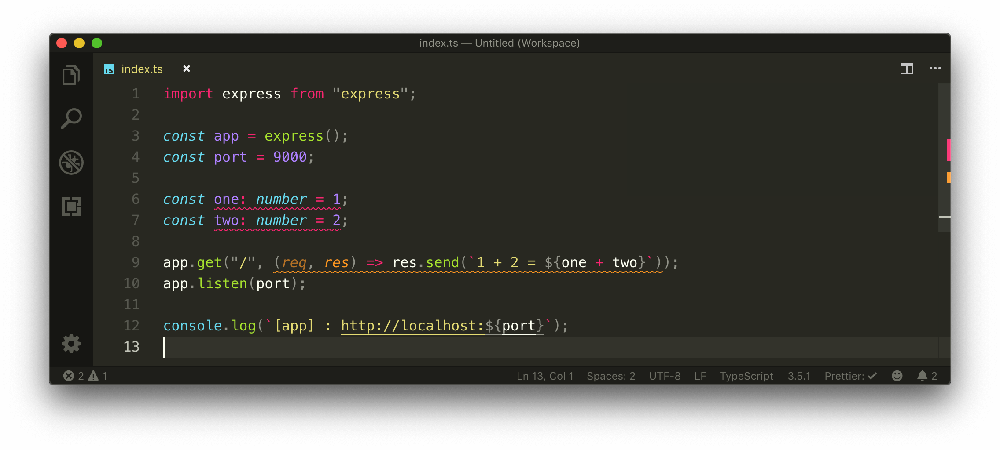
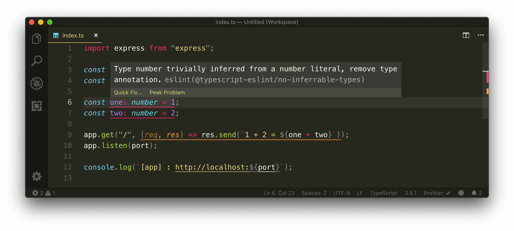
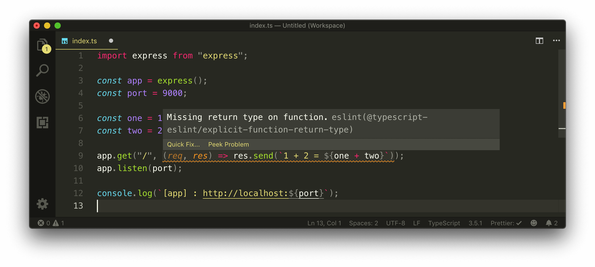
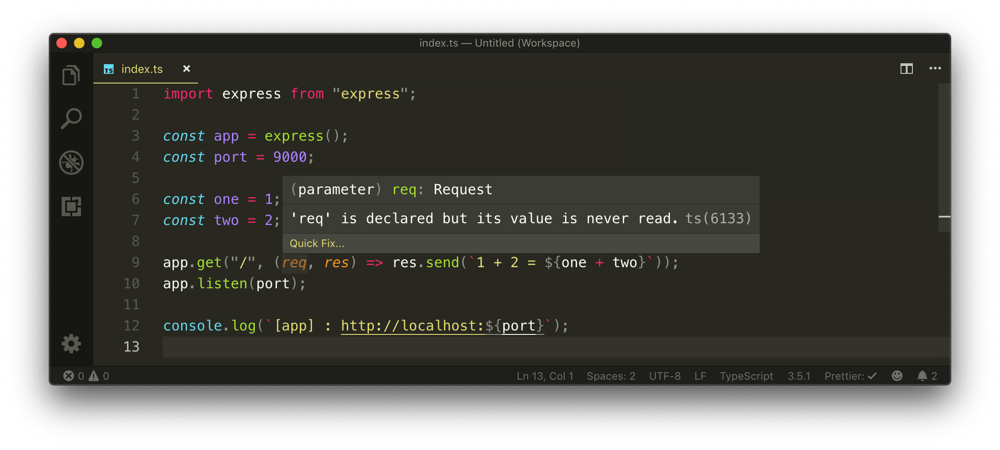
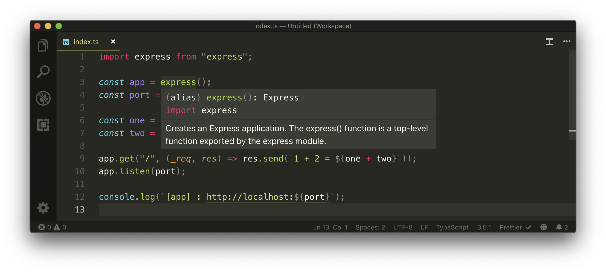

# Linting with ESLint

Though VSCode includes TypeScript language support which helps recognize errors in our TypeScript code, we'll probably need more robust code checking. As an example of something we might want to forbid is preventing a variable from ever having the `any` type. TypeScript won't stop us since `any` is a valid basic type but as a preference, we probably don't want to have code built in our app that has the `any` type since it removes the benefits of type checking.

This is where linting comes. Linting (i.e. code checking) is a process that analyzes code for potential errors. When it comes to linting JavaScript and/or TypeScript code, [**ESLint**](https://eslint.org/) is the most popular library to do so. It's configurable, easy to introduce, and comes with a set of default rules.

To introduce linting into our app and take advantage of our code editor, we'll first install the [VSCode ESLint extension](https://marketplace.visualstudio.com/items?itemName=dbaeumer.vscode-eslint). The VSCode ESLint extension allows us to integrate ESLint into VSCode to help provide warnings, issues, and errors in our editor.

Once the VSCode ESLint extension is installed, we'll go ahead and install a few other development dependencies that we'll need to enable ESLint configuration into our app. We'll install:

- `eslint`: the core ESLint library
- `@typescript-eslint/parser`: parser that will allow ESLint to lint TypeScript code
- `@typescript-eslint/eslint-plugin`: plugin when used in conjunction with`@typescript-eslint/parser` contains many TypeScript specific ESLint rules.

```shell
server $: npm install -D eslint @typescript-eslint/parser @typescript-eslint/eslint-plugin
```

### .eslintrc.json

We'll introduce an `.eslintrc.json` configuration file in the root project directory. The `.eslintrc.json` file is the configuration file that'll dictate the ESLint set up of our application. We'll look to introduce a couple of options to our ESLint configuration file.

#### `parser`

```json
"parser": "@typescript-eslint/parser",
```

ESLint depends on a parser to read and translate JavaScript code for it to understand. The default ESLint parser ([ESpree](https://github.com/eslint/espree)) doesn't recognize TypeScript code. The [`@typescript-eslint/parser`](https://github.com/typescript-eslint/typescript-eslint/tree/master/packages/parser) is probably the most widely used and supported parser for TypeScript code, and the one installed in our app.

#### `parserOptions`

```json
"parserOptions": {
  "ecmaVersion": 2018,
  "sourceType": "module"
},
```

The [parserOptions](https://eslint.org/docs/user-guide/configuring#specifying-parser-options) configuration allows us to specify the language options we want ESLint to support. By default, ESLint supports ES5. We'll set the `ecmaVersion` to `2018` to allow us the use of modern ES features in our app. `sourceType: module` to declare that we're using ES6 modules in our app.

#### `extends`

```json
"extends": ["plugin:@typescript-eslint/recommended"],
```

The `extends` option allows us to extend the rules from a certain plugin with which we've picked [@typescript-eslint/recommended](https://github.com/typescript-eslint/typescript-eslint/blob/master/packages/eslint-plugin/src/configs/recommended.json).

#### `env`

```json
"env": { "node": true },
```

`env` dictates which environment our ESLint script is expected to run. Every environment has its own set of particular global variables so we've stated that we're in the `node` environment.

#### `rules`

`rules` is where we can declare individual ESLint rules we want in our app. Here's where we can override the rules from the `@typescript-eslint/recommended` package we've extended.

The `@typescript-eslint/recommended` package comes with a rule for indenting. [Prettier](https://prettier.io/) will handle all indenting/formatting for us, and it's often recommended to turn off indent formatting rules as a result. We'll turn off the standard `indent` rule and the `@typescript-eslint/indent` rule.

```json
"rules": {
  "indent": "off",
  "@typescript-eslint/indent": "off"
}
```

### ESLint and TypeScript

Currently, the ESLint VSCode Extension [doesn't have TypeScript support enabled by default](https://github.com/Microsoft/vscode-eslint/issues/609), and editor warnings are only shown for JS Files. To have ESLint work for TypeScript files, we'll need to add the following to the `/settings.json` file of our VSCode editor.

```json
"eslint.validate": [
  "javascript",
  "javascriptreact",
  { "language": "typescript", "autoFix": true },
  { "language": "typescriptreact", "autoFix": true }
]
```

> You can find the `/settings.json` file of your VSCode editor by first pressing `SHIFT + CMD + P` (on Mac) to launch the Command Palette where you can then search for `Preferences: Open Settings (JSON)`.
>
> Alternatively, you can launch the User Settings section of VSCode by pressing `CMD + ,` on Mac, or `CTRL + ,` on Windows, or selecting `Code > Preferences > Settings` in the toolbar. In the User Setting sections, you can then type `Open Settings (JSON)` in the search field and click the `Edit in settings.json` option to open the `/settings.json` file.

When we survey the `src/index.ts` file, we'll now notice the editor displays some lint warnings!



> Note: You may only see warnings in your VSCode editor when importing only the `server/` project into the editor (not the parent `tinyhouse_v1/` directory).

The first warning we see states that when the `number` type is inferred for the variables `one` and `two`, it's unecessary for it to be explicitly declared.



This rule is one of the ESLint rules dictated from our [recommended typescript-eslint package](https://github.com/bradzacher/eslint-plugin-typescript/blob/master/docs/rules/no-inferrable-types.md) that states simple types such as `number`, `string` and `boolean` can be easily inferred and doesn't have to be explicity defined. We like this rule, so we'll comply by removing the explicit annotation of the `number` type.

```json
const one = 1;
const two = 2;
```

We see another lint warning that tells us the callback function in the `app.get()` method is missing a return type.



Just like how we can explicitly define types for variables, TypeScript allows us to specify the return types for functions. We like to have our function type be inferred whenever possible so we'll modify this ESLint rule. In the `.eslintrc.json` file, we'll turn off the [`explicit-function-return-type`](https://github.com/bradzacher/eslint-plugin-typescript/blob/master/docs/rules/explicit-function-return-type.md) rule.

```json
  "rules": {
    "indent": "off",
    "@typescript-eslint/indent": "off",
    "@typescript-eslint/explicit-function-return-type": "off"
  }
```

There's one more thing to consider. When we take a look at the `req` parameter in our callback function, we can see an editor message that states `'req' is declared but its value is never read`.



This isn't an ESLint error but a TypeScript warning. This is a useful warning but in our case we've declared the `req` parameter to access the second positional parameter - `res`. To notify TypeScript we're aware of this unused parameter, we can prefix the `req` parameter with an underscore.

```typescript
app.get("/", (_req, res) => res.send(`1 + 2 = ${one + two}`));
```

Our `src/index.ts` file will now look like the following:

```typescript
import express from "express";

const app = express();
const port = 9000;

const one = 1;
const two = 2;

app.get("/", (_req, res) => res.send(`1 + 2 = ${one + two}`));
app.listen(port);

console.log(`[app] : http://localhost:${port}`);
```

### VSCode & IntelliSense

The capability to hover over variables, parameters, and functions and have our editor provide information is due to [VSCode's TypeScript IntelliSense feature](https://code.visualstudio.com/docs/languages/typescript). TypeScript and VSCode's IntelliSense is a powerful capability especially when coupled with an ESLint + VSCode Integration. Not only are we able to recognize issues/warnings in our editor, we're able to hover and also recognize the typing information and documentation inferred for all the different variables, parameters, and functions used within an application!


