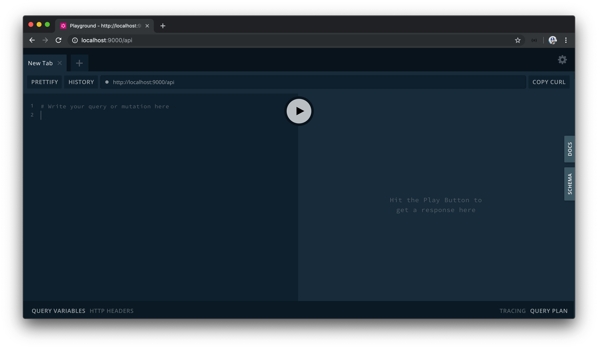
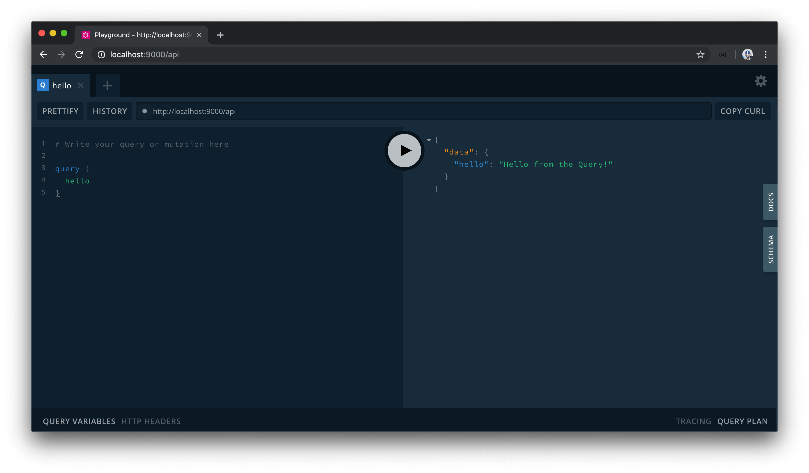
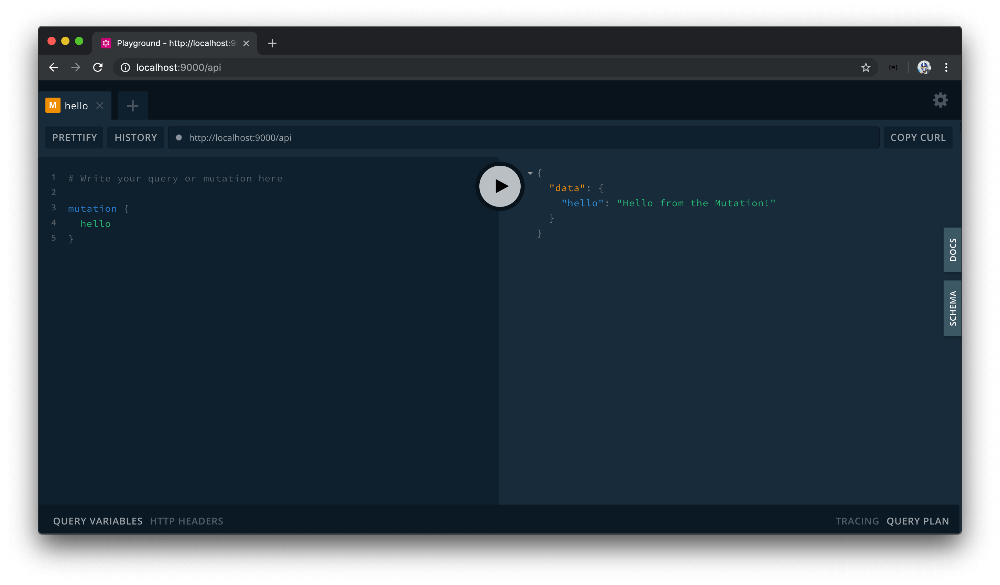

# Creating a GraphQL Schema with the GraphQL JS Library

## Gameplan

Let's quickly summarize how we want to introduce Apollo Server before we begin doing so.

To introduce Apollo server to our application, the first thing we'll need to do is create an instance of Apollo server. This is done by importing the `ApolloServer` class and constructing a new instance with the `ApolloServer` constructor.

```typescript
import { ApolloServer } from "apollo-server-express";

const server = new ApolloServer();
```

With an Apollo Server instance created, the `apollo-server-express` library allows us to specify middleware that works alongside the existing server middleware. It's in this middleware where we can pass in the express `app` instance as well as specify the endpoint for where our GraphQL API should live.

```typescript
import { ApolloServer } from "apollo-server-express";

const app = express();
const server = new ApolloServer();

server.applyMiddleware({ app, path: "/api" });
```

The `ApolloServer()` constructor can take in a series of _options_ needed to instantiate the Apollo Server instance. The conventional options that can often be passed in are the:

- `typeDefs`: String that represents the entire GraphQL schema.
- `resolvers`: Map of functions that implement the schema.

Though we're going to aim to get to this point, we'll begin by going through a more "bare-bones" approach to creating a GraphQL server. In the first attempt to creating our schema, we'll import and create [GraphQLObjectType](https://graphql.org/graphql-js/type/#graphqlobjecttype)'s with the help of the `graphql` JavaScript library.

## Simple GraphQL Schema

To begin, we'll have the `ApolloServer` constructor class imported in our `/src/index.ts` file. We'll run the constructor function and assign the result to a `server` const variable. We won't pass in any arguments to the constructor just yet. We'll apply middleware to the Apollo Server instance and pass in the `express` app instance, and state our GraphQL API will be on a path of `/api`.

Finally, we'll also remove all the RESTful Express Routes we've created since we'll now be moving towards GraphQL. We'll remove the import of `listings` as well as remove the import and use of `bodyParser`.

At this moment, our `src/index.ts` file will look like the following:

```typescript
import express from "express";
import { ApolloServer } from "apollo-server-express";

const app = express();
const port = 9000;
const server = new ApolloServer();

server.applyMiddleware({ app, path: "/api" });
app.listen(port);

console.log(`[app] : http://localhost:${port}`);
```

Let's now look to create a schema with the `graphql` JavaScript library. We'll build our schema within a new file called `graphql.ts` that is to be created in our `src/` folder.

```shell
server/
  // ...
  src/
    graphql.ts
    index.ts
    listings.ts
  // ...
```

To create our schema, we'll be using class objects that the `graphql` JavaScript library provides. We're going to begin by importing two classes from the graphql library [GraphQLSchema](https://graphql.org/graphql-js/type/#graphqlschema) and [GraphQLObjectType](https://graphql.org/graphql-js/type/#graphqlobjecttype).

```typescript
import { GraphQLSchema, GraphQLObjectType } from "graphql";
```

- [`GraphQLSchema`](https://graphql.org/graphql-js/type/#graphqlschema) is to be used to create a GraphQL Schema by passing in the root level query and mutation GraphQL object types.
- [`GraphQLObjectType`](https://graphql.org/graphql-js/type/#graphqlobjecttype) is the most basic component of a GraphQL schema which can be used to represent practically all our GraphQL object types from the root query and mutation types to specific custom types.

To get us started, we'll construct a blank query and mutation object types with the help of the `GraphQLObjectType` class. Though the `GraphQLObjectType` constructor can take a series of options, we'll only specify the `name` option for each object type and name them accordingly as `'Query'` and `'Mutation'`.

```typescript
import { GraphQLSchema, GraphQLObjectType } from "graphql";

const query = new GraphQLObjectType({
  name: "Query"
});

const mutation = new GraphQLObjectType({
  name: "Mutation"
});
```

We'll then pass the constructed `query` and `mutation` objects as options to a `GraphQLSchema` constructor. We'll also export this created schema.

```typescript
import { GraphQLSchema, GraphQLObjectType } from "graphql";

const query = new GraphQLObjectType({
  name: "Query"
});

const mutation = new GraphQLObjectType({
  name: "Mutation"
});

export const schema = new GraphQLSchema({
  query,
  mutation
});
```

At this point, TypeScript will display some errors in our `GraphQLObjectType` constructors telling us that the `fields` of the object type is required. This is valid since the GraphQL query language is all about selecting fields on objects.

We'll go ahead and declare the `fields` option for each object type. The `fields` option expects us to specify a map of the different fields that live within the object type. In both cases, we'll declare a simple `hello` field to get us started.

```typescript
import { GraphQLSchema, GraphQLObjectType } from "graphql";

const query = new GraphQLObjectType({
  name: "Query",
  fields: {
    hello: {}
  }
});

const mutation = new GraphQLObjectType({
  name: "Mutation",
  fields: {
    hello: {}
  }
});

export const schema = new GraphQLSchema({
  query,
  mutation
});
```

A field property also takes options of its own. Here we can specify the `type` option to dictate the type of the field, and a `resolve` function to dictate how the field is expected to _resolve_.

`type` could be a Scalar type, Object type, Enum type, etc. In this case, we'll want to specify that the return type of our `hello` field is a string so we'll import the `GraphQLString` scalar type and specify that as the type of our `hello` fields.

```typescript
import { GraphQLSchema, GraphQLString, GraphQLObjectType } from "graphql";

const query = new GraphQLObjectType({
  name: "Query",
  fields: {
    hello: {
      type: GraphQLString
    }
  }
});

const mutation = new GraphQLObjectType({
  name: "Mutation",
  fields: {
    hello: {
      type: GraphQLString
    }
  }
});

export const schema = new GraphQLSchema({
  query,
  mutation
});
```

Every field in a schema should have a resolver function that resolves the value of that GraphQL field. Here, we're able to use the `resolve` function option to do so. For both hello fields, we'll resolve to return simple string messages - `'Hello from the Query!'` for the query and `'Hello from the Mutation!'` for the mutation.

```typescript
import { GraphQLSchema, GraphQLObjectType, GraphQLString } from "graphql";

const query = new GraphQLObjectType({
  name: "Query",
  fields: {
    hello: {
      type: GraphQLString,
      resolve: () => "Hello from the Query!"
    }
  }
});

const mutation = new GraphQLObjectType({
  name: "Mutation",
  fields: {
    hello: {
      type: GraphQLString,
      resolve: () => "Hello from the Mutation!"
    }
  }
});

export const schema = new GraphQLSchema({ query, mutation });
```

With our barebones schema created, we can now have it imported and passed into the `ApolloServer` constructor in the `/src/index.ts` file.

```typescript
const server = new ApolloServer({ schema });
```

When we now run the server and head to the location of our GraphQL Endpoint - <https://localhost:9000/api>, we'll be presented with an IDE to interact with our API!



## GraphQL Playground

[GraphQL Playground](https://github.com/prisma/graphql-playground) is an in-browser IDE (Integrated Development Environment) for exploring GraphQL APIs. GraphQL Playground is built by the Prisma team and is based on another IDE called [GraphiQL](https://github.com/graphql/graphiql) (which is what we used for interacting with Github's public GraphQL API).

GraphQL Playground is intended to be a more sophisticated IDE by giving us capabilities such as looking through query history, automatic schema reloading, the configuration of HTTP headers, and so on. The vast majority of the time, however, we'll often find ourselves interacting with our API by surveying the documentation of our GraphQL schema and running queries/mutations to verify our API works as intended without having to use `curl` or tools like Postman.

On the left-hand pane, let's look to write our first query. We'll use the `query` keyword and declare the `hello` field as the field we'll want to query. When successful, we'll get the data we expect!



This will behave similarly for the mutation as well. We'll use the `mutation` keyword and state the `hello` field as the `mutation` we'll want to run.



Amazing. Our Express app is now prepared with Apollo Server. In the next lesson, we'll look to replicate the functionality we had in our Express REST API (querying listings and deleting a listing) with our GraphQL setting.
