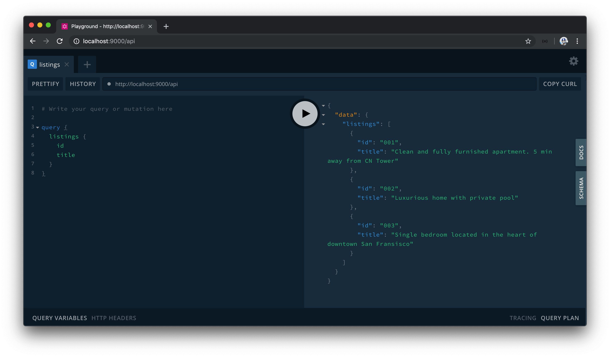

# Querying and mutating listings data with GraphQL

We've created a simple GraphQL Schema with which our root level query and mutation object types each have a single `hello` field that returns a string message when queried. We'll now look to mimic the listings retrieval and manipulation we had in our REST API with GraphQL.

## Listing Object Type

The first thing we'll do is create a custom `Listing` object type. The `Listing` object type is to reference the listing type that is to be returned from our soon to be query and mutation. We'll use the `GraphQLObjectType` class to construct this type in the `src/graphql.ts` file.

The `Listing` type is to contain a series of fields that represent a listing.

```typescript
const Listing = new GraphQLObjectType({
  name: "Listing",
  fields: () => ({
    id: {},
    title: {},
    image: {},
    address: {},
    price: {},
    numOfGuests: {},
    numOfBeds: {},
    numOfBaths: {},
    rating: {}
  })
});
```

We'll need to define the types of each of the fields within `Listing`.

### `GraphQLID`

GraphQL provides a unique scalar type for ID's, [`GraphQLID`](https://graphql.org/graphql-js/type/#graphqlid). The `GraphQLID` scalar type is to represent a unique identifier however it behaves and gets serialized as a `String`. Its main purpose is to convey that a field is to be a unique identifying field. We'll import the `GraphQLID` type and use it as the type of the `id` field.

```typescript
import {
  // ...
  GraphQLID
} from "graphql";

const Listing = new GraphQLObjectType({
  name: "Listing",
  fields: () => ({
    id: { type: GraphQLID }
    // ...
  })
});
```

### `GraphQLString`

The `title`, `image`, and `address` fields of `Listing` are expected to be strings so we'll define their types with the already imported [`GraphQLString`](https://graphql.org/graphql-js/type/#graphqlstring) scalar type.

```typescript
import {
  // ...
  GraphQLString
} from "graphql";

const Listing = new GraphQLObjectType({
  name: "Listing",
  fields: () => ({
    // ...
    title: { type: GraphQLString },
    image: { type: GraphQLString },
    address: { type: GraphQLString }
    // ...
  })
});
```

### `GraphQLInt`

The `price`, `numOfGuests`, `numOfBeds`, `numOfBaths`, and `rating` fields of `Listing` are expected to be integers so we'll define their types with the [`GraphQLInt`](https://graphql.org/graphql-js/type/#graphqlint) type.

```typescript
import {
  // ...
  GraphQLInt
} from "graphql";

const Listing = new GraphQLObjectType({
  name: "Listing",
  fields: () => ({
    // ...
    numOfGuests: { type: GraphQLInt },
    numOfBeds: { type: GraphQLInt },
    numOfBaths: { type: GraphQLInt },
    rating: { type: GraphQLInt }
  })
});
```

> For floating-point numbers (i.e. numbers with decimals), GraphQL provides the [`GraphQLFloat`](https://graphql.org/graphql-js/type/#graphqlfloat) scalar type.

Our `Listing` object will now look like the following:

```typescript
const Listing = new GraphQLObjectType({
  name: "Listing",
  fields: () => ({
    id: { type: GraphQLID },
    title: { type: GraphQLString },
    image: { type: GraphQLString },
    address: { type: GraphQLString },
    price: { type: GraphQLInt },
    numOfGuests: { type: GraphQLInt },
    numOfBeds: { type: GraphQLInt },
    numOfBaths: { type: GraphQLInt },
    rating: { type: GraphQLFloat }
  })
});
```

> It might be apparent that the types we specify here _mimic_ the `Listings` TypeScript interface created in the `src/listings.ts` file.
>
> As a reminder, TypeScript is the extension we're using to type check and reinforce our development code.
>
> GraphQL is a _typed_ query language for APIs so we have to define the types of the fields in our schema. There are open-source tools (e.g. [GraphQL Code Generator](https://graphql-code-generator.com/docs/getting-started/)) that help in generating TypeScript types from GraphQL schemas, but they add a layer of complexity so we won't be using them for our server code. We'll investigate how we can generate TypeScript types from a GraphQL schema when we work on the client portion of our app.

### `GraphQLNonNull`

We'll take the type definitions for the fields in the `Listing` object type another step. We want all our fields in the `Listing` type to never be `null` and to **always be defined**. We can achieve this by using the [GraphQLNonNull](https://graphql.org/graphql-js/type/#graphqlnonnull) wrapper.

`GraphQLNonNull` is a type marker that enforces values are never null and will ensure an error is thrown if this ever occurs. Let's import the `GraphQLNonNull` wrapper in our `src/graphql.ts` file.

```typescript
import {
  // ...
  GraphQLNonNull
} from "graphql";
```

We'll wrap every field type in `Listing` with the `GraphQLNonNull` wrapper which will make our `Listing` object type appear as follows:

```typescript
const Listing = new GraphQLObjectType({
  name: "Listing",
  fields: {
    id: { type: GraphQLNonNull(GraphQLID) },
    title: { type: GraphQLNonNull(GraphQLString) },
    image: { type: GraphQLNonNull(GraphQLString) },
    address: { type: GraphQLNonNull(GraphQLString) },
    price: { type: GraphQLNonNull(GraphQLInt) },
    numOfGuests: { type: GraphQLNonNull(GraphQLInt) },
    numOfBeds: { type: GraphQLNonNull(GraphQLInt) },
    numOfBaths: { type: GraphQLNonNull(GraphQLInt) },
    rating: { type: GraphQLNonNull(GraphQLFloat) }
  }
});
```

### Root query and `GraphQLList`

We'll now modify our root `Query` object to have a field that will allow us to return an array of listing objects from the mock `listings` array we have in our app. We'll rename the `hello` field in our `query` object to a `listings` field responsible in returning a list of listings.

```typescript
const query = new GraphQLObjectType({
  name: "Query",
  fields: () => ({
    listings: {}
  })
});
```

The `listings` query field is expected to be a _list_ of `Listing` items. Since we expect this field to be a list, we'll need to use the [`GraphQLList`](https://graphql.org/graphql-js/type/#graphqllist) definition.

`GraphQLList` is a type wrapper that indicates a list is to be created for a particular type. Let's import the `GraphQLList` type.

```typescript
import {
  // ...
  GraphQLList
} from "graphql";
```

`GraphQLList` expects an argument of the item type expected in the list. We'll specify the type of the `listings` field to be a list of the `Listing` object type.

```typescript
const query = new GraphQLObjectType({
  name: "Query",
  fields: () => ({
    listings: {
      type: GraphQLList(Listing)
    }
  })
});
```

We also want the type of element being iterated in the list to never be null so we'll wrap it with the `GraphQLNonNull` wrapper.

```typescript
const query = new GraphQLObjectType({
  name: "Query",
  fields: () => ({
    listings: {
      type: GraphQLList(GraphQLNonNull(Listing))
    }
  })
});
```

We _also_ don't want the `listings` type itself ever being null, so we'll wrap the whole type with the `GraphQLNonNull` wrapper as well.

```typescript
const query = new GraphQLObjectType({
  name: "Query",
  fields: () => ({
    listings: {
      type: GraphQLNonNull(GraphQLList(GraphQLNonNull(Listing)))
    }
  })
});
```

A little verbose but it does what we intended to do. For the `listings` field to return a defined list that has a defined set of listing items, we use the `GraphQLNonNull` wrapper twice.

We'll now import the `listings` mock array from the `src/listings.ts` file.

```typescript
import { listings } from "./listings";
```

With the `listings` data array available, we can have it simply be returned in our `listings` field `resolve` function.

```typescript
const query = new GraphQLObjectType({
  name: "Query",
  fields: {
    listings: {
      type: GraphQLNonNull(GraphQLList(GraphQLNonNull(Listing))),
      resolve: () => {
        return listings;
      }
    }
  }
});
```

The `listings` field when queried will now return the list of listings from our mock array.

### Root mutation

We'll replace the `hello` field in our `mutation` object to a `deleteListing` field. `deleteListing` when resolved will delete a listing from our mock array and return the deleted listing object.

```typescript
const mutation = new GraphQLObjectType({
  name: "Mutation",
  fields: () => ({
    deleteListing: {}
  })
});
```

Since we expect the deleted listing to be returned, we'll state that the type of the `deleteListing` field is the `Listing` object type. Since we won't want to have this field ever return `null`, we'll wrap the type of the field with `GraphQLNonNull`.

```typescript
const mutation = new GraphQLObjectType({
  name: "Mutation",
  fields: () => ({
    deleteListing: {
      type: GraphQLNonNull(Listing)
    }
  })
});
```

Our `deleteListing` mutation will need to accept an argument of the `id` of the listing that is to be deleted. Here is where we'll introduce a new `args` field in `deleteListing` to dictate the fields that are to be passed to `deleteListing` as arguments.

```typescript
const mutation = new GraphQLObjectType({
  name: "Mutation",
  fields: () => ({
    deleteListing: {
      type: GraphQLNonNull(Listing),
      args: {}
    }
  })
});
```

We'll declare an `id` arg and specify a type of `GraphQLID`. We'll also state the `id` argument can't be null so we'll wrap it with the `GraphQLNonNull` type.

```typescript
const mutation = new GraphQLObjectType({
  name: "Mutation",
  fields: () => ({
    deleteListing: {
      type: GraphQLNonNull(Listing),
      args: {
        id: { type: GraphQLNonNull(GraphQLID) }
      }
    }
  })
});
```

GraphQL resolvers [have access of up to four positional arguments](https://www.apollographql.com/docs/graphql-tools/resolvers/#resolver-function-signature). With the `deleteListing` field resolver, we're currently only interested in accessing the `args` this field will receive. `args` of a resolver function is the second positional argument of the function, so we'll define the first two arguments of the resolver function. We'll label the first obj argument as `root` to convey it is the root obj passed to our root mutation object type and we'll prefix it with underscore since it is to be unused. We'll destruct the `id` value from the arguments payload.

```typescript
const mutation = new GraphQLObjectType({
  name: "Mutation",
  fields: () => ({
    deleteListing: {
      type: GraphQLNonNull(Listing),
      args: {
        id: { type: GraphQLNonNull(GraphQLID) }
      },
      resolve: (_root, { id }) => {}
    }
  })
});
```

Our resolver function will have the same functionality as what we had in the `/delete-listing` route of our Express RESTful API. We'll look to remove the appropriate listing from our listings collection and return the removed listing.

Compared with what we did in the POST Express route is we won't use a `res.send()` function and we'll either simply return the removed listing or throw an `Error`. In addition, instead of returning an array from the `.splice()` array that contains the deleted listing item, we'll ensure that we return the listed object from the array.

```typescript
const mutation = new GraphQLObjectType({
  name: "Mutation",
  fields: {
    deleteListing: {
      type: GraphQLNonNull(Listing),
      args: {
        id: { type: GraphQLNonNull(GraphQLID) }
      },
      resolve: (_root, { id }) => {
        for (let i = 0; i < listings.length; i++) {
          if (listings[i].id === id) {
            return listings.splice(i, 1)[0];
          }
        }

        throw new Error("failed to deleted listing");
      }
    }
  }
});
```

> At this moment, the `root` obj and `id` argument don't have appropriate types. We'll add appropriate typing to these parameters in the next lesson as we change how we're creating the GraphQL schema.

## GraphQL Playground

### Querying listings

Our schema is appropriately set up with the functionality we're interested in having. We'll start the server in our terminal, and launch GraphQL Playground by visiting <http://localhost:9000/api> in our browser.

When we take a look through the GraphQL Playground documentation, we can see the newly added fields in our `Query` and `Mutation` object types. When we look at the `Listing` type that is to be returned, we can see all the fields and the expected types of each field for `Listing`.


Let's query the `listings` field. At first, we'll simply query the `id` and `title` fields within `listings`.

```graphql
query {
  listings {
    id
    title
  }
}
```

By running our query, we'll see _just_ the `id` and `title` fields of every listing object in the mock `listings` array!



How about if we change our query and introduce more fields, like the `address` and `price` of each listing?

```graphql
query {
  listings {
    id
    title
    address
    price
  }
}
```

Running our query again, we now get `address` and `price` information as well!


From the simple GraphQL schema we've set up, we're able to query **whatever fields we'd want from the mock listings array**.

### Deleting a listing

We'll now try to delete a listing with the `deleteListing` mutation we've established. In our GraphQL Playground, we'll change the keyword to `mutation` and specify the `deleteListing` field as the mutation that is to be run.

```graphql
mutation {
  deleteListing {

  }
}
```

We'll pass in an `id` argument and provide a value of one of the ids of our mock listings array. Like we've done before, we'll use an `id` of `"001"` to represent the first listing in the mock `listings` array that we want deleted.

```graphql
mutation {
  deleteListing(id: "001") {

  }
}
```

We're able to return what fields we want from the deleted listing when the mutation is run successfully. Let's state we're interested in retrieving just the `id` and `title` fields of the deleted listing.

```graphql
mutation {
  deleteListing(id: "001") {
    id
    title
  }
}
```

When we run the mutation in our playground, we'll retrieve the `id` and `title` fields of the deleted listing when the mutation is complete.


If we attempt to query the listings again, we'll see that the first listing object is now gone.

By invoking our `listings` query and `deleteListing` mutation, we can observe another advantage of using our GraphQL API. With our prior Express RESTful API we had to make our GET request and POST request in two separate endpoints - `/listings` and `/delete-listing`. With GraphQL, **we're able to make our queries and mutations with a single endpoint** (`/api` in our example).

## GraphQL Schema Language

Great! In this lesson, we learned how to create a GraphQL schema by creating custom object types with the constructors provided by the `graphql` JavaScript library. You may have noticed how defining the schema this way started to become quite verbose _very quickly_. As our schema inevitably grows bigger when we move on to our larger-scale app, our schema will become harder to understand and debug if we continued creating the schema the way we've done so far.

With that said, there is a different way to define a GraphQL Schema. We can use the [GraphQL Schema Language](https://www.apollographql.com/docs/apollo-server/essentials/schema/#schema-definition-language), which is a human-readable syntax to creating a GraphQL schema. In the next lesson, we'll re-create the schema we've created thus far with the GraphQL Schema Language.
