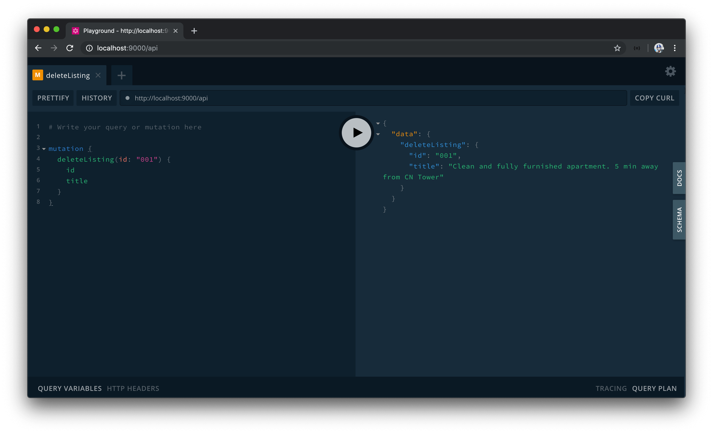

# Using the GraphQL Schema Language

The [GraphQL schema language (sometimes known as the Schema Definition Language)](https://www.apollographql.com/docs/apollo-server/essentials/schema/#schema-definition-language) uses a simple syntax to define and create a GraphQL schema and is language agnostic. Most graphql server libraries provide us with the capability of creating a schema with the GraphQL schema language. The GraphQL JavaScript library also allows us to create a schema with the GraphQL schema language, but we'll achieve this with the `apollo-server-express` package.

Apollo Server conventionally allows us to define a GraphQL schema by setting up two different values.

- `typeDefs` - string that represents the GraphQL schema.
- `resolvers` - map of functions that implement the schema.

We'll create these in separate files located within a `src/graphql` folder. We'll also create an `index.ts` file in the `src/grapqhl` folder to gather the `typeDefs` and `resolvers` map and export them explicitly from the `graphql/` folder.

```shell
server/
  src/
    graphql/
      index.ts
      resolvers.ts
      typeDefs.ts
    // ...
```

## typeDefs

### `Listing`

We'll begin by creating our schema definition with the GraphQL schema language in the `src/graphql/typeDefs.ts` file. To do so, we'll import and use the [`gql` template literal tag](https://github.com/apollographql/graphql-tag) from `apollo-server-express`.

```typescript
import { gql } from "apollo-server-express";
```

The `gql` tag will allow us to write GraphQL in our code by having _strings_ be parsed as a GraphQL Abstract Syntax Tree. Let's see this in action before we discuss how the `gql` tag works. We'll export and create a `const` variable named `typeDefs` that has the `gql` tag wrapped around a template literal string.

```typescript
import { gql } from "apollo-server-express";

export const typeDefs = gql``;
```

We'll first define the `Listing` object type as we've done in the previous lesson but in this instance use the syntax of the GraphQL schema language. We can define a new object type by using the `type` keyword.

```typescript
import { gql } from "apollo-server-express";

export const typeDefs = gql`
	type Listing {}
`;
```

We can declare the fields of our `Listing` object type and use the built-in scalar types to reference the types of each field - `ID` for the id type, `String` for the string types, and `Int` for the integer types.

```typescript
import { gql } from "apollo-server-express";

export const typeDefs = gql`
  type Listing {
    id: ID
    title: String
    image: String
    address: String
    price: Int
    numOfGuests: Int
    numOfBeds: Int
    numOfBaths: Int
    rating: Float
  }
`;
```

Recall how we've wanted each of the fields within the `Listing` type to never be `null`? In the last lesson, we achieved this by wrapping the types with the `GraphQLNonNull` wrapper. With the GraphQL schema language, we can simply place an `!` after a type definition to declare that the type should always be defined.

```typescript
import { gql } from "apollo-server-express";

export const typeDefs = gql`
  type Listing {
    id: ID!
    title: String!
    image: String!
    address: String!
    price: Int!
    numOfGuests: Int!
    numOfBeds: Int!
    numOfBaths: Int!
    rating: Int!
  }
`;
```

### `Query`

With our `Listing` type defined, we can go ahead and declare the shape of the root `Query` and `Mutation` types.

We intend on having a single `listings` field be in our `Query` object that's responsible in returning a list of `Listing` objects. With the GraphQL schema language, we can simply wrap the type with `[]` brackets to denote a GraphQL List.

```typescript
import { gql } from "apollo-server-express";

export const typeDefs = gql`
  type Listing {
    id: ID!
    title: String!
    image: String!
    address: String!
    price: Int!
    numOfGuests: Int!
    numOfBeds: Int!
    numOfBaths: Int!
    rating: Int!
  }

  type Query {
    listings: [Listing]
  }
`;
```

For our `listings` query field, we want to ensure the value returned is not `null` and contains a list of not `null` values. We'll place the `!` marks accordingly to denote this.

```typescript
import { gql } from "apollo-server-express";

export const typeDefs = gql`
  type Listing {
    id: ID!
    title: String!
    image: String!
    address: String!
    price: Int!
    numOfGuests: Int!
    numOfBeds: Int!
    numOfBaths: Int!
    rating: Int!
  }

  type Query {
    listings: [Listing!]!
  }
`;
```

### `Mutation`

Finally, we'll declare the shape of the `Mutation` object type that contains a `deleteListing` field that is to return a required `Listing` type.

```typescript
import { gql } from "apollo-server-express";

export const typeDefs = gql`
  type Listing {
    id: ID!
    title: String!
    image: String!
    address: String!
    price: Int!
    numOfGuests: Int!
    numOfBeds: Int!
    numOfBaths: Int!
    rating: Int!
  }

  type Query {
    listings: [Listing!]!
  }

  type Mutation {
    deleteListing: Listing!
  }
`;
```

The `deleteListing` field is unique since it's the only field that accepts an argument. We'll specify the `id` argument it expects and declare that is of type `ID!`. Our `typeDefs` string in its complete state will look like the following:

```typescript
import { gql } from "apollo-server-express";

export const typeDefs = gql`
  type Listing {
    id: ID!
    title: String!
    image: String!
    address: String!
    price: Int!
    numOfGuests: Int!
    numOfBeds: Int!
    numOfBaths: Int!
    rating: Int!
  }

  type Query {
    listings: [Listing!]!
  }

  type Mutation {
    deleteListing(id: ID!): Listing!
  }
`;
```

### gql

The `gql` tag helps parse the string we've created into a GraphQL Abstract Syntax tree and Apollo Server requires us to use it to wrap our schema.

For clarification - `gql` is a _function_ that takes a string as an argument. The string argument has to be constructed with template literals. You might be wondering why this function appears a little strange since its use involves the placement of a template string beside the `gql` reference. This is an ES6 feature known as "tagged template literals" which isn't commonly used but allows for the capability to parse strings with a preprocessor. The main takeaway here is that `gql` is a tag (i.e. function) where the argument is derived from the template literal applied alongside it. It takes the `string` and returns a GraphQL Tree.

By using the `gql` tag, it helps us manipulate the GraphQL document by making it easier to add/remove fields and perform more complicated functionality like merging queries. This is most apparent when we install and use an accompanying editor extension like the [VSCode's Apollo GraphQL Extension](https://marketplace.visualstudio.com/items?itemName=apollographql.vscode-apollo). When installed, we'll get appropriate syntax highlighting for all our GraphQL documents created with the `gql` tag!


## Resolvers

We'll now move towards creating the `resolvers` of our GraphQL Schema with which we'll do in the `src/graphql/resolvers.ts` file. Here's where we'll provide the functionality to all of our schema entry points for fetching & manipulating data. In other words, here is where define our GraphQL _resolvers_.

In the `src/graphql/resolvers.ts` file, we'll import the mock `listings` data array since we'll need it in our resolver functions and we'll export a `const` object labeled `resolvers`.

```typescript
import { listings } from "../listings";

export const resolvers = {};
```

The `resolvers` object is simply going to be a map that relates the schema fields to the functions that resolve that field.

### `Query`

First, we'll define the `Query` root object and the `listings` field resolver. The `listings` field resolver will simply return the `listings` array from our mock data.

```typescript
import { listings } from "../listings";

export const resolvers = {
  Query: {
    listings: () => {
      return listings;
    }
  }
};
```

### `Mutation`

We'll then declare the `Mutation` object with the `deleteListing` field resolver.

```typescript
import { listings } from "../listings";

export const resolvers = {
  Query: {
    listings: () => {
      return listings;
    }
  },
  Mutation: {
    deleteListing: () => {}
  }
};
```

The `deleteListing` resolver will expect an `id` argument that we're going to need to access. The arguments passed to a resolver function is positioned as the second argument of a resolver function. As a result, we'll declare the `root` arg first and we'll destruct the `id` field from the passed in arguments.

The delete functionality would appear just like we had in our original GraphQL schema where we return the spliced listing object within the list or throw an `Error`.

```typescript
import { listings } from "../listings";

export const resolvers = {
  // ...
  Mutation: {
    deleteListing: (_root, { id }) => {
      for (let i = 0; i < listings.length; i++) {
        if (listings[i].id === id) {
          return listings.splice(i, 1)[0];
        }
      }

      throw new Error("failed to deleted listing");
    }
  }
};
```

## Resolvers and types

The `root` and `id` properties in our `deleteListing` resolver function don't have appropriate types associated with them.

The first `root` object argument will contain the results returned from a resolver on a _parent_ field. We know `Query` and `Mutation` are our root object types so for this object to have a value, it needs to be declared and passed from the server configuration. We haven't configured anything to be defined here so `root` will be undefined and as a result, we can use the `undefined` type.

`id` in the GraphQL Schema is of type `ID`. The `ID` type gets serialized as a `string` when the function is run so we'll type define the destructured arguments object in `deleteListing` and give `id` the string type.

```typescript
import { listings } from "../listings";

export const resolvers = {
  // ...
  Mutation: {
    deleteListing: (_root: undefined, { id }: { id: string }) => {
      for (let i = 0; i < listings.length; i++) {
        if (listings[i].id === id) {
          return listings.splice(i, 1)[0];
        }
      }

      throw new Error("failed to deleted listing");
    }
  }
};
```

### `IResolvers` interface

Apollo Server provides some interface types to help better define the types of a resolvers map. We'll import the `IResolvers` interface from the `apollo-server-express` package and type define our resolvers map with it.

Our `src/graphql/resolvers.ts` file in the complete state for this lesson will look like the following.

```typescript
import { IResolvers } from "apollo-server-express";
import { listings } from "../listings";

export const resolvers: IResolvers = {
  Query: {
    listings: () => {
      return listings;
    }
  },
  Mutation: {
    deleteListing: (_root: undefined, { id }: { id: string }) => {
      for (let i = 0; i < listings.length; i++) {
        if (listings[i].id === id) {
          return listings.splice(i, 1)[0];
        }
      }

      throw new Error("failed to deleted listing");
    }
  }
};
```

The `IResolvers` interface helps enforce our `resolvers` map object to only contain either resolver fields or resolver functions themselves. For example, if we tried to introduce a field that has a value of a `string`, we'll get a warning.

```typescript
import { IResolvers } from "apollo-server-express";
import { listings } from "../listings";

export const resolvers: IResolvers = {
  field: "this is a string" // Type 'string' is not assignable...
  // ...
};
```

Also, the `IResolvers` interface is a [generic](https://www.typescriptlang.org/docs/handbook/generics.html) and allows us to define the types of the `obj` and `context` arguments in our resolver functions by passing in type variables - `IResolvers<TSource, TContext>`.

```typescript
import { IResolvers } from "apollo-server-express";
import { listings } from "../listings";

export const resolvers: IResolvers<undefined, Context> = {
  Query: {
    field: (root, args: {}, ctx) => {
      // root will have the undefined type
      // ctx will have the Context type
      // ...
    }
  }
  // ...
};
```

We prefer to explicitly define the types of parameters in each of our resolver functions so we won't define these types definitions as type variables to `IResolvers`.

> If you don't understand how TypeScript generics work (e.g. what `IResolvers<TSource, TContext>` means), no need to worry! We'll be introducing and explaining TypeScript generics and type variables in an upcoming lesson.

## Running our GraphQL requests

In the `src/graphql/index.ts` file, we'll re-export the `typeDefs` string and `resolvers` map.

```typescript
export * from "./resolvers";
export * from "./typeDefs";
```

In the `src/index.ts` file, we'll import the type definitions and resolvers from the `graphql/` folder. We'll modify our Apollo Server instantiation to take a new method of defining the schema by accepting the `typeDefs` and `resolvers` options. We'll also remove the standalone `graphql` file we had before where we instantiated our schema with the help of the GraphQL JavaScript library.

With all the changes made, our `src/index.ts` file will look like the following:

```typescript
import express from "express";
import { ApolloServer } from "apollo-server-express";
import { typeDefs, resolvers } from "./graphql";

const app = express();
const port = 9000;
const server = new ApolloServer({ typeDefs, resolvers });

server.applyMiddleware({ app, path: "/api" });
app.listen(port);

console.log(`[app] : http://localhost:${port}`);
```

When our server is running, our `listings` query will continue to work as expected.


And our `deleteListing` mutation will delete a listing when run and return information for the deleted listing.


