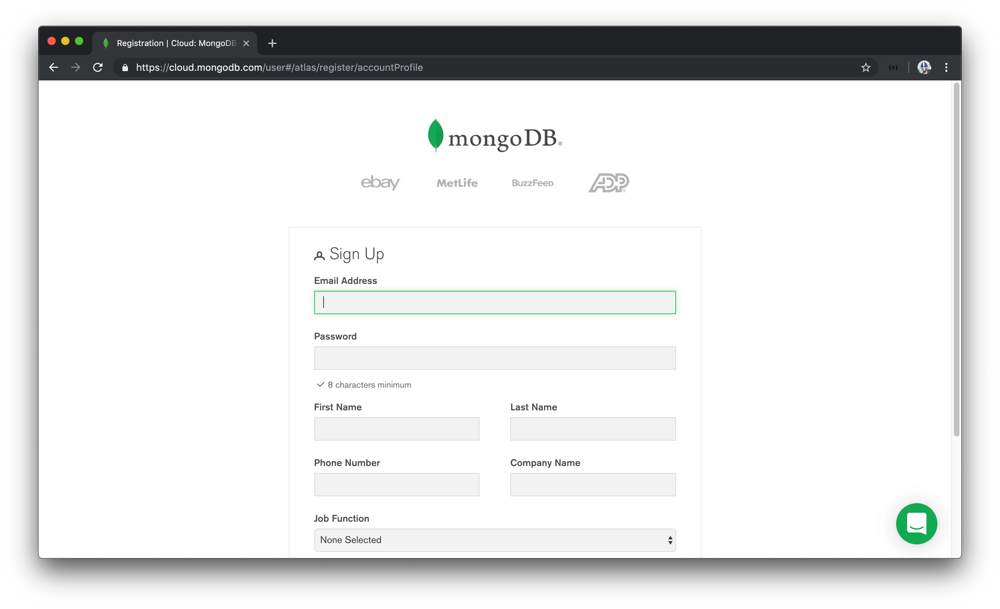
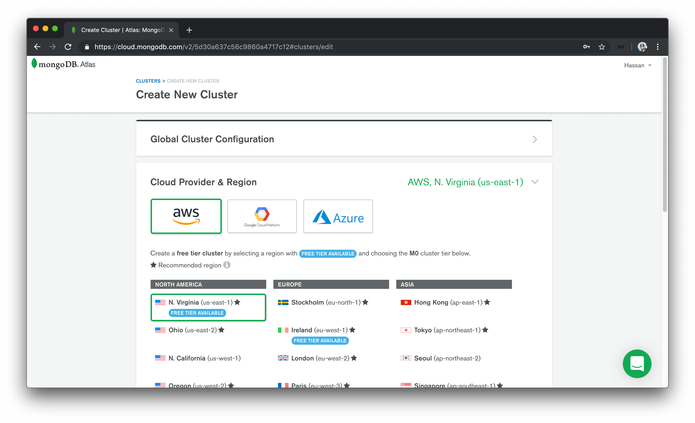
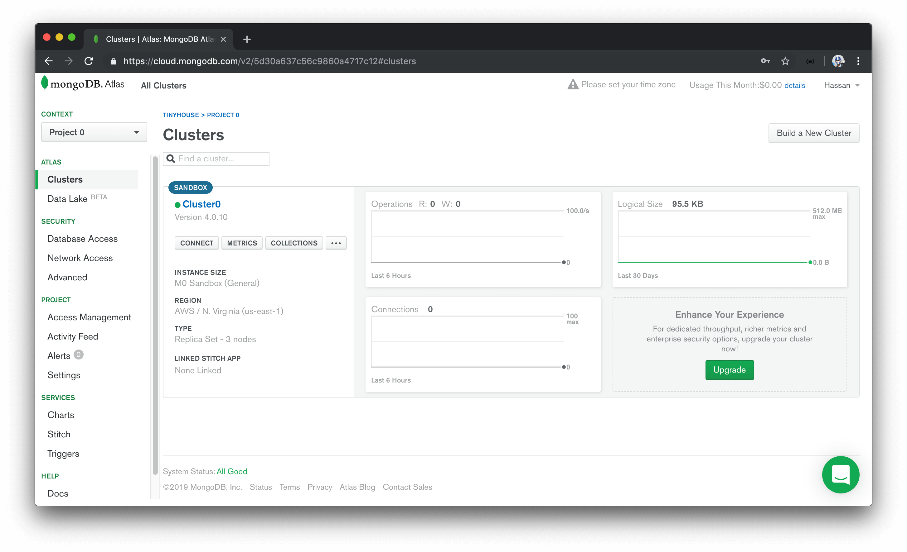
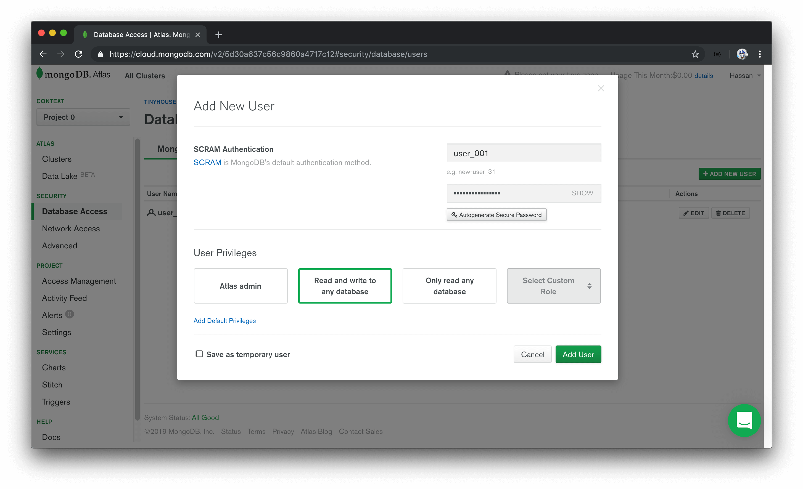
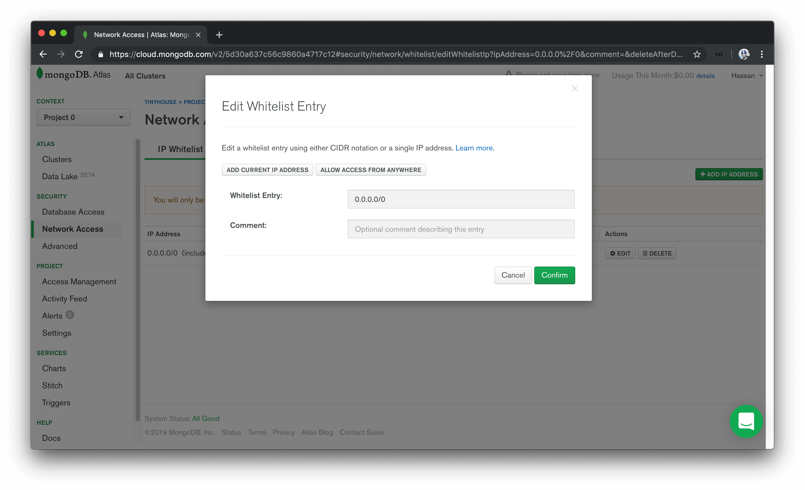
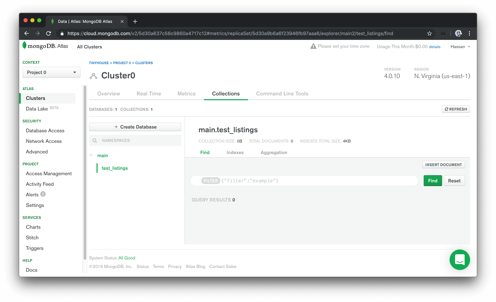
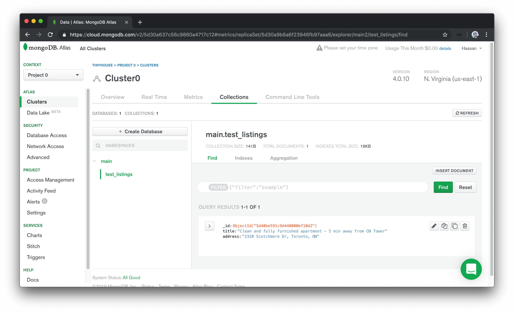

# Setting up a new MongoDB Cluster with Atlas

Just like how we intend to deploy our server to the cloud, we're going to implement our database on the cloud as well. This is important because the moment our server is in the cloud during production, it'll need to access a database on the cloud as well. We can't just have a database on our static local computer.

We're going to set up a MongoDB cluster with [MongoDB Atlas](https://www.mongodb.com/cloud/atlas) which is a fully managed cloud database service built and maintained by the same team behind MongoDB.

> A [MongoDB cluster](https://docs.atlas.mongodb.com/create-new-cluster/#a-open-the-create-new-cluster-dialog) is essentially a group of two or more servers that work together to provide users with higher availability, scalability, and reliability.
>
> MongoDB Atlas makes managing and hosting data on the cloud easy with clusters.

## Create an account

To use MongoDB Atlas, we'll need to have an account created. If you don't happen to have an account, you'll be to create one in the Atlas register page - <https://cloud.mongodb.com/user#/atlas/register/>.



## Create a cluster

Once an account has been created, we'll be redirected and prompted to create our very first cluster.



MongoDB Atlas recommends a lot of their popular options but they do give us the capability of customizing how our cluster is to be set up. We won't make any configuration changes and keep the default options that have already been selected.

> MongoDB Atlas allows for the creation and deployment of one `Free Tier` cluster per Atlas project. `Free Tier` clusters never expire and provide all the features and functionality we need for this course.
>
> We recommend selecting a cloud provider and region that provides the capability to create a free tier cluster.

It'll take about 7 - 10 minutes to provision a new `Free tier` cluster. Once ready, we'll be presented with details about our cluster in our MongoDB Atlas dashboard.



## Create a MongoDB user

We'll need to create a user to interact with databases in our MongoDB Atlas cluster. To do so, we can navigate to the `Database Access` section within the `SECURITY` tab. Here is where we'll add a new MongoDB user and provide both `read` and `write` access to the database cluster.



> A MongoDB user is different than an Atlas user. Atlas users can access the entire Atlas dashboard while MongoDB users access databases within clusters.

## Whitelist an IP address

MongoDB Atlas only allows client connections to the cluster from IP addresses that have been whitelisted. To whitelist an IP address, we can navigate to the `Network Access` section within the `SECURITY` tab.

To not concern ourselves with what our client IP addresses would be in development and/or in the deployed state, we'll select `Allow Access From Anywhere` to allow any IP address to access the cluster.

> For databases in production settings that may contain sensitive data, there may be some valid reasons to restrict connections to only a small subset of valid IP addresses. Since this won't be a concern in the course, we'll allow access from anywhere.



## Add sample data

The last thing we'll do as part of our cluster set-up is introduce sample data to a collection in our cluster. In the `Cluster` main dashboard section, we'll select `Collections` to navigate to the Collections tab of our cluster. We'll look to add our own data and specify a database name of `main` and a collection name of `test_listings`.



At this moment, we don't have any data in our `test_listings` collection so we'll look to add some data in the Atlas UI. We'll select `Insert Document` and we'll have three fields be added to a new document.

```javascript
_id: ObjectId("....."); // ObjectId
title: "Clean and fully furnished apartment - 5 min away from CN Tower"; // string
address: "2320 Scotchmere Dr, Toronto, ON"; // string
```

As we're inserting new fields here, we're able to specify the types of each field. MongoDB fields could be `null`, `Int64` (64 bit integer), `Int32` (32 bit integer), `code`, `boolean`, etc. This relates to how [MongoDB stores data records as BSON documents (i.e. Binary representation of JSON documents)](https://docs.mongodb.com/manual/core/document/). MongoDB's BSON document structure allows for the capability to store documents in binary form.

We'll have the `_id` field be of the `ObjectId` data type, while `title` and `description` will be of the `string` data type.

> The [`ObjectId`](https://docs.mongodb.com/manual/reference/method/ObjectId/) data type is a 12-byte identifier that is often used for the primary `_id` field of MongoDB documents. MongoDB assigns an `_id` field as a primary index to every document.

Once the document is inserted, we'll be able to see the newly added document in our Atlas collection UI.



With a MongoDB cluster created that contains sample data, the only thing left for us to do is connect our server application with our MongoDB Atlas cluster. We'll pick this up in the next lesson!
