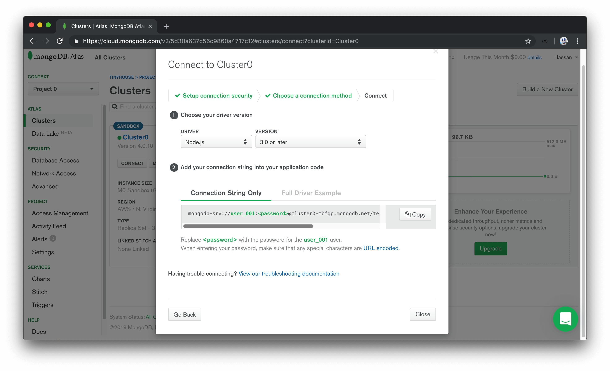
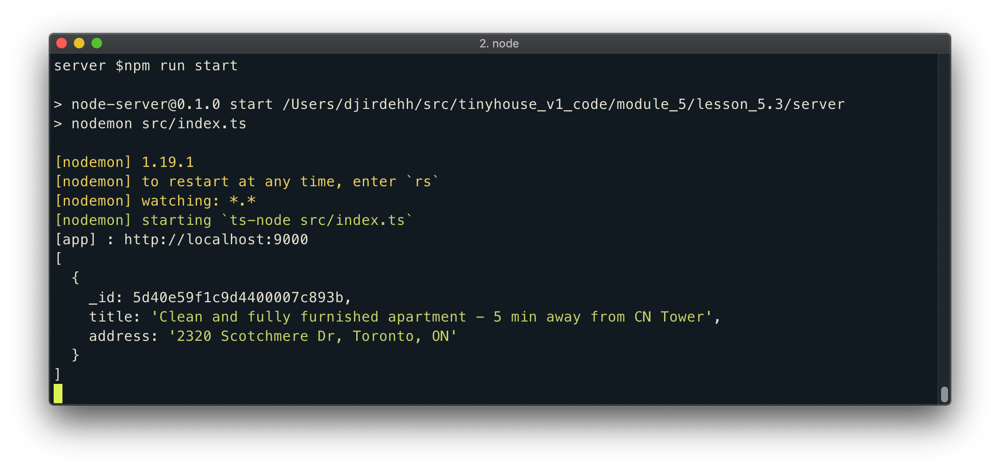

# Connecting the server with MongoDB

> To connect to MongoDB Atlas from a Node server, we need to ensure we have a secure internet connection. If you are learning this course on an insecure network (such as a public library or a coffee shops' public wi-fi), **MongoDB Atlas may reject your connection request**.

There's a few different libraries and tools that can be used to connect and interact with a MongoDB database from a Node server application. We're going to use the official MongoDB [Node.js Driver](https://mongodb.github.io/node-mongodb-native/) to make our connection. The Node.js MongoDB driver provides both callback and promise based interaction with MongoDB.

We'll head to our terminal and install the `mongodb` driver as a dependency for our server application.

```shell
server $: npm install mongodb
```

The node MongoDB driver is written in native JavaScript so we'll install the accompanying type definitions from the DefinitelyTyped repository.

```shell
server $: npm install -D @types/mongodb
```

With the node MongoDB driver installed, we'll aim to connect our server with the collection in the database we've established in MongoDB Atlas.

## Connecting to the Database

### Connection URL

We'll create a `database/` folder in `src/` that contains an `index.ts` file where we'll set up and declare the connection between our server and MongoDB.

```shell
src/
  database/
    index.ts
  graphql/
  index.ts
  listings.ts
```

In the `src/database/index.ts` file, our goal is to export a function that when run will make the connection to our database. We'll name this function accordingly and call it `connectDatabase`.

```typescript
export const connectDatabase = () => {};
```

To connect with our database we're going to need to import and use the [`MongoClient`](hhttps://mongodb.github.io/node-mongodb-native/3.2/api/MongoClient.html) constructor from the `mongodb` library.

```typescript
import { MongoClient } from "mongodb";

export const connectDatabase = () => {};
```

The `MongoClient` instance gives us access to a [`connect()`](https://mongodb.github.io/node-mongodb-native/3.2/api/MongoClient.html#.connect) function that takes a URL argument to specify a connection to a MongoDB instance. We'll retrieve this connection URL from MongoDB Atlas.

- In the MongoDB Atlas console, we'll find our cluster and click the `CONNECT` button available in the cluster dashboard.
- We'll select `Connect Your Application` and pick the `Node.js` driver option and the latest version (`3.0 or later`).

We'll then be presented with the connection URL.



We'll copy the connection url string provided to us and assign it to a `const` variable called `url` in our `src/database/index.ts` file.

```typescript
import { MongoClient } from "mongodb";

const url = `mongodb+srv://user_001:<password>@cluster0-mbfgp.mongodb.net`;

export const connectDatabase = () => {};
```

The connection url string contains details about the database user, the user's password (though not provided since the password is a protected credential), and the `cluster` we're making the connection to.

We'll extrapolate the user, password, and cluster portions of the string to their own respective `const` variables.

```typescript
import { MongoClient } from "mongodb";

const user = "user_001";
const userPassword = "";
const cluster = "cluster0-mbfgp";

const url = `mongodb+srv://${user}:${userPassword}@${cluster}.mongodb.net`;

export const connectDatabase = () => {};
```

We can get the password of the MongoDB user in the `SECURITY` section of MongoDB Atlas. We'll navigate to `Database Access` under the `SECURITY` tab, find the particular user we want. We'll auto-generate a new password, copy the password value, and assign it to the `userPassword` constant variable we've set up.

```typescript
import { MongoClient } from "mongodb";

const user = "user_001";
const userPassword = "XXXXXX"; // user password
const cluster = "cluster0-mbfgp";

const url = `mongodb+srv://${user}:${userPassword}@${cluster}.mongodb.net`;

export const connectDatabase = () => {};
```

> It's especially important to never commit or expose database configuration variables. In this case, we're simply pasting the values here to verify our connection works in this lesson before we decide to extrapolate it. Database configuration variables should never be committed directly to source code!

### `MongoClient`

With the connection URL available to us, let's use the `MongoClient` constructor to connect to our Mongo cluster.

In our `connectDatabase()` function, we'll run the `connect()` function from the `MongoClient` instance and pass in the connection url. This will return a new Mongo Client instance with which we'll assign to a `const` variable called `client`.

```typescript
import { MongoClient } from "mongodb";

const user = "user_001";
const userPassword = "XXXXXX";
const cluster = "cluster0-mbfgp";

const url = `mongodb+srv://${user}:${userPassword}@${cluster}.mongodb.net`;

export const connectDatabase = () => {
  const client = MongoClient.connect(url);
};
```

The `connect()` function is asynchronous. We want to assign the _result_ of the asynchronous function to the `client` variable, so we'll use the `await` syntax here to achieve this. Since the `await` keyword can only be used within an `async` function, we'll declare that our `connectDatabase()` function is asynchronous.

```typescript
import { MongoClient } from "mongodb";

const user = "user_001";
const userPassword = "XXXXXX";
const cluster = "cluster0-mbfgp";

const url = `mongodb+srv://${user}:${userPassword}@${cluster}.mongodb.net`;

export const connectDatabase = async () => {
  const client = await MongoClient.connect(url);
};
```

Documentation from the node MongoDB driver often shows passing a `{ useNewUrlParser: true }` option to a `MongoClient.connect()` function. This is to ensure compatibility with parsing of the connection url between the current version of our Node MongoDB driver and the version of MongoDB being used in Atlas. We'll follow along and specify the `useNewUrlParser` option.

```typescript
import { MongoClient } from "mongodb";

const user = "user_001";
const userPassword = "XXXXXX";
const cluster = "cluster0-mbfgp";

const url = `mongodb+srv://${user}:${userPassword}@${cluster}.mongodb.net`;

export const connectDatabase = async () => {
  const client = await MongoClient.connect(url, {
    useNewUrlParser: true
  });
};
```

As of recently, when we start our server with the above connection, a deprecation warning is shown in our terminal logs encouraging us to use a new `Server Discover and Monitoring engine`. To do so, we can pass a `{ useUnifiedTopology: true }` option to the `MongoClient.connect()` function constructor.

```typescript
import { MongoClient } from "mongodb";

const user = "user_001";
const userPassword = "XXXXXX";
const cluster = "cluster0-mbfgp";

const url = `mongodb+srv://${user}:${userPassword}@${cluster}.mongodb.net`;

export const connectDatabase = async () => {
  const client = await MongoClient.connect(url, {
    useNewUrlParser: true,
    useUnifiedTopology: true
  });
};
```

> In upcoming screencast videos, you may see the `MongoClient.connect()` constructor function without the `useUnifiedTopology` option defined. Be sure to define the `useUnifiedTopology` option if you're interested in avoiding the MongoClient connection deprecation warning.

From the newly created `client`, we can access the databases within our cluster with the [`client.db()`](https://mongodb.github.io/node-mongodb-native/3.2/api/MongoClient.html#db) method. Let's retrieve the database we've created named `main` from our cluster and assign the result to a `db` constant variable:

```typescript
import { MongoClient } from "mongodb";

const user = "user_001";
const userPassword = "XXXXXX";
const cluster = "cluster0-mbfgp";

const url = `mongodb+srv://${user}:${userPassword}@${cluster}.mongodb.net`;

export const connectDatabase = async () => {
  const client = await MongoClient.connect(url, {
    useNewUrlParser: true,
    useUnifiedTopology: true
  });
  const db = client.db("main");
};
```

Though we could return this `db` value directly from our function, we will aim to return a map of the collections from the database. We'll return an object that contains a reference to the collections we have in our database. Since we only have a `test_listings` collection in our database, we'll return an object with a `listings` key that references the `test_listings` collection in our database. We can access the collections from the `db` object with the [`db.collection()`](https://mongodb.github.io/node-mongodb-native/3.2/api/Db.html#collection) function.

Our `src/database/index.ts` file will now look like the following.

```typescript
import { MongoClient } from "mongodb";

const user = "user_001";
const userPassword = "XXXXXX";
const cluster = "cluster0-mbfgp";

const url = `mongodb+srv://${user}:${userPassword}@${cluster}.mongodb.net`;

export const connectDatabase = async () => {
  const client = await MongoClient.connect(url, {
    useNewUrlParser: true,
    useUnifiedTopology: true
  });
  const db = client.db("main");

  return {
    listings: db.collection("test_listings")
  };
};
```

### `src/index.ts`

With our database connection function established, let's look to have our Express Server execute the database connection when our app is being instantiated.

To be able to run the `connectDatabase()` function the minute our server starts, we'll slightly configure how our `src/index.ts` file is shaped. To make things a little more apparent, we'll create a `mount()` function that accepts the Express `app` instance. We'll dictate that this `mount()` function will be the parent function to run to essentially start our Node Express server.

The `mount()` function will accept the Express `app` instance and do what we've done before by instantiating the Apollo Server, applying the necessary middleware, and having our app listen on the appropriate port. The "type" of the Express app instance will be the `Application` interface that we'll import from the `express` declaration file. This will have our `src/index.ts` file look like the following:

```typescript
import express, { Application } from "express";
import { ApolloServer } from "apollo-server-express";
import { typeDefs, resolvers } from "./graphql";

const port = 9000;

const mount = (app: Application) => {
  const server = new ApolloServer({ typeDefs, resolvers });

  server.applyMiddleware({ app, path: "/api" });
  app.listen(port);

  console.log(`[app]: http://localhost:${port}`);
};

mount(express());
```

We'll now import the `connectDatabase()` function from the `src/database/` folder. At the beginning of our `mount()` function, we'll run the `connectDatabase()` function and assign the result to a `const` variable that we'll call `db`. We'll want the result of the asynchronous `connectDatabase()` function to be assigned to the `db` variable so we'll use the `async/await` syntax for our `mount()` function as well.

```typescript
import express, { Application } from "express";
import { ApolloServer } from "apollo-server-express";
import { connectDatabase } from "./database";
import { typeDefs, resolvers } from "./graphql";

const port = 9000;

const mount = async (app: Application) => {
  const db = await connectDatabase();

  // ...
};

mount(express());
```

We're interested in having all our resolver functions in our GraphQL API be able to interact with the `db` object. This is because any reading or updates we intend to make, we'll want to make it towards the `test_listings` collection in the database in our MongoDB cluster.

This is where we can take advantage of the [`ctx` (i.e. context) argument](https://www.apollographql.com/docs/apollo-server/essentials/data/#context-argument) within our resolver functions. The context argument is an object that is shared by _all_ resolvers in a GraphQL API. The context argument is useful in passing information that all or many resolvers may need such as database connections.

In our Apollo Server constructor, we'll introduce a third option labeled `context`. The Apollo Server constructor gets called with _every_ request so we're able to set the context based off request details if we're interested but in our case, we'll simply just pass in the `db` object.

```typescript
import express, { Application } from "express";
import { ApolloServer } from "apollo-server-express";
import { connectDatabase } from "./database";
import { typeDefs, resolvers } from "./graphql";

const port = 9000;

const mount = async (app: Application) => {
  const db = await connectDatabase();
  const server = new ApolloServer({
    typeDefs,
    resolvers,
    context: () => ({ db })
  });

  // ...
};

mount(express());
```

All our resolvers should now have access to the connected database as part of `context`.

Before we begin to change our existing query and mutation to interact with our MongoDB collection, we'll do a quick check to see if we're able to connect to the MongoDB cluster. We'll look to query the sample listing document we've set up in the listings (`test_listings`) collection in our database.

We'll make our first query at the end of our `mount()` function in the `src/index.ts` file. We'll look to find all the listing documents in our listings (`test_listings`) collection and assign the result to a `const` variable called `listings`. To achieve this, we'll use the MongoDB [`find()` method](https://docs.mongodb.com/manual/reference/method/db.collection.find/).

The `find()` method is used to find all documents that match a query parameter. In our case, we'll specify an empty query parameter to have all documents in our listings collection (`test_listings`) be returned. To ensure an array of documents is to be returned, we'll use the MongoDB [`toArray()` function](https://docs.mongodb.com/manual/reference/method/cursor.toArray/) at the end of the query `find()` statement.

We'll then place a `console.log()` to survey the value of the `listings` `const` variable.

```typescript
import express, { Application } from "express";
import { ApolloServer } from "apollo-server-express";
import { connectDatabase } from "./database";
import { typeDefs, resolvers } from "./graphql";

const port = 9000;

const mount = async (app: Application) => {
  const db = await connectDatabase();

  // ...

  const listings = await db.listings.find({}).toArray();
  console.log(listings);
};

mount(express());
```

When we start our server, we'll be presented with a log message in our terminal that shows the sample listing document we've added to the Atlas `test_listings` collection! This shows that we've successfully connected our server to MongoDB.



In the next lesson, we'll provide type definitions for the collection objects available to us on the server.
