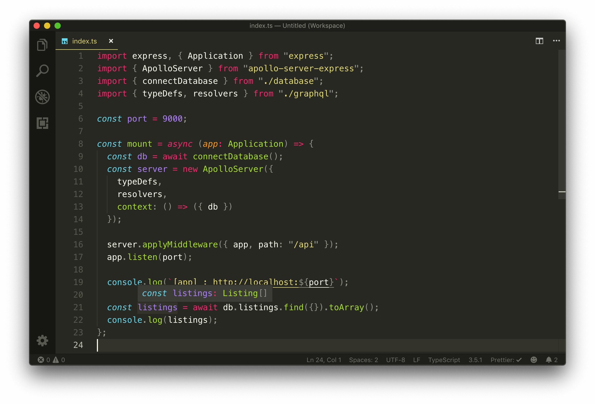

# TypeScript Generics and adding types to our Collections

Let's bring the benefit of TypeScript to our MongoDB functionalities in our server code. What we'll essentially need to do is create type definitions for the database collections we want to access in our server. We'll create these type definitions in a new file called `types.ts` under a `src/lib/` folder. This is where we'll keep any type definitions that are to be used in our code in multiple different areas.

```shell
server/
  src/
    database/
    graphql/
    lib/
      types.ts
    index.ts
    listings.ts
  // ...
```

At this moment, our database only contains a single collection (`test_listings`) geared towards storing documents of listing data. In the `src/lib/types.ts` file, we'll create an interface that resembles the shape of a document in our listings collection. This will look very similar to what we had before when we created an interface for our mock listings array.

```typescript
export interface Listing {
  id: string;
  title: string;
  image: string;
  address: string;
  price: number;
  numOfGuests: number;
  numOfBeds: number;
  numOfBaths: number;
  rating: number;
}
```

In a MongoDB document, the main identifier field, by default, is a little unique. First, it's prefixed with an underscore so it's actually `_id`. In addition, it usually has a unique data type - `ObjectId`.

The [`ObjectId` data type](https://docs.mongodb.com/manual/reference/method/ObjectId/) is a unique 12-byte identifier which by default is generated by MongoDB as the primary key for a document in a collection. `ObjectId` plays a role in how documents can be searched, filtered, and sorted in a collection. Since our listing documents in our collection is to have the `_id` field, we'll declare this field in our `Listing` interface and give it a type value of `ObjectID` which is provided to us from the type definitions of the Node MongoDB driver.

```typescript
import { ObjectId } from "mongodb";

export interface Listing {
  _id: ObjectId;
  title: string;
  image: string;
  address: string;
  price: number;
  numOfGuests: number;
  numOfBeds: number;
  numOfBaths: number;
  rating: number;
}
```

We'll now create an interface that will help shape the object being returned from our `connectDatabase()` function in the `src/database/index.ts` file. We'll establish this as a new interface called `Database`.

```typescript
import { ObjectId } from "mongodb";

interface Listing {
  // ...
}

interface Database {}
```

Since our database object returned from the `connectDatabase()` contains a single listing collection, we can specify that in our `Database` interface and provide it a type value of `Collection`. The `Collection` interface will also be imported from the `mongodb` library.

```typescript
import { Collection, ObjectId } from "mongodb";

interface Listing {
  // ...
}

interface Database {
  listings: Collection;
}
```

At this moment, we haven't done anything of significance since our app already infers that the `listings` collection property from our `connectDatabase()` function is of type `Collection`. The `Collection` interface, however, is a _generic_ and accepts a type variable (i.e. parameter). We can add the `Listing` interface we've created as the type parameter of the `Collection` interface we've assigned as the type of the `listings` field.

Our `src/lib/types.ts` will now look like the following:

```typescript
import { Collection, ObjectId } from "mongodb";

export interface Listing {
  _id: ObjectId;
  title: string;
  image: string;
  address: string;
  price: number;
  numOfGuests: number;
  numOfBeds: number;
  numOfBaths: number;
  rating: number;
}

export interface Database {
  listings: Collection<Listing>;
}
```

We'll now take a bit of a tangent to better explain what we've just done with the use of the `Collection` generic.

## TypeScript Generics

### `identity<T>()`

[TypeScript generics](https://www.typescriptlang.org/docs/handbook/generics.html) is one piece of TypeScript that often confuses newcomers since it makes TypeScript code appear a lot more complicated than it actually is.

First and foremost, [generics](https://en.wikipedia.org/wiki/Generic_programming) is a tool/programming method that exists in languages like C# and Java and is geared to help create reusable components that can work with a variety of different types. Generics make this possible by allowing the abstraction of types used in functions or variables. TypeScript adopts this pattern by allowing us to create code that can work with different types.

We'll go through a simple example extrapolated from the [TypeScript documentation](https://www.typescriptlang.org/docs/handbook/generics.html) to illustrate the basics of generics. Assume we had a function called `identity()` that received an argument and returned said argument. Since it's expected to return what it receives, we can specify the type of the argument and the value returned by the function to be the same (e.g. `number`).

```typescript
const identity = (arg: number): number => {
  return arg;
};

identity(5); // arg type and return type = number
identity("5"); // ERROR
```

If we tried to change the return type of the function, TypeScript will display a warning and rightly so since it infers the type of the parameter being returned from the function.

What if we wanted the `identity()` function to be reusable for different types? One thing we _could_ try to do is specify [`Union Types`](https://www.typescriptlang.org/docs/handbook/advanced-types.html#union-types) where the argument type and returned type could be one of many types. For example, we could say the function argument can accept a `number` or a `string` and return either a `number` or a `string`.

```typescript
const identity = (arg: number | string): number | string => {
  return arg;
};

identity(5); // arg type and return type = number
identity("5"); // arg type and return type = string
```

Though this would work in certain cases, the example above won't be reusable especially if we don't know the type of the argument we'll pass in.

Another approach we could take that would work for all types is to use the `any` type.

```typescript
const identity = (arg: any): any => {
  return arg;
};

identity(5); // arg type and return type = number
identity("5"); // arg type and return type = string
```

Using `any` would work but it isn't ideal since we won't be able to constrain what arguments the function accepts or infer what the function is to return.

Here is where generics and the capability of passing a type variable comes in. Just like how we've said `identity()` can accept an argument, we can also say that `identity()` is to accept a _type variable_, or in other words a type parameter or type argument. In TypeScript, we can pass type variables with the angle brackets syntax - `<>`. Here's an example of having the `identity()` function accept a type variable denoted with the letter `T`.

```typescript
const identity = <T>(arg: any): any => {
  return arg;
};
```

Just like how the value argument is available in the function, the _type_ argument is available in the function as well. We could say that whatever type variable is passed will be the type of the argument and the return type of the function.

```typescript
const identity = <T>(arg: T): T => {
  return arg;
};

identity<number>(5); // arg type and return type = number
identity<string>("5"); // arg type and return type = string
identity<any>({ fresh: "kicks" }); // arg type and return type = any
```

> In the example above, TypeScript will be smart enough to recognize the value of the type variable `T`, without always specifying a type value (e.g. `<any>`). This only works in simple cases. In more complicated cases, we'll need to ensure type variables are being passed in.

### Generic Interfaces

Generics can be used extensively and aren't only specific to functions. Assume we wanted to have our `identity()` function create an object that has a `field` property with the value of `arg`.

```typescript
const identity = <T>(arg: T): T => {
  const obj = {
    field: arg
  };
  return arg;
};
```

Assume we wanted to type constrain the `obj` created to a particular Interface type. **TypeScript type aliases and interfaces also accept type variables**, so we could have an `IdentityObj` interface created above the function that sets the type of a `field` property to a type variable being passed in.

```typescript
interface IdentityObj<T> {
  field: T;
}

const identity = <T>(arg: T): T => {
  const obj = {
    field: arg
  };
  return arg;
};
```

In the `identity()` function, we can define the type of `obj` as the `IdentityObj` interface and pass the type variable along. We can also have the function then return the `field` property from `obj` to conform to the expected return type of the `identity()` function.

```typescript
interface IdentityObj<T> {
  field: T;
}

const identity = <T>(arg: T): T => {
  const obj: IdentityObj<T> = {
    field: arg
  };
  return obj.field;
};
```

### Default generic values

TypeScript allows for the capability to have default generic type values (i.e. [generic parameter defaults](https://www.typescriptlang.org/docs/handbook/release-notes/typescript-2-3.html#generic-parameter-defaults)). Here's an example of having our `identity()` function and `IdentityObj` interface assign a default type value of `any` to the type variable that can be passed in.

```typescript
interface IdentityObj<T = any> {
  field: T;
}

const identity = <T = any>(arg: T): T => {
  const obj: IdentityObj<T> = {
    field: arg
  };
  return obj.field;
};
```

Now if a type variable isn't defined when using the `identity()` function and the compiler isn't able to infer what the type variable might be, it'll simply be set to `any`.

By convention, the letter `T` is often used to infer a type variable and is most likely due to the fact it stands for Type. We could very well use any letter we want - `U` `V`, etc. In certain cases, some prefer to extrapolate the type variable name especially if one might pass in multiple type variables. Here's an example of the `identity()` function being able to accept two type variables - `TData` and `TVariables`.

```typescript
interface IdentityObj<T = any> {
  field: T;
}

const identity = <TData = any, TVariables = any>(arg: TData): TData => {
  const obj: IdentityObj<TData> = {
    field: arg
  };
  return obj.field;
};
```

Notice how much more complicated the above code appears to be? It's not that difficult if one recognizes what's happening and can trace things step by step.

We'll stop here for now. We'll remove this example `identity()` function and look back at the use of the `Collection` interface for the listings collection in our `connectDatabase()` function.

### Collection<Listing>

In the `src/lib/types.ts` file, why is the passing of the `Listing` interface as a type variable helpful in the context of using the `Collection` interface for the `listings` property?

```typescript
import { Collection, ObjectId } from "mongodb";

interface Listing {
  // ...
}

interface Database {
  listings: Collection<Listing>;
}
```

If we take a look at the [`Collection` interface in our `mongodb` type definitions file](https://github.com/DefinitelyTyped/DefinitelyTyped/blob/master/types/mongodb/index.d.ts), we can see that it takes a type variable labeled `TSchema` that has a default type value of `Default`.

```typescript
// https://github.com/DefinitelyTyped/DefinitelyTyped/blob/master/types/mongodb/index.d.ts

export interface Collection<TSchema = Default> {
  // ...
}
```

When we take a look at the `Default` type in the [type declaration file](https://github.com/DefinitelyTyped/DefinitelyTyped/blob/master/types/mongodb/index.d.ts), we'll recognize that it's equal to the type of `any`.

```typescript
// https://github.com/DefinitelyTyped/DefinitelyTyped/blob/master/types/mongodb/index.d.ts

type Default = any;
```

When we do a quick search of `TSchema`,we can see some functions that utilize it in such a way that the return statement of the function takes advantage of the type variable being passed in.

When we pass in the `Listing` interface to `Collection`, this will help ensure that many MongoDB methods ([`find()`](https://docs.mongodb.com/manual/reference/method/db.collection.find/), [`findOne()`](https://docs.mongodb.com/manual/reference/method/db.collection.findOne/index.html), etc.) on a collection will utilize the `Listing` type from the returned result. We'll see an example of this when we use the `Database` interface type we've just created.

In the `src/database/index.ts` file, let's import the `Database` interface from the newly created types file and look to specify the type of the returned statement from the `connectDatabase()` function. Our `connectDatabase()` function is asynchronous so we can't simply specify the return type of the value we expect, we have to say it's going to be a _Promise_ of the expected return. TypeScript natively provides a `Promise` interface which accepts a type variable with which will be the type of the resolved promise value.

We'll declare the return type of the `connectDatabase()` function to be of `Promise<Database>`.

```typescript
// ...
import { Database } from "../lib/types";

// ...

export const connectDatabase = async (): Promise<Database> => {
  // ....
};
```

We've stated that our `connectDatabase()` function when resolved will be an object that resembles the shape of the `Database` interface type. Our `listings` field in the object being returned will now be inferred to be a `Collection` of `Listing`.

> Instead of defining an explicit return type of `connectDatabase()`, we could have very well passed in the `Listing` interface as a type variable to the `db.collection()` method.
>
> `db.collection<Listing>('test_listings`).
>
> This will achieve the same result.

We'll head to the `src/index.ts` file and survey the value of `listings` from our MongoDB `find()` function we've set up in the last lesson to verify our MongoDB connection. We can see that the `listings` variable is now appropriately type defined as an array of items where each item is of the `Listing` interface type!



Since we haven't made any functional changes in this lesson, when we start the server - our server should work as expected and `console.log` the sample listings data in our collection. We'll no longer need to verify our database connection works so we'll remove the query we've made to retrieve all listing documents from our collection as well the `console.log()` method in our `mount()` function.
