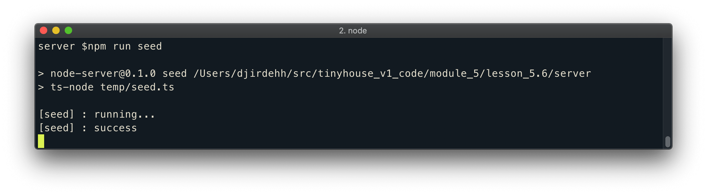
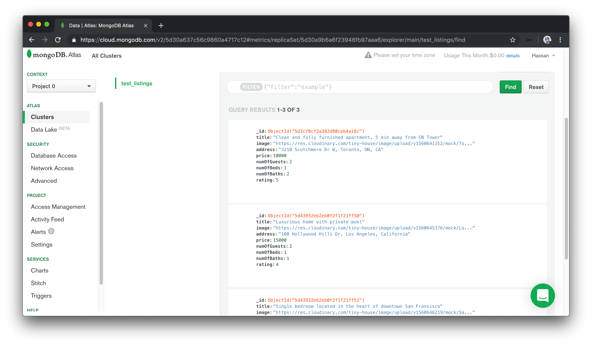

# Seeding mock data to the database

Now that we've successfully connected our app to our MongoDB instance, we'll want to change the query and mutation we have in our app to interact with data in our database. Before we do that, we'll begin by first seeding our database with the same mock data we've used in the previous lessons.

We aim to have a script that will make it easy for us to populate the database with some mock data for development. This will help us avoid navigating to the MongoDB Atlas dashboard to introduce mock data whenever needed.

We'll create this script in a `seed.ts` file in a new `temp/` folder in our root project directory.

```shell
server/
  temp/
    seed.ts
  // ...
```

TypeScript may warn us that we're introducing a TypeScript file outside of the `rootDir/`, which are the files we want TypeScript code to be compiled (i.e. the files in the `src/` folder). The reason we're placing the `seed.ts` file outside of our `src/` folder (which is where our app is being instantiated and run) is because the `seed()` function we'll create _is to only be used for development_. The `seed()` function is to help populate mock data in our database so we can test the rest of our app. When we get to deploying our app, we won't need this seed file and parent temporary folder.

Since the code in the seed file isn't needed for our app, we don't need TypeScript to compile it to valid JavaScript. In the `tsconfig.json` file, we can specify files and folders we don't want to be included in the TypeScript compilation process with the `exclude` option. We'll specify that the `temp` folder should be excluded from our TypeScript compilation.

```json
{
  "compilerOptions": {
    "target": "es6",
    "module": "commonjs",
    "rootDir": "./src",
    "outDir": "./build",
    "esModuleInterop": true,
    "strict": true
  },
  "exclude": ["temp"]
}
```

### `seed.ts`

In the `temp/seed.ts` file, we'll first require the `dotenv` library and configure it since our soon to be created `seed()` function is going to use the `connectDatabase()` function in our app. The database credentials used in the `connectDatabase()` function are referenced from environment variables so we'll need `dotenv` configured.

```typescript
require("dotenv").config();
```

Next, we'll create a simple asynchronous `seed()` function that has a `try` and `catch` block. The `try` statement will simply log a message to the console noting that the seed function is being run and in the `catch` statement we'll throw an `Error`.

At the bottom of the file, we'll also run the `seed()` function.

```typescript
require("dotenv").config();

const seed = async () => {
  try {
    console.log(`[seed] : running...`);
  } catch (error) {
    throw new Error("failed to seed database");
  }
};

seed();
```

Notice how we're using JavaScript's [`try`...`catch` statement](https://developer.mozilla.org/en-US/docs/Web/JavaScript/Reference/Statements/try...catch) here? Usually, when a code encounters an error it just crashes and outputs the error to a console if one is available. But with the `try`...`catch` pattern, we have a chance to _catch_ that error and choose how to handle it. We might want to just `console.log` the error, log the error in our database for reference, or in our `seed()` function - we'll simply throw another error and stop the program execution.

The `try`...`catch` pattern works in the following steps:

1.  The code in `try {...}` is executed.
2.  If there are no errors, then the `catch (error) {...}` is ignored.
3.  If an error does occur, the `try` execution is stopped and the control flows to the beginning of `catch (error)`. The `error` argument of `catch` contains details about the error that has occurred.

In our `seed()` function, we'll now connect to our MongoDB Atlas database just like we've done in the `src/index.ts` file. We'll import the `connectDatabase()` function, run the function and assign the result to a `db` constant.

```typescript
require("dotenv").config();

import { connectDatabase } from "../src/database";

const seed = async () => {
  try {
    console.log(`[seed] : running...`);

    const db = await connectDatabase();
  } catch (error) {
    throw new Error("failed to seed database");
  }
};

seed();
```

We'll then copy the mock listings data from our `src/listings.ts` file and paste it directly after our database connection.

```typescript
require("dotenv").config();

import { connectDatabase } from "../src/database";

const seed = async () => {
  try {
    console.log(`[seed] : running...`);

    const db = await connectDatabase();
    export const listings = [
      {
        id: "001",
        title: "Clean and fully furnished apartment. 5 min away from CN Tower",
        image:
          "https://res.cloudinary.com/tiny-house/image/upload/v1560641352/mock/Toronto/toronto-listing-1_exv0tf.jpg",
        address: "3210 Scotchmere Dr W, Toronto, ON, CA",
        price: 10000,
        numOfGuests: 2,
        numOfBeds: 1,
        numOfBaths: 2,
        rating: 5
      }
      // ...
    ];
  } catch (error) {
    throw new Error("failed to seed database");
  }
};

seed();
```

In our `seed()` function, we want the entire mock listings array to be inserted into our `test_listings` collection in our Mongo database. We've specified the type of a listing that resembles the shape of a listing collection document in the `src/lib/types` folder. To make sure we're inserting listings that resemble the shape that we expect, we'll import the `Listing` interface type and define the type of the mock listings array as `Listing[]`.

```typescript
require("dotenv").config();

import { connectDatabase } from "../src/database";
import { Listing } from "../src/lib/types";

const seed = async () => {
  try {
    console.log(`[seed] : running...`);

    const db = await connectDatabase();
    export const listings: Listing[] = [
      {
        id: "001",
        title: "Clean and fully furnished apartment. 5 min away from CN Tower",
        image:
          "https://res.cloudinary.com/tiny-house/image/upload/v1560641352/mock/Toronto/toronto-listing-1_exv0tf.jpg",
        address: "3210 Scotchmere Dr W, Toronto, ON, CA",
        price: 10000,
        numOfGuests: 2,
        numOfBeds: 1,
        numOfBaths: 2,
        rating: 5
      }
      // ...
    ];
  } catch (error) {
    throw new Error("failed to seed database");
  }
};

seed();
```

TypeScript will display an error since the `Listing` interface expects an `_id` field of type `ObjectId` while in our mock listings array we've provided `id` fields of type `string`. To generate a new `ObjectId` value for each of the different listing objects, we can import the `ObjectId` class from the Node MongoDB driver and create a new `ObjectId` instance with `new ObjectId()`.

We'll specify `_id` (instead of `id`) fields for each listing object in our mock data array and provide new `ObjectId` values.

```typescript
require("dotenv").config();

import { ObjectId } from "mongodb";
import { connectDatabase } from "../src/database";
import { Listing } from "../src/lib/types";

const seed = async () => {
  try {
    console.log(`[seed] : running...`);

    const db = await connectDatabase();
    export const listings: Listing[] = [
      {
        _id: new ObjectId(),
        title: "Clean and fully furnished apartment. 5 min away from CN Tower",
        image:
          "https://res.cloudinary.com/tiny-house/image/upload/v1560641352/mock/Toronto/toronto-listing-1_exv0tf.jpg",
        address: "3210 Scotchmere Dr W, Toronto, ON, CA",
        price: 10000,
        numOfGuests: 2,
        numOfBeds: 1,
        numOfBaths: 2,
        rating: 5
      }
      // ...
    ];
  } catch (error) {
    throw new Error("failed to seed database");
  }
};

seed();
```

With our mock `listings` data array available to us, we can simply loop through the array and insert each listing into the database collection with Mongo's [`insertOne()` function](https://docs.mongodb.com/manual/reference/method/db.collection.insertOne/).

We'll place a `console.log` at the end of the `try` statement to notify us when the seed process is made complete.

```typescript
require("dotenv").config();

import { ObjectId } from "mongodb";
import { connectDatabase } from "../src/database";
import { Listing } from "../src/lib/types";

const seed = async () => {
  try {
    console.log(`[seed] : running...`);

    const db = await connectDatabase();
    export const listings: Listing[] = [
      {
        _id: new ObjectId(),
        title: "Clean and fully furnished apartment. 5 min away from CN Tower",
        image:
          "https://res.cloudinary.com/tiny-house/image/upload/v1560641352/mock/Toronto/toronto-listing-1_exv0tf.jpg",
        address: "3210 Scotchmere Dr W, Toronto, ON, CA",
        price: 10000,
        numOfGuests: 2,
        numOfBeds: 1,
        numOfBaths: 2,
        rating: 5
      }
      // ...
    ];

    for (const listing of mockListings) {
      await db.listings.insertOne(listing);
    }

    console.log(`[seed] : success`);
  } catch (error) {
    throw new Error("failed to seed database");
  }
};

seed();
```

With our `seed()` function prepared, we can now introduce an application script that will run the `seed()` function. We'll label this script as the `seed` script and use `ts-node` instead of `nodemon` to run the seed file (this is because we only want to run the `seed` script once at a time, we don't need to watch for changes in our code and re-run the `seed` script).

```json
  "scripts": {
    "start": "nodemon src/index.ts",
    "seed": "ts-node temp/seed.ts",
    "build": "tsc -p ./"
  }
```

Let's run the `seed` script in our terminal to verify our seeding functionality works as expected.

```shell
server $: npm run seed
```

We'll notice the two `console.log` statements in our terminal notifying us that our `seed()` function is running before being made complete.



And we'll notice the newly inserted listings in the collections tab of our cluster in MongoDB Atlas!



> If the `listing` document that we've introduced a few lessons back (i.e. the `listing` document with just the `_id`, `title`, and `address` fields) still exists in the collection in MongoDB Atlas, we'll remove it from our collection.
