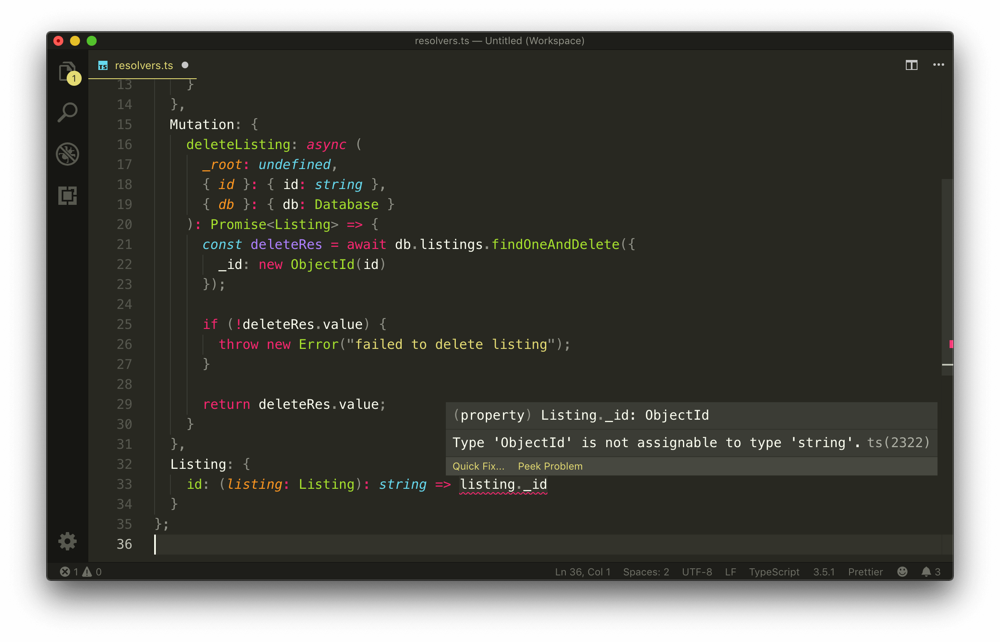
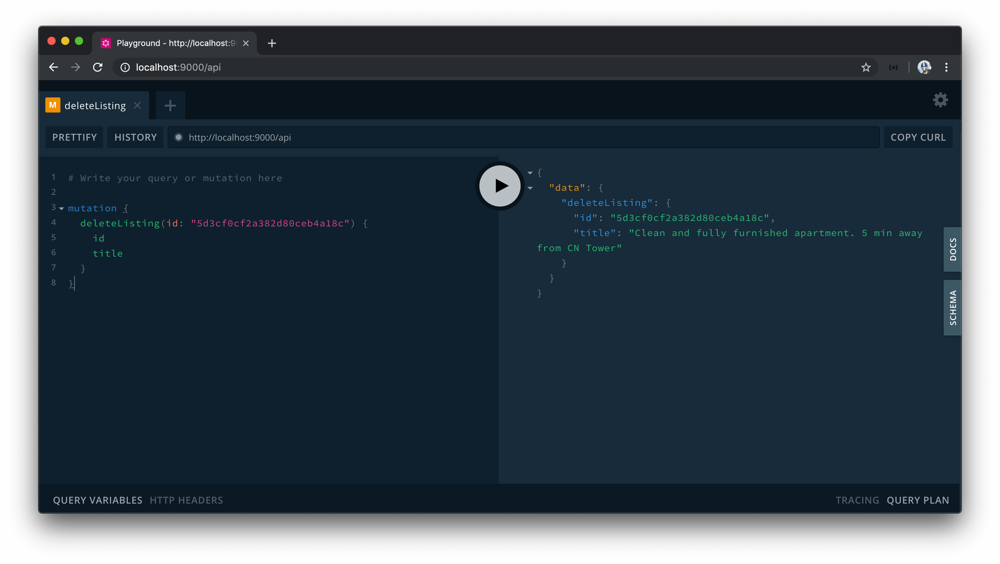

# Processing Data from MongoDB

In this lesson, we'll modify our GraphQL resolvers to now manipulate and use information from our database. We'll start by modifying the `listings` query field which currently returns the mock `listings` array we've set up in our code when queried.

### Query listings

We'll head to the `src/graphql/resolvers.ts` file to update the GraphQL API resolver functions. In our resolvers, we're going to need to access the `db` object created in our `src/index.ts` file. In our Apollo Server instantiation, we've placed the `db` object in our context so we should be able to access the `db` object from all our GraphQL resolvers.

[Context is the third positional parameter of a resolver function](https://www.apollographql.com/docs/graphql-tools/resolvers/#resolver-function-signature). The `listings` field resolver doesn't use the first `root` object parameter or expect any arguments to be passed as part of the second parameter. As a result, we'll define the first two function parameters to then access the `ctx` parameter. Since the `root` obj parameter doesn't have any value, we'll state its type to be `undefined`. The arguments parameter of a resolver function is always an object and since no arguments are expected to be passed for the `listings` field, we'll define the type of the arguments option as an empty object literal - `{}`.

```typescript
import { IResolvers } from "apollo-server-express";
import { listings } from "../listings";

export const resolvers: IResolvers = {
  Query: {
    listings: (_root: undefined, _args: {}) => {
      return listings;
    }
  },
  Mutation: {
    // ...
  }
};
```

We'll destruct the `db` property from the third context parameter. The type of the `db` object is the `Database` interface we've set up in the `src/lib/types.ts` file. We'll import the `Database` interface and assign the type of the `db` object to the `Database` interface type.

```typescript
import { IResolvers } from "apollo-server-express";
import { Database } from "../lib/types";
import { listings } from "../listings";

export const resolvers: IResolvers = {
  Query: {
    listings: (_root: undefined, _args: {}, { db }: { db: Database }) => {
      return listings;
    }
  },
  Mutation: {
    // ...
  }
};
```

The `listings` resolver function will use Mongo's [`find()` method](https://docs.mongodb.com/manual/reference/method/db.collection.find/) to return all the documents in our listings collection. The `find()` method allows us to find documents based on a query but we won't provide a query argument since we want the method to return every collection document. We'll also use Mongo's [`toArray()` method](https://docs.mongodb.com/manual/reference/method/cursor.toArray/index.html) to ensure an array of data is to be returned.

We'll use the `async/await` syntax to ensure the result of our asynchronous method is returned.

```typescript
import { IResolvers } from "apollo-server-express";
import { Database } from "../lib/types";
import { listings } from "../listings";

export const resolvers: IResolvers = {
  Query: {
    listings: async (_root: undefined, _args: {}, { db }: { db: Database }) => {
      return await db.listings.find({}).toArray();
    }
  },
  Mutation: {
    // ...
  }
};
```

Our `listings` query will now return the listings data from our MongoDB collection.

### `deleteListing`

We'll modify the `deleteListing` mutation to delete a listing from our database. In our `deleteListing` resolver function, we'll access the `db` object from the context as we've done in our query. We'll also remove the delete functionality we had in our `deleteListing` resolver that removed a listing object from the mock data array in the `src/listings.ts` file.

```typescript
import { IResolvers } from "apollo-server-express";
import { Database } from "../lib/types";
import { listings } from "../listings";

export const resolvers: IResolvers = {
  Query: {
    // ...
  },
  Mutation: {
    deleteListing: (
      _root: undefined,
      { id }: { id: string },
      { db }: { db: Database }
    ) => {}
  }
};
```

In our `deleteListing` resolver function, we'll use MongoDB's [`findOneAndDelete()` method](https://docs.mongodb.com/manual/reference/method/db.collection.findOneAndDelete/index.html) to allow us to delete a single document based on filter criteria.

The `id` of the listing that is to be deleted is passed in as an argument parameter of the `deleteListing` mutation. We can apply a filter in our `findOneAndDelete()` function to delete the listing in which its ID matches that of the `id` parameter passed in. If we recall, the unique identifying field in a listing document is the `_id` field which is of type `ObjectId`.

Just like how the `ObjectId` class from the Node MongoDB driver allows us to create a new `ObjectId`, it also accepts a string value to convert it to the valid hexadecimal format. We'll run the `findOneAndDelete()` function and apply a filter where we look for the listing in which it's `_id` field is equal to the `ObjectId` format of the passed in `id` argument. The `findOneAndDelete()` function returns an object so we'll assign the returned object to a `deleteRes` constant variable. We'll use the `async/await` syntax to ensure the returned result from the `findOneAndDelete()` is assigned to the `deleteRes` constant variable.

```typescript
import { ObjectId } from "mongodb";
import { IResolvers } from "apollo-server-express";
import { Database } from "../lib/types";
import { listings } from "../listings";

export const resolvers: IResolvers = {
  Query: {
    // ...
  },
  Mutation: {
    deleteListing: async (
      _root: undefined,
      { id }: { id: string },
      { db }: { db: Database }
    ) => {
      const deleteRes = await db.listings.findOneAndDelete({
        _id: new ObjectId(id)
      });
    }
  }
};
```

The `value` property of the returned object from the `findOneAndDelete()` method contains the value of the deleted item, when successful. We'll use an `if` statement to verify the `value` property exists. If it does exist, we'll simply have our `deleteListing` function return the `value` property (which is to be the deleted listing itself). If the `value` property doesn't exist, we'll throw an error that says `"failed to delete listing"`.

```typescript
import { ObjectId } from "mongodb";
import { IResolvers } from "apollo-server-express";
import { Database } from "../lib/types";
import { listings } from "../listings";

export const resolvers: IResolvers = {
  Query: {
    // ...
  },
  Mutation: {
    deleteListing: async (
      _root: undefined,
      { id }: { id: string },
      { db }: { db: Database }
    ) => {
      const deleteRes = await db.listings.findOneAndDelete({
        _id: new ObjectId(id)
      });

      if (!deleteRes.value) {
        throw new Error("failed to delete listing");
      }

      return deleteRes.value;
    }
  }
};
```

With our resolvers updated to now interact with the database, we no longer need the mock `listings` array so we'll remove the import of the mock array in the `src/graphql/resolvers.ts` file and remove the `src/listings.ts` file as well.

### `Listing`

At this moment, if we started our server and tried to run either the `listings` query or the `deleteListing` mutation, they would actually both fail. This is primarily due to how our `Listing` object type is set up in our GraphQL schema and how our listing document is being returned from the database.

There's one important point to discuss that we might have not addressed yet. We've mentioned that every field in a GraphQL schema needs to have a resolver function responsible in resolving that field. We have resolver functions for both the `Query` and `Mutation` root object types but what about the `Listing` object type. How are those particular fields being resolved?

To follow the appropriate standard, in our `src/graphql/resolvers.ts` file, we should be setting up a resolvers map for the `Listing` object type. Let's go ahead and create the new `Listing` object field in our `resolvers` map to better illustrate this.

```typescript
import { ObjectId } from "mongodb";
import { IResolvers } from "apollo-server-express";
import { Database } from "../lib/types";

export const resolvers: IResolvers = {
  Query: {
    // ...
  },
  Mutation: {
    // ...
  },
  Listing: {}
};
```

Assume we wanted to resolve the `title` field in our `Listing` object type.

```typescript
import { ObjectId } from "mongodb";
import { IResolvers } from "apollo-server-express";
import { Database } from "../lib/types";

export const resolvers: IResolvers = {
  Query: {
    // ...
  },
  Mutation: {
    // ...
  },
  Listing: {
    title: () => {}
  }
};
```

In the root level `listings` and `deleteListing` resolvers, the first positional `obj` argument for each of these fields was `undefined`. In the fields within the `Listing` object type, **the first positional `obj` argument will be defined as whatever the root level fields return**.

When we take a look at our schema (in the `src/graphql/typeDefs.ts` file), we know the return type of the `listings` field and `deleteListing` mutation would be the `Listing` object type in some variation or another (`listings` returns an array of `Listing` while `deleteListing` return a single `Listing`).

```typescript
import { gql } from "apollo-server-express";

export const typeDefs = gql`
  type Listing {
    // ...
  }

  type Query {
    listings: [Listing!]!
  }

  type Mutation {
    deleteListing(id: ID!): Listing!
  }
`;
```

When we take a look at the resolver functions of the `listings` and `deleteListing` fields, we see that we have the functions return values. Where do these returned values go? These values become the _object_ argument for the children fields.

In the `Listing` object type, the first positional object argument is going to be the `listing` obj returned from the parent fields. This `listing` object is essentially the shape of the listing document in our database collection. We have a type labeled `Listing` in our `src/lib/types` file that is to resemble the shape of a listing collection document. We'll import the `Listing` interface type in our resolvers file and assign it as the type of the `obj` argument of the `title` resolver. Since we know this object is a listing we'll name this object parameter accordingly.

```typescript
import { ObjectId } from "mongodb";
import { IResolvers } from "apollo-server-express";
import { Database, Listing } from "../lib/types";

export const resolvers: IResolvers = {
  Query: {
    // ...
  },
  Mutation: {
    // ...
  },
  Listing: {
    title: (listing: Listing) => {}
  }
};
```

In the `title` resolver of `Listing`, we can specify how we want the `title` to be resolved. Since the `listing` obj has a `title` of type `string`, we can have the resolver function return `listing.title` directly.

```typescript
import { ObjectId } from "mongodb";
import { IResolvers } from "apollo-server-express";
import { Database, Listing } from "../lib/types";

export const resolvers: IResolvers = {
  Query: {
    // ...
  },
  Mutation: {
    // ...
  },
  Listing: {
    title: (listing: Listing) => listing.title
  }
};
```

For the majority of fields in our `Listing` object type, we'll do the same and return the value directly from the `listing` object.

```typescript
import { ObjectId } from "mongodb";
import { IResolvers } from "apollo-server-express";
import { Database, Listing } from "../lib/types";

export const resolvers: IResolvers = {
  Query: {
    // ...
  },
  Mutation: {
    // ...
  },
  Listing: {
    title: (listing: Listing) => listing.title,
    image: (listing: Listing) => listing.image
    // ...
  }
};
```

In GraphQL, the `title` and `image` resolvers we've defined above are known as [**trivial resolvers**](https://graphql.org/learn/execution/#trivial-resolvers). Trivial resolvers are resolvers that simply return a value from the object using the same key specified in the Object type (e.g. `title` -> `listing.title`). Many GraphQL libraries (Apollo Server included) allow us to omit these simple resolvers since if a resolver isn't specified it would simply read for the property of the object of the same name by default!

> Even if we don't specify trivial resolvers, these fields _are_ being resolved but are taken care of by the GraphQL server library!

As a result, we don't have to define resolver functions for all our `Listing` fields _expect_ for the `id` field. A listing document in our collection contains an `_id` field while our API specifies an `id` field in our schema. Since the listing `obj` being passed from the root fields doesn't contain an `id` field without an underscore, we'll need to define a resolver for `id`.

```typescript
import { ObjectId } from "mongodb";
import { IResolvers } from "apollo-server-express";
import { Database, Listing } from "../lib/types";

export const resolvers: IResolvers = {
  Query: {
    // ...
  },
  Mutation: {
    // ...
  },
  Listing: {
    id: (listing: Listing) => {}
  }
};
```

We could say the `id` field will be equal to the `_id` field from the listing object. However, the listing `_id` field isn't a string but an `ObjectId`. To ensure compatibility, we'll apply the JavaScript [`toString` method](https://developer.mozilla.org/en-US/docs/Web/JavaScript/Reference/Global_Objects/Object/toString) to convert the `ObjectId` to a string.

```typescript
import { ObjectId } from "mongodb";
import { IResolvers } from "apollo-server-express";
import { Database, Listing } from "../lib/types";

export const resolvers: IResolvers = {
  Query: {
    // ...
  },
  Mutation: {
    // ...
  },
  Listing: {
    id: (listing: Listing) => listing._id.toString()
  }
};
```

Our `listings` and `deleteListing` GraphQL fields should now work as expected. There's one last thing we'll do before we verify everything works.

### Explicit resolver function types

We've customized our ESLint rules to not enforce the requirement of having to define explicit function return types since we're okay with TypeScript inferring the function return types whenever it can. However, in our resolver functions, it would be helpful to specify the return type _to ensure we return the correct type of values for each function_.

- The `listings` query resolver should return an array of listings. Since the `listings` resolver is a promise, we can state its return type as `Promise<Listing[]>`.
- The `deleteListing` mutation resolver should return a single listing (i.e. the deleted listing). Since the `deleteListing` resolver is also a promise, we can state its return type as `Promise<Listing>`.
- The `id` field in the `Listing` object type is `GraphQLID` which is to be handled as a string when resolved. As a result, we'll state that the expected return type of the `id` resolver in `Listing` is a `string`.

Now, if we attempted to return a value from the resolver function that doesn't match the expected return type - TypeScript will display a warning.



With all the changes made, our `src/graphql/resolvers.ts` file will now look like the following:

```typescript
import { ObjectId } from "mongodb";
import { IResolvers } from "apollo-server-express";
import { Database, Listing } from "../lib/types";

export const resolvers: IResolvers = {
  Query: {
    listings: async (
      _root: undefined,
      _args: {},
      { db }: { db: Database }
    ): Promise<Listing[]> => {
      return await db.listings.find({}).toArray();
    }
  },
  Mutation: {
    deleteListing: async (
      _root: undefined,
      { id }: { id: string },
      { db }: { db: Database }
    ): Promise<Listing> => {
      const deleteRes = await db.listings.findOneAndDelete({
        _id: new ObjectId(id)
      });

      if (!deleteRes.value) {
        throw new Error("failed to delete listing");
      }

      return deleteRes.value;
    }
  },
  Listing: {
    id: (listing: Listing): string => listing._id.toString()
  }
};
```

We'll start our server and verify that our `listings` query works as expected.


If we were to copy an `id` from one of the listing objects returned from our query and use it as the argument value for the `deleteListing` mutation, we'll observe that our `deleteListing` mutation also deletes a listing successfully.



This asserts that we now have our GraphQL API interact and manipulate persisted data in a database.

> At any moment in time, you should be able to run the `seed` script to introduce more listings to the database collection.
