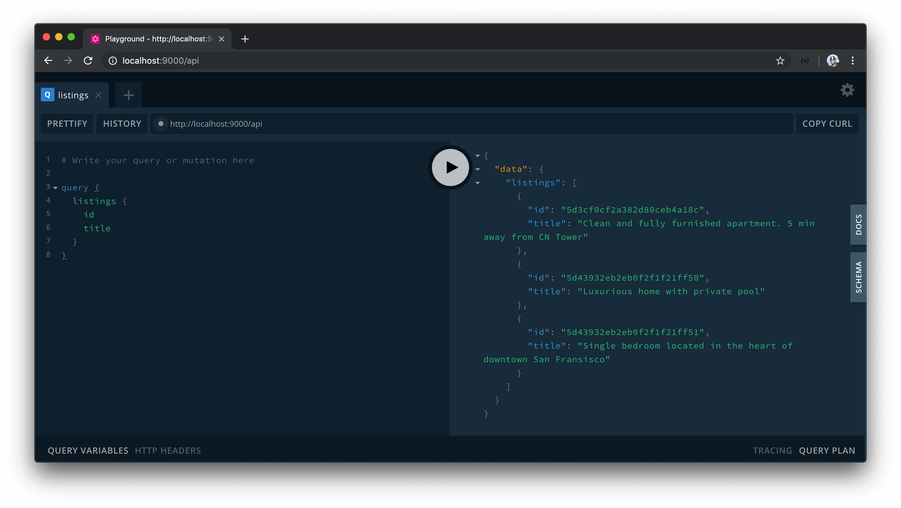

# Modularizing Resolvers

If our app was to continue to grow, our `resolvers.ts` file will continue to get bigger to accommodate all the different resolvers within the different object types in our API. Though there's nothing inherently wrong with this, we can look to [separate our resolvers into different resolvers maps (i.e. modules)](https://www.apollographql.com/docs/apollo-server/essentials/data/#modularizing-resolvers) in such a way that each resolvers map will pertain a particular domain (or module).

For example, assume we had a resolvers map just for resolvers that pertain to the listings domain (i.e. the `listingResolvers`). The listings resolvers map will encompass all the resolvers that pertain to the listing domain or module such as the `listings` query, the `deleteListing` mutation, the `id` resolver field for the `Listing` object, etc.

```typescript
export const listingResolvers: IResolvers = {
  Query: {
    listings: () => {
      // ...
    }
  },
  Mutation: {
    deleteListing: () => {
      // ...
    }
  },
  Listing: {
    id: () => {
      // ...
    }
  }
};
```

We could have _another_ resolvers map that deals with a different domain or module. For example, we can have a `userResolvers` map that contained all the resolvers that pertain to retrieving or changing user data in our database.

```typescript
export const userResolvers: IResolvers = {
  Query: {
    users: () => {
      // ...
    }
  },
  Mutation: {
    deleteUser: () => {
      // ...
    }
  },
  User: {
    id: () => {
      // ...
    }
  }
};
```

This level of modularization will make no change to the actual functionality of our app but aim to have our resolvers be more concise and easier to read.

Let's set up the resolvers of our API to follow this level of modularization. The first thing we'll do is create a new folder called `resolvers` in our `src/graphql/` folder. The `src/graphql/resolvers/` folder is where we'll place each of our different resolvers objects.

```shell
server/
  src/
    graphql/
      resolvers/
      // ...
    // ...
```

In the `src/graphql/resolvers/` folder, we'll create a sub-folder for each module we'd want to have a resolvers object. At this moment in time, we only have the capability to modify and read data about listings (i.e. we only have a listings collection), so we'll create a `Listing/` sub-folder that contains an `index.ts` file where we'll create and export a `listingResolvers` map.

```shell
server/
  src/
    graphql/
      resolvers/
        Listing/
      // ...
    // ...
```

We'll move everything from our `src/graphql/resolvers.ts` file to the `index.ts` file in `src/graphql/resolvers/Listing/` and rename the exported `resolvers` object to `listingResolvers`.

```typescript
import { ObjectId } from "mongodb";
import { IResolvers } from "apollo-server-express";
import { Database, Listing } from "../../../lib/types";

export const listingResolvers: IResolvers = {
  Query: {
    listings: async (
      _root: undefined,
      _args: {},
      { db }: { db: Database }
    ): Promise<Listing[]> => {
      return await db.listings.find({}).toArray();
    }
  },
  Mutation: {
    deleteListing: async (
      _root: undefined,
      { id }: { id: string },
      { db }: { db: Database }
    ): Promise<Listing> => {
      const deleteRes = await db.listings.findOneAndDelete({
        _id: new ObjectId(id)
      });

      if (!deleteRes.value) {
        throw new Error("failed to delete listing");
      }

      return deleteRes.value;
    }
  },
  Listing: {
    id: (listing: Listing): string => listing._id.toString()
  }
};
```

We'll also remove the previously existing `src/graphql/resolvers.ts` file.

### `lodash.merge`

Since we only have a single resolvers map (`listingResolvers`), we could reference the `listingResolvers` map directly in our Apollo server instantiation. Instead, we'll look to prepare our app such that it is ready to accept and merge multiple different resolvers maps.

For us to pass multiple resolver objects into the `ApolloServer` constructor, we must find a way to merge them into a single object. Luckily, there is an npm package perfect for this and it comes from [lodash](https://lodash.com/).

> [Lodash](https://lodash.com/) is an incredibly useful utility library that provides a significant number of functions to help do a variety of different things needed to manipulate objects and arrays. We're most interested in the lodash [merge](https://lodash.com/docs/4.17.15#merge) method which helps recursively merge enumerable properties of source objects into a destination object.

We won't need the entire lodash library since we're only interested in the lodash `merge` method. As a result, we'll install the [`lodash.merge` package](https://www.npmjs.com/package/lodash.merge) which is a single `npm` package that provides the `merge` function alone.

In our terminal, we'll install the `lodash.merge` package as an application dependency.

```shell
server $: npm install lodash.merge
```

We'll also install the `@types/lodash.merge` package as a development dependency.

```shell
server $: npm install -D @types/lodash.merge
```

We'll create an `index.ts` file in our `src/graphql/resolvers/` folder and import the `merge` function from `lodash.merge`. We'll also import the `listingResolvers` map from the `src/graphql/resolvers/Listing` folder.

```typescript
import merge from "lodash.merge";
import { listingResolvers } from "./Listing";
```

We can then export a `const` variable labeled `resolvers` that uses the `merge` function and places the `listingResolvers` map within.

```typescript
import merge from "lodash.merge";
import { listingResolvers } from "./Listing";

export const resolvers = merge(listingResolvers);
```

If we were to now create different resolvers maps in our `src/graphql/resolvers` folder, we can import them in the `src/graphql/resolvers/index.ts` file and place them in the `merge` function to have them _merged_ into a single destination object.

```typescript
// example of having multiple resolvers objects
import merge from "lodash.merge";
import { bookingResolvers } from "./Booking";
import { listingResolvers } from "./Listing";
import { userResolvers } from "./User";

export const resolvers = merge(bookingResolvers, listingResolvers, userResolvers);
```

Our app is already prepared to consume the resolvers object. This is because the `src/index.ts` file imports the resolvers object from the `src/graphql/` folder.

```typescript
// ...
import { typeDefs, resolvers } from "./graphql";

const mount = async () => {
  // ...
};

// ...
```

And the `src/graphql/` folder exports the resolvers object from a resolvers file path in the `src/graphql/` folder.

**`src/graphql/index.ts`**

```typescript
export * from "./resolvers";
export * from "./typeDefs";
```

When we now run our app, everything should work as expected. Our `listings` query should retrieve all the listing documents in our listings collection.



And our `deleteListing` mutation will appropriately remove a listing document from our collection.


### `typeDefs`

Just like how a `resolvers` object can be broken down and modularized into smaller objects, the `typeDefs` string for our GraphQL schema could also be broken down to smaller sub-strings as well. This can be achieved with the use of the `extend` keyword, which allows for the creation of a schema by _extending_ a base schema. This can help avoid a large list of root `Query` and `Mutation` fields.

Here's [an example of a `typeDefs` schema from the Apollo Server documentation](https://www.apollographql.com/docs/graphql-tools/generate-schema/#extending-types) that shows the creation of two strings where the second type definitions string use the `extend` keyword to extend the root `Query` object type and introduce a `foos` field.

```graphql
const typeDefs = [`
  schema {
    query: Query
  }

  type Query {
    bars: [Bar]!
  }

  type Bar {
    id
  }
  `, `
  type Foo {
    id: String!
  }

  extend type Query {
    foos: [Foo]!
  }
`]
```

Though we're able to break our `typeDefs` schema to smaller pieces and subsequently into separate files, we personally prefer to have the entire `typeDefs` schema be kept in a single string within a single file. One reason we prefer to have all type definitions within a single string is that its hard for the `typeDefs` string to become large enough that it becomes to difficult to manage.
