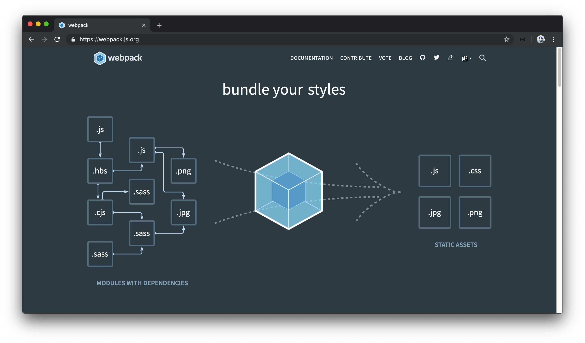
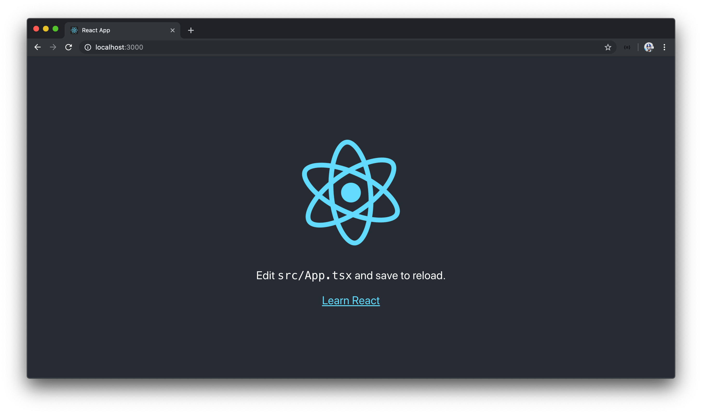

# Create React App

Our focus thus far has been building a GraphQL API from the server-side of our app. We're now going to switch our focus to the client-side of our app. The core piece of our client application is going to be [React](https://reactjs.org/).

For simple React applications, we're able to create a React app by introducing a few script tags in an HTML file. There are a few limitations to this approach which make it difficult to write complex applications. We're unable to use JavaScript modules and being able to compile TypeScript and ESNext code becomes difficult or practically impossible to maintain as an application becomes larger.

## Webpack

The [Webpack](https://webpack.js.org/) JavaScript bundler can help us here.



**Webpack** is a third-party tool that helps _bundle_ JavaScript code. A JavaScript bundler bundles all the JavaScript code used in an application, which includes the code we write and the code of any external libraries, and bundles them into a single bundle. This bundle could be a single file or a series of a few files.

Why is bundling important? First off, bundling improves performance in production. It's a lot quicker for a browser to download a few large bundled files as opposed to downloading a very large number of small files.

Webpack also works with other dependencies to compile and bundle development code to production code. For example, Webpack combined with [`babel-loader`](https://github.com/babel/babel-loader) helps compile ES6 (or newer) JavaScript code to an older format that almost all browsers can recognize. Another important example is Webpack can work with [`typescript-loader`](https://github.com/TypeStrong/ts-loader) to help compile our TypeScript code to normal JavaScript when bundled.

Webpack is a powerful tool. Since a large number of modern-day JavaScript applications use Webpack, [a huge thanks goes to the people working on it](https://webpack.js.org/contribute/). With that said, Webpack does come at a cost - it's often recognized to be a little advanced and not very easy to understand to help setup. This is where something like `create-react-app` comes in.

### `create-react-app`

The React team and community have given us `create-react-app` ([repo link](https://github.com/facebook/create-react-app)), a tool to help scaffold and create a Webpack bundled React application _rapidly_. We'll use `create-react-app` to create a new React project.

Though we're able to globally install the `create-react-app` utility, we can use the `npx` runner to run `create-react-app` without having to install it.

> [npx](https://www.npmjs.com/package/npx) is an npm package runner that was [introduced with npm version 5.2](https://medium.com/@maybekatz/introducing-npx-an-npm-package-runner-55f7d4bd282b). Among doing a few different things, it allows for the execution of Node packages which haven't been previously installed.
>
> In our case, we'll execute the `create-react-app` package to create a new React app without having to install the `create-react-app` package.

In the `tinyhouse_v1` folder, we'll create a new React application under a directory labeled `client/`, with `create-react-app`. `create-react-app` allows us to create a React application with TypeScript by [adding the `--typescript` flag](https://facebook.github.io/create-react-app/docs/adding-typescript).

```shell
tinyhouse_v1 $: npx create-react-app client --typescript
```

When the `create-react-app` command is complete, a `client/` directory will be created in the `tinyhouse_v1/` folder adjacent to the `server/` project we've been working with.

```shell
tinyhouse_v1/
  client/
  server/
```

If we follow the instructions logged to us from the terminal once the directory has been created, we'll navigate to the `client/` folder and run our React application with `npm run start`.

```shell
client $: npm run start
```

We'll have our React app running on `http://localhost:3000`!


