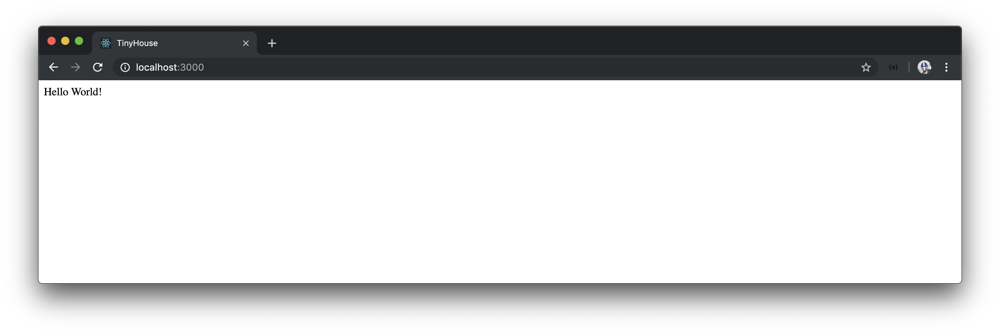

# Create React App - The Rundown

`create-react-app` creates a series of files and folders as it instantiates and creates a Webpack bundled React application. For those who may be unfamiliar with the scaffold created from `create-react-app`, we'll spend this lesson going through the generated `client/` application.

`create-react-app` has created an application scaffold that looks like the following:

```shell
client/
  node_modules/
  public/
  src/
  .gitignore
  package-lock.json
  package.json
  README.md
  tsconfig.json
```

### `node_modules/`

The `node_modules/` directory in our application refers to all the different JavaScript libraries that have been installed in our application.

### `public/`

#### `public/index.html`

The `public/` folder holds the favicon asset as well as the root markup page of the application - the `index.html` file. When we take a look at the `public/index.html` file, we can see a simple HTML file that contains a `<head>` element and a `<body>` element. The `<head>` tag specifies standard viewport settings and references the favicon asset in the `public/` folder.

```html
<!DOCTYPE html>
<html lang="en">
  <head>
    <meta charset="utf-8" />
    <link rel="shortcut icon" href="%PUBLIC_URL%/favicon.ico" />
    <meta name="viewport" content="width=device-width, initial-scale=1" />
    <meta name="theme-color" content="#000000" />
    <!--
      manifest.json provides metadata used when your web app is installed on a
      user's mobile device or desktop. See https://developers.google.com/web/fundamentals/web-app-manifest/
    -->
    <link rel="manifest" href="%PUBLIC_URL%/manifest.json" />
    <!--
      Notice the use of %PUBLIC_URL% in the tags above.
      It will be replaced with the URL of the `public` folder during the build.
      Only files inside the `public` folder can be referenced from the HTML.

      Unlike "/favicon.ico" or "favicon.ico", "%PUBLIC_URL%/favicon.ico" will
      work correctly both with client-side routing and a non-root public URL.
      Learn how to configure a non-root public URL by running `npm run build`.
    -->
    <title>React App</title>
  </head>
  <body>
    <!-- ... -->
  </body>
</html>
```

In the `<head>` tag of our `public/index.html` file, we can see some documentation and use of a `manifest.json` file. [A manifest JSON file helps provide metadata for when an app is installed on a user’s mobile device, which makes a web application more progressive](https://developers.google.com/web/fundamentals/web-app-manifest/) and is set up in the `public/manifest.json` file of our app. This ties into some of the boilerplate code `create-react-app` gives us to help create a [Progressive Web Application](https://developers.google.com/web/progressive-web-apps).

Some comments exist in the `<head>` tag that tells us how the `PUBLIC_URL` tag behaves. In the `create-react-app` setting, [`PUBLIC_URL` is replaced with the URL of the public folder during build](https://facebook.github.io/create-react-app/docs/using-the-public-folder#adding-assets-outside-of-the-module-system) which helps reference assets within the `public/` folder. We won't be making any changes to the `public/index.html` file except for renaming the title of our application to the name of our app - `TinyHouse`.

```html
<!DOCTYPE html>
<html lang="en">
  <head>
    <!-- ... -->
    <title>TinyHouse</title>
  </head>
  <body>
    <!-- ... -->
  </body>
</html>
```

In the `<body>` element of the `public/index.html` file, we’re presented with a `<noscript>` tag followed by the `<div id="root"></div>` element.

```html
<!DOCTYPE html>
<html lang="en">
  <head>
    <!-- ... -->
  </head>
  <body>
    <noscript>You need to enable JavaScript to run this app.</noscript>
    <div id="root"></div>
    <!--
      This HTML file is a template.
      If you open it directly in the browser, you will see an empty page.

      You can add webfonts, meta tags, or analytics to this file.
      The build step will place the bundled scripts into the <body> tag.

      To begin the development, run `npm start` or `yarn start`.
      To create a production bundle, use `npm run build` or `yarn build`.
    -->
  </body>
</html>
```

The content within [`<noscript>`](https://developer.mozilla.org/en-US/docs/Web/HTML/Element/noscript) is displayed to the user when the user has disabled scripts in the browser or is using a browser that has an unsupported script. The `<div>` element with the `id` of `root` is where our entire React application will be mounted onto. This is the element that’s referenced in our React `render()` function with which we’ll see shortly. Finally, we have some comments in the `<body>` element that tells us upon building the application, the bundled scripts of our app will be placed into this `<body>` tag.

### `src/`

We’ll hardly find the need to be making any significant change in the surrounding files that involve the set up of our application. The vast majority of the time, we'll be working within the `src/` directory that contains the TypeScript, React, and CSS files that we’ll be working directly with.

#### `src/index.tsx`

The `src/index.tsx` file is the root React/TypeScript file in our application. If you’ve never used TypeScript and React before, the `.tsx` file extension may seem new to you. JSX (or otherwise known as JavaScript XML) is an extension that allows us to write JavaScript that looks like HTML.

We can see the use of JSX in the `ReactDOM.render()` function where the first argument being passed is the `<App />` component.

```tsx
ReactDOM.render(<App />, document.getElementById("root"));
```

The declaration of `<App />` in the `render()` function is JSX - XML-like syntax in our JavaScript file. In standard React, we’re able to use JSX within files that have the normal `.js` file extension though certain people prefer to use the `.jsx` file extension to denote the React JavaScript files that contain JSX.

If we intend on using JSX within our TypeScript files, we [must name our files with the `.tsx` file extension](https://www.typescriptlang.org/docs/handbook/jsx.html#basic-usage). The other requirement to using JSX in TypeScript is to have the `jsx` option enabled in our TypeScript configuration, which we’ll see has already been done in our client project's `tsconfig.json` file.

The `ReactDOM.render()` function helps render the parent `<App />` component on the root element in our `public/index.html` file. The render function is from the `ReactDOM` library and takes up to three arguments with which the first two is often defined. The first argument is essentially the root level element we'd like our React application to render (which is currently the `<App />` component). The second argument is _where_ to render (i.e. mount) it with which in this case is the reference to the DOM node with the `id` of `root`.

The third argument of the `render()` function takes a callback function that when provided runs the callback after the component is mounted or updated. We won't need to run this callback function so we won't introduce it. The only change we'll make is more of a preference - instead of importing the `ReactDOM` global, we can directly import the `render()` function that's also being exported from the `react-dom` library.

Our `src/index.tsx` file will then look like the following:

```tsx
import React from "react";
import { render } from "react-dom";
import "./index.css";
import App from "./App";
import * as serviceWorker from "./serviceWorker";

render(<App />, document.getElementById("root"));

// If you want your app to work offline and load faster, you can change
// unregister() to register() below. Note this comes with some pitfalls.
// Learn more about service workers: https://bit.ly/CRA-PWA
serviceWorker.unregister();
```

At the end of the `src/index.ts` file, there's exists an additional reference to help in the introduction of a service worker. [Service workers](https://developers.google.com/web/fundamentals/primers/service-workers/) are scripts that run in the browser to help applications be more progressive by introducing features like asset caching and push notifications. We’re not going to spend much time in this course explaining how service workers and Progressive Web Apps behave, so we'll leave this in its current state for now which is essentially the unregistered state of the service worker defined in the `src/service-worker.ts` file.

#### `src/react-app-env.d.ts`

In the `src/` folder exists a `react-app-env.d.ts` declaration file. Declaration files are usually denoted with the `.d.ts` file extension and are files that describe the typings of a JavaScript file that exists elsewhere.

```tsx
/// <reference types="react-scripts" />
```

A [triple-slash directive](https://www.typescriptlang.org/docs/handbook/triple-slash-directives.html) (`///`) is used in the `react-app-env.d.ts` file and is a unique TypeScript capability that pertains to single-line comments that contain a single XML tag. Triple-slash directives instruct the TypeScript compiler to include additional files in the compilation process. The directive in the `react-app-env.d.ts` file instructs the compiler to include and reference the type declarations of the `react-scripts` library which is the library used to build, test, and run our React application.

With that said, there has been discussion among the community as to why this particular declaration file is placed within the `src/` folder, and not in a `types/` folder of sorts. [An open issue currently exists](https://github.com/facebook/create-react-app/issues/6560) where the React team is currently looking to place a comment in the `react-app-env.d.ts` file to better explain the purpose of this declaration file.

#### Rest of `src/`

The rest of the `src/` folder contains a few of the other files responsible in setting up the UI we see when we start our client application.

- `App.css`: CSS file used in the `<App>` component.
- `App.test.tsx`: The test file of the `<App>` component that demonstrates the use of the [Jest testing framework](https://jestjs.io/) installed in our application.
- `App.tsx`: The parent `<App>` component that contains the boilerplate code shown in our UI.
- `index.css`: CSS file used in the `src/index.tsx` file.
- `logo.svg`: The React logo in SVG format used in the `<App>` component.

We'll remove the `index.css`, `App.tsx`, `App.test.tsx`, `App.css`, and the `logo.svg` file from the `src/` folder. In the `src/index.tsx` file, we'll remove the imports of the removed files and in the `render()` function, simply render a single `<div>` element that says `'Hello World!'` for now.

```tsx
import React from "react";
import { render } from "react-dom";
import * as serviceWorker from "./serviceWorker";

render(<div>Hello World!</div>, document.getElementById("root"));

// If you want your app to work offline and load faster, you can change
// unregister() to register() below. Note this comes with some pitfalls.
// Learn more about service workers: https://bit.ly/CRA-PWA
serviceWorker.unregister();
```

### `.gitignore`

The `.gitignore` file dictates the files we don’t want to check in with `git`. This includes `node_modules/`, the bundled `build/` folder when created, and any `.env` files.

### `package-lock.json`

The `package-lock.json` file is an automatically generated JSON file that stores a dependency tree that highlights the dependencies installed from the `package.json` file at that moment in time. It should be committed to source code but we'll never make changes to it directly.

### `package.json`

The `package.json` file lists all the locally installed npm packages as well as the `npm` script commands that can be made.

```json
{
  "name": "client",
  "version": "0.1.0",
  "private": true,
  "dependencies": {
    "@types/jest": "24.0.16",
    "@types/node": "12.6.9",
    "@types/react": "16.8.24",
    "@types/react-dom": "16.8.5",
    "react": "^16.8.6",
    "react-dom": "^16.8.6",
    "react-scripts": "3.0.1",
    "typescript": "3.5.3"
  },
  "scripts": {
    "start": "react-scripts start",
    "build": "react-scripts build",
    "test": "react-scripts test",
    "eject": "react-scripts eject"
  },
  "eslintConfig": {
    "extends": "react-app"
  },
  "browserslist": {
    "production": [">0.2%", "not dead", "not op_mini all"],
    "development": [
      "last 1 chrome version",
      "last 1 firefox version",
      "last 1 safari version"
    ]
  }
}
```

`create-react-app` provides four script commands - `start`, `build`, `test`, and `eject`.

```json
  "scripts": {
    "start": "react-scripts start",
    "build": "react-scripts build",
    "test": "react-scripts test",
    "eject": "react-scripts eject"
  },
```

- `start`: runs our local Webpack server for development.
- `build`: bundles our application in a build folder ready for deployment.
- `test`: Runs the test files in our workspace with the help of the Jest testing framework.
- `eject`: enables us to abandon the configuration that `create-react-app` provides which subsequently allows us to tweak the application Webpack configuration to our liking.

> Ejecting is often done when one either feels that their project ‘outgrows’ the configuration `create-react-app` sets up or needs some special type of configuration. It's always important to remember that once a `create-react-app` application is ejected - one can never go back to the application's original state.
>
> In this course, we won’t find the need to eject our application workspace.

All our application script commands use the `react-scripts` dependency available in our app to run the intended command. `react-scripts` is essentially the core service that’s installed into every `create-react-app` project. `react-scripts` specifies all the app’s development dependencies like Webpack, Babel, and ESLint. It also contains “scripts” that glue these dependencies together to help us `start`, `build`, `test`, and `eject` our application.

In the `dependencies` section of the `package.json` file, we can see all the locally installed dependencies in our application.

```json
  "dependencies": {
    "@types/jest": "24.0.16",
    "@types/node": "12.6.9",
    "@types/react": "16.8.24",
    "@types/react-dom": "16.8.5",
    "react": "^16.8.6",
    "react-dom": "^16.8.6",
    "react-scripts": "3.0.1",
    "typescript": "3.5.3"
  },
```

The `eslintConfig` property of `package.json` is [one way to specify the ESLint configuration within an application](https://eslint.org/docs/user-guide/configuring) (as opposed to having an `.eslintrc` file in the root of the project directory).

```json
  "eslintConfig": {
    "extends": "react-app"
  },
```

The `create-react-app` scaffold sets the ESLint configuration to extend a specific package known as `react-app` which was created for `create-react-app` projects.

And finally, [`browserslist`](https://github.com/browserslist/browserslist) works with a few other tools (such as the application’s `postcss` configuration as well as `autoprefixer`) to dictate which browsers our application will support.

```json
  "browserslist": {
    "production": [
      ">0.2%",
      "not dead",
      "not op_mini all"
    ],
    "development": [
      "last 1 chrome version",
      "last 1 firefox version",
      "last 1 safari version"
    ]
  }
```

### `README.md`

The `README.md` file explains the `create-react-app` project as well as provides details behind each of the available script commands.

### `tsconfig.json`

`create-react-app` creates a `tsconfig.json` file for our project by default. Like we've seen when working with the `server/` project, the `tsconfig.json` file guides the TypeScript compiler with options required to compile the TypeScript project. Though we won’t alter any of the configuration `create-react-app` has set up for us, we’ll quickly summarize the options that have been declared:

#### `target`:

`target` specifies the target JavaScript version the compiler will output. The `target` output is `es5` which would be compatible for both modern and older browsers.

```json
"target": "es5",
```

#### `lib`:

`lib` indicates the list of library files to be included in the compilation. `lib` is important because it helps us decouple the compile target and the library support we would want. For example, the `Promise` keyword doesn't exist in ES5 and if we intend to use it, TypeScript would display a warning since our compile target is `es5`. By specifying a `lib` option of `esnext`, we can still have our compiler compile down to ES5 while using the `Promise` keyword with no issues.

The `create-react-app` scaffold sets the `lib` option to `["dom", "dom.iterable", "esnext"]`. `dom` allows us to directly manipulate the DOM while `dom.iterable` gives us the ability to iterate over a list of DOM nodes.

```json
"lib": [
  "dom",
  "dom.iterable",
  "esnext"
],
```

#### `allowJs`:

`allowJs` allows JavaScript files to be compiled.

```json
"allowJs": true,
```

#### `skipLibCheck`:

`skipLibCheck` skips type checking of all declaration files.

```json
"skipLibCheck": true,
```

#### `esModuleInterop` \| `allowSyntheticDefaultImports`:

`esModuleInterop` and `allowSyntheticDefaultImports` combined gives us the ability to allow default imports of modules that have no default export.

```json
"esModuleInterop": true,
"allowSyntheticDefaultImports": true,
```

#### `strict`:

`strict` enables a series of strict type checking options such as `noImplicitAny`, `noImplicitThis`, `strictNullChecks`, etc.

```json
"strict": true,
```

#### `forceConsistentCasingInFileNames`:

`forceConsistentCasingInFileNames` disallows inconsistently cased references to the same file names.

```json
"forceConsistentCasingInFileNames": true,
```

#### `module`:

`module` refers to the module manager to be used in the compiled JavaScript output. `systemjs` and `commonjs` among other options can be specified but `esnext` is defined in our set-up.

```json
"module": "esnext",
```

#### `moduleResolution`:

`moduleResolution` refers to the strategy used to resolve module declaration files (i.e. the type definition files for external JavaScript code). With the `node` approach, they’re simply loaded from the `node_modules/` folder.

```json
"moduleResolution": "node",
```

#### `resolveJsonModule`:

`resolveJsonModule` includes the modules with the `.json` extension in the compilation process.

```json
"resolveJsonModule": true,
```

#### `isolatedModules`:

`isolatedModules` allows for the transpiling of each file as a separate module.

```json
"isolatedModules": true,
```

#### `noEmit`:

`noEmit` specifies we don't want the emitting of any output during the compilation process.

```json
"noEmit": true,
```

#### `jsx`:

`jsx` allows us to state the support of JSX within TypeScript files. The `preserve` or `react` option states that JSX should be supported within TypeScript JSX files.

```json
"jsx": "preserve"
```

#### `include`:

`include` specifies the files or folders that we would want to be included during the TypeScript compilation process. In our `tsconfig.json` file, `src/` is being specified which states that any TypeScript code within the `src/` folder will be compiled to normal JavaScript. Everything outside of the `src/` folder won’t be included within the TypeScript compilation process.

> If you haven't fully understood all the options specified in the `tsconfig.json` file, this isn't a problem. The main takeaways are the `tsconfig.json` file dictates the details behind how we want to compile our TypeScript code and `create-react-app` provides a detailed configuration out of the box. If you're interested in seeing all the different possible compiler options that we could use, be sure to check out the [TypeScript compiler options documentation](https://www.typescriptlang.org/docs/handbook/compiler-options.html).

As of now, the only significant change we've made to our `create-react-app` scaffold is in the `src/` folder where we've removed the initial boilerplate code and had the `render()` function in the `src/index.tsx` file simply render a `'Hello World!'` message.

To verify our changes, we'll start our client application:

```shell
client $: npm run start
```

And when we head to `http://localhost:3000`, we'll be presented with the `'Hello World!'` message.


