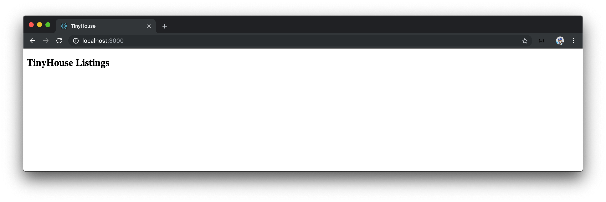

# The Listings Component

Our eventual objective is to render and display a list of listing items in the UI that's retrieved and obtained from the GraphQL API we've set up in the server. Before we concern ourselves with the custom styling and UI of the page, we'll first attempt to have data be available and displayed on the client.

First and foremost, we'll begin working on a new component that we'll create called `<Listings>` with which we're going to keep in a `sections/` folder in our `src/` directory. Let's create the `sections/` folder and an `index.ts` file in `src/sections/`. We'll also create a `Listings/` folder within `src/sections/` that has a `Listings.tsx` file and an `index.ts` file.

```shell
client/
  src/
    sections/
      Listings/
        index.ts
        Listings.tsx
      index.ts
  // ...
```

Since we're creating a single `<Listings>` component, these additional folders may appear unnecessary. When we start building the application in more detail (especially in Part 2 of this course), we'll want to structure and separate _all_ the components in our app in a neat and structured format.

We'll aim to separate and declare "parent level" components within their own section in the `sections/` folder. Within a module (i.e. folder) in `sections/`, we'll explicitly namespace and contain each module within itself since each section module will contain all the accompanying files for that section such as the styles, child components, and additional assets relative to that module alone. The `index.ts` files are established within the root of each module to create explicit public interfaces for the ease of importing and exporting between modules. This will appear clearer when we start to introduce more code.

In the `src/sections/Listings/Listings.tsx` file, we'll import `React` from the `react` library.

```tsx
import React from "react";
```

We'll then export a functional component with the name of `Listings`. We'll state the `<Listings>` component is to simply return a `<h2>` tag that says `'TinyHouse Listings'`. Though we're not directly using the `React` import declared, we have to import `React` if we ever want to define JSX in a component.

```tsx
import React from "react";

export const Listings = () => {
  return <h2>TinyHouse Listings</h2>;
};
```

In the corresponding `index.ts` file within `src/sections/Listings/`, we'll re-export the `<Listings>` component.

```typescript
export * from "./Listings";
```

In the `src/sections/index.ts` file, we'll also re-export the `<Listings>` component from the `sections/` folder.

```typescript
export * from "./Listings";
```

The `<Listings>` component is now being exported from `src/sections`. In the `src/index.tsx` file, we'll import the `<Listings>` component from the `src/sections` folder and render it in our application `render()` function.

```tsx
import React from "react";
import { render } from "react-dom";
import { Listings } from "./sections";
import * as serviceWorker from "./serviceWorker";

render(<Listings />, document.getElementById("root"));

// If you want your app to work offline and load faster, you can change
// unregister() to register() below. Note this comes with some pitfalls.
// Learn more about service workers: https://bit.ly/CRA-PWA
serviceWorker.unregister();
```

When we start our application, we'll see the `'TinyHouse Listings'` header message instead of a `'Hello World!'` message.


