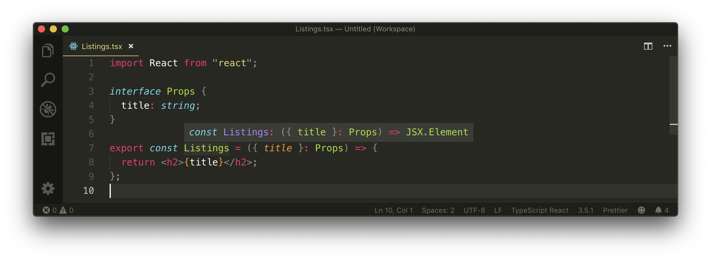
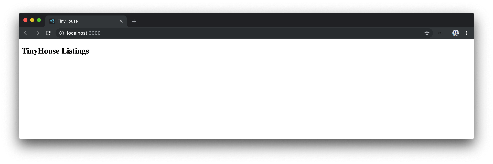

# Props & TypeScript

There are two main types of components in React - [Class components and Functional components](https://reactjs.org/docs/components-and-props.html#function-and-class-components). Functional (or Function) components are _functions_ that can accept props and return JSX. In our `<Listings>` component we can see that the Listings component doesn't receive props yet, but returns JSX - which makes it a valid functional component.

```tsx
import React from "react";

export const Listings = () => {
  return <h2>TinyHouse Listings</h2>;
};
```

With that said, let's attempt to have the `<Listings>` component now receive some props. We'll look to have the `'TinyHouse Listings'` text be given to the `<Listings>` component from the parent. The parent, in this context, is the root `src/index.tsx` file. In the `src/index.tsx` file where `<Listings>` is being rendered, we'll pass in a new prop labeled `title` that has a string value of `'TinyHouse Listings'`.

```tsx
render(<Listings title="TinyHouse Listings" />, document.getElementById("root"));
```

TypeScript will throw an error since we haven't stated that the `<Listings>` component is to accept a `title` prop of type `string`.

In the `<Listings>` component, we'll specify that `props` are being passed down and the `title` field from `props` is to be used in the `<h2>` tag.

```tsx
import React from "react";

export const Listings = props => {
  return <h2>{props.title}</h2>;
};
```

We'll now get an error in the `<Listings>` component that says that the `props` argument has an implicit `any` type. We could explicitly type define this argument like we type define any function argument:

```tsx
import React from "react";

export const Listings = (props: any) => {
  return <h2>{props.title}</h2>;
};
```

We've set `props` to the generic `any` type which tells the compiler the type of `props` is now explicitly defined. Our app will now work. However, `any` isn't useful so let's type define `props` as an object that expects a `title` field of type `string`:

```tsx
import React from "react";

export const Listings = (props: { title: string }) => {
  return <h2>{props.title}</h2>;
};
```

Our application now works and the type of the `title` prop is more appropriately defined. When a component has a large number of props, specifying the type of props right where the argument is being defined can make things hard to read. So we can describe the shape of our `props` data as an interface above the component. We'll call this interface `Props`.

With the `Props` interface defined, we're now able to specify the type of our props with this newly created interface:

```tsx
import React from "react";

interface Props {
  title: string;
}

export const Listings = (props: Props) => {
  return <h2>{props.title}</h2>;
};
```

We can go ahead and also destruct the `title` prop directly from the props argument.

```tsx
import React from "react";

interface Props {
  title: string;
}

export const Listings = ({ title }: Props) => {
  return <h2>{title}</h2>;
};
```

When we hover over the declaration of the `<Listings>` component, we can see that TypeScript infers the `<Listings>` component to be a **function that accepts props and returns a JSX Element**. In essence, the simplest TypeScript definition of a Functional Component.



Since the `<Listings>` component renders the same text despite it coming from props, our UI should appear the same.


