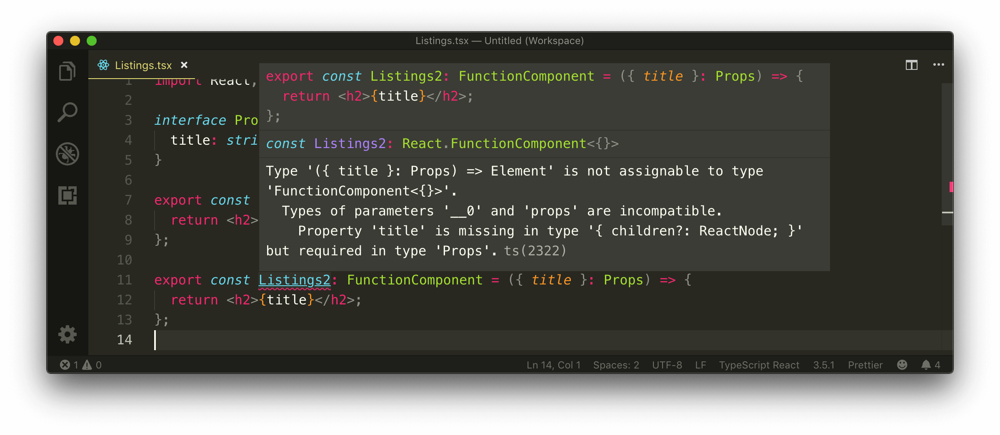

# Functional Components & TypeScript

Though TypeScript infers that the `<Listings>` component is a function that renders JSX (i.e. a functional component), we can take an additional step to specify an explicit type of the function component itself.

React offers specific unique types we can use if we want to enforce additional type definitions for functional components.

Previously, functional components were recognized to be stateless presentational components since functional components could never keep track of its own state. As a result, we would be able to define a functional component with the `SFC` type or the `StatelessComponent` type which still exists today and can be exported from the type definitions of `react`.

```tsx
import React, { StatelessComponent, SFC } from "react";
```

Though they exist, React has _deprecated_ the `StatelessComponent` and `SFC` types. This is because functional components can now keep track of its own state with the emergence of [React Hooks](https://reactjs.org/docs/hooks-intro.html).

The `FunctionComponent` type (or the shorthand version `FC`) is encouraged if we intend to take advantage of additional typings of our functional components.

To visualize the difference the `FunctionComponent` type brings, we'll replicate the `<Listings>` component with another component we'll label `<Listings2>`. We'll define the type of the `<Listings2>` component as the `FunctionComponent` interface type.

```tsx
import React, { FunctionComponent } from "react";

interface Props {
  title: string;
}

export const Listings = ({ title }: Props) => {
  return <h2>{title}</h2>;
};

export const Listings2: FunctionComponent = ({ title }: Props) => {
  return <h2>{title}</h2>;
};
```

We'll see a TypeScript error emerge from the `<Listings2>` component where it states that the `title` property is missing as part of the `Props` type of the component.



If we take a look at the `FunctionComponent` interface type, we'll get a clearer understanding of why this error occurs. The `FunctionComponent` type is an interface that accepts a couple of properties. The first and only required property is a function that accepts props and returns a ReactElement (or `null`).

```tsx
// from the react type definitions file

interface FunctionComponent<P = {}> {
  (props: PropsWithChildren<P>, context?: any): ReactElement | null;
  propTypes?: WeakValidationMap<P>;
  contextTypes?: ValidationMap<any>;
  defaultProps?: Partial<P>;
  displayName?: string;
}
```

> In VSCode, the CMD + Click shortcut allows you to navigate and inspect the type definitions of interfaces and type aliases being used.

The `FunctionComponent` is a generic that accepts a type variable denoted with the letter `P` that has a default value of an empty object type. Though the `FunctionComponent` interface doesn't require the `P` type variable to be defined, it passes the `P` type variable to the `PropsWithChildren` type used for the `props` argument of the first function property.

When we take a look at the `PropsWithChildren` type in our React type definitions file, we can see that `PropsWithChildren` is a type alias that accepts a type variable (`P`) and _combines_ the `P` type variable with a new object type that has a `children` property. The capability of combining multiple types into one is a TypeScript capability known as [intersection types](https://www.typescriptlang.org/docs/handbook/advanced-types.html#intersection-types).

```tsx
// from the react type definitions file

type PropsWithChildren<P> = P & { children?: ReactNode };
```

The first required property of the `FunctionComponent` interface type is the function declaration of the function component (i.e. the function that accepts props and returns JSX). The `props` argument of that function is type defined as the `PropsWithChildren` type. When a type variable isn't passed, the `props` object argument is recognized to _only_ have the `children` property. As a result, when we attempt to access another property from our props (e.g `title`), TypeScript displays an error.

To solve the error, we'll need to pass in our `Props` interface type as the type variable of our `FunctionComponent`. By doing so, the `props` returned from our `FunctionComponent` will recognize the `title` property of type string. When using the `FunctionComponent` interface type, we also no longer need to specify the type of props from the argument itself.

```tsx
import React, { FunctionComponent } from "react";

interface Props {
  title: string;
}

export const Listings = ({ title }: Props) => {
  return <h2>{title}</h2>;
};

export const Listings2: FunctionComponent<Props> = ({ title }) => {
  return <h2>{title}</h2>;
};
```

At this moment the `<Listings>` and `<Listings2>` component behave identically to one another. So what does the `FunctionComponent` type give us?

### `children`

The `props` argument of a component with the `FunctionComponent` type will contain a `children` property of type `ReactNode`.

```tsx
import React, { FunctionComponent } from "react";

// ...

export const Listings2: FunctionComponent<Props> = ({ title, children }) => {
  return <h2>{title}</h2>;
};
```

> The [`children` prop](https://reactjs.org/docs/composition-vs-inheritance.html#containment) references the children JSX elements rendered _within_ a component.
>
> E.g. `<ComponentA><ComponentB /></ComponentA>` - `<ComponentB>` is the _child (i.e. children)_ of `<ComponentA>`

If we wanted to replicate having a typed `children` prop in our original `<Listings>` component, we'll need to import the `ReactNode` type and define a `children` property with `ReactNode` in our `Props` interface.

The `FunctionComponent` interface also provides a series of typed optional properties.

### `propTypes`

We can specify the [`propTypes`](https://reactjs.org/docs/typechecking-with-proptypes.html) of the component and `propTypes` will be able to infer what kind of props is expected to be passed in the component.

```tsx
import React, { FunctionComponent } from "react";
import PropTypes from 'prop-types';

// ...

export const Listings2: FunctionComponent<Props> = ({ title }) => {
  return <h2>{title}</h2>;
};

Listings2.propTypes = {
  title: propTypes.string // title is recognized as a prop
  description: propTypes.description // description is NOT recognized as a prop
}
```

`propTypes` is a React feature that allows us to type-check props without using a JavaScript extension like TypeScript. Since we are using TypeScript to type-check our props,`propTypes` isn't really helpful.

Like `propTypes`, the `FunctionComponent` interface helps type-check the `contextTypes` property which is used to type define the types of properties within [context](https://reactjs.org/docs/context.html). Similar to `propTypes`, `contextTypes` isn't helpful if we leverage TypeScript to define the types of our application's context properties.

### `defaultProps`

React provides a `defaultProps` option to allow us to provide default values for props. With `FunctionComponent`, the props stated in the `defaultProps` property is type-checked.

```tsx
import React, { FunctionComponent } from "react";

// ...

export const Listings2: FunctionComponent<Props> = ({ title }) => {
  return <h2>{title}</h2>;
};

Listings2.defaultProps = {
  title: "TinyHouse Listings", // title is recognized as a prop
  description: "The most fabolous listings in the city" // description is NOT recognized as a prop
};
```

`defaultProps` isn't helpful as well since [ES6 gives us the capability of defining default parameters](https://developer.mozilla.org/en-US/docs/Web/JavaScript/Reference/Functions/Default_parameters).

```tsx
import React, { FunctionComponent } from "react";

// ...

export const Listings2: FunctionComponent<Props> = ({ title = "TinyHouse Listings" }) => {
  return <h2>{title}</h2>;
};
```

### `displayName`

Finally, the `FunctionComponent` interface states the type of the `displayName` property as a `string`. [`displayName` is a component property that allows us to set the display name of components for debugging messages](https://reactjs.org/docs/react-component.html#displayname).

```tsx
import React, { FunctionComponent } from "react";

// ...

export const Listings2: FunctionComponent<Props> = ({ title }) => {
  return <h2>{title}</h2>;
};

// displayName must be a string

Listings2.displayName = "Listings"; // Pass
Listings2.displayName = 5; // Error
```

`displayName` isn't often used since by default, the display name of components will be inferred from the name of the function.

Though the `FunctionComponent` interface type is useful, it's most helpful when we want to use and specify unique information within our components such as rendering children, or maybe setting the `displayName`, or possibly using `propTypes`/`defaultProps` (though we wouldn't recommend these in a TypeScript + ES6 environment).

We don't need the type functionality the `FunctionComponent` interface type gives us. As a result, we won't use the `FunctionComponent` interface type and we'll stick with the simple means of having our function components be inferred as functions that accept props and return JSX.

With that said, we'll close this lesson by removing the import of the `FunctionComponent` type and the `Listings2` component we've created.
