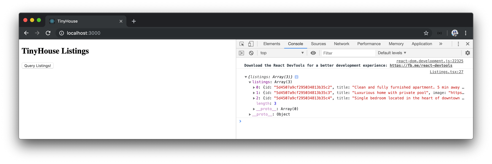

# Querying Listings

We'll look to make our first interaction with the local GraphQL API we've set up on the server. There's a large number of tools in the ecosystem that is geared to help clients make GraphQL queries. And these tools provide a lot of value with which we'll see shortly, but they're not a requirement to making GraphQL requests.

In the next couple of lessons, we'll be taking our time and looking to make our GraphQL requests through some simple means which will give us a good understanding of what it takes to make a GraphQL request.

Here's a gameplan of what we'll do to make our first request.

### Gameplan

#### We'll invoke a `POST` HTTP method

[GraphQL supports both the POST and GET methods with some requirements in each](https://graphql.org/learn/serving-over-http/#http-methods-headers-and-body).

In traditional REST applications, `POST` and `GET` are denoted to invoke what kind of request is going to be made. In GraphQL, however, we address retrieving or mutating information with **queries** and **mutations**. The one main distinction between GraphQL queries or mutations is that mutations are executed one after the other while queries are executed in parallel. Since our GraphQL server is served over HTTP, we can make either a `POST` or `GET` request to invoke a GraphQL query or mutation.

Most GraphQL clients use the `POST` HTTP method to both retrieve and persist data with which we'll be doing as well.

#### We'll specify the content type of our POST request as `application/json`

We'll pass our GraphQL documents (i.e. queries) as a JSON object.

#### We'll reference the URL of the API endpoint when we make our requests

Our GraphQL API is served over a single endpoint (`http://localhost:9000/api`), so we'll reference this single endpoint in all our requests.

### Server `fetch()`

We'll be using the native browser [`fetch()` method](https://developer.mozilla.org/en-US/docs/Web/API/Fetch_API/Using_Fetch) to make our GraphQL requests.

> If you're using the Internet Explorer browser to run the React project, the window `fetch()` method is unsupported. We'll suggest using Chrome/Firefox or installing a [`fetch()` polyfill library](https://github.com/github/fetch).

We'll create our server `fetch()` function in a new `lib/` folder within `src/`.

```shell
client/
  src/
    lib/
    // ...
  // ...
```

The `src/sections/` folder will be responsible for containing the main section components of our app. The `src/lib/` folder will be where we introduce code that is to be most likely shared between the different components in our app.

We'll create an `api/` folder within `lib/`. We'll additionally create an `index.ts` and `server.ts` file inside the `api/` folder.

```shell
client/
  src/
    lib/
      api/
        index.ts
        server.ts
```

In the `src/lib/api/server.ts` file, we'll export a `server` `const` object that will remain empty for now.

```typescript
export const server = {};
```

We'll re-export the `server` object from the `src/lib/api/index.ts` file.

```typescript
export * from "./server";
```

In the `server` object, we'll define a property on the object that's given a label of `fetch`. This property is to be a function.

```typescript
export const server = {
  fetch: () => {}
};
```

In the `server.fetch()` function, we'll use the window `fetch()` function to help make our request. We'll assign the results of the window `fetch()` method to a constant variable we'll call `res` (i.e. response).

```typescript
export const server = {
  fetch: () => {
    const res = fetch();
  }
};
```

Window `fetch()` is a _promise_. We want the results of the promise to be assigned to the `res` constant variable. We'll use the `async`/`await` syntax by making the `server.fetch` property function an `async` function and placing the `await` expression on the window `fetch()` function:

```typescript
export const server = {
  fetch: async () => {
    const res = await fetch();
  }
};
```

When our `server.fetch()` function gets called, we'll expect an object to contain the GraphQL document. We'll label the GraphQL document as `query` regardless if a GraphQL query or mutation is being invoked.

Let's create an interface for this object body, that we'll call `Body`, that will have a `query` field of type `string`. We'll dictate that the `server.fetch()` function is to accept a `body` argument of type `Body`.

```typescript
interface Body {
  query: string;
}

export const server = {
  fetch: async (body: Body) => {
    const res = await fetch();
  }
};
```

With our `server` `fetch()` function expecting the request body object, we can begin to build out the window `fetch()` method.

### `/api` proxy

The first argument of the window `fetch()` method is a required argument that is the reference to the path of the resource we want to fetch. In our instance, the path or endpoint of our API is `http://localhost:9000/api` when our server is running. If we were to directly use the `http://localhost:9000/api` in our `fetch()` method, our client Webpack server (`http://localhost:3000`) will attempt to load a resource from a _different_ origin (`http://localhost:9000`). This will essentially be performing [**Cross-Origin Resource Sharing**](https://developer.mozilla.org/en-US/docs/Web/HTTP/CORS) and for security reasons, browsers _may_ reject the ability for our client to make the request to the server. To avoid this, we can have our Webpack Server _proxy_ requests intended for our API Server.

[`create-react-app` makes the ability to proxy requests in development](https://facebook.github.io/create-react-app/docs/proxying-api-requests-in-development) fairly easy by allowing us to define a `proxy` field in the `package.json` file.

In the `package.json` file, we'll introduce a `proxy` field with a value of the base path of our running server url - `http://localhost:9000`.

```json
  "proxy": "http://localhost:9000"
```

If a request within our React Webpack server is now made to an unrecognized request prefix, for example `/api`, it will be redirected to the specified proxy - `http://localhost:9000/api`.

> Proxying requests from the client to the server is only for development. When it comes to deployment, we have to ensure these URLs point to the right locations in the production state.
>
> You may need to restart the React Webpack server to take the proxy change made in the `package.json` file into account.

### `server.fetch()`

In our `server.fetch()` function, we can specify an argument of `/api` in the window `fetch()` method. `/api` will get proxied to `http://localhost:9000/api`.

```typescript
interface Body {
  query: string;
}

export const server = {
  fetch: async (body: Body) => {
    const res = await fetch("/api");
  }
};
```

Since we want our window `fetch()` method to make a POST request, we'll need pass in the appropriate request options.

The first option we'll specify is the `method` option with a value of `'POST'`.

```typescript
interface Body {
  query: string;
}

export const server = {
  fetch: async (body: Body) => {
    const res = await fetch("/api", {
      method: "POST"
    });
  }
};
```

The second request option will be where we declare the content type of our request as `application/json`. This is to be done in the `headers` option of our request body.

```typescript
interface Body {
  query: string;
}

export const server = {
  fetch: async (body: Body) => {
    const res = await fetch("/api", {
      method: "POST",
      headers: {
        "Content-Type": "application/json"
      }
    });
  }
};
```

Finally, we'll pass in the data that is to be sent as the body of the request. We can't pass in a JavaScript object so this is where we'll use the [`JSON.stringify()` method](https://developer.mozilla.org/en-US/docs/Web/JavaScript/Reference/Global_Objects/JSON/stringify) to convert the data `body` to be passed in as a JSON string.

When the fetch is successful it returns a JSON response. To have this response handled as a native JavaScript object, we can return [`res.json()`](https://developer.mozilla.org/en-US/docs/Web/API/Body/json).

```typescript
interface Body {
  query: string;
}

export const server = {
  fetch: async (body: Body) => {
    const res = await fetch("/api", {
      method: "POST",
      headers: {
        "Content-Type": "application/json"
      },
      body: JSON.stringify(body)
    });

    return res.json();
  }
};
```

At this moment, our `server.fetch()` method is a promise that when resolved returns a data type of `any`. This isn't strongly typed so we'll revise this in an upcoming lesson. For now, we'll verify if we're able to interact with the Node server from the React client.

We'll look to query the listings information from the `<Listings>` component directly. In the `src/sections/Listings/Listings.tsx` component file, we'll import the newly created `server` object from the `src/lib/api/` folder.

```tsx
import React from "react";
import { server } from "../../lib/api";

interface Props {
  title: string;
}

export const Listings = ({ title }: Props) => {
  return <h2>{title}</h2>;
};
```

To get things started, we'll state that we want the `listings` query to be made only when a button has been clicked. We'll introduce this button element in our component template and attach a click event listener on the button, that when clicked will call a component function called `fetchListings()`.

```tsx
import React from "react";
import { server } from "../../lib/api";

interface Props {
  title: string;
}

export const Listings = ({ title }: Props) => {
  const fetchListings = () => {};

  return (
    <div>
      <h2>{title}</h2>
      <button onClick={fetchListings}>Query Listings!</button>
    </div>
  );
};
```

In our component `fetchListings()` function, we'll attempt to make the server fetch request. Our `server` `fetch()` function expects a `body` argument with which contains a `query` field of the GraphQL query (i.e request). Since the request to be made is of content-type `application/json` and passes a stringified JSON, we'll create our query as a string that represents the shape of data we'd like to return from our API. We'll want to query the only root level query available in our server - the `listings` query. We'll define this query request at the top of the `Listings.tsx` file.

To distinguish our GraphQL query document from any other variable, we'll declare the query in a constant variable named `LISTINGS`. We'll set up our `LISTINGS` query document to query all the fields from the `Listing` GraphQL object type.

```tsx
import React from "react";
import { server } from "../../lib/api";

const LISTINGS = `
  query Listings {
    listings {
      id
      title
      image
      address
      price
      numOfGuests
      numOfBeds
      numOfBaths
      rating
    }
  }
`;

interface Props {
  title: string;
}

export const Listings = ({ title }: Props) => {
  const fetchListings = () => {};

  return (
    <div>
      <h2>{title}</h2>
      <button onClick={fetchListings}>Query Listings!</button>
    </div>
  );
};
```

In our component `fetchListings()` function - we'll call the `server.fetch()` function, pass in a `body` object and specify a `query` field in `body` to be that of the `LISTINGS` query we've set up. We'll assign the result of our `server.fetch()` function to a constant variable called `listings` and attempt to `console.log()` the `listings` result right after the request has been made.

```tsx
import React from "react";
import { server } from "../../lib/api";

const LISTINGS = `
  query Listings {
    listings {
      id
      title
      image
      address
      price
      numOfGuests
      numOfBeds
      numOfBaths
      rating
    }
  }
`;

interface Props {
  title: string;
}

export const Listings = ({ title }: Props) => {
  const fetchListings = () => {
    const listings = server.fetch({ query: LISTINGS });
    console.log(listings);
  };

  return (
    <div>
      <h2>{title}</h2>
      <button onClick={fetchListings}>Query Listings!</button>
    </div>
  );
};
```

The `.json()` method in our `server.fetch()` function takes the response and returns a promise. We'll make our component `fetchListings()` function asynchronous since we'll have to `await` for the results from the `async` `server.fetch()` function. The data of the returned promise will live in a `data` field within the response object so we'll destructure `data` from the response object.

> GraphQL conveniently places the [data we expect from a request in a `data` field of the response](https://graphql.github.io/graphql-spec/June2018/#sec-Data).

Our `Listings.tsx` component file will now look like the following:

```tsx
import React from "react";
import { server } from "../../lib/api";

const LISTINGS = `
  query Listings {
    listings {
      id
      title
      image
      address
      price
      numOfGuests
      numOfBeds
      numOfBaths
      rating
    }
  }
`;

interface Props {
  title: string;
}

export const Listings = ({ title }: Props) => {
  const fetchListings = async () => {
    const { data } = await server.fetch({ query: LISTINGS });
    console.log(data); // check the console to see the listings data from our GraphQL Request!
  };

  return (
    <div>
      <h2>{title}</h2>
      <button onClick={fetchListings}>Query Listings!</button>
    </div>
  );
};
```

To verify if our client can make requests to the GraphQL server, we'll first run our Node server.

```shell
server $: npm run start
```

With the server running, we'll also run our React Webpack server.

```shell
client $: npm run start
```

When we click the `Query Listings` button, we'll see the `listings` data from our server in our browser console!


