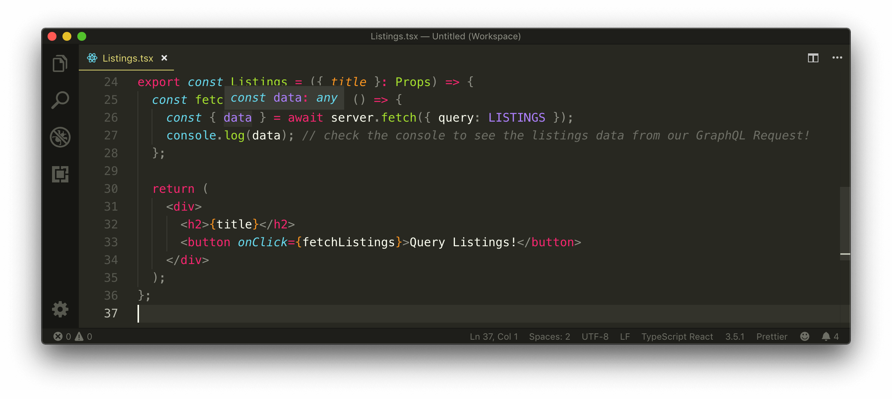
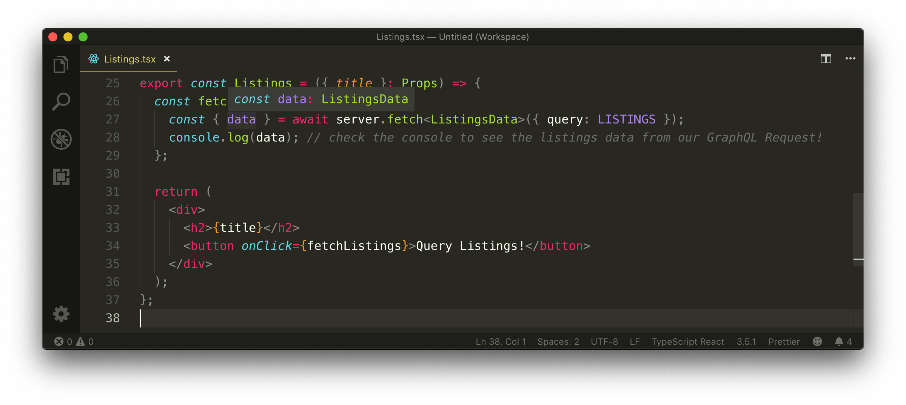
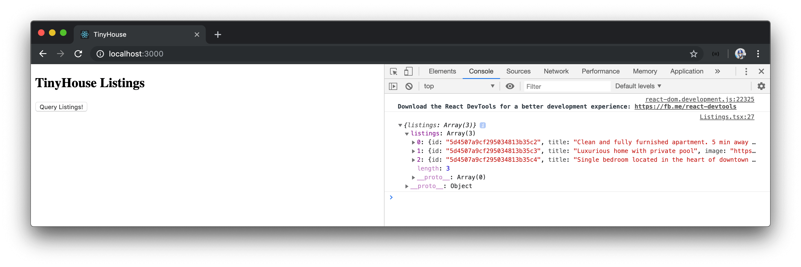

# Abstracting the type of data from server fetch

Although our `server.fetch()` function works, we still have an issue where data retrieved from the `server.fetch()` function doesn't have a type associated with it.



To solve this, we'll take advantage of Typescript [generics](https://www.typescriptlang.org/docs/handbook/generics.html). We've seen how generics worked both in the Node server application as well the `FunctionComponent` type we initially surveyed, but we haven't had the chance to create our own generic abstraction.

We want the `server.fetch()` function to return the data from the request but we also want this data to be typed. We also want the `fetch()` function to work for any data object with its own unique type. The `server.fetch()` function has no idea what the type of data it returns could be. However, in the component where the fetch function is being called, we have an idea of the data we're expecting because we're _defining the query we want to make_.

For the `listings` query field, we expect an array of `listings` where `id`, `title`, `image`, `address` are to be strings and the `price`, `numOfGuests`, `numOfBeds`, `numOfBaths`, and `rating` fields are to be numbers.

```tsx
const LISTINGS = `
  query Listings {
    listings {
      id
      title
      image
      address
      price
      numOfGuests
      numOfBeds
      numOfBaths
      rating
    }
  }
`;
```

If we have an idea of the shape of the data from the request, we essentially want to pass this shape of data into the `server.fetch()` function and we can achieve this with generics. First and foremost, in the `server.fetch()` function in the `src/lib/api/server.ts` file, we'll use angle brackets and declare that the function can accept a type variable denoted by `TData`.

```typescript
export const server = {
  fetch: async <TData>(body: Body) => {
    const res = await fetch("/api", {
      method: "POST",
      headers: {
        "Content-Type": "application/json"
      },
      body: JSON.stringify(body)
    });

    return res.json();
  }
};
```

We'll specify a default type parameter of `any` to say if the type of data isn't provided, we'll ensure the type is to be returned as `any`.

```typescript
export const server = {
  fetch: async <TData = any>(body: Body) => {
    const res = await fetch("/api", {
      method: "POST",
      headers: {
        "Content-Type": "application/json"
      },
      body: JSON.stringify(body)
    });

    return res.json();
  }
};
```

By having access to the `TData` type variable in our `server.fetch()` function, we can set the return type of the function to the type we expect. The `res.json()` function simply returns a value of `Promise<any>` and doesn't give us the option of passing in a type variable.

When our function is successful, we're confident of how the data is going to be returned. This is where we can [type assert](https://www.typescriptlang.org/docs/handbook/basic-types.html#type-assertions) the returned value to what we expect. In our instance, we'll type assert the returned statement as `Promise<{ data: TData }>`.

```typescript
export const server = {
  fetch: async <TData = any>(body: Body) => {
    const res = await fetch("/api", {
      method: "POST",
      headers: {
        "Content-Type": "application/json"
      },
      body: JSON.stringify(body)
    });

    return res.json() as Promise<{ data: TData }>;
  }
};
```

[Type assertions](https://www.typescriptlang.org/docs/handbook/basic-types.html#type-assertions) are a TypeScript capability where one can _override_ the types that TypeScript either infers or analyzes. There are two ways of type asserting - either using the `as` syntax or using the angle brackets syntax.

```typescript
return <Promise<{ data: TData }>>res.json(); // angle brackets to type assert res.json()

return res.json() as Promise<{ data: TData }>; // (as) to type assert res.json()
```

Our ESLint configuration prefers the `as` syntax and so do we, so we'll use the `as` syntax to type assert the returned promise.

> Type assertions should be used _sparingly_ because it's easy to type assert information without specifying the properties that are needed in the type. Most of the time we'll assign types normally but only in cases we know better than the compiler - do we assert.

The data being returned from our `server.fetch()` can be now be typed as the type value passed into the function! Let's see how this would work for our `<Listings>` component.

For the `<Listings>` component, we'll create an interface type that is to resemble the shape of listings data that can be retrieved from our GraphQL `listings` query. We'll create this type in a `types.ts` file located within the `src/sections/Listings/` folder.

```shell
client/
  src/
    lib/
      api/
      sections/
        Listings/
          index.ts
          Listings.ts
          types.ts
  // ...
```

In the `Listings/types.ts` file, we'll first create an interface called `Listing` that describes the shape of a single listing object.

```typescript
interface Listing {
  id: string;
  title: string;
  image: string;
  address: string;
  price: number;
  numOfGuests: number;
  numOfBeds: number;
  numOfBaths: number;
  rating: number;
}
```

We'll then export an interface labeled `ListingsData` that represents the shape of the `data` field returned from our API. When we query listings, we'll observe the `data` field is to contain a `listings` field which is an array of listing items so we'll specify the interface as so.

```typescript
interface Listing {
  id: string;
  title: string;
  image: string;
  address: string;
  price: number;
  numOfGuests: number;
  numOfBeds: number;
  numOfBaths: number;
  rating: number;
}

export type ListingsData = {
  listings: Listing[];
};
```

In the `Listings.tsx` component file, we'll import the `ListingsData` interface type and pass it down as the type variable for the `server.fetch()` function.

```tsx
import React from "react";
import { server } from "../../lib/api";
import { ListingsData } from "./types";

const LISTINGS = `
  query Listings {
    listings {
      id
      title
      image
      address
      price
      numOfGuests
      numOfBeds
      numOfBaths
      rating
    }
  }
`;

interface Props {
  title: string;
}

export const Listings = ({ title }: Props) => {
  const fetchListings = async () => {
    const { data } = await server.fetch<ListingsData>({ query: LISTINGS });
    console.log(data); // check the console to see the listings data from our GraphQL Request!
  };

  return (
    <div>
      <h2>{title}</h2>
      <button onClick={fetchListings}>Query Listings!</button>
    </div>
  );
};
```

The data now being returned from the `server` `fetch()` function is appropriately typed.



If we attempt to access the listings field within `data`, we'll be able to access the listings information we expect. If we wanted to access some other property that didn't exist, TypeScript will throw an error.

```typescript
const fetchListings = async () => {
  const { data } = await server.fetch<ListingsData>({
    query: LISTINGS
  });
  console.log(data.listings); // listings exists in data
  console.log(data.bookings); // bookings does not exist in data
};
```

Our app will still behave the same as before since we haven't made any functional changes. We'll be able to query the listings from our database and see the queried result in our browser console.


