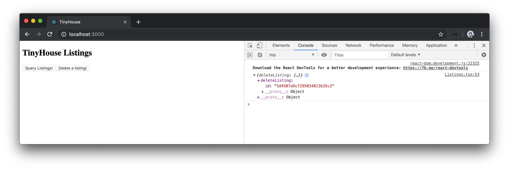

# Deleting a listing

With our custom `server.fetch()` function, we've been able to query the `listings` field in our GraphQL API. Now, we'll look to see how we can make the GraphQL mutation available in our API - `deleteListing`.

In our `server.fetch()` function, we've specified that the request body has to have at the very least the query string that represents the GraphQL query (i.e. request) we want to make.

```typescript
interface Body {
  query: string;
}

export const server = {
  fetch: async <TData = any>(body: Body) => {
    // ...
  }
};
```

We can reuse this `server.fetch()` function to help conduct our mutation. The mutation we'll want to make (`deleteListing`) expects a variable argument to be passed which is the `id` of the listing that is to be deleted. As a result, we should expect the body of the request to contain the variables that can be passed into our GraphQL request.

The JSON body we pass into our request expects a `query` field of type `string`. The other field we'll pass in is the `variables` field which is to be an object for holding the variables that are to be passed into the GraphQL request.

Just like how the data of a request is to be typed, it can be helpful if we're able to type define the expected variables of a request since every request may expect different variables. Because of this, we'll make the `Body` interface a generic that accepts a `TVariables` type with which will be the type of the `variables` field.

```typescript
interface Body<TVariables> {
  query: string;
  variables: TVariables;
}
```

Variables of a request can be optional since we don't have to pass in variables for every GraphQL request. We'll denote the `variables` field as being optional by placing a question mark at the end of the `variables` field in the `Body` interface.

```typescript
interface Body<TVariables> {
  query: string;
  variables?: TVariables;
}
```

In the `server.fetch()` function, we'll need to pass the value of the `TVariables` type to the `Body` interface type assigned to the `body` argument. Just like how we've introduced a `TData` type variable into our `server.fetch()` function, we can introduce a `TVariables` type variable as well and give it a default value of `any`. We'll then pass the `TVariables` type value along to the `Body` interface used as the type of the `body` argument.

```typescript
interface Body<TVariables> {
  query: string;
  variables?: TVariables;
}

export const server = {
  fetch: async <TData = any, TVariables = any>(body: Body<TVariables>) => {
    const res = await fetch("/api", {
      method: "POST",
      headers: {
        "Content-Type": "application/json"
      },
      body: JSON.stringify(body)
    });

    return res.json() as Promise<{ data: TData }>;
  }
};
```

Our `server.fetch()` function is now prepared to allow components to make GraphQL mutations. In the `<Listings>` component, we'll create a button that'll trigger a method when clicked. We'll call this method `deleteListing()` and the button text will be `'Delete a listing!'`. Since our `deleteListing()` function will make an asynchronous request, we'll label the function as an `async` function.

```tsx
import React from "react";
import { server } from "../../lib/api";
import { ListingsData } from "./types";

const LISTINGS = `
  query Listings {
    listings {
      id
      title
      image
      address
      price
      numOfGuests
      numOfBeds
      numOfBaths
      rating
    }
  }
`;

interface Props {
  title: string;
}

export const Listings = ({ title }: Props) => {
  const fetchListings = async () => {
    const { data } = await server.fetch<ListingsData>({
      query: LISTINGS
    });
    console.log(data); // check the console to see the listings data from our GraphQL Request!
  };

  const deleteListing = async () => {};

  return (
    <div>
      <h2>{title}</h2>
      <button onClick={fetchListings}>Query Listings!</button>
      <button onClick={deleteListing}>Delete a listing!</button>
    </div>
  );
};
```

The `deleteListing()` function is where we'll want to call the `server.fetch()` function, pass in the expected GraphQL request and the variables of the request. Let's first define the shape of both the data we expect to retrieve as well as the shape of variables we want to pass in.

In the `Listings/types.ts` file, we'll declare the expected types of the data and variables field of our `deleteListing` mutation as `DeleteListingData` and `DeleteListingVariables` respectively.

The data we expect returned from the `deleteListing` mutation is the deleted listing itself. So we'll specify a `deleteListing` field within the `DeleteListingData` interface that will have a type of the `Listing` interface we've defined earlier.

```typescript
interface Listing {
  id: string;
  title: string;
  image: string;
  address: string;
  price: number;
  numOfGuests: number;
  numOfBeds: number;
  numOfBaths: number;
  rating: number;
}

export type ListingsData = {
  listings: Listing[];
};

export interface DeleteListingData {
  deleteListing: Listing;
}
```

The only variable of the `deleteListing` mutation is to be an `id` of type string.

```typescript
interface Listing {
  id: string;
  title: string;
  image: string;
  address: string;
  price: number;
  numOfGuests: number;
  numOfBeds: number;
  numOfBaths: number;
  rating: number;
}

export type ListingsData = {
  listings: Listing[];
};

export interface DeleteListingData {
  deleteListing: Listing;
}

export interface DeleteListingVariables {
  id: string;
}
```

In the `Listings.tsx` file, we'll import the newly created types for our GraphQL `deleteListing` request.

```typescript
import { DeleteListingData, DeleteListingVariables, ListingsData } from "./types";
```

We'll need to construct the query document of our `deleteListing` mutation. We'll set this document in a `const` variable called `DELETE_LISTING`. We'll use the `mutation` keyword and declare the name of the mutation as `DeleteListing` and we'll call the `deleteListing` mutation. For what is to be returned, we'll state we're only interested in returning the `id` of the deleted listing.

```typescript
const DELETE_LISTING = `
  mutation DeleteListing {
    deleteListing {
      id
    }
  }
`;
```

We now need to find a way to pass in the `id` variable needed in our `deleteListing` mutation. In the `mutation` declaration of our document, we can say we expect a variable named `id` and we can say the GraphQL type of this `id` variable is `GraphQLID` and it is to be required. Since we can use the GraphQL schema language here - this will appear as `ID!`.

In GraphQL, we can use the `$` syntax to define variables in a GraphQL request, and we can pass the variables as a separate map into the request field. This will appear as follows:

```tsx
const DELETE_LISTING = `
  mutation DeleteListing($id: ID!) {
    deleteListing(id: $id) {
      id
    }
  }
`;
```

With our mutation query document available, we can now establish the `server.fetch()` function in the component `deleteListing()` function. We'll trigger the `server.fetch()` function, pass in the `DeleteLisingData` and `DeleteListingVariables` type variables, and specify in the body of the request the mutation query we've set up and `id` variable to be passed in. To get an `id` of a listing in our database, we'll retrieve and use an `id` from a `listing` object when we query all the listings.

We'll destructure the `data` returned from our `server.fetch()` call and `console.log()` it at the end of our `deleteListing(()` component function.

This will make our `Listings.tsx` component file now look like the following:

```tsx
import React from "react";
import { server } from "../../lib/api";
import { DeleteListingData, DeleteListingVariables, ListingsData } from "./types";

const LISTINGS = `
  query Listings {
    listings {
      id
      title
      image
      address
      price
      numOfGuests
      numOfBeds
      numOfBaths
      rating
    }
  }
`;

const DELETE_LISTING = `
  mutation DeleteListing($id: ID!) {
    deleteListing(id: $id) {
      id
    }
  }
`;

interface Props {
  title: string;
}

export const Listings = ({ title }: Props) => {
  const fetchListings = async () => {
    const { data } = await server.fetch<ListingsData>({ query: LISTINGS });
    console.log(data); // check the console to see the listings data from our GraphQL Request!
  };

  const deleteListing = async () => {
    const { data } = await server.fetch<DeleteListingData, DeleteListingVariables>({
      query: DELETE_LISTING,
      variables: {
        id: "5d4507a9cf295034813b35c2" // hardcoded id variable,
      }
    });
    console.log(data); // check the console to see the result of the mutation!
  };

  return (
    <div>
      <h2>{title}</h2>
      <button onClick={fetchListings}>Query Listings!</button>
      <button onClick={deleteListing}>Delete a listing!</button>
    </div>
  );
};
```

We'll start both the Node server and React Webpack server from our terminal.

```shell
server $: npm run start
```

```shell
client $: npm run start
```

When we click the `'Delete a listing!'` button in our UI, we'll see the `id` information of the deleted listing in our console!



If we were to query all the listings again, we'll see the listing we've deleted has been removed.

> At any moment in time, you can run the `seed` script on the Node server project to introduce more listings into the listings collection in the database.

### `TVariables`

When we've set a value of the `TData` type variable in our `server.fetch()` function, we've been able to assign the type of `data` being returned from the request. Specifying a value of `TVariables` on the other hand helps type check the variables data being used in the request.

In our component `deleteListing()` function, if we were to introduce another variable that we haven't stated is part of the `DeleteListingVariables` interface - TypeScript will emit an error.

```tsx
const deleteListing = async () => {
  const { data } = await server.fetch<DeleteListingData, DeleteListingVariables>({
    query: DELETE_LISTING,
    variables: {
      id: "5d4507a9cf295034813b35c2",
      rating: 3 // rating does not exist in DeleteListingVariables
    }
  });
  console.log(data);
};
```

Since not every request needs variables, the `variables` field in our body request is optional.
