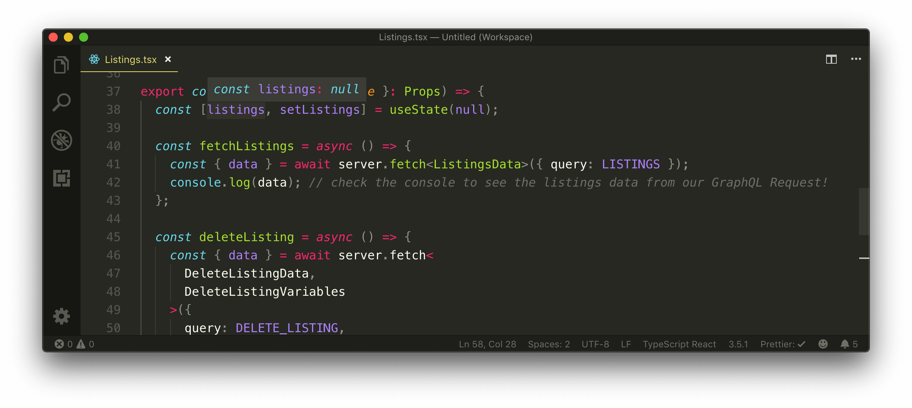
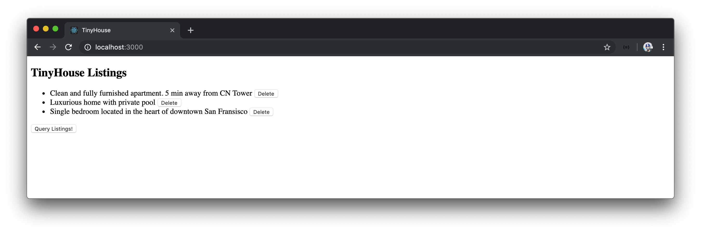

# The useState Hook

The [`useState` Hook](https://reactjs.org/docs/hooks-state.html) is a special Hook that allows us to **add** React state to functional components. We're going to use the `useState` Hook to keep track of the listings data from our query as part of the `<Listings>` component state.

## `useState`

In our `Listings.tsx` component file, we'll import the `useState` Hook from the React library.

```tsx
import React, { useState } from "react";
```

We'll specify the `useState` Hook at the top of the `Listings` component and specify two values it will return - `listings` and `setListings`. Since we don't have an idea of what the initial data of our state object is going to be, we'll initialize it with `null`.

```tsx
export const Listings = ({ title }: Props) => {
  const [listings, setListings] = useState(null);

  // ...
};
```

The `useState` Hook allows us to destructure two values.

1.  The first value is the state value we want to create. In our case, we've called the state value we've created `listings`.
2.  The second value is a function used to update the state value. In our case, we've called the function to update `listings` - `setListings()`.

The only argument that the `useState` Hook accepts is the initial value of the state value being created. We've initialized the `listings` value with `null`.

We're _destructuring_ the array `useState` gives us into two values - `listings` and `setListings`. The `useState` Hook is just a function that returns an array of two values. What we've written is equivalent to doing:

```tsx
export const Listings = ({ title }: Props) => {
  const listingsAndSetListings = useState(null);
  const listings = listingsAndSetListings[0];
  const setListings = listingsAndSetListings[1];

  // ...
};
```

Instead of writing the above in three lines, we're able to group the use of `useState` into a single line with [array de-structuring](https://developer.mozilla.org/en-US/docs/Web/JavaScript/Reference/Operators/Destructuring_assignment#Array_destructuring), a feature introduced in ES6.

### `useState` and the `Listing` type

The `useState` Hook often does a good job in inferring the type of state data depending on the initial value provided. If we take a look at the `listings` state value at this moment in time, we can see that the TypeScript compiler recognizes the type of `listings` as `null`.



There's an issue here. When we initialize our state values, we often initialize them with `null` or empty values. If we intend on using the `listings` value later in our component when it's finally populated, TypeScript will emit a warning if we attempt to access a property from it or map through it because TypeScript recognizes the type of the `listings` value as `null`.

This is why the `useState` Hook accepts a type argument that allows us to specify the type of the value being created. In this case, we would want to specify the type of the `listings` state value is the array of the `Listing` type we've created in the `Listings/types.ts` file.

We'll first export the `Listing` interface from the `Listings/types.ts` file.

```tsx
export interface Listing {
  id: string;
  title: string;
  image: string;
  address: string;
  price: number;
  numOfGuests: number;
  numOfBeds: number;
  numOfBaths: number;
  rating: number;
}
```

And import the `Listing` interface type in the `Listings.tsx` component file.

```tsx
import {
  DeleteListingData,
  DeleteListingVariables,
  Listing,
  ListingsData
} from "./types";
```

We'll then use the `Listing` interface type to state that the `listings` state value is to have a type of `Listing[]`. Since we're initializing the `listings` state value with `null`, we'll state the type of the `listings` state value as a union type of `Listing[] | null`. This will mean that the `listings` state value can either be of the `Listing[]` type or the `null` type.

```tsx
export const Listings = ({ title }: Props) => {
  const [listings, setListings] = useState<Listing[] | null>(null);

  // ...
};
```

### Query listings

We want to update the `listings` state value the moment our `listings` query is complete. In our component `fetchListings()` function, we'll remove the `console.log()` and use the `setListings()` function from our Hook to update `listings`.

```tsx
export const Listings = ({ title }: Props) => {
  const [listings, setListings] = useState<Listing[] | null>(null);

  const fetchListings = async () => {
    const { data } = await server.fetch<ListingsData>({
      query: LISTINGS
    });
    setListings(data.listings);
  };

  // ...
};
```

With our component state being updated when the query is complete, we can now attempt to display the `listings` data when available in our UI. Since the `listings` state value is to be an array of objects, we'll use the JavaScript [`.map()` function](https://developer.mozilla.org/en-US/docs/Web/JavaScript/Reference/Global_Objects/Array/map) to render a simple list item for every data object in `listings` when available. We'll assign this list to a `const` variable called `listingsList`.

```tsx
export const Listings = ({ title }: Props) => {
  const [listings, setListings] = useState<Listing[] | null>(null);

  const fetchListings = async () => {
    const { data } = await server.fetch<ListingsData>({
      query: LISTINGS
    });
    setListings(data.listings);
  };

  // ...

  const listingsList = (
    <ul>
      {listings.map(listing => {
        return <li key={listing.id}>{listing.title}</li>;
      })}
    </ul>
  );
};
```

> A `key` is specified to each rendered list item (with a value of `listing.id`) to help React identify each item and keep track if one is to change, be removed, or added. You can find more details about **Lists and Keys** in the [React documentation](https://reactjs.org/docs/lists-and-keys.html#keys).

Right away, our editor will display an error saying `listings` might be `null` and it is when the component gets rendered for the first time. As a result, we should only map through the values when `listings` is available. When `listings`is `null`, we'll set the `listingsList` `const` variable to `null`. We'll use a [ternary statement](https://developer.mozilla.org/en-US/docs/Web/JavaScript/Reference/Operators/Conditional_Operator) to achieve this.

```tsx
export const Listings = ({ title }: Props) => {
  const [listings, setListings] = useState<Listing[] | null>(null);

  const fetchListings = async () => {
    const { data } = await server.fetch<ListingsData>({
      query: LISTINGS
    });
    setListings(data.listings);
  };

  // ...

  const listingsList = listings ? (
    <ul>
      {listings.map(listing => {
        return <li key={listing.id}>{listing.title}</li>;
      })}
    </ul>
  ) : null;

  // ...
};
```

We'll now place the `listingsList` constant element right below the `<h2>{title}</h2>` element in the `<Listings>` component return statement.

```tsx
export const Listings = ({ title }: Props) => {
  const [listings, setListings] = useState<Listing[] | null>(null);

  const fetchListings = async () => {
    const { data } = await server.fetch<ListingsData>({
      query: LISTINGS
    });
    setListings(data.listings);
  };

  // ...

  const listingsList = listings ? (
    <ul>
      {listings.map(listing => {
        return <li key={listing.id}>{listing.title}</li>;
      })}
    </ul>
  ) : null;

  return (
    <div>
      <h2>{title}</h2>
      {listingsList}
      <button onClick={fetchListings}>Query Listings!</button>
      <button onClick={deleteListing}>Delete a listing!</button>
    </div>
  );
};
```

Let's try and see what we've done so far. We'll make sure both the `server` and `client` apps are running.

```shell
server $: npm run start
```

```shell
client $: npm run start
```

We'll then launch our React app and click the button available to us to query listings. When the query is complete, we're presented with a list of listing titles in our UI!


### Delete a listing

Since we're able to display a list of listings in our UI, we can now try to attach the `deleteListing()` component function to every rendered list item node and allow the user to select which listing they'd want to delete.

We'll first declare that the component `deleteListing()` function should accept an `id` argument, of type `string`, and pass it as the `id` variable for our `server.fetch()` function. We'll also remove the `console.log()` message at the end of our `deleteListing()` function. Since we don't need data here, we'll also remove the de-structuring portion as where we destruct the `data` from our mutation result. `deleteListing()` will be responsible in simply calling the `server.fetch()` function to delete a listing.

```tsx
export const Listings = ({ title }: Props) => {
  const [listings, setListings] = useState<Listing[] | null>(null);

  // ...

  const deleteListing = async (id: string) => {
    await server.fetch<DeleteListingData, DeleteListingVariables>({
      query: DELETE_LISTING,
      variables: {
        id
      }
    });
  };

  // ...
};
```

For every rendered list item, we'll introduce a button that has a click event listener that'll trigger the `deleteListing()` function and pass in the `id` of the list item node. We'll also remove the additional button that was geared to deleting a listing with a hard-coded `id` in our component return statement.

```tsx
export const Listings = ({ title }: Props) => {
  const [listings, setListings] = useState<Listing[] | null>(null);

  // ...

  const deleteListing = async (id: string) => {
    await server.fetch<DeleteListingData, DeleteListingVariables>({
      query: DELETE_LISTING,
      variables: {
        id
      }
    });
  };

  const listingsList = listings ? (
    <ul>
      {listings.map(listing => {
        return (
          <li key={listing.id}>
            {listing.title}{" "}
            <button onClick={() => deleteListing(listing.id)}>Delete</button>
          </li>
        );
      })}
    </ul>
  ) : null;

  return (
    <div>
      <h2>{title}</h2>
      {listingsList}
      <button onClick={fetchListings}>Query Listings!</button>
    </div>
  );
};
```

When we now delete a listing, our mutation should be successful and we'd expect our UI to update and show the change. But that doesn't happen. We're only able to see the updated UI when we query the listings again by _refreshing_ the page. This makes sense since when the mutation is complete, our listings state value remains unchanged and keeps its original state object.

We could directly manipulate the `listings` state value after the `deleteListing` mutation is complete. A potentially simpler approach is to **refetch** the `listings` query after a listing has been deleted and have our `listings` state object be updated for the new listings data. We can do this by simply calling the `fetchListings()` function right at the end of the component `deleteListing()` function.

Our `Listings.tsx` file in its complete state will look like the following:

```tsx
import React, { useState } from "react";
import { server } from "../../lib/api";
import {
  DeleteListingData,
  DeleteListingVariables,
  Listing,
  ListingsData
} from "./types";

const LISTINGS = `
  query Listings {
    listings {
      id
      title
      image
      address
      price
      numOfGuests
      numOfBeds
      numOfBaths
      rating
    }
  }
`;

const DELETE_LISTING = `
  mutation DeleteListing($id: ID!) {
    deleteListing(id: $id) {
      id
    }
  }
`;

interface Props {
  title: string;
}

export const Listings = ({ title }: Props) => {
  const [listings, setListings] = useState<Listing[] | null>(null);

  const fetchListings = async () => {
    const { data } = await server.fetch<ListingsData>({ query: LISTINGS });
    setListings(data.listings);
  };

  const deleteListing = async (id: string) => {
    await server.fetch<DeleteListingData, DeleteListingVariables>({
      query: DELETE_LISTING,
      variables: {
        id
      }
    });
    fetchListings();
  };

  const listingsList = listings ? (
    <ul>
      {listings.map(listing => {
        return (
          <li key={listing.id}>
            {listing.title}{" "}
            <button onClick={() => deleteListing(listing.id)}>Delete</button>
          </li>
        );
      })}
    </ul>
  ) : null;

  return (
    <div>
      <h2>{title}</h2>
      {listingsList}
      <button onClick={fetchListings}>Query Listings!</button>
    </div>
  );
};
```

With the list of listing titles available to us, we'll be able to delete the listing we want by clicking the `'Delete'` button to the right of a certain listing title.



When we delete a listing in our list - the `listings` query is refetched, the `listings` state value is updated, and our UI is re-rendered to show the new state of the app.
