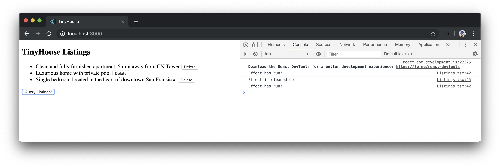

# The useEffect Hook

In the last lesson, we observed how the `useState` Hook helped keep track of the listings data fetched from our query as component state. As a result, we were able to present the listings state data in the UI. We also managed to have the `listings` query be refetched at any time the user deletes a listing.


To be able to query all the listings from the API, we attached a click listener that called our `server.fetch()` function to make the request. In a lot of applications we use day-to-day, queries and the display of data is often made at the moment a page is being rendered. In the context of our `<Listings>` component, we'll want our initial query to be made when the `<Listings>` component is being _rendered for the first time_. To help us achieve this, we'll use another very commonly used React Hook - the [`useEffect` Hook](https://reactjs.org/docs/hooks-effect.html).

## `useEffect`

The [`useEffect` Hook](https://reactjs.org/docs/hooks-effect.html) allows us to perform _side effects_ in our function components. Side effects are essentially anything where we want an "imperative" action to happen. API calls, updating the DOM, subscribing to event listeners - these are all side effects that we might like a component to undergo at different times.

The `useEffect` Hook is sometimes a little harder to grasp than the `useState` Hook so we'll spend some time explaining it in a little more detail.

We'll import the `useEffect` Hook from `react` in the `Listings.tsx` component file:

```tsx
import React, { useState, useEffect } from "react";
```

Just like how we've set up the `useState` Hook at the top level of the `<Listings>` component, we'll do the same for the `useEffect` Hook as well. We'll declare the `useEffect` right after our `useState` Hook.

```tsx
export const Listings = ({ title }: Props) => {
  const [listings, setListings] = useState(null);

  useEffect();

  // ...
};
```

### Callback function

The `useEffect` Hook doesn't return any values but instead takes two arguments. The first being required and the second optional. The first argument is the effect callback function we want the Hook to run (i.e. the effect itself). To get us started, let's place a `console.log()` message within the effect callback.

```tsx
export const Listings = ({ title }: Props) => {
  const [listings, setListings] = useState(null);

  useEffect(() => {
    console.log("Effect has run!");
  });

  // ...
};
```

By default, the effect stated in a `useEffect` Hook runs when the component **first renders** and **after every update**. If we run our application right now, we'll notice the `console.log()` message is generated as our component is rendered. To determine when the component updates, we can hit the `'Query Listings'` button and notice the console message be generated practically every time the component is being updated.


### Dependency list

The second argument of the `useEffect` Hook is optional and is a **dependency list** which allows us to tell React to skip applying the effect only until in certain conditions. In other words, the second argument of the `useEffect` Hook allows us to limit **when the effect is to be run**. If we simply place a blank empty array as the second argument, this is how we tell React to only run the effect on initial render.

```tsx
export const Listings = ({ title }: Props) => {
  const [listings, setListings] = useState(null);

  useEffect(() => {
    console.log("Effect has run!");
  }, []);

  // ...
};
```

If we launched our app, we'll notice the console message only be generated when the component first mounts.


Instead of having our effect run once in the beginning and on every update, we can attempt to restrict the effect to run only in the beginning and when the component updates in a specific fashion. The component simply updating is a broad term - the component can update due when a certain state value changes, when its parent gets rerendered causing children components to re-render as well, etc. With the `useEffect` Hooks dependency list, we can fine-tune to which values the Hook should depend on to run the effect.

In our case, let's say we want to fire off a console message when the component update depends on the `listings` state value getting updated. We'll specify the `listings` value as a dependency in our `useEffect` Hook.

```tsx
export const Listings = ({ title }: Props) => {
  const [listings, setListings] = useState(null);

  useEffect(() => {
    console.log("Effect has run!");
  }, [listings]);

  // ...
};
```

Assume we were to create a new state number property called `count`, initialize it with `0`, and create a click event handler that increments the state `count` property.

```tsx
export const Listings = ({ title }: Props) => {
  const [listings, setListings] = useState(null);
  const [count, setCount] = useState(0);

  useEffect(() => {
    console.log("Effect has run!");
  }, [listings]);

  // ...

  return (
    <div>
      <h2>{title}</h2>
      {listingsList}
      <button onClick={fetchListings}>Query Listings!</button>
      <button onClick={() => setCount(count + 1)}>Increase Count</button>
    </div>
  );
};
```

We'll notice our effect callback _doesn't run_ when the `count` state property changes. It runs on update only when the `listings` value changes.


If we want the effect to run on both change in `listings` and `count`, we can add the count state value to the dependencies list as well.

```tsx
export const Listings = ({ title }: Props) => {
  const [listings, setListings] = useState(null);
  const [count, setCount] = useState(0);

  useEffect(() => {
    console.log("Effect has run!");
  }, [listings, count]);

  // ...
};
```

We'll remove the initialization and use of the `count` state value.

### Effect cleanup

The effect callback gets run every time on initial render and when we've specified when an effect should run. The `useEffect` Hook also provides the ability to run a cleanup after the effect. This can be done by specifying a return function at the end of our effect.

```tsx
export const Listings = ({ title }: Props) => {
  const [listings, setListings] = useState(null);

  useEffect(() => {
    console.log("Effect has run!");

    return () => {
      console.log("Effect is cleaned up!");
    };
  }, [listings]);

  // ...
};
```

If we head to the UI, we can observe when this cleanup is run. Essentially, we can see that the cleanup function is run _before_ running the intended effect the next time. In addition, if our component ever un-mounts - the cleanup function will run as well.



A good example of when we might need a cleanup is when we set up a subscription in our effect but want to remove the subscription whenever the next subscription call is to be made, to avoid memory leaks.

### `useEffect` to fetch listings

We've gathered enough information on the `useEffect` Hook to perform what we intend to achieve. We're interested in fetching the listings from our GraphQL API _the moment_ our component is rendered. We know that we can have an effect only run if we specify an empty array in the dependencies list. In our `<Listings>` component, we'll set up a `useEffect` Hook with an empty dependency list and call the `fetchListings()` function right within our effect callback. The `fetchListings()` function will be responsible for making our query and updating the listings state of our component.

Since we'll be able to render our list on mount, we'll remove the `onClick` handler we had before that allowed us to make our query upon the click of a button.

Our `Listings.tsx` component will now look like the following:

```tsx
import React, { useState, useEffect } from "react";
import { server } from "../../lib/api";
import {
  DeleteListingData,
  DeleteListingVariables,
  Listing,
  ListingsData
} from "./types";

const LISTINGS = `
  query Listings {
    listings {
      id
      title
      image
      address
      price
      numOfGuests
      numOfBeds
      numOfBaths
      rating
    }
  }
`;

const DELETE_LISTING = `
  mutation DeleteListing($id: ID!) {
    deleteListing(id: $id) {
      id
    }
  }
`;

interface Props {
  title: string;
}

export const Listings = ({ title }: Props) => {
  const [listings, setListings] = useState<Listing[] | null>(null);

  useEffect(() => {
    fetchListings();
  }, []);

  const fetchListings = async () => {
    const { data } = await server.fetch<ListingsData>({ query: LISTINGS });
    setListings(data.listings);
  };

  const deleteListing = async (id: string) => {
    await server.fetch<DeleteListingData, DeleteListingVariables>({
      query: DELETE_LISTING,
      variables: {
        id
      }
    });
    fetchListings();
  };

  const listingsList = listings ? (
    <ul>
      {listings.map(listing => {
        return (
          <li key={listing.id}>
            {listing.title}{" "}
            <button onClick={() => deleteListing(listing.id)}>Delete</button>
          </li>
        );
      })}
    </ul>
  ) : null;

  return (
    <div>
      <h2>{title}</h2>
      {listingsList}
    </div>
  );
};
```

Our listings list is now shown the moment our component is rendered!


> As a best practice, [it's recommended to have functions that are used within the `useEffect` Hook to be declared inside of the effect itself](https://reactjs.org/docs/hooks-faq.html#is-it-safe-to-omit-functions-from-the-list-of-dependencies). This is most important when the function used in the effect depends on component props or state (with which the `fetchListings()` function doesn't).
>
> We'll discuss this point further at the end of this lesson and in the next few lessons. For now, we'll keep the instantiation of the `fetchListings()` function outside of the effect since we also use it in the component `deleteListing()` function.

### `useEffect` and missing dependencies

There's one important point we'll make before we close this lesson. If an effect depends on a component value that's prone to change (for example `props` or `state`) and that value is _not defined_ in the effect's dependencies list - this can be a source of bugs.

For example, assume we wanted to run an effect and display a console message when the `listings` state value gets populated or updated.

```tsx
export const Listings = ({ title }: Props) => {
  const [listings, setListings] = useState(null);

  useEffect(() => {
    fetchListings();

    if (listings && listings.length) {
      console.log("Listings Exist!");
    }
  }, []);

  // ...
};
```

In the above case, our VSCode editor will warn us by telling us to either include the missing dependency (`listings`) or remove the dependency array completely.


> The lint warning check comes from the [`react-hooks/exhaustive-deps` ESLint rule](https://github.com/facebook/react/issues/14920) that is introduced with every `create-react-app` generated application.

Why is using a dependency not declared in the dependencies list of the `useEffect` an issue? Because by not specifying a dependency that's being used in the effect, we risk our effect function potentially depending on stale values from previous renders. It's hard to pinpoint when something like this can happen but if it does, it could lead to some difficult to change bugs. This is also a reason why React recommends the moving of all functions that are used in the Hook within the Hook itself, to help better survey the dependencies that function may depend on.

> Each render cycle of a React component has its own version of `props` and `state`. Effects always observe the `props` and `state` from the render they were defined in. By declaring all the dependencies that are to be used in an effect within the dependencies list, we ensure that an effect is re-run when a change in dependency is made and the effect can reference the new updated dependency value.
>
> Dan Abramov (of the React core team) has a fantastic blog post labeled [A Complete Guide to useEffect](https://overreacted.io/a-complete-guide-to-useeffect/) where he discusses this topic in detail.
