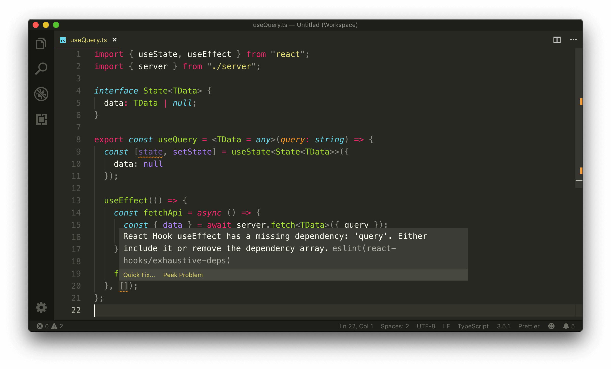
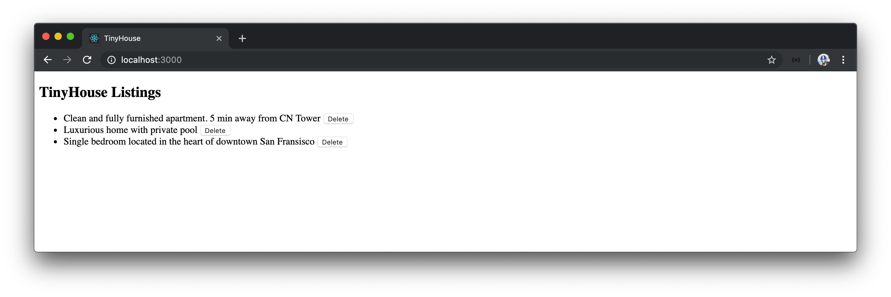

# Custom useQuery Hook

React's `useEffect` Hook helped us achieve the desired result of displaying listings information the moment our `<Listings>` component mounts.

The pattern of creating a state property, using the `useEffect` Hook, and running the `server.fetch()` function to make our query on mount will be replicated for every component that might want to fetch data the moment the component mounts. We can create a custom Hook that will help consolidate this pattern for all components.

[Custom Hooks](https://reactjs.org/docs/hooks-custom.html) in React allows us to share logic between components and with best practice should have the `use` keyword in its name. Custom Hooks can also call other Hooks as well!

#### Gameplan

Let's walk through how we'll want our custom Hook to behave. We'll label this Hook the `useQuery` Hook and we'll look to declare it at the top level of a component like so:

```tsx
export const Listings = ({ title }: Props) => {
  useQuery();
};
```

Since the query of our application doesn't have any variables, our `useQuery` Hook will accept a single argument here - the GraphQL query that we'd want to make.

```tsx
export const Listings = ({ title }: Props) => {
  useQuery(LISTINGS);
};
```

The Hook will return an object, where we'll be able to destruct the data from and use in our component:

```tsx
export const Listings = ({ title }: Props) => {
  const { data } = useQuery(LISTINGS);
};
```

Just like we've done already, we'll make our Hook accept a type variable to help type define the data being returned:

```tsx
export const Listings = ({ title }: Props) => {
  const { data } = useQuery<ListingsData>(LISTINGS);
};
```

That would be all a component will need to do. The Hook will take care of tracking a state property, how the `server.fetch()` function is called and when it should be called (i.e when the component mounts).

### `useQuery` Hook

Now with an idea of what we intend to do, we'll create this Hook in a file named `useQuery.ts` that is to be kept in the existing `src/lib/api/` folder.

```shell
src/
  lib/
    api/
      index.ts
      server.ts
      useQuery.ts
  // ...
```

In the `useQuery.ts` file, we'll export a function constant called `useQuery` that accepts a type variable labeled `TData` which we'll give a default value of `any`. The function itself will accept a `query` parameter argument of type `string`.

```typescript
export const useQuery = <TData = any>(query: string) => {};
```

#### `useState`

We've used the `useState` Hook before to maintain the query data kept in the component for it to be presented in the UI. We'll use the `useState` Hook similarly to keep track of the data to be returned from the query for us to then return at the end of our Hook.

We'll also use the `useEffect` Hook to help run the effect of making the API call when a component is rendered.

Let's import the `useState` and `useEffect` Hooks from React.

```typescript
import { useState, useEffect } from "react";

export const useQuery = <TData = any>(query: string) => {};
```

At the beginning of our custom Hook, we'll look to use the `useState` Hook to create a state object that will contain the data from our API call. Before we initialize this state property, we'll describe the shape that it expects to have in an interface called `State`.

```typescript
import { useState, useEffect } from "react";

interface State {}

export const useQuery = <TData = any>(query: string) => {};
```

The `State` interface will contain the `data` object that will be returned from our API call. The shape of `data` will be from a type variable the interface will accept and be passed from the `useQuery` Hook function. We'll label the type variable the `State` interface is to accept as `TData` as well.

```typescript
import { useState, useEffect } from "react";

interface State<TData> {
  data: TData;
}

export const useQuery = <TData = any>(query: string) => {};
```

The shape of `data` will only be what the `TData` type variable is _after_ our API call has been made complete. Therefore we'll state that `data` is a union type such that data can also be `null` (which will be the time before the API call has been made).

```typescript
import { useState, useEffect } from "react";

interface State<TData> {
  data: TData | null;
}

export const useQuery = <TData = any>(query: string) => {};
```

With the shape of state in mind, let's use the `useState` Hook and initialize this state object. We'll label the state property `state` and the function setter as `setState`. We'll pass in the `State` interface as the expected type variable of the `useState` Hook, and we'll initialize our state `data` object as `null`.

```typescript
import { useState, useEffect } from "react";

interface State<TData> {
  data: TData | null;
}

export const useQuery = <TData = any>(query: string) => {
  const [state, setState] = useState<State<TData>>({
    data: null
  });
};
```

#### `useEffect`

To make our API call, we'll use the `server.fetch()` function we've already created. As a result, we'll import the `server` object in our `useQuery.ts` file from the `src/lib/api/server.ts` file.

```typescript
import { useState, useEffect } from "react";
import { server } from "./server";

interface State<TData> {
  data: TData | null;
}

export const useQuery = <TData = any>(query: string) => {
  const [state, setState] = useState<State<TData>>({
    data: null
  });
};
```

We'll now construct the `server.fetch()` function and specify we'd want it to run in a `useEffect` Hook. We'll follow the [recommended pattern of having functions used in an effect declared within the effect callback](https://reactjs.org/docs/hooks-faq.html#is-it-safe-to-omit-functions-from-the-list-of-dependencies).

We'll set up the `useEffect` Hook, and define an asynchronous function within the effect callback that we'll label `fetchApi()`.

```typescript
import { useState, useEffect } from "react";
import { server } from "./server";

interface State<TData> {
  data: TData | null;
}

export const useQuery = <TData = any>(query: string) => {
  const [state, setState] = useState<State<TData>>({
    data: null
  });

  useEffect(() => {
    const fetchApi = async () => {};
  });
};
```

The `fetchApi()` function will be responsible for making the API request by running the `server.fetch()` function. As we run `server.fetch()`, we'll pass in the `query` payload it expects and a type variable of the data that is to be returned. We'll retrieve the data from the request and update the `state` property created in our Hook.

```typescript
import { useState, useEffect } from "react";
import { server } from "./server";

interface State<TData> {
  data: TData | null;
}

export const useQuery = <TData = any>(query: string) => {
  const [state, setState] = useState<State<TData>>({
    data: null
  });

  useEffect(() => {
    const fetchApi = async () => {
      const { data } = await server.fetch<TData>({ query });
      setState({ data });
    };
  });
};
```

> When we update state, we're updating _an object_ that contains the `data` object.

With the `fetchApi()` function declared, we want to run this function only when a component first mounts. We'll achieve this by running the function in the effect callback and specifying an empty array in the effect's dependencies list.

```typescript
import { useState, useEffect } from "react";
import { server } from "./server";

interface State<TData> {
  data: TData | null;
}

export const useQuery = <TData = any>(query: string) => {
  const [state, setState] = useState<State<TData>>({
    data: null
  });

  useEffect(() => {
    const fetchApi = async () => {
      const { data } = await server.fetch<TData>({ query });
      setState({ data });
    };

    fetchApi();
  }, []);
};
```

We'll notice an ESLint warning be shown in the dependencies list of our `useEffect` Hook.



The `react-Hooks/exhaustive-deps` rule asks us to pass in the `query` value to the dependencies list or remove the dependencies list entirely. This is because `query` is being passed from elsewhere, and as a result, the `useEffect` Hook wants to make sure that we don't reference a stale value if our effect was to run again.

In this instance, we'll include the `query` dependency.

```typescript
import { useState, useEffect } from "react";
import { server } from "./server";

interface State<TData> {
  data: TData | null;
}

export const useQuery = <TData = any>(query: string) => {
  const [state, setState] = useState<State<TData>>({
    data: null
  });

  useEffect(() => {
    const fetchApi = async () => {
      const { data } = await server.fetch<TData>({ query });
      setState({ data });
    };

    fetchApi();
  }, [query]);
};
```

This is because we don't expect our `useEffect` Hook to run after initial mount since **we don't picture the `query` constant to ever change**. If we take a look at the `Listings.tsx` component, we'll be able to see the `LISTINGS` query document that we'll pass to our Hook be declared _outside_ of the `<Listings>` component.

```tsx
// ...

const LISTINGS = `
  query Listings {
    listings {
      id
      title
      image
      address
      price
      numOfGuests
      numOfBeds
      numOfBaths
      rating
    }
  }
`;

// ...

export const Listings = ({ title }: Props) => {
  const { data } = useQuery<ListingsData>(LISTINGS);
};
```

The `useQuery` Hook isn't smart enough to recognize that the `query` parameter value is to be a constant value declared outside of the component. Even if the `<Listings>` component gets re-rendered on change, we'll still be referencing the same `LISTINGS` constant value. As a recommended approach mentioned by Dan Abramov - [if a dependency (function or non-function value) is truly constant, there's no harm in placing it as part of the dependencies list of an effect](https://github.com/facebook/react/issues/14920#issuecomment-471070149).

At the end of the `useQuery` Hook, we'll now simply return the `state` object. Our `useQuery` Hook in its complete state will look like the following:

```typescript
import { useState, useEffect } from "react";
import { server } from "./server";

interface State<TData> {
  data: TData | null;
}

export const useQuery = <TData = any>(query: string) => {
  const [state, setState] = useState<State<TData>>({
    data: null
  });

  useEffect(() => {
    const fetchApi = async () => {
      const { data } = await server.fetch<TData>({ query });
      setState({ data });
    };

    fetchApi();
  }, [query]);

  return state;
};
```

We'll re-export the `useQuery` Hook from the `src/lib/api/index.ts` file.

```typescript
export * from "./server";
export * from "./useQuery";
```

Our `<Listings>` component can now import and use the `useQuery` Hook. In the `Listings.tsx` component file, we'll import the `useQuery` Hook and remove the `listings` state declaration, the `useEffect` Hook, and the `fetchListings` function from the component.

The `<Listings>` component `deleteListing()` function depends on calling `fetchListings()` again, so we'll remove that line from the function for now and come back to how we attempt to make refetch happen in the next lesson.

Finally, we'll declare the `useQuery` Hook at the top of our `<Listings>` component and pass in the `LISTINGS` query we want to make. We'll specify the type of the data we want and we'll use a ternary statement to retrieve the `listings` data that we're looking for, from what the `useQuery` Hook returns.

With all the changes made, the `Listings.tsx` component file will look as follows:

```tsx
import React from "react";
import { server, useQuery } from "../../lib/api";
import { DeleteListingData, DeleteListingVariables, ListingsData } from "./types";

const LISTINGS = `
  query Listings {
    listings {
      id
      title
      image
      address
      price
      numOfGuests
      numOfBeds
      numOfBaths
      rating
    }
  }
`;

const DELETE_LISTING = `
  mutation DeleteListing($id: ID!) {
    deleteListing(id: $id) {
      id
    }
  }
`;

interface Props {
  title: string;
}

export const Listings = ({ title }: Props) => {
  const { data } = useQuery<ListingsData>(LISTINGS);

  const deleteListing = async (id: string) => {
    await server.fetch<DeleteListingData, DeleteListingVariables>({
      query: DELETE_LISTING,
      variables: {
        id
      }
    });
  };

  const listings = data ? data.listings : null;

  const listingsList = listings ? (
    <ul>
      {listings.map(listing => {
        return (
          <li key={listing.id}>
            {listing.title}{" "}
            <button onClick={() => deleteListing(listing.id)}>Delete</button>
          </li>
        );
      })}
    </ul>
  ) : null;

  return (
    <div>
      <h2>{title}</h2>
      {listingsList}
    </div>
  );
};
```

We'll now verify that our query works as intended. We'll start both the Node server and React client applications.

```shell
server $: npm run start
```

```shell
client $: npm run start
```

When we load our React app, we can see that our `useQuery` Hook does as intended. It makes the request and updates the component state the moment our component is mounted! Great!



The `useQuery` Hook is a great example of how components can share logic between one another which makes components more concise and easier to read. The `<Listings>` component is pretty much unaware of what the `useQuery` Hook does. All the `<Listings>` component needs to do is use the Hook at the beginning of the component and get the data it needs. If any other component needs to make a query upon initial mount, it can follow the same approach done in `<Listings>`.

With that said, there are some limitations to what we've set up. We've removed the capability to refetch our query when a change has been made which requires us to refresh the page to get an updated UI, when a listing has been deleted. In the next lesson, we'll see how we can introduce the refetch capability as part of the `useQuery` Hook.
