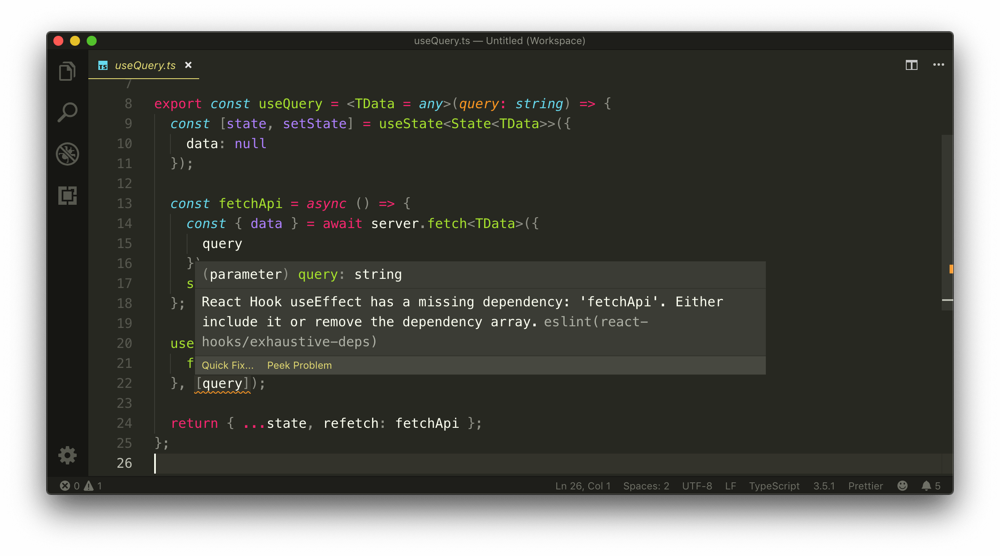
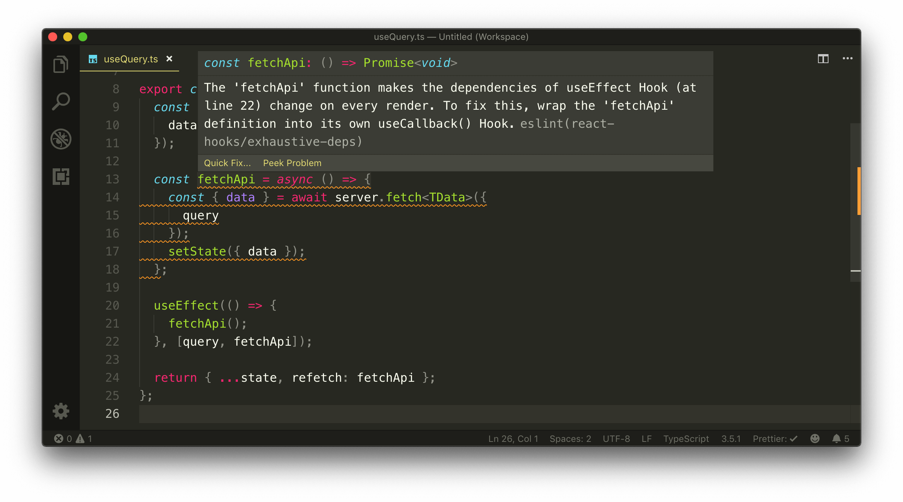
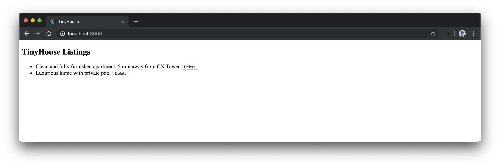

# Custom useQuery and refetch

Our custom `useQuery` Hook made our `<Listings>` component simpler and provided the opportunity to have the shared piece of functionality of querying and updating state with other components as well.

In this lesson, we'll address how we'd like a query refetch be made when the `deleteListing` mutation is fired. We'll have our `useQuery` Hook prepared to allow for a component to trigger a refetch.

### Gameplan

There might be a few ways we can think about solving this but a simple way we'd like to go with is we can perhaps destruct the `fetchApi()` function from our `useQuery` Hook and have it labeled as `refetch()`. If we ever intend to refetch the query stated in the Hook, we can simply run this function directly in our component.

```tsx
export const Listings = ({ title }: Props) => {
  const { data, refetch } = useQuery<ListingsData>(LISTINGS);

  const deleteListing = async (id: string) => {
    // ...
    refetch();
  };

  // ...
};
```

### `refetch()`

The `fetchApi()` function in our `useQuery` Hook is the function we'll want to run again if we needed to refetch query information and update state. In the `useQuery.ts` file, we'll restructure how our Hook is set up to have the `fetchApi()` function be returned from the Hook. To do so, we'll need to declare the `fetchApi()` function _outside_ of the effect callback.

```typescript
import { useState, useEffect } from "react";
import { server } from "./server";

interface State<TData> {
  data: TData | null;
}

export const useQuery = <TData = any>(query: string) => {
  const [state, setState] = useState<State<TData>>({
    data: null
  });

  const fetchApi = async () => {
    const { data } = await server.fetch<TData>({
      query
    });
    setState({ data });
  };

  useEffect(() => {
    fetchApi();
  }, [query]);

  return { ...state, refetch: fetchApi };
};
```

In the `return` statement of our `useQuery` Hook, we return an object that contains all the properties within state by using the [JavaScript spread syntax](https://developer.mozilla.org/en-US/docs/Web/JavaScript/Reference/Operators/Spread_syntax) to expand the properties of state in the new object. We've also introduced a new property called `refetch` that has the value of the `fetchApi()` function.

ESLint will display a warning in the `useEffect` dependencies list stating that the `useEffect` Hook is missing the dependency - `fetchApi`.



If we attempt to place `fetchApi` has a dependency to the `useEffect` Hook, we'll get another ESLint warning telling us the `fetchApi` dependency will make the dependencies of `useEffect` run on _every render_ which is not what we want.



This is where we can follow the suggestion given to us from the `react-hooks/exhaustive-deps` ESLint rule to wrap the `fetchApi()` function within a [`useCallback` Hook](https://reactjs.org/docs/hooks-reference.html#usecallback).

#### `useCallback()`

We'll import the [`useCallback` Hook](https://reactjs.org/docs/hooks-reference.html#usecallback) in our `useQuery.ts` file.

```typescript
import { useState, useEffect, useCallback } from "react";
```

The [`useCallback` Hook](https://reactjs.org/docs/hooks-reference.html#usecallback) appears similar to the `useEffect` Hook and receives a callback function as the first argument and a dependency list in the second argument.

```typescript
import { useState, useEffect } from "react";
import { server } from "./server";

interface State<TData> {
  data: TData | null;
}

export const useQuery = <TData = any>(query: string) => {
  const [state, setState] = useState<State<TData>>({
    data: null
  });

  useCallback(() => {}, []);

  // ...
};
```

The `useCallback` Hook returns a _memoized_ version of the callback being passed in. Memoization is a technique geared towards improving performance by storing the results of function calls and returning the cached result when the same inquiry for the function is made again.

In the instance of having the `useCallback` Hook within our `useQuery` Hook, we can ensure that the callback function won't run unless the dependencies specified in the `useCallback` Hook is changed.

In the `useCallback` Hook, we'll declare the `fetchApi()` function within and run the function just like we've done in the `useEffect` Hook. We'll also specify `query` as a dependency of `useCallback`.

```typescript
import { useState, useEffect } from "react";
import { server } from "./server";

interface State<TData> {
  data: TData | null;
}

export const useQuery = <TData = any>(query: string) => {
  const [state, setState] = useState<State<TData>>({
    data: null
  });

  useCallback(() => {
    const fetchApi = async () => {
      const { data } = await server.fetch<TData>({
        query
      });
      setState({ data });
    };

    fetchApi();
  }, [query]);

  // ...
};
```

We can assign the memoized callback returned from `useCallback` to a `const` variable we can simply call `fetch`.

```typescript
import { useState, useEffect } from "react";
import { server } from "./server";

interface State<TData> {
  data: TData | null;
}

export const useQuery = <TData = any>(query: string) => {
  const [state, setState] = useState<State<TData>>({
    data: null
  });

  const fetch = useCallback(() => {
    const fetchApi = async () => {
      const { data } = await server.fetch<TData>({
        query
      });
      setState({ data });
    };

    fetchApi();
  }, [query]);

  // ...
};
```

We can finally run the memoized `fetch()` function in the `useEffect` Hook. We'll also specify the `fetch()` function as a dependency to the `useEffect` Hook.

In our `useQuery` return statement, we'll return an object that contains the properties of `state`. In the returned object, we'll return a `refetch` property that has the value of the `fetch()` function.

This will have our `useQuery` Hook look like the following:

```typescript
import { useState, useEffect, useCallback } from "react";
import { server } from "./server";

interface State<TData> {
  data: TData | null;
}

export const useQuery = <TData = any>(query: string) => {
  const [state, setState] = useState<State<TData>>({
    data: null
  });

  const fetch = useCallback(() => {
    const fetchApi = async () => {
      const { data } = await server.fetch<TData>({
        query
      });
      setState({ data });
    };

    fetchApi();
  }, [query]);

  useEffect(() => {
    fetch();
  }, [fetch]);

  return { ...state, refetch: fetch };
};
```

### `useEffect` and `useCallback`

What we've introduced might appear a little confusing so we'll summarize what we've just done.

We've used the `useEffect` Hook to attempt to run our `server.fetch()` function when a component mounts for the first time.

```typescript
export const useQuery = <TData = any>(query: string) => {
  // ...

  useEffect(() => {
    const fetchApi = async () => {
      const { data } = await server.fetch<TData>({ query });
      setState({ data });
    };

    fetchApi();
  }, []);

  // ...
};
```

Our `useEffect` Hook depends on the `query` parameter with which it expects us to define in the dependencies list to avoid any potential issues. Since `query` is to be a static constant referenced outside of the component, we can specify it in the dependencies list of the `useEffect` Hook with no issues.

```typescript
export const useQuery = <TData = any>(query: string) => {
  // ...

  useEffect(() => {
    const fetchApi = async () => {
      const { data } = await server.fetch<TData>({ query });
      setState({ data });
    };

    fetchApi();
  }, [query]);

  // ...
};
```

We, however, wanted to have the `fetchApi()` function extractable from the Hook itself, and as a result needed to declare `fetchApi()` _outside_ of the `useEffect` Hook.

```typescript
export const useQuery = <TData = any>(query: string) => {
  // ...

  const fetchApi = async () => {
    const { data } = await server.fetch<TData>({ query });
    setState({ data });
  };

  useEffect(() => {
    fetchApi();
  }, [query]); // ESLint warning - fetchApi is a missing dependency

  // ...
};
```

The `useEffect` Hook wants to ensure we're not doing something incorrectly and asks if we can specify the `fetchApi()` function as a dependency or wrap it within a `useCallback` Hook. We're not sure how the `fetchApi()` function will behave as the component gets updated and we only want `fetchApi()` to run on initial mount, so we instead use the `useCallback` Hook to _memoise_ our callback function to never change unless the `query` parameter changes, which is unlikely to.

```typescript
export const useQuery = <TData = any>(query: string) => {
  // ...

  const fetch = useCallback(() => {
    const fetchApi = async () => {
      const { data } = await server.fetch<TData>({
        query
      });
      setState({ data });
    };

    fetchApi();
  }, [query]);

  useEffect(() => {
    fetch();
  }, [fetch]);

  // ...
};
```

With what we've just done, we've been able to return a `refetch` property from our `useQuery` Hook that will allow components to _refetch_ a query.

### Listings and `refetch()`

In the `<Listings>` component, we'll destruct the `refetch()` function from our Hook, and run it after our `deleteListing` mutation is complete.

Our `<Listings>` component will look like the following:

```tsx
export const Listings = ({ title }: Props) => {
  const { data, refetch } = useQuery<ListingsData>(LISTINGS);

  const deleteListing = async (id: string) => {
    await server.fetch<DeleteListingData, DeleteListingVariables>({
      query: DELETE_LISTING,
      variables: {
        id
      }
    });

    refetch();
  };

  const listings = data ? data.listings : null;

  const listingsList = listings ? (
    <ul>
      {listings.map(listing => {
        return (
          <li key={listing.id}>
            {listing.title}{" "}
            <button onClick={() => deleteListing(listing.id)}>Delete</button>
          </li>
        );
      })}
```

We'll start our Node server and React client apps.

```shell
server $: npm run start
```

```shell
client $: npm run start
```

And when we now delete a listing, our `listings` query is refetched and our UI is updated!



Amazing! Our `useQuery` Hook behaves as we want it to! The only other things we'll like to consider for our `useQuery` Hook is the ability to handle loading and errors, which is something that we haven't thought about yet but is pretty important!

> Our `listings` GraphQL query doesn't depend on variables but we can very well have passed in variables to our Hook to consume if needed. However, we'll have to be careful here since if our component ever re-renders, a new variables object will be passed into our Hook if variables are defined in the component (unlike the query document). If we were to do this, we may need to take additional steps to perhaps memoize the variables being passed as well. This is where a [`useRef` Hook](https://reactjs.org/docs/hooks-reference.html#useref) may need to be used.
