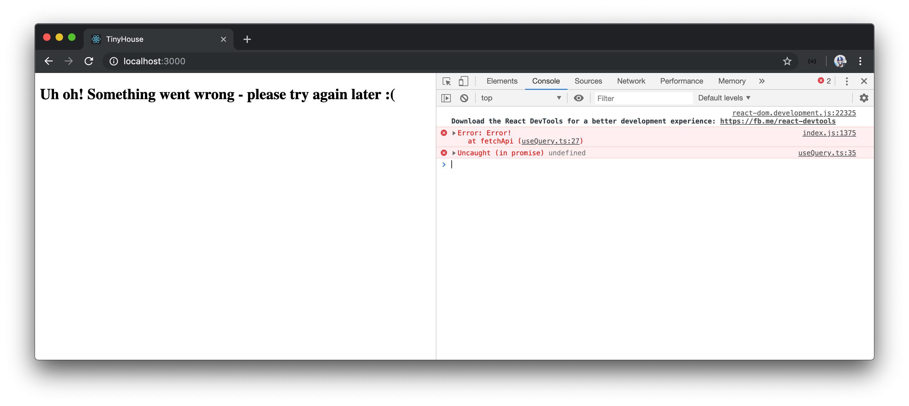

# Custom useQuery and loading/error states

Though our `useQuery` Hook works as intended, we haven't taken into account the tracking of the loading and error states of our queries.

### Loading

We'll first address the loading state of our request. When we say loading, we're essentially referring to being able to track the status of our asynchronous request. If the request is in flight, the UI should reflect this with a loading indicator of sorts. And when complete, we should be presented with the expected data.

To keep track of loading, we'll introduce a new loading field into the `State` interface of the state object tracked in our custom `useQuery` Hook. We'll declare the type of the `loading` field as `boolean`.

```typescript
interface State<TData> {
  data: TData | null;
  loading: boolean;
}
```

We'll initialize the `loading` value as `false` in our state initialization.

```typescript
export const useQuery = <TData = any>(query: string) => {
  const [state, setState] = useState<State<TData>>({
    data: null,
    loading: false
  });

  // ...
};
```

At the beginning of the `fetchApi()` method within the memoized `fetch` callback, we'll set the `loading` state to `true` while also specifying that our state `data` is still `null`. When a request is complete we'll set `loading` back to `false`.

```typescript
export const useQuery = <TData = any>(query: string) => {
  const [state, setState] = useState<State<TData>>({
    data: null,
    loading: false
  });

  const fetch = useCallback(() => {
    const fetchApi = async () => {
      setState({ data: null, loading: true });

      const { data } = await server.fetch<TData>({
        query
      });

      setState({ data, loading: false });
    };

    fetchApi();
  }, [query]);

  // ...
};
```

We've already used the spread syntax to return everything within `state` at the end of `useQuery`. We can now destruct the `loading` property from the `useQuery` Hook used in the `<Listings>` component.

If `loading` is ever `true` in our `<Listings>` component, we'll render a simple header tag that says `'Loading...'`. When `loading` is set back to false, the title and the listings list is to be shown.

```tsx
export const Listings = ({ title }: Props) => {
  const { data, loading, refetch } = useQuery<ListingsData>(LISTINGS);

  // ...

  if (loading) {
    return <h2>Loading...</h2>;
  }

  return (
    <div>
      <h2>{title}</h2>
      {listingsList}
    </div>
  );
};
```

We'll ensure both the Node server and React client apps are running.

```shell
server $: npm run start
```

```shell
client $: npm run start
```

And in the browser, we'll now notice a brief `'Loading...'` message when the query request is in flight.


### Errors

We'll now address what would happen if our `server.fetch()` function was to error out since our `<Listings>` component isn't currently prepared to handle this.

With Apollo Server and GraphQL, errors can be a little unique. Oftentimes when a query has failed and returns an error - our server may treat that query as _successful_ since the query request was made successfully.

Let's see an example of this. We'll briefly dive back into out Node server application and take a look at the `listings` resolver function within the `server/src/graphql/resolvers/Listing/index.ts` file.

```typescript
export const listingResolvers: IResolvers = {
  Query: {
    listings: async (
      _root: undefined,
      _args: {},
      { db }: { db: Database }
    ): Promise<Listing[]> => {
      return await db.listings.find({}).toArray();
    }
  }
  // ...
};
```

The `listings` resolver simply returns all the listing documents from the database collection we've set up in MongoDB Atlas. We'll temporarily throw an error before the `return` statement of the resolver function to mimic if an error was to occur.

```typescript
export const listingResolvers: IResolvers = {
  Query: {
    listings: async (
      _root: undefined,
      _args: {},
      { db }: { db: Database }
    ): Promise<Listing[]> => {
      throw new Error("Error!");
      return await db.listings.find({}).toArray();
    }
  }
  // ...
};
```

We can refresh our browser to attempt to query the `listings` field again. We're not going to get the information we're expected from the API but if we take a look at our browser's `Network` tab and find the post API request made, we can see that the request made to `/api` was successful with status code 200!


If we take a look at the response from the API request, whether through the browser `Network` tab or GraphQL Playground, we can see the server returns `data` as null and an `errors` array is populated.


When an error is thrown in Apollo Server, the error gets populated inside the `errors` array that contains information about the errors added by Apollo Server. This complies with the [GraphQL specification](https://graphql.github.io/graphql-spec/June2018/#sec-Errors-and-Non-Nullability) - if an error is thrown, the field should return data of `null` while the error is to be added to the `errors` field of the response.

On this note, we should specify that the response from the server can return an `errors` field along with a `data` field.

The `errors` field from our server is an array where each item has a few different properties to display different information (`message`, `extensions`, `locations`, etc). In the `src/lib/api/server.ts` file, we'll create an interface for what an error would look like when returned from the server. We'll create an `Error` interface and keep things simple by stating `message` as the only property we intend to access from an error.

```typescript
interface Error {
  message: string;
}
```

In our return statement from the `server.fetch()` function, we'll state in our type assertion that the returned object will contain an `errors` field of type `Error[]`.

```typescript
export const server = {
  fetch: async <TData = any, TVariables = any>(body: Body<TVariables>) => {
    const res = await fetch("/api", {
      method: "POST",
      headers: {
        "Content-Type": "application/json"
      },
      body: JSON.stringify(body)
    });

    return res.json() as Promise<{
      data: TData;
      errors: Error[];
    }>;
  }
};
```

To be on the safe side, we should also guard for when the `server.fetch()` function fails with an error status code. In this case, the GraphQL request won't even be made since the actual fetch request will fail.

The [window `fetch()` function provides an `ok` property](https://developer.mozilla.org/en-US/docs/Web/API/Response/ok) within the response which can be used to determine if the response was successful (i.e. the response status is in the range `200` - `299`).

We'll use the `res.ok` field to check if the response status code is ever not `200`. If the response code is an error code, we'll throw an error stating `'failed to fetch from server'`.

The `server.ts` file will now look like the following:

```typescript
interface Body<TVariables> {
  query: string;
  variables?: TVariables;
}

interface Error {
  message: string;
}

export const server = {
  fetch: async <TData = any, TVariables = any>(body: Body<TVariables>) => {
    const res = await fetch("/api", {
      method: "POST",
      headers: {
        "Content-Type": "application/json"
      },
      body: JSON.stringify(body)
    });

    if (!res.ok) {
      throw new Error("failed to fetch from server");
    }

    return res.json() as Promise<{ data: TData; errors: Error[] }>;
  }
};
```

> The `res.ok` check is used to check for if the server response ever returns a status that is not successful. The returned `errors` field from our response is when a request is successfully made but our GraphQL API returns an error within the `errors` field.

We'll now head back to our `useQuery` Hook and handle if the `server.fetch()` function is to ever throw or return an error. We won't look to pass error messages or information from our `server.fetch()` function to our React components. The `useQuery` Hook will simply return an `error` boolean with which our components will retrieve and handle.

First, we'll introduce a new field to our `State` interface with the label of `error` and a type value of `boolean`.

```typescript
interface State<TData> {
  data: TData | null;
  loading: boolean;
  error: boolean;
}
```

We'll initialize our `error` state property with a value of `false`.

```typescript
export const useQuery = <TData = any>(query: string) => {
  const [state, setState] = useState<State<TData>>({
    data: null,
    loading: false,
    error: false
  });

  // ...
};
```

To help catch errors thrown from our `server.fetch()` function, we'll wrap the content of our `fetchApi()` function in the `fetch` callback within a `try`/`catch` statement. If a request error is thrown within our `server.fetch()` function, the `catch` block of our `fetchApi()` method will run and we'll simply set our state by having `data` be set to `null`, `loading` to `false`, and the `error` field to `true`.

We'll also ensure the `error` properties are set to `false` in the `setState()` functions within our `try` block.

```typescript
export const useQuery = <TData = any>(query: string) => {
  const [state, setState] = useState<State<TData>>({
    data: null,
    loading: false
  });

  const fetch = useCallback(() => {
    const fetchApi = async () => {
      try {
        setState({
          data: null,
          loading: true,
          error: false
        });

        const { data } = await server.fetch<TData>({
          query
        });

        setState({ data, loading: false, error: false });
      } catch {
        setState({
          data: null,
          loading: false,
          error: true
        });
      }
    };

    fetchApi();
  }, [query]);

  // ...
};
```

If an error is thrown from our `server.fetch()` function and caught in our `fetchApi()` function, we'll like to surface this error in our browser console. We'll use the [`console.error()`](https://developer.mozilla.org/en-US/docs/Web/API/Console/error) function to do so and place the `console.error()` in a `throw` statement to prevent any further execution of our code.

```typescript
export const useQuery = <TData = any>(query: string) => {
  const [state, setState] = useState<State<TData>>({
    data: null,
    loading: false
  });

  const fetch = useCallback(() => {
    const fetchApi = async () => {
      try {
        setState({
          data: null,
          loading: true,
          error: false
        });

        const { data } = await server.fetch<TData>({
          query
        });

        setState({ data, loading: false, error: false });
      } catch (err) {
        setState({
          data: null,
          loading: false,
          error: true
        });
        throw console.error(err);
      }
    };

    fetchApi();
  }, [query]);

  // ...
};
```

Now if our `server.fetch()` completely errors out and returns an error status code, the error will be surfaced in our browser console when we attempt to query `listings`!


The remaining thing we need to consider is if the `server.fetch()` function is successful (i.e. status code `200`) but the resolver in our GraphQL API returns an error in the `errors` field of the response. This is where we'll destruct the `errors` field from the response of the `server.fetch()` function in our `useQuery` Hook. We'll check to see if the `errors` array is populated, and if it is, we'll throw an error so the `catch` statement can run and set the error message to the browser console.

Our `useQuery` Hook in the complete state will appear as follows:

```typescript
export const useQuery = <TData = any>(query: string) => {
  const [state, setState] = useState<State<TData>>({
    data: null,
    loading: false,
    error: false
  });

  const fetch = useCallback(() => {
    const fetchApi = async () => {
      try {
        setState({ data: null, loading: true, error: false });

        const { data, errors } = await server.fetch<TData>({
          query
        });

        if (errors && errors.length) {
          throw new Error(errors[0].message);
        }

        setState({ data, loading: false, error: false });
      } catch (err) {
        setState({ data: null, loading: false, error: true });
        throw console.error(err);
      }
    };

    fetchApi();
  }, [query]);

  useEffect(() => {
    fetch();
  }, [fetch]);

  return { ...state, refetch: fetch };
};
```

> We're only capturing and logging the first `error` message we can find in the `errors` array from our response. For a more robust solution, one can look to capture and log all the errors that different field resolvers may throw within the `errors` array.

We'll now appropriately log a GraphQL error that exists in the `errors` array of our server request. By still having the thrown error in the `listings` resolver, we'll be able to see this error when we try to query listings in our browser.


Though errors are being appropriately captured now, we should surface and display something to the UI when this happens. In our `<Listings>` component, we'll destruct the `error` field from the returned statement of the `useQuery` Hook.

If the `error` property from the `useQuery` Hook is ever `true`, we'll have our `<Listings>` component simply render a header message that says something went wrong.

```tsx
export const Listings = ({ title }: Props) => {
  const { data, loading, error, refetch } = useQuery<ListingsData>(LISTINGS);

  // ...

  if (error) {
    return <h2>Uh oh! Something went wrong - please try again later :(</h2>;
  }

  return (
    <div>
      <h2>{title}</h2>
      {listingsList}
    </div>
  );
};
```

The entire `<Listings>` component will look as follows:

```tsx
export const Listings = ({ title }: Props) => {
  const { data, loading, error, refetch } = useQuery<ListingsData>(LISTINGS);

  const deleteListing = async (id: string) => {
    await server.fetch<DeleteListingData, DeleteListingVariables>({
      query: DELETE_LISTING,
      variables: {
        id
      }
    });

    refetch();
  };

  const listings = data ? data.listings : null;

  const listingsList = listings ? (
    <ul>
      {listings.map(listing => {
        return (
          <li key={listing.id}>
            {listing.title}{" "}
            <button onClick={() => deleteListing(listing.id)}>Delete</button>
          </li>
        );
      })}
```

Now, if our `server.fetch()` function ever errors out with an error status code or returns errors within an `errors` field from the request, our `useQuery` Hook will return a truthy `error` value.

At this moment, our `listings` resolver in the backend code throws an error. When we attempt to make our query in the React application, we'll be displayed with the error message in our UI! If our server was unavailable, we'll also surface the same error message in the UI as well.



We'll remove the temporary thrown error message in our `listings` resolver function in the server code.

And that's it! Albeit being pretty simple, our `useQuery` Hook does everything it's intended to do for now. In our component, we can notice we're still making a direct `server.fetch()` function when we intend to run the `deleteListing` mutation. In the next lesson, we'll try and see how to have the execution of mutations grouped within a custom `useMutation` Hook.

> There are situations where a partial response and error can be returned from a GraphQL request, where one field from the request is successful, and another field in the request errors. (e.g. the `id` field in the `Listing` object type resolves successfully, but the `title` field in `Listing` object type errors).
>
> In this situation, our GraphQL response _may_ contain both data within the `data` field and errors in the `errors` field. In our application, we've resorted to simply displaying an error message in the UI as long as the `errors` array is populated.
