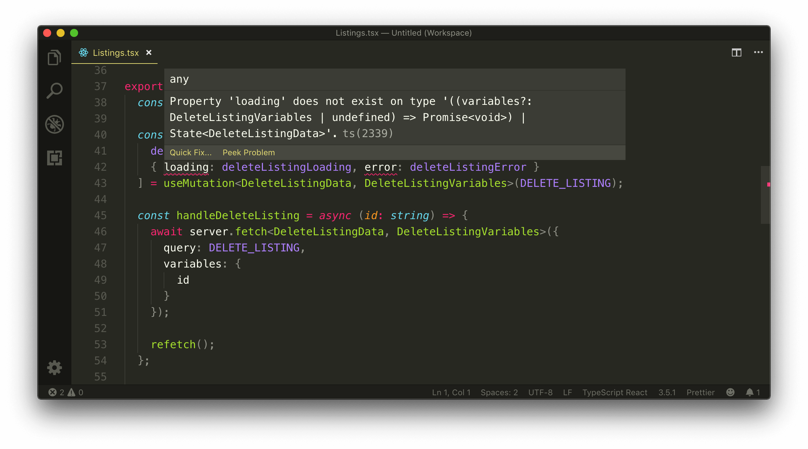
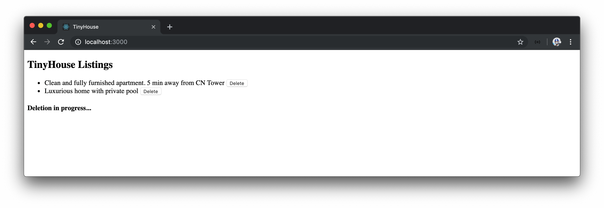
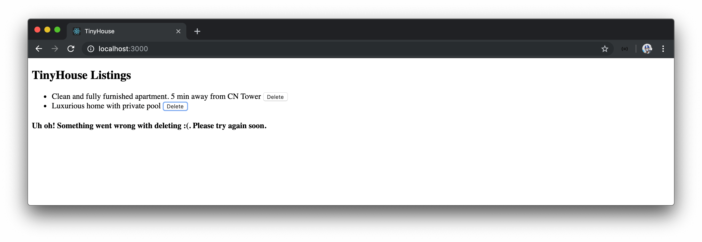

# Custom useMutation Hook

We've created a `useQuery` Hook to help make a GraphQL query request when a component first mounts. In this lesson, we'll look to create a `useMutation` Hook that helps prepare a function to make an API mutation request.

### Gameplan

Our `useMutation` Hook will behave differently since we won't want a mutation to run the moment a component mounts by default. Our `useMutation` Hook will simply receive the mutation query document to be made.

```tsx
export const Listings = ({ title }: Props) => {
  useMutation<DeleteListingData, DeleteListingVariables>(DELETE_LISTING);

  // ...
};
```

And return an array of two values - the first being the request function and the second being an object that contains detail of the request.

```tsx
export const Listings = ({ title }: Props) => {
  const [deleteListing, { loading, error }] = useMutation<
    DeleteListingData,
    DeleteListingVariables
  >(DELETE_LISTING);

  // ...
};
```

We'll get a better understanding of how our `useMutation` Hook is to behave once we start to create it.

### `useMutation`

We'll create our `useMutation` Hook in a file of its own in the `src/lib/api` folder. We'll label this file `useMutation.ts`.

```shell
src/
  lib/
    api/
      index.ts
      server.ts
      useMutation.ts
      useQuery.ts
  // ...
```

Similar to the `useQuery` Hook, we're going to need to keep track of some state within our `useMutation` Hook so we'll import the `useState` Hook. Since we're going to be interacting with the server as well, we'll import the `server` object which will help us make the `server.fetch()` request.

```typescript
import { useState } from "react";
import { server } from "./server";
```

We'll create a `State` interface that describes the shape of the state object we'll want to maintain. The `State` interface will have the `data`, `loading`, and `error` fields. The type of `data` will either be equal to a type variable passed in the interface (`TData`) or `null`. The `loading` and `error` fields will be of type `boolean`.

```typescript
interface State<TData> {
  data: TData | null;
  loading: boolean;
  error: boolean;
}
```

We'll export and create a `const` function called `useMutation`. The `useMutation` function will accept two type variables - `TData` and `TVariables`. `TData` is to represent the shape of data that can be returned from the mutation while `TVariables` is to represent the shape of variables the mutation is to accept. Both of the `TData` and `TVariables` type variables will have a default type value of `any`.

Our mutation function, however, will only accept a single required document `query` parameter.

```typescript
import { useState } from "react";
import { server } from "./server";

interface State<TData> {
  data: TData | null;
  loading: boolean;
  error: boolean;
}

export const useMutation = <TData = any, TVariables = any>(query: string) => {};
```

> The term `query` here is used to reference the GraphQL _request_ that is to be made. One can rename the `query` parameter to `mutation` to be more specific.

### `variables`

We expect variables necessary for our request to be used in our `useMutation` Hook but we haven't specified `variables` as a potential argument in our function. The reason being is how we want our Hook to work. In our use case, we won't want to pass in the variables when we use the `useMutation` Hook but instead pass it in the request function the mutation is expected to return.

Let's go through an example of what we intend to do. Assume the `useMutation` Hook when used in a component is to return a fetch function that we'll label as `request`.

```tsx
export const Listings = ({ title }: Props) => {
  const [request] = useMutation<DeleteListingData, DeleteListingVariables>(
    DELETE_LISTING
  );
};
```

Only when the `request` function is called, will we pass in the variables necessary for the mutation.

```tsx
export const Listings = ({ title }: Props) => {
  const [request] = useMutation<DeleteListingData, DeleteListingVariables>(
    DELETE_LISTING
  );

  const deleteListing = (id: string) => {
    await request({ id }); // variables is passed in
  };
};
```

This is simply how we want to set up our `useMutation` Hook. It's possible to also pass in variables when we run the Hook function as well.

### `useMutation`

At the beginning of the `useMutation` Hook, we'll initialize the state object we'll want our Hook to maintain. We'll initialize our state similar to how we've done in the `useQuery` Hook by setting `data` to `null` and the `loading` and `error` fields to `false`.

```typescript
import { useState } from "react";
import { server } from "./server";

interface State<TData> {
  data: TData | null;
  loading: boolean;
  error: boolean;
}

export const useMutation = <TData = any, TVariables = any>(query: string) => {
  const [state, setState] = useState<State<TData>>({
    data: null,
    loading: false,
    error: false
  });
};
```

We'll now create a `fetch()` function in our `useMutation` Hook that will be responsible for making our request. `fetch()` will be an asynchronous function that accepts a `variable` object that will have a type equal to the `TVariables` type variable. We'll also state the `variables` parameter is an optional parameter since there may be mutations we can create that don't require any variables.

We'll introduce a `try/catch` statement within the `fetch()` function.

```typescript
import { useState } from "react";
import { server } from "./server";

interface State<TData> {
  data: TData | null;
  loading: boolean;
  error: boolean;
}

export const useMutation = <TData = any, TVariables = any>(query: string) => {
  const [state, setState] = useState<State<TData>>({
    data: null,
    loading: false,
    error: false
  });

  const fetch = async (variables?: TVariables) => {
    try {
      // try statement
    } catch {
      // catch statement
    }
  };
};
```

At the beginning of the `try` block, we'll set the state `loading` property to `true` since at this point the request will be in-flight. We'll keep `data` and `error` as the original values of `null` and `false` respectively.

We'll then conduct our `server.fetch()` function, and pass in the `query` and `variables` values the `server.fetch()` function can accept. The `server.fetch()` function will return an object of `data` and `errors` so we'll destruct those values as well. We'll also pass along the type variables of `data` and `variables` to ensure the information returned from the `server.fetch()` function is appropriately typed.

```typescript
import { useState } from "react";
import { server } from "./server";

interface State<TData> {
  data: TData | null;
  loading: boolean;
  error: boolean;
}

export const useMutation = <TData = any, TVariables = any>(query: string) => {
  const [state, setState] = useState<State<TData>>({
    data: null,
    loading: false,
    error: false
  });

  const fetch = async (variables?: TVariables) => {
    try {
      setState({ data: null, loading: true, error: false });

      const { data, errors } = await server.fetch<TData, TVariables>({
        query,
        variables
      });
    } catch {
      // catch statement
    }
  };
};
```

In the last lesson, we observed how GraphQL requests could _resolve_ but have errors be returned from our resolver. These errors will be captured in the `errors` array we'retrieving from the `server.fetch()` function. We'll check to see if these errors exist and if so - throw an `Error` and pass in the error message from the first error object in the `errors` array.

```typescript
import { useState } from "react";
import { server } from "./server";

interface State<TData> {
  data: TData | null;
  loading: boolean;
  error: boolean;
}

export const useMutation = <TData = any, TVariables = any>(query: string) => {
  const [state, setState] = useState<State<TData>>({
    data: null,
    loading: false,
    error: false
  });

  const fetch = async (variables?: TVariables) => {
    try {
      setState({ data: null, loading: true, error: false });

      const { data, errors } = await server.fetch<TData, TVariables>({
        query,
        variables
      });

      if (errors && errors.length) {
        throw new Error(errors[0].message);
      }
    } catch {
      // catch statement
    }
  };
};
```

If the request is successful and no errors exist, we'll set the returned `data` into our state. We'll also set the `loading` and `error` properties to false.

If an error arises for either the request failing or errors being returned from the API, we'll set the `error` value in our state to `true`. We'll also specify `data` should be `null` and `loading` is false. We'll capture the `error` message and look to log the `error` message in the browser console.

```typescript
import { useState } from "react";
import { server } from "./server";

interface State<TData> {
  data: TData | null;
  loading: boolean;
  error: boolean;
}

export const useMutation = <TData = any, TVariables = any>(query: string) => {
  const [state, setState] = useState<State<TData>>({
    data: null,
    loading: false,
    error: false
  });

  const fetch = async (variables?: TVariables) => {
    try {
      setState({ data: null, loading: true, error: false });

      const { data, errors } = await server.fetch<TData, TVariables>({
        query,
        variables
      });

      if (errors && errors.length) {
        throw new Error(errors[0].message);
      }

      setState({ data, loading: false, error: false });
    } catch (err) {
      setState({ data: null, loading: false, error: true });
      throw console.error(err);
    }
  };
};
```

This will be the scope of our `fetch()` function. The only thing remaining from our custom `useMutation` Hook is to return the values we'd want our component to use. For this Hook, we'll return an array of two values. The first value will be the `fetch()` function itself and the second value will be the `state` object.

```typescript
import { useState } from "react";
import { server } from "./server";

interface State<TData> {
  data: TData | null;
  loading: boolean;
  error: boolean;
}

export const useMutation = <TData = any, TVariables = any>(query: string) => {
  const [state, setState] = useState<State<TData>>({
    data: null,
    loading: false,
    error: false
  });

  const fetch = async (variables?: TVariables) => {
    try {
      setState({ data: null, loading: true, error: false });

      const { data, errors } = await server.fetch<TData, TVariables>({
        query,
        variables
      });

      if (errors && errors.length) {
        throw new Error(errors[0].message);
      }

      setState({ data, loading: false, error: false });
    } catch (err) {
      setState({ data: null, loading: false, error: true });
      throw console.error(err);
    }
  };

  return [fetch, state];
};
```

We could have very well returned an object of key-value pairs and had the `fetch()` function as a value in the object. Since we're returning an array, when we destruct these values in our component, we can simply name the request function as we'd like. This is because arrays aren't mapped based on a key-value pair but instead on indices.

Our `useMutation` Hook is now complete! Notice how our `useMutation` Hook differs from `useQuery`? They're similar in how we've constructed a `fetch()` function and the `state` object we're using to keep track of our request. In `useMutation` however, we're not using a `useEffect` Hook since we want the component to determine when a request should be made. We also destruct the values as an array instead of an object.

Let's have our `useMutation` Hook exported from our `/api` folder before we use it in our component.

```typescript
export * from "./server";
export * from "./useMutation";
export * from "./useQuery";
```

### `<Listings>`

In the `<Listings>` component, we'll import the `useMutation` Hook.

```tsx
import { useMutation, useQuery } from "../../lib/api";
```

We'll declare the `useMutation` Hook at the top of the `<Listings>` component, right after the use of the `useQuery` Hook. In the `useMutation` Hook declaration, we'll pass in the mutation constant object we expect (`DELETE_LISTING`) and the type variables referencing the `data` and `variables` of that mutation.

We'll destruct the values we want from `useMutation`. We'll name the `fetch()` function being destructured `deleteListing()`, and we'll destructure the `loading` and `error` state from the state object. We won't have the need for `data` since we don't plan on presenting that information in our UI.

```tsx
export const Listings = ({ title }: Props) => {
  // ...
  const [deleteListing, { loading, error }] = useMutation<
    DeleteListingData,
    DeleteListingVariables
  >(DELETE_LISTING);
};
```

Since we're naming the destructured `fetch()` function as `deleteListing()`, we'll rename the component `deleteListing()` function to `handleDeleteListing()`. To differentiate the `loading` and `error` properties between the `useQuery` and `useMutation` Hooks, we'll rename the `loading` and `error` properties from `useMutation` to `deleteListingLoading` and `deleteListingError` respectively.

```tsx
export const Listings = ({ title }: Props) => {
  // ...
  const [
    deleteListing,
    { loading: deleteListingLoading, error: deleteListingError }
  ] = useMutation<DeleteListingData, DeleteListingVariables>(DELETE_LISTING);
};
```

### Tuples and `MutationTuple`

We'll notice our editor warn us of a TypeScript error when we inspect the `loading` or `error` properties from `useMutation`.



We notice a TypeScript error along the lines of the `loading` or `error` property doesn't exist on type `((variables?: DeleteListingVariables | undefined) => Promise<void>)` or `State<DeleteListingData>`.

The `((variables?: DeleteListingVariables | undefined) => Promise<void>)` type refers to the `fetch()` function in our `useMutation` Hook that accepts `variables` and returns `Promise<void>`. `State<DeleteListingData>` refers to the `state` object used in the `useMutation` Hook.

Why is TypeScript unsure about the type of values destructured from the array? The reason is that when we define arrays, we usually define arrays with a _single type_. In this case, we're returning an array with _multiple types_. TypeScript, therefore, states that the values of this array are either of the `fetch()` function type or the state object type.

This is where we have to tell the TypeScript compiler the individual type of each element in the array. In other words, there is where we have to define a [Tuple type](https://www.typescriptlang.org/docs/handbook/basic-types.html#tuple).

> From the [TypeScript documentation](https://www.typescriptlang.org/docs/handbook/basic-types.html#tuple), Tuple types allow us to express an array with a fixed number of elements whose types are known.

In the `useMutation.ts` file, we'll look to explicitly define the return type of our `useMutation` Hook. We'll define this type as the `MutationTuple` type alias.

```typescript
import { useState } from "react";
import { server } from "./server";

interface State<TData> {
  data: TData | null;
  loading: boolean;
  error: boolean;
}

type MutationTuple = [];

export const useMutation = <TData = any, TVariables = any>(query: string) => {
  // ...
};
```

The `MutationTuple` type will receive type variables, `TData` and `TVariables`, to help shape the `variables` argument in the function type and the `data` property in the state object type.

```typescript
import { useState } from "react";
import { server } from "./server";

interface State<TData> {
  data: TData | null;
  loading: boolean;
  error: boolean;
}

type MutationTuple<TData, TVariables> = [];

export const useMutation = <TData = any, TVariables = any>(query: string) => {
  // ...
};
```

The `MutationTuple` type alias will be an array of two values.

- The first value will have the type of a function that accepts an optional `variables` argument and returns a promise that when resolved is `void`.
- The second value will have the type of the `State` interface.

With the `MutationTuple` type alias defined, we'll explicitly state the return type of the `useMutation` Hook as `MutationTuple` while passing along the appropriate type variables.

```typescript
import { useState } from "react";
import { server } from "./server";

interface State<TData> {
  data: TData | null;
  loading: boolean;
  error: boolean;
}

type MutationTuple<TData, TVariables> = [
  (variables?: TVariables | undefined) => Promise<void>,
  State<TData>
];

export const useMutation = <TData = any, TVariables = any>(
  query: string
): MutationTuple<TData, TVariables> => {
  // ...
};
```

When we go back to our `<Listings>` component, we'll see that the TypeScript error is now gone! This is because each item in the returned array of `useMutation` has its own unique type.

### `QueryResult`

Though we don't need to define an explicit type for our `useQuery` Hook, we'll annotate a type to keep things consistent between our `useQuery` and `useMutation` Hooks. In the `useQuery.ts` file, we'll create a `QueryResult` interface type which is to be the return type of the `useQuery` Hook.

```typescript
import { useState, useEffect, useCallback } from "react";
import { server } from "./server";

interface State<TData> {
  data: TData | null;
  loading: boolean;
  error: boolean;
}

interface QueryResult {}

export const useQuery = <TData = any>(query: string) => {
  // ...
};
```

The `QueryResult` interface will essentially contain all the fields in the `State` interface while introducing a `refetch` function field. This is where we can take advantage of the `extend` keyword to extend the `State` interface. [In TypeScript, an interface can extend another interface to copy its own members](https://www.typescriptlang.org/docs/handbook/interfaces.html#extending-interfaces).

We'll state the `QueryResult` interface is to extend the `State` interface and introduce a `refetch` property that is to have a function type that returns `void`. The `QueryResult` interface is to accept a `TData` type variable with which it'll pass down to the `State` interface declaration it extends.

We'll assign the return type of the `useQuery` Hook to the `QueryResult` interface we set up.

```typescript
import { useState, useEffect, useCallback } from "react";
import { server } from "./server";

interface State<TData> {
  data: TData | null;
  loading: boolean;
  error: boolean;
}

interface QueryResult<TData> extends State<TData> {
  refetch: () => void;
}

export const useQuery = <TData = any>(query: string): QueryResult<TData> => {
  // ...
};
```

### Delete listing

With our `useMutation` Hook now returning the appropriate types for each returned value, we can look to use the `useMutation` Hook to help delete a listing.

In the `handleDeleteListing()` function in our `<Listings>` component, we'll remove the use of `server.fetch()` and simply call the `deleteListing()` function that's been destructured from `useMutation` and pass the `id` variable needed in our `deleteListing` mutation.

Since the `deleteListing()` function from `useMutation` is asynchronous, we'll `await` till it finishes before we make our query refetch.

```tsx
export const Listings = ({ title }: Props) => {
  // ...
  const [
    deleteListing,
    { loading: deleteListingLoading, error: deleteListingError }
  ] = useMutation<DeleteListingData, DeleteListingVariables>(DELETE_LISTING);

  const handleDeleteListing = async (id: string) => {
    await deleteListing({ id });
    refetch();
  };
};
```

We'll want to notify the user when a deletion is in progress and we'll use the loading property destructured from our `useMutation` Hook to help us. We'll create a simple header tag that will say `'Deletion in progress...'` when a deletion is in flight. We'll use a ternary statement to have this header tag kept in a constant variable only when the `deleteListingLoading` property is true, otherwise, we'll set the value of the `const` variable to `null`. We'll render this element constant at the bottom of our component `return` statement.

```tsx
export const Listings = ({ title }: Props) => {
  // ...
  const [
    deleteListing,
    { loading: deleteListingLoading, error: deleteListingError }
  ] = useMutation<DeleteListingData, DeleteListingVariables>(DELETE_LISTING);

  const handleDeleteListing = async (id: string) => {
    await deleteListing({ id });
    refetch();
  };

  // ...

  const deleteListingLoadingMessage = deleteListingLoading ? (
    <h4>Deletion in progress...</h4>
  ) : null;

  return (
    <div>
      <h2>{title}</h2>
      {listingsList}
      {deleteListingLoadingMessage}
    </div>
  );
};
```

The user will now be briefly notified when a delete request is in process.



If an error in our mutation ever occurs, we'd want to notify the user as well. Similar to how we've created a `deleteListingLoadingMessage` constant variable, we'll create a `deleteListingErrorMessage` constant variable to display an error message when `deleteListingError` is `true`. We'll have `deleteListingErrorMessage` rendered at the bottom of our component's `return` statement as well.

Our `<Listings>` component in its entirety will look like the following:

```tsx
export const Listings = ({ title }: Props) => {
  const { data, loading, error, refetch } = useQuery<ListingsData>(LISTINGS);

  const [
    deleteListing,
    { loading: deleteListingLoading, error: deleteListingError }
  ] = useMutation<DeleteListingData, DeleteListingVariables>(DELETE_LISTING);

  const handleDeleteListing = async (id: string) => {
    await deleteListing({ id });
    refetch();
  };

  const listings = data ? data.listings : null;

  const listingsList = listings ? (
    <ul>
      {listings.map(listing => {
        return (
          <li key={listing.id}>
            {listing.title}{" "}
            <button onClick={() => handleDeleteListing(listing.id)}>Delete</button>
          </li>
        );
      })}
    </ul>
  ) : null;

  if (loading) {
    return <h2>Loading...</h2>;
  }

  if (error) {
    return <h2>Uh oh! Something went wrong - please try again later :(</h2>;
  }

  const deleteListingLoadingMessage = deleteListingLoading ? (
    <h4>Deletion in progress...</h4>
  ) : null;

  const deleteListingErrorMessage = deleteListingError ? (
    <h4>Uh oh! Something went wrong with deleting :(. Please try again soon.</h4>
  ) : null;

  return (
    <div>
      <h2>{title}</h2>
      {listingsList}
      {deleteListingLoadingMessage}
      {deleteListingErrorMessage}
    </div>
  );
};
```

If an error now arises from our `deleteListing` mutation call, the user will be notified of this in the UI.



> Notice how we handle the `loading` and `error` states between our query and mutation?
>
> When a query is made, we have no data to show the user. As a result, we've resorted to showing a full-page loading or error message when the query is in flight or has errored out respectively. When a mutation fails, however, we've opted to not remove the existing UI from the application and instead display the loading and error message at the bottom of the list.
>
> How the loading and error states of an application are handled is due to the design and goals of how an application is to be built. We'll spend more time discussing this topic in the second part of this course.

Amazing! We've successfully created a `useMutation` Hook that helps abstract the `server.fetch()` functionality away from components. For any component that may need to trigger a mutation, they can follow the pattern performed here in the `<Listings>` component.
