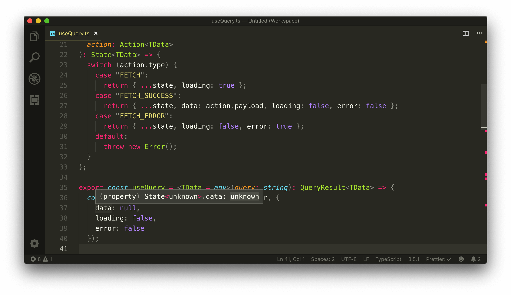
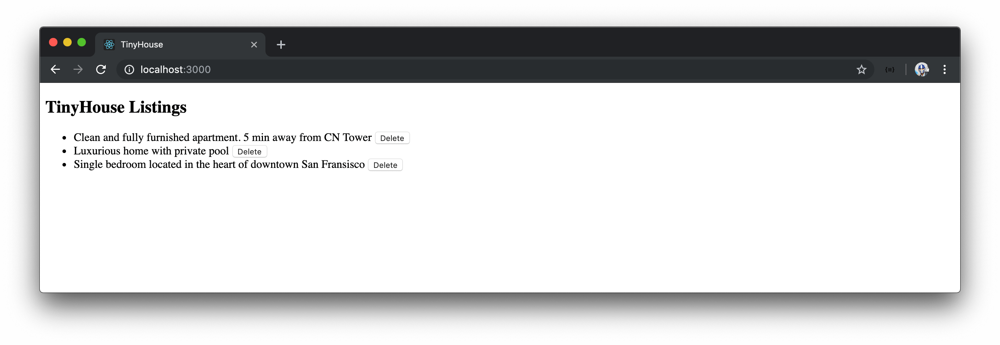
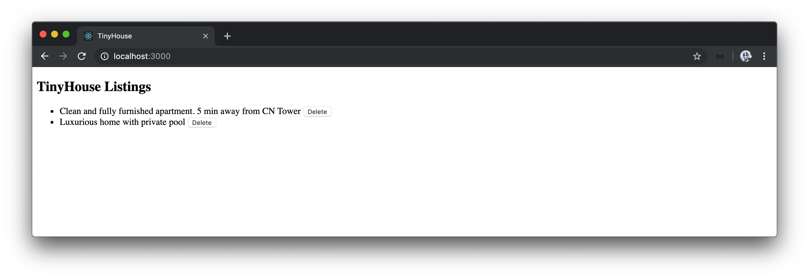

# The useReducer Hook

Our custom `useQuery` and `useMutation` Hooks work the way we want them to. They return the data we expect from our GraphQL requests and return some status information such as the loading and error states of our requests.

If we take a look at how we're manipulating the state objects our Hooks are returning, we can see that we're using the `useState` Hook to achieve this. This is because `useState` is one of the primary Hooks given to us by React to manage the state of functional components.

```typescript
// useQuery
export const useQuery = <TData = any>(query: string): QueryResult<TData> => {
  const [state, setState] = useState<State<TData>>({
    data: null,
    loading: false,
    error: false
  });

  // ...
};
```

For both the `useQuery` and `useMutation` Hooks, the state we're trying to manipulate and track is an _object_ where each field of the object dictates something about the request. Every function in our fetch that sets the state can be seen to be an _action_ of sorts.

- The first action sets the loading status to `true`.
- The second action sets the data in `state` to the data received.
- The last action if ever to occur is to set the error status to `true`.

Since we have a clear pattern of actions that interact with the same object, we can instead use another state management Hook that React provides called [`useReducer`](https://reactjs.org/docs/hooks-reference.html#usereducer).

## `useReducer`

We'll look to first use the `useReducer` Hook in our custom `useQuery` Hook, so we'll import the `useReducer` Hook from the react library in the `useQuery.ts` file.

```typescript
import { useState, useReducer, useEffect, useCallback } from "react";
```

[`useReducer`](https://reactjs.org/docs/hooks-reference.html#usereducer) behaves very similar to how [Redux](https://redux.js.org/) works.

> [Redux](https://redux.js.org) is a library that adapts the flux pattern to managing state in a client-side application.
>
> `useReducer` takes the concepts of Redux and allows us to manage data with a similar pattern!

The `useReducer` Hook takes a **`reducer()`** function that receives the current state and an **action**, and returns the new state. `useReducer` returns an array of two values and can take three arguments:

- The first argument is the `reducer()` function.
- The second argument is the initial state.
- The third (optional) argument is an initialization function responsible for initializing the state.

```typescript
const [state, dispatch] = useReducer(reducer, initialArg, init);
```

The `useReducer` Hook will appear more understandable when we start to implement it.

### `reducer`

In the `useQuery.ts` file, we'll define a simple `reducer()` function outside of our Hook. A `reducer()` function is a function that receives the current state and an action that would return the new state.

```typescript
import { useState, useReducer, useEffect, useCallback } from "react";
import { server } from "./server";

// ...

const reducer = (state, action) => {};

export const useQuery = <TData = any>(query: string): QueryResult<TData> => {
  // ...
};
```

A [`switch` statement](https://developer.mozilla.org/en-US/docs/Web/JavaScript/Reference/Statements/switch) is often used to determine the return value of state based on the action received.

```typescript
import { useState, useReducer, useEffect, useCallback } from "react";
import { server } from "./server";

// ...

const reducer = (state, action) => {
  switch () {}
}

export const useQuery = <TData = any>(
  query: string
): QueryResult<TData> => {
  // ...
};
```

The `action` parameter of the `reducer` function is to be an object that might contain a payload value we can use to update the state with. `action` is to usually contain a `type` property describing what kind of action is being made. `action.type` will be the expression used in the `switch` statement to evaluate the returned new `state` object in the `reducer` function.

```typescript
import { useState, useReducer, useEffect, useCallback } from "react";
import { server } from "./server";

// ...

const reducer = (state, action) => {
  switch (action.type) {
  }
};

export const useQuery = <TData = any>(query: string): QueryResult<TData> => {
  // ...
};
```

By convention, action types are often denoted with capital letters. Let's specify the cases and the returns we expect our reducer to take for each action type. We'll specify three cases - `FETCH`, `FETCH_SUCCESS`, and `FETCH_ERROR`.

Though this should never happen, we'll also specify a `default` case in our `switch` statement that will throw an error if the `action.type` does not exist or match either the `FETCH`, `FETCH_SUCCESS`, or `FETCH_ERROR` types.

```typescript
import { useState, useReducer, useEffect, useCallback } from "react";
import { server } from "./server";

// ...

const reducer = (state, action) => {
  switch (action.type) {
    case "FETCH":
      return; // ...
    case "FETCH_SUCCESS":
      return; // ...
    case "FETCH_ERROR":
      return; // ...
    default:
      throw new Error();
  }
};

export const useQuery = <TData = any>(query: string): QueryResult<TData> => {
  // ...
};
```

For each of the cases in our `switch` statement, we'd want the reducer to return a new updated state object. We have access to the initial `state` as the first argument of the `reducer()` function and to conform to the [Redux/Flux pattern of how state should be treated immutable (i.e. can't be changed)](https://redux.js.org/recipes/using-object-spread-operator#using-object-spread-operator), we'll always return new state objects for each case.

> Our `useReducer` Hook is to interact with a state object similar to what we had before. The state object contains the `data`, `loading`, and `error` fields.

For the first `FETCH` action that is to be fired, we simply want to make the `loading` field of `state` to `true`. We'll use the [spread syntax](https://developer.mozilla.org/en-US/docs/Web/JavaScript/Reference/Operators/Spread_syntax) to place the values of `state` in our new object and update the `loading` property to `true`.

```typescript
import { useState, useReducer, useEffect, useCallback } from "react";
import { server } from "./server";

// ...

const reducer = (state, action) => {
  switch (action.type) {
    case "FETCH":
      return { ...state, loading: true };
    case "FETCH_SUCCESS":
      return; // ...
    case "FETCH_ERROR":
      return; // ...
    default:
      throw new Error();
  }
};

export const useQuery = <TData = any>(query: string): QueryResult<TData> => {
  // ...
};
```

In the `FETCH_SUCCESS` scenario, we'd want to update the data in our state as well as ensure `loading` and `error` are false. This new payload that we'd want to apply will arrive from the action itself.

```typescript
import { useState, useReducer, useEffect, useCallback } from "react";
import { server } from "./server";

// ...

const reducer = (state, action) => {
  switch (action.type) {
    case "FETCH":
      return { ...state, loading: true };
    case "FETCH_SUCCESS":
      return {
        ...state,
        data: action.payload,
        loading: false,
        error: false
      };
    case "FETCH_ERROR":
      return; // ...
    default:
      throw new Error();
  }
};

export const useQuery = <TData = any>(query: string): QueryResult<TData> => {
  // ...
};
```

In the `FETCH_ERROR` case, we'll want to ensure `loading` is false while `error` is set to true.

```typescript
import { useState, useReducer, useEffect, useCallback } from "react";
import { server } from "./server";

// ...

const reducer = (state, action) => {
  switch (action.type) {
    case "FETCH":
      return { ...state, loading: true };
    case "FETCH_SUCCESS":
      return {
        ...state,
        data: action.payload,
        loading: false,
        error: false
      };
    case "FETCH_ERROR":
      return { ...state, loading: false, error: true };
    default:
      throw new Error();
  }
};

export const useQuery = <TData = any>(query: string): QueryResult<TData> => {
  // ...
};
```

We've yet to specify the type values of the `state` and `action` parameters in our `reducer()` function. We've already created the `State` interface that describes the shape of the state object we want to interact with so we'll annotate the assign the `state` parameter in our `reducer()` function with the `State` interface type. We need access to the `TData` type variable that the `State` interface accepts so we'll say our `reducer()` function will receive a `TData` type variable as well.

```typescript
import { useState, useReducer, useEffect, useCallback } from "react";
import { server } from "./server";

interface State<TData> {
  data: TData | null;
  loading: boolean;
  error: boolean;
}

// ...

const reducer = <TData>(state: State<TData>, action) => {
  switch (action.type) {
    case "FETCH":
      return { ...state, loading: true };
    case "FETCH_SUCCESS":
      return {
        ...state,
        data: action.payload,
        loading: false,
        error: false
      };
    case "FETCH_ERROR":
      return { ...state, loading: false, error: true };
    default:
      throw new Error();
  }
};

export const useQuery = <TData = any>(query: string): QueryResult<TData> => {
  // ...
};
```

We can create a new type alias labeled `Action` that represents the shapes of the different action objects that can pass through our reducer. Each action is an object that contains a `type` field where the type fields match that of the case labels we've created in our `reducer()` function - `FETCH`, `FETCH_SUCCESS`, and `FETCH_ERROR`.

```typescript
import { useState, useReducer, useEffect, useCallback } from "react";
import { server } from "./server";

interface State<TData> {
  data: TData | null;
  loading: boolean;
  error: boolean;
}

// ...

type Action = { type: "FETCH" } | { type: "FETCH_SUCCESS" } | { type: "FETCH_ERROR" };

const reducer = <TData>(state: State<TData>, action) => {
  switch (action.type) {
    case "FETCH":
      return { ...state, loading: true };
    case "FETCH_SUCCESS":
      return {
        ...state,
        data: action.payload,
        loading: false,
        error: false
      };
    case "FETCH_ERROR":
      return { ...state, loading: false, error: true };
    default:
      throw new Error();
  }
};

export const useQuery = <TData = any>(query: string): QueryResult<TData> => {
  // ...
};
```

In our `FETCH_SUCCESS` action type, we expect a payload that has the shape of our data from the server. Similar to our `State` interface, we'll state that the `Action` type alias is to accept a `TData` type variable which will be used to describe the shape of the action payload for the `FETCH_SUCCESS` case. We can then assign the `Action` type to the `action` argument in our `reducer()` function.

```typescript
import { useState, useReducer, useEffect, useCallback } from "react";
import { server } from "./server";

interface State<TData> {
  data: TData | null;
  loading: boolean;
  error: boolean;
}

// ...

type Action<TData> =
  | { type: "FETCH" }
  | { type: "FETCH_SUCCESS"; payload: TData }
  | { type: "FETCH_ERROR" };

const reducer = <TData>(state: State<TData>, action: Action<TData>) => {
  switch (action.type) {
    case "FETCH":
      return { ...state, loading: true };
    case "FETCH_SUCCESS":
      return {
        ...state,
        data: action.payload,
        loading: false,
        error: false
      };
    case "FETCH_ERROR":
      return { ...state, loading: false, error: true };
    default:
      throw new Error();
  }
};

export const useQuery = <TData = any>(query: string): QueryResult<TData> => {
  // ...
};
```

Finally, we can explicitly define the return type of the `reducer()` function to ensure we're always returning the same object in each switch case. Since the `reducer()` function is to return an updated state object, we'll say its return type is `State<TData>`.

```typescript
import { useState, useReducer, useEffect, useCallback } from "react";
import { server } from "./server";

interface State<TData> {
  data: TData | null;
  loading: boolean;
  error: boolean;
}

// ...

type Action<TData> =
  | { type: "FETCH" }
  | { type: "FETCH_SUCCESS"; payload: TData }
  | { type: "FETCH_ERROR" };

const reducer = <TData>(state: State<TData>, action: Action<TData>): State<TData> => {
  switch (action.type) {
    case "FETCH":
      return { ...state, loading: true };
    case "FETCH_SUCCESS":
      return {
        ...state,
        data: action.payload,
        loading: false,
        error: false
      };
    case "FETCH_ERROR":
      return { ...state, loading: false, error: true };
    default:
      throw new Error();
  }
};

export const useQuery = <TData = any>(query: string): QueryResult<TData> => {
  // ...
};
```

### `useReducer`

With our `reducer()` function established, we can now look to use it in a `useReducer` Hook declared at the top of the `useQuery` Hook function.

The `useReducer` Hook returns two values in a tuple - the `state` object itself and a `dispatch` function used to trigger an _action_.

```typescript
// ...

export const useQuery = <TData = any>(query: string): QueryResult<TData> => {
  const [state, dispatch] = useReducer();

  // ...
};
```

The `useReducer` Hook takes a minimum of two arguments - the first being the `reducer()` function itself and the second being the initial state. We'll pass in the `reducer()` function we've created and declare the initial state object like we've done with the `useState` Hook (`data` is `null`, `loading` is `false`, and `error` is `false`).

```typescript
// ...

export const useQuery = <TData = any>(query: string): QueryResult<TData> => {
  const [state, dispatch] = useReducer(reducer, {
    data: null,
    loading: false,
    error: false
  });

  // ...
};
```

We could look to try and introduce type variables to the `useReducer()` function itself. However, the `useReducer` Hook does a good job in inferring the type of `state` and `dispatch` based on the type of the `reducer()` function defined. If we take a look at the initial `state` object being passed in to our `useReducer` statement - we can see that `loading` and `error` are recognized to have the `boolean` type while `data` is recognized as `unknown`.



> The [`unknown`](https://www.typescriptlang.org/docs/handbook/release-notes/typescript-3-0.html#new-unknown-top-type) type was introduced in TypeScript v3 and behaves similar to the `any` type with some minor differences. You can read more about the `unknown` type in the [TypeScript documentation](https://www.typescriptlang.org/docs/handbook/release-notes/typescript-3-0.html#new-unknown-top-type).

The `data` property within `state` is currently `unknown` because we haven't passed a value for the `TData` type variable the `reducer()` function expects. Here's where we can do something interesting that can help us achieve this. Instead of passing the `reducer()` function directly to the `useReducer` Hook, we can pass in _a function that returns the expected `reducer()` function_. This will help us pass along the `TData` type variable from the `useQuery` Hook to the `reducer()` function.

Right above the use of the `useReducer` Hook, we'll create a `fetchReducer` constant that's simply equal to the result of the `reducer()` function while passing in the appropriate type variable.

We'll pass the `fetchReducer` property as the first argument of the `useReducer()` function.

```typescript
// ...

export const useQuery = <TData = any>(query: string): QueryResult<TData> => {
  const fetchReducer = reducer<TData>();
  const [state, dispatch] = useReducer(fetchReducer, {
    data: null,
    loading: false,
    error: false
  });

  // ...
};
```

Now, we'll change the `reducer()` function to be a function that _returns_ another function with the reducer capabilities.

```typescript
// ...

const reducer = <TData>() => (state: State<TData>, action: Action<TData>) => {
  switch (action.type) {
    case "FETCH":
      return { ...state, loading: true };
    case "FETCH_SUCCESS":
      return {
        ...state,
        data: action.payload,
        loading: false,
        error: false
      };
    case "FETCH_ERROR":
      return { ...state, loading: false, error: true };
    default:
      throw new Error();
  }
};

export const useQuery = <TData = any>(query: string): QueryResult<TData> => {
  const fetchReducer = reducer<TData>();
  const [state, dispatch] = useReducer(fetchReducer, {
    data: null,
    loading: false,
    error: false
  });

  // ...
};
```

Our `useReducer` Hook is now appropriately set up! We can remove the use of the `useState` Hook and where we've used the `setState()` function in our fetch functionality. In the `fetchApi()` function within the `fetch` callback, we'll now use the `dispatch` property given to us from `useReducer` to dispatch actions at every stage of the request.

At the beginning of the `fetchApi()` method, we'll dispatch the `FETCH` action. Upon success, we'll dispatch the `FETCH_SUCCESS` action with the appropriate payload. On error, we'll dispatch the `FETCH_ERROR` action.

With all the changes made, our `useQuery.ts` file will now look like the following:

```typescript
import { useReducer, useEffect, useCallback } from "react";
import { server } from "./server";

interface State<TData> {
  data: TData | null;
  loading: boolean;
  error: boolean;
}

interface QueryResult<TData> extends State<TData> {
  refetch: () => void;
}

type Action<TData> =
  | { type: "FETCH" }
  | { type: "FETCH_SUCCESS"; payload: TData }
  | { type: "FETCH_ERROR" };

const reducer = <TData>() => (
  state: State<TData>,
  action: Action<TData>
): State<TData> => {
  switch (action.type) {
    case "FETCH":
      return { ...state, loading: true };
    case "FETCH_SUCCESS":
      return { ...state, data: action.payload, loading: false, error: false };
    case "FETCH_ERROR":
      return { ...state, loading: false, error: true };
    default:
      throw new Error();
  }
};

export const useQuery = <TData = any>(query: string): QueryResult<TData> => {
  const fetchReducer = reducer<TData>();
  const [state, dispatch] = useReducer(fetchReducer, {
    data: null,
    loading: false,
    error: false
  });

  const fetch = useCallback(() => {
    const fetchApi = async () => {
      try {
        dispatch({ type: "FETCH" });

        const { data, errors } = await server.fetch<TData>({
          query
        });

        if (errors && errors.length) {
          throw new Error();
        }

        dispatch({ type: "FETCH_SUCCESS", payload: data });
      } catch {
        dispatch({ type: "FETCH_ERROR" });
      }
    };

    fetchApi();
  }, [query]);

  useEffect(() => {
    fetch();
  }, [fetch]);

  return { ...state, refetch: fetch };
};
```

And that's it! There's nothing else we'd need to change. If we have our Node and React servers running, we'll see that our `useQuery` Hook works as intended and our app loads the listings information as expected.



If we take a look of what we've done with the `useReducer` Hook, we can see what we've achieved is similar to what we had before by changing the values of the different fields in our state at different points of our request. The disadvantage with `useReducer` is it requires a little more boilerplate and understanding than using the `useState` Hook. The advantage of using the `useReducer` Hook is that it's more preferable to use for complex state objects with multiple sub-values due to the _decoupling_ of the updates that happen to our state from the actions themselves.

### `useMutation`

We'll now update our `useMutation` Hook in the `useMutation.ts` file to also use the `useReducer` Hook. Since our state and actions mimic one another between the `useQuery` and `useMutation` Hooks, we'll follow a similar pattern to migrate our `useMutation` Hook from using `useState` to `useReducer`.

- We'll import the `useReducer` Hook
- We'll define an `Action` type alias that's the same as the one in our `useQuery` Hook.
- We'll create a `reducer()` function that is the same as the one our `useQuery` Hook.
- We'll implement the `fetchReducer()` function and the use of the `useReducer` Hook at the top of the `useMutation` Hook function.
- Finally, we'll specify the different dispatches at different points of the mutation request.

With the above changes made, our `useMutation.ts` file will look like the following:

```typescript
import { useReducer } from "react";
import { server } from "./server";

interface State<TData> {
  data: TData | null;
  loading: boolean;
  error: boolean;
}

type MutationTuple<TData, TVariables> = [
  (variables?: TVariables | undefined) => Promise<void>,
  State<TData>
];

type Action<TData> =
  | { type: "FETCH" }
  | { type: "FETCH_SUCCESS"; payload: TData }
  | { type: "FETCH_ERROR" };

const reducer = <TData>() => (state: State<TData>, action: Action<TData>) => {
  switch (action.type) {
    case "FETCH":
      return { ...state, loading: true };
    case "FETCH_SUCCESS":
      return { ...state, data: action.payload, loading: false, error: false };
    case "FETCH_ERROR":
      return { ...state, loading: false, error: true };
    default:
      throw new Error();
  }
};

export const useMutation = <TData, TVariables = {}>(
  query: string
): MutationTuple<TData, TVariables> => {
  const fetchReducer = reducer<TData>();
  const [state, dispatch] = useReducer(fetchReducer, {
    data: null,
    loading: false,
    error: false
  });

  const fetch = async (variables?: TVariables) => {
    try {
      dispatch({ type: "FETCH" });

      const { data, errors } = await server.fetch<TData, TVariables>({
        query,
        variables
      });

      if (errors && errors.length) {
        throw new Error(errors[0].message);
      }

      dispatch({ type: "FETCH_SUCCESS", payload: data });
    } catch (err) {
      dispatch({ type: "FETCH_ERROR" });
      throw console.error(err);
    }
  };

  return [fetch, state];
};
```

Our `useMutation` Hook will continue to work as intended by allowing us to delete a listing from the list of listings presented in our UI.



> Since our `useQuery` and `useMutation` Hooks behave very similar to one another, we can extrapolate a lot of the shared content between the two files to a shared utility file or helper. We'll keep the similar information between the two Hooks separate but you're more than welcome to extrapolate some of this content to a shared location.

This brings us to the end of this lesson as well as the end of our custom Hooks implementation. In the next module, we'll discuss some of the potential shortcomings with our custom implementation and what we'll be using instead moving forward!
