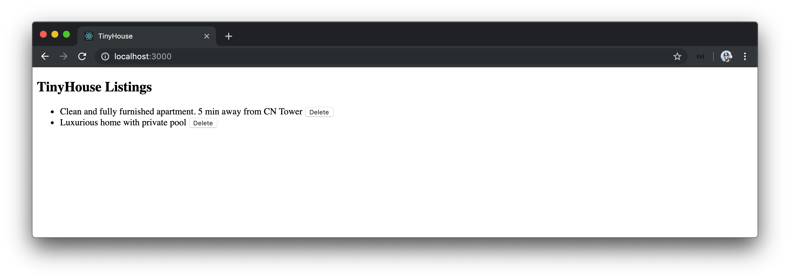

# React Apollo Hooks

We have the Apollo client created and available everywhere in our app. Let's see how we can import and use the Hooks from React Apollo in our `<Listings>` component.

In the `<Listings>` component, we'll now import the `useQuery` and `useMutation` Hooks from the React Apollo library instead of our own local `src/lib/` folder.

```tsx
import { useQuery, useMutation } from "@apollo/react-hooks";
```

We'll observe that the use of `useQuery` and `useMutation` in the `<Listings>` component doesn't throw any errors except for perhaps in how we pass in the GraphQL document nodes. That is because we've built our custom `useQuery` and `useMutation` Hooks to resemble _very closely_ with how the Hooks from React Apollo work!

Here's a summary of how React Apollo's `useQuery` and `useMutation` Hooks behave.

1.  The `useQuery` and `useMutation` Hooks take two arguments, the query or mutation in question and an `options` object.
2.  The `useQuery` and `useMutation` Hooks accept two type variables, one to represent the shape of data to be returned and the other to represent the shape of variables that can be passed in.
3.  The `useQuery` Hook [returns a series of fields within an object recognized as the `QueryResult`](https://www.apollographql.com/docs/react/data/queries/#result). `data`, `loading`, `error`, and a `refetch()` function are some of the fields within the `QueryResult`. The `QueryResult` object also returns a bunch of other fields like the Apollo `client` itself, the `networkStatus` of the request, a `fetchMore()` function, and so on.
4.  The `useMutation` Hook returns a tuple of two values. The first value being the mutation function itself and the second value being the [mutation result values](https://www.apollographql.com/docs/react/data/mutations/#result) which are similar to the result returned in `useQuery`.

Though the way we've used our custom `useQuery` and `useMutation` Hooks mimic that of React Apollo, there are still a few changes we'll need to make.

### `gql`

The first change we'll make is how we pass in the GraphQL document nodes to our query and mutation requests. With our simple `server.fetch()` function, we were able to construct and use GraphQL documents that are strings. The Hooks in React Apollo expect our GraphQL documents to be constructed as trees.

We can have our GraphQL documents be created as abstract trees with the help of the `gql` template tag just like we've seen in our Node server application. The `gql` template tag is available to us from the `apollo-boost` package.

We'll import the `gql` tag from the `apollo-boost` package in the `Listings.tsx` file.

```tsx
import { gql } from "apollo-boost";
```

In our GraphQL query documents, we'll use the `gql` tag function to have our strings be parsed as GraphQL Abstract Syntax Trees.

```tsx
const LISTINGS = gql`
  query Listings {
    listings {
      id
      title
      image
      address
      price
      numOfGuests
      numOfBeds
      numOfBaths
      rating
    }
  }
`;

const DELETE_LISTING = gql`
  mutation DeleteListing($id: ID!) {
    deleteListing(id: $id) {
      id
    }
  }
`;
```

With [VSCode's Apollo GraphQL](https://marketplace.visualstudio.com/items?itemName=apollographql.vscode-apollo) extension, we'll now get appropriate syntax highlighting for all our GraphQL documents created with the `gql` tag!


### `variables`

The next change we'll make is how we pass in variables to the request function returned from the `useMutation` Hook. Before, we simply provided an object of key/value pairs for every field. For the Hooks in React Apollo, we'll need to specify an options object that has a `variables` field within that contains the variables needed in the request. This is because `variables` is just _one_ option that can be accepted by the `useQuery` and `useMutation` Hooks.

```tsx
const handleDeleteListing = async (id: string) => {
  await deleteListing({ variables: { id } });
  refetch();
};
```

With the changes made, our `Listings.tsx` file will look like the following:

```tsx
import React from "react";
import { gql } from "apollo-boost";
import { useQuery, useMutation } from "@apollo/react-hooks";
import { DeleteListingData, DeleteListingVariables, ListingsData } from "./types";

const LISTINGS = gql`
  query Listings {
    listings {
      id
      title
      image
      address
      price
      numOfGuests
      numOfBeds
      numOfBaths
      rating
    }
  }
`;

const DELETE_LISTING = gql`
  mutation DeleteListing($id: ID!) {
    deleteListing(id: $id) {
      id
    }
  }
`;

interface Props {
  title: string;
}

export const Listings = ({ title }: Props) => {
  const { data, loading, error, refetch } = useQuery<ListingsData>(LISTINGS);

  const [
    deleteListing,
    { loading: deleteListingLoading, error: deleteListingError }
  ] = useMutation<DeleteListingData, DeleteListingVariables>(DELETE_LISTING);

  const handleDeleteListing = async (id: string) => {
    await deleteListing({ variables: { id } });
    refetch();
  };

  const listings = data ? data.listings : null;

  const listingsList = listings ? (
    <ul>
      {listings.map(listing => {
        return (
          <li key={listing.id}>
            {listing.title}{" "}
            <button onClick={() => handleDeleteListing(listing.id)}>Delete</button>
          </li>
        );
      })}
    </ul>
  ) : null;

  if (loading) {
    return <h2>Loading...</h2>;
  }

  if (error) {
    return <h2>Uh oh! Something went wrong - please try again later :(</h2>;
  }

  const deleteListingLoadingMessage = deleteListingLoading ? (
    <h4>Deletion in progress...</h4>
  ) : null;

  const deleteListingErrorMessage = deleteListingError ? (
    <h4>Uh oh! Something went wrong with deleting :(. Please try again soon.</h4>
  ) : null;

  return (
    <div>
      <h2>{title}</h2>
      {listingsList}
      {deleteListingLoadingMessage}
      {deleteListingErrorMessage}
    </div>
  );
};
```

That's it! The `useQuery` Hook for React Apollo allows us to query listings on page load.


The `useMutation` Hook allows us to delete a listing from the list of listings. By using the `refetch()` function given to us by the `useQuery` Hook, we're able to refetch the `listings` query after a deletion is made.



The `loading` and `error` fields we receive from our Hooks dictate how we show information in the UI.

Since we're using the official React Apollo library, we can now remove the entire `src/lib/` folder that contained the custom `server.fetch()` function, the custom `useQuery` Hook, and the custom `useMutation` Hook that we don't plan to use any longer.
