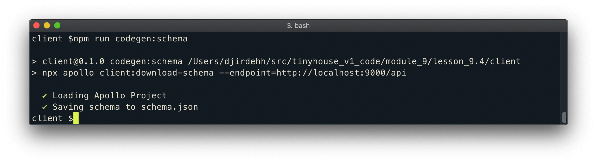
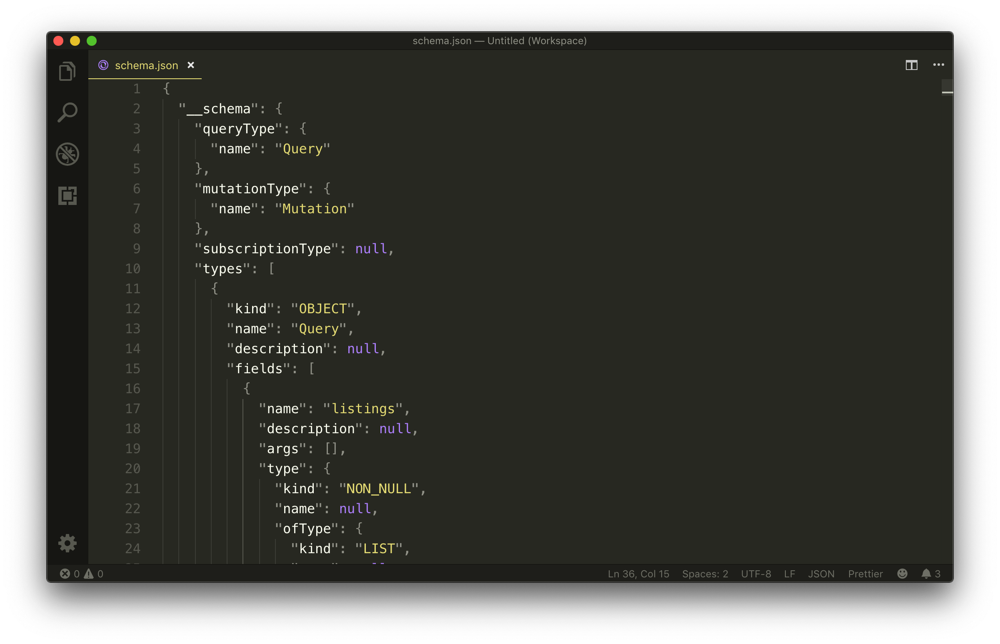
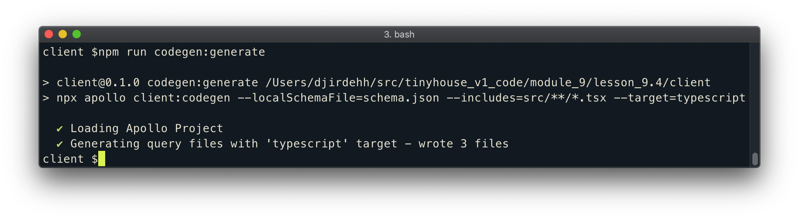
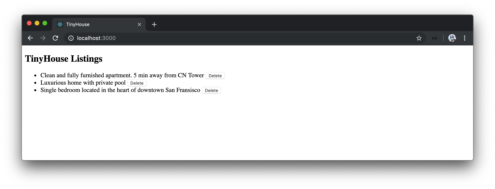

# Autogenerated types with Apollo CLI

In the current and last module, we've come to recognize how powerful Hooks can be when it comes to making GraphQL queries and mutations. In this module, we've brought in React Apollo and used React Apollo's `useQuery` and `useMutation` Hooks. With either the custom Hooks or React Apollo Hooks, we've passed in custom type definitions we've created to help shape the type of data and variables we are to receive and use in our GraphQL requests.

We've created the custom typings for our requests in a `types.ts` file located within the `src/sections/Listings` folder.

```typescript
export interface Listing {
  id: string;
  title: string;
  image: string;
  address: string;
  price: number;
  numOfGuests: number;
  numOfBeds: number;
  numOfBaths: number;
  rating: number;
}

export type ListingsData = {
  listings: Listing[];
};

export interface DeleteListingData {
  deleteListing: Listing;
}

export interface DeleteListingVariables {
  id: string;
}
```

In the `Listings/types.ts` file, we've created custom type definitions for our `listings` query and `deleteListing` mutation by surveying the GraphQL API and schema.

In a large scale production application, we could have dozens and dozens of GraphQL documents for all the GraphQL requests we might have in an app. First off, it'll be a little tedious having to create the typings for all of these documents. Second, a breaking change in the server will make finding and updating our client types a little difficult. If we think about it, **our GraphQL API already has it's own types**. Wouldn't be cool if we can just leverage those types automatically?

We can with the help of code generators! The community has created plenty GraphQL code generators aimed at addressing this point. To name a few, there is the:

- [GraphQL Code Generator](https://github.com/dotansimha/graphql-code-generator)
- [Typed Graphqlify](https://github.com/acro5piano/typed-graphqlify)
- [Apollo CLI](https://github.com/apollographql/apollo-tooling)

Though these tools have differences, they all allow for generating client-side types from a GraphQL schema.

> Among generating client-side types, [GraphQL Code Generator](https://github.com/dotansimha/graphql-code-generator) allows for generating other code like server-side types, client-side components, etc.
>
> [GraphQL Code Generator](https://github.com/dotansimha/graphql-code-generator) and the [Apollo CLI](https://github.com/apollographql/apollo-tooling) can help generate client-side types for many different languages like TypeScript, Swift, Java, C#, etc.

## Apollo CLI

The [Apollo CLI](https://github.com/apollographql/apollo-tooling) is a robust command line interface that allows for a variety of different things such as schema validation, server compatibility checks, and the ability to generate static types. We'll use the official Apollo CLI to generate static types from our GraphQL API.

To use the Apollo CLI, we're able to install the [apollo](https://github.com/apollographql/apollo-tooling) tooling globally or as an application dependency. What we'll like to do instead is set up scripts in the `package.json` file of our app and run the `apollo` tooling commands with the `npx` command.

There are two commands we'll need to run to be able to generate static types from our schema.

1.  We first need to _download_ our GraphQL schema and save it in our project for the Apollo CLI to be able to generate types.
2.  We can then generate the static types of our requests from our schema.

We'll set up both of these steps as two separate script commands in our application's `package.json` file. We'll label these scripts `codegen:schema` and `codegen:generate`.

```json
{
  // ...
  "scripts": {
    // ...
    "codegen:schema": "",
    "codegen:generate": ""
  }
  // ...
}
```

To download the schema, we'll need to run the [`apollo client:download-schema` command](https://github.com/apollographql/apollo-tooling#apollo-clientdownload-schema-output) and specify the options we would want. In our case, we'll specify the single minimum option we need - the endpoint and pass in the value of our local GraphQL endpoint (`http://localhost:9000/api`).

```json
{
  // ...
  "scripts": {
    // ...
    "codegen:schema": "npx apollo client:download-schema --endpoint=http://localhost:9000/api",
    "codegen:generate": ""
  }
  // ...
}
```

> For more detail in all the different `apollo` CLI commands and options, be sure to check out the Apollo CLI [README.md](https://github.com/apollographql/apollo-tooling).

We'll run the newly created `codegen:schema` script in our command line.

```shell
client $: npm run codegen:schema
```

After a brief period, we'll notice success messages that state `Loading Apollo Project` and `Saving schema to schema.json`.



If we look at the root of our `client/` project directory, we'll notice a `schema.json` file be generated that represents our entire GraphQL schema!



With the GraphQL schema available in our app, we can now look to generate the static types for the `listings` query and `deleteListing` mutation in our GraphQL API. This can be done with the Apollo CLI `client:codegen` command.

```json
apollo client:codegen
```

We'll specify a few options as we set up the script to run the `client:codegen` command.

The first option we'll add is the `--localSchemaFile` option, which is used to specify the path to the schema file in our `client/` directory. Since the `schema.json` file is in the root of our project, the value for the `--localSchemaFile` option will be `schema.json`.

```json
apollo client:codegen --localSchemaFile=schema.json
```

The second option we'll specify is the `--includes` option which is used to state the files that contain the GraphQL operations we'll want to generate static types for. Since all of our GraphQL requests live in TypeScript files within our `src/` folder, we'll want to declare a search for TypeScript files in the `src/` folder. Here we'll specify a value of `src/**/*.tsx` which entails looking through our entire `src/` folder and for any files that have the `.tsx` file extension.

> The search value in the `--includes` option uses the [Glob pattern](https://gulpjs.com/docs/en/getting-started/explaining-globs) to match the intended file paths.

```json
apollo client:codegen --localSchemaFile=schema.json --includes=src/**/*.tsx
```

The final option we'll specify is the `—-target` option which is required and allows us to specify which code generator we'd like to use. `swift`, `flow`, `scala` are all different options but in our case we're interested in the `typescript` option.

```json
apollo client:codegen --localSchemaFile=schema.json --includes=src/**/*.tsx --target=typescript
```

We'll have the above `apollo` command as part of the `codegen:generate` script command in our application.

```json
{
  // ...
  "scripts": {
    // ...
    "codegen:schema": "npx apollo client:download-schema --endpoint=http://localhost:9000/api",
    "codegen:generate": "npx apollo client:codegen --localSchemaFile=schema.json --includes=src/**/*.tsx --target=typescript"
  }
  // ...
}
```

We can now run the newly created `codegen:generate` command in our terminal.

```shell
client $: npm run codegen:generate
```

Upon success, we'll see the `Loading Apollo Project` message followed by `Generating query files with 'typescript' target - wrote 3 files`.



By default, the Apollo code generator creates static typings for the GraphQL documents it finds in a `__generated__/` folder located within the _module_ (i.e. folder) it found those documents. If we take a look at the autogenerated `src/sections/Listings/__generated__/` folder, we can notice files were created for each GraphQL request - `DeleteListing.ts` and `Listings.ts`.

```shell
client/
  src/
    sections
      Listings/
        __generated__/
          DeleteListing.ts
          Listings.ts
      // ...
    // ...
```

In the `Listings/__generated__/DeleteListing.ts` file, we can see interfaces for the data the `deleteListing` mutation is expected to return and the variables the `deleteListing` mutation can accept!

```typescript
/* tslint:disable */
/* eslint-disable */
// This file was automatically generated and should not be edited.

// ====================================================
// GraphQL mutation operation: DeleteListing
// ====================================================

export interface DeleteListing_deleteListing {
  __typename: "Listing";
  id: string;
}

export interface DeleteListing {
  deleteListing: DeleteListing_deleteListing;
}

export interface DeleteListingVariables {
  id: string;
}
```

Similarly, in the `Listings/__generated__/Listing.ts` file, we can see the interface for the data the `listings` query is expected to return.

```typescript
/* tslint:disable */
/* eslint-disable */
// This file was automatically generated and should not be edited.

// ====================================================
// GraphQL query operation: Listings
// ====================================================

export interface Listings_listings {
  __typename: "Listing";
  id: string;
  title: string;
  image: string;
  address: string;
  price: number;
  numOfGuests: number;
  numOfBeds: number;
  numOfBaths: number;
  rating: number;
}

export interface Listings {
  listings: Listings_listings[];
}
```

Let's begin to use the Apollo generated types. In our `Listings.tsx` component file, we'll import the appropriate types from each generated file. Since the `Listings` namespace is used to represent the component, we'll import the `Listings` data interface as `ListingsData` to prevent any naming conflict. For consistency, we'll do the same for the `DeleteListing` data interface as well. We'll also remove the imports being made from our locally created `types.ts` file.

```tsx
import { Listings as ListingsData } from "./__generated__/Listings";
import {
  DeleteListing as DeleteListingData,
  DeleteListingVariables
} from "./__generated__/DeleteListing";
```

Our Hooks are already consuming type variables with the same names as the ones that have been imported so there's nothing else left for us to do. Our app now works just as before.



Since we're using the autogenerated types the Apollo CLI gives us, we can remove the custom `types.ts` file we created before in the `Listings/` folder.

If our server was to ever change the schema, all we'll need to do is regenerate the `schema.json` file that is to be kept in our application and then regenerate the static type definitions for our GraphQL requests. Amazing!

We'll note two things before we close this lesson.

For the Apollo code generator to pick up the GraphQL documents and make static types that reference them, it requires us to **name all our GraphQL requests**. If we attempt to run our static type generation command without naming our documents, Apollo Codegen will throw an error.

```typescript
// named query - okay
const LISTINGS = gql`
  query Listings {
    listings {
      id
    }
  }
`;

// unnamed query - error
const LISTINGS = gql`
  query {
    listings {
      id
    }
  }
`;
```

In addition to creating static type definitions for each GraphQL document, Apollo Codegen also creates
a `globalTypes.ts` file kept in the root of the project under a `__generated__/` folder of its own. The `globalTypes.ts` file keeps a reference of all `enum` and `input` object types that can exist in our GraphQL API. Since we don't have any in our existing application, our `globalTypes.ts` file at this moment is empty.

```tsx
/* tslint:disable */
/* eslint-disable */
// This file was automatically generated and should not be edited.

//==============================================================
// START Enums and Input Objects
//==============================================================

//==============================================================
// END Enums and Input Objects
//==============================================================
```

And that's it! The `useQuery` and `useMutation` Hooks in our app now uses the statically generated types that Apollo Codegen has generated. We won't be making any more changes to how our component makes our GraphQL requests which concludes this module. In the next module, we'll be taking a look at a React UI framework to help make presentable UI changes in our app.
