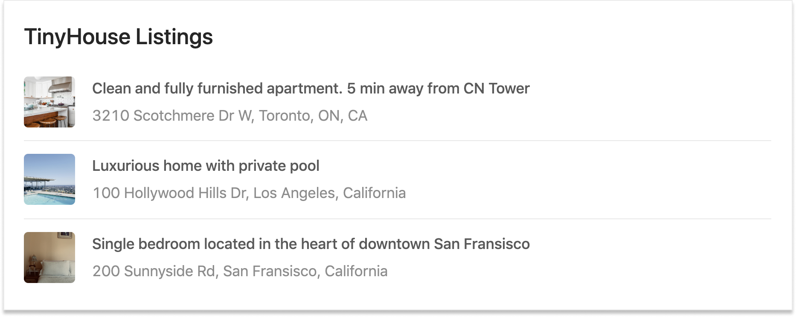
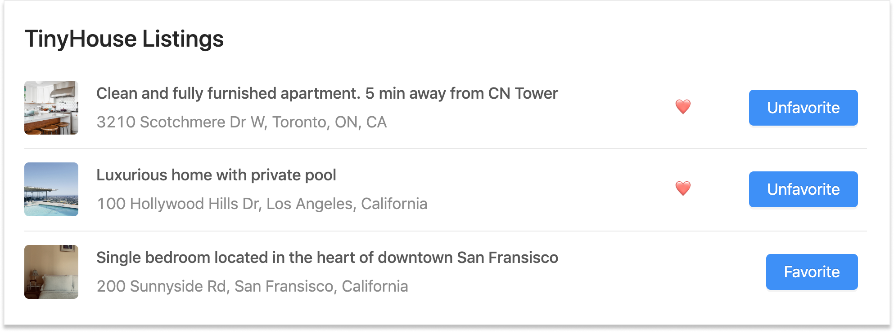
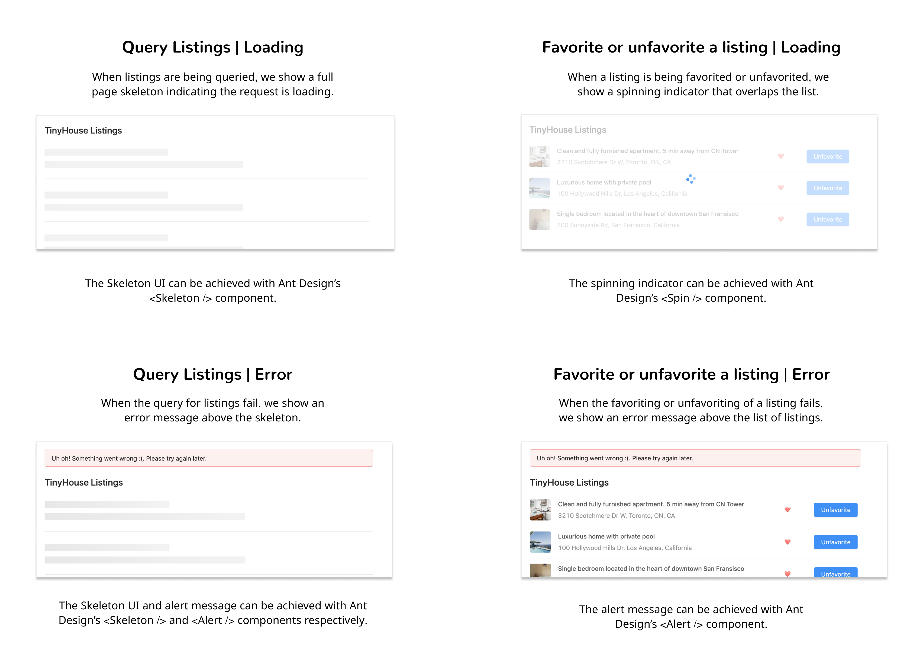

# Favorite Listing Challenge

This challenge is part of the larger project challenge, **Favorite a listing**, in the [TinyHouse](https://www.newline.co/tinyhouse) full-stack React Masterclass. By completing this series of challenges, you'll build a simple full-stack web app that allows you to request a list of listings where you're also able to favorite and unfavorite listings. This challenge project will involve work that is to be done with Node, MongoDB, GraphQL, and React.


This directory contains the starting scaffold for you to use as well as the completed solution.

Below, we'll specify the challenge requirements, describe the functionality we intend to have, and give you tips along the way.

## Challenge Details

### Starting point

At the starting `/scaffold`, a GraphQL API exists where we're able to query for a series of listings with the root level `listings` field and favorite a certain listing by passing a listing `id` argument value and executing the `favoriteListing` mutation. The schema for our GraphQL API looks like the following:

```gql
type Listing {
  id: ID!
  title: String!
  image: String!
  address: String!
  price: Int!
  numOfGuests: Int!
  numOfBeds: Int!
  numOfBaths: Int!
  rating: Float!
  favorite: Boolean!
}

type Query {
  listings: [Listing!]!
}

type Mutation {
  favoriteListing(id: ID!): Listing!
}
```

The root-level `listings` and `favoriteListing` fields interact and manipulate data that is to be kept in a MongoDB collection within a database constructed with the help of MongoDB Atlas.

> To begin working with the `server/` project in the `scaffold/` directory, ensure the collection being interacted is the name that you've established and provide values for the appropriate database configuration variables.

With the `server/` project running, the `client/` project in the `scaffold/` has been prepared to have the `listings` query be made and the `listings` data retrieved be surfaced the moment client application is run.



### Requirements

**In this challenge, we'll focus on modifying our React client to allow a user to favorite and unfavorite a listing in the list displayed in the UI.**

1. Create the following UI elemnets.

   - If a listing is not in the favorited state, display a button to favorite the listing.
   - If a listing is in the favorited state, display a ❤️ heart icon to indicate this. Also display a button to unfavorite the lisitng.



2. When the `Favorite`/`Unfavorite` button is pressed, the UI should be refreshed automatically to display the updated state of listings (i.e ensure the UI is always in sync with the database).

3. Ensure the client handles all loading and error states from our GraphQL requests. You're welcome to handle these states as you prefer. In the `solution/` we've managed our loading and error states as follows:



## Instructions

How to attempt this challenge:

1. Clone this repo
2. Solve the challenge
3. Compare your solution with the `solution/` folder provided in this directory

If you feel stuck at any moment in time, feel free to hop over and ask a question in the **`#tinyhouse`** channel of the Newline Discord organization!

## Tips

1. You'll need to create the `favoriteListing` mutation request document in the React client and have the `Favorite`/`Unfavorite` buttons trigger the `favoriteListing` mutation.

2. To auto-generate TypeScript definitions from the GraphQL API, you can run the `codegen:schema` and `codegen:generate` script commands available in the `client/` project.
