# Styling with Ant Design

In this lesson, we'll introduce the [Ant Design](https://ant.design/) React UI framework and use some of the components from the Ant Design framework to make our client application look more presentable. The objective of this lesson isn't to convey _what_ certain components given to us by Ant Design are but more to convey how we can use a React UI framework to help improve the presentation of what we've built.

First and foremost, we'll install the `antd` library into our client application.

```shell
client $: npm install antd
```

The `antd` library is built with TypeScript so we won't have to install any additional type declaration files. When installed, we can begin to use the components that Ant Design provides.

> The [Ant Design](https://ant.design/docs/react/introduce) documentation provides a detailed overview of all the different components Ant Design provides as well as the `props` they accept and examples of their use. In this lesson, we'll simply highlight and use a few certain components.

### `<List>`

The first component we'll use is Ant Design's [`<List>` component](https://ant.design/components/list/). We'll use the `<List>` component to first render a list of `titles` from the `listings` data we retrieve from our GraphQL API.

We'll import the `List` component module in our `Listings.tsx` file.

```tsx
import { List } from "antd";
```

We'll modify the `listingsList` constant variable we had before to now use Ant Design's `<List>` component to render a list of elements. As we render the `<List>` component, we'll use the component's `itemLayout`, `dataSource`, and `renderItem` props.

Our `listingsList` constant in our `<Listings>` component will look like the following:

```tsx
const listingsList = listings ? (
  <List
    itemLayout="horizontal"
    dataSource={listings}
    renderItem={listing => (
      <List.Item>
        <List.Item.Meta title={listing.title} />
      </List.Item>
    )}
  />
) : null;
```

- The `itemLayout` prop dictates the layout of how we want each list item to be rendered with which we've given a value of `"horizontal"`.
- `dataSource` takes an array or collection of data that'll help prepare the list.
- The `renderItem` prop is an example of the [render props pattern](https://reactjs.org/docs/render-props.html) that dictates how each list item is to be rendered. We're using the child `<List.Item>` and `<List.Item.Meta>` components to render the title of each iterated listing.

The `<Listings>` component `handleDeleteListing()` method isn't currently being used but we'll use it again shortly.

Though at this moment we'll be rendering the markup from Ant Design, we won't see any CSS that Ant Design gives us. If we take a look at the ["use in `create-react-app`" section of the Ant Design documentation](https://ant.design/docs/react/use-with-create-react-app) we can that Ant Design expects us to import an accompanying CSS file from the installed `antd` library.

We'll create an `index.css` file in a `styles/` folder at the root of the `src/` folder.

```shell
client/
  src/
    styles/
      index.css
    // ...
  // ...
```

In the `index.css` file, we'll add the following [`@import`](https://developer.mozilla.org/en-US/docs/Web/CSS/@import) to import the Ant Design stylesheet into our `index.css` file.

```css
@import "~antd/dist/antd.css";
```

In our `src/index.tsx` file, we can tell our `index.tsx` file to use the `index.css` file by simply importing it.

```tsx
import "./styles/index.css";
```

The ability to simply import our stylesheet in our components can be done thanks to [Webpack and the configuration made in `create-react-app`](https://facebook.github.io/create-react-app/docs/adding-a-stylesheet). This is an incredibly useful feature that allows us to create blocks of stylesheets for respective components. Since `index.tsx` is the root level "component", applying styles here is applied to all children components as well.

> The [Ant Design documentation](https://ant.design/docs/react/use-with-create-react-app#Advanced-Guides) does also show the capability of ejecting the `create-react-app` configuration and using the Ant Design's [`babel-plugin-import` library](https://github.com/ant-design/babel-plugin-import) to allow for the importing of components with reduced CSS bundle sizes.
>
> In this course, we'll keep things simple and introduce components from Ant Design just like we've done for the `<List>` component.

Though we're not there yet, when taking a look at our browser - we'll see the markup and styling Ant Design's `<List>` component gives us!

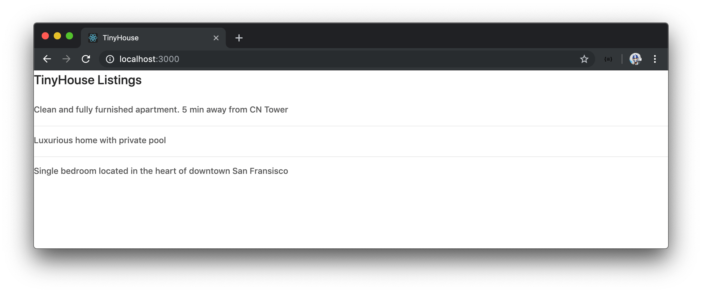

We'll look to add some custom padding to our list of Listings before we further update the `<List>` component. We'll create a `styles/Listings.css` file in the `Listings/` folder to act as the stylesheet for the `<Listings>` component.

```shell
client/
  src/
    sections/
      Listings/
        styles/
          Listings.css
          //...
```

In the `Listings.css` file, we'll introduce a `.listings` class and give it a margin of `20px` as well as a max-width of `750px`.

```css
.listings {
  margin: 20px;
  max-width: 750px;
}
```

In our `<Listings>` component, we'll import the newly created `Listings.css` stylesheet and specify the `.listings` class in the root `<div>` element of the component.

```tsx
// ...
import "./styles/Listings.css";

// ...

export const Listings = ({ title }: Props) => {
  // ...

  return (
    <div className="listings">
      <h2>{title}</h2>
      {listingsList}
      {deleteListingLoadingMessage}
      {deleteListingErrorMessage}
    </div>
  );
};
```

If we take a look at our app, we can see the margin and max-width be applied to our list.

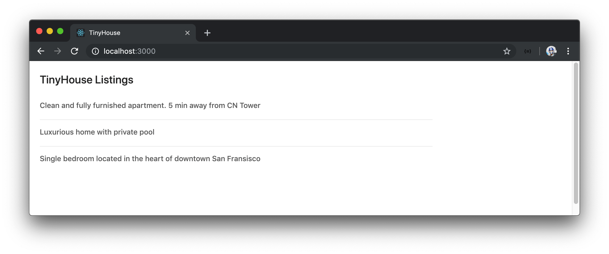

We'll now look to populate our list a little more. The `<List.Item.Meta>` component can take an `avatar` and `description` prop. For the `description` prop, we'll specify a value of the listing address. For the `avatar` prop, we'll import and use the [`<Avatar>`](https://ant.design/components/avatar/) component that Ant Design provides. We'll import and use the `<Avatar>` component from `antd` and provide a `src` of `listing.image`. The `<Avatar>` component also takes a `shape` and `size` prop with which we'll provide a `shape` of `"square"` and a `size` of `48`.

Our `listingsList` constant variable will now look like the following:

```tsx
// ...
import { Avatar, List } from "antd";

// ...

export const Listings = ({ title }: Props) => {
  // ...

  const listingsList = listings ? (
    <List
      itemLayout="horizontal"
      dataSource={listings}
      renderItem={listing => (
        <List.Item>
          <List.Item.Meta
            title={listing.title}
            description={listing.address}
            avatar={<Avatar src={listing.image} shape="square" size={48} />}
          />
        </List.Item>
      )}
    />
  ) : null;

  // ...
};
```

Just from those changes alone, we'll now have avatars and address descriptions for each of our listing items!

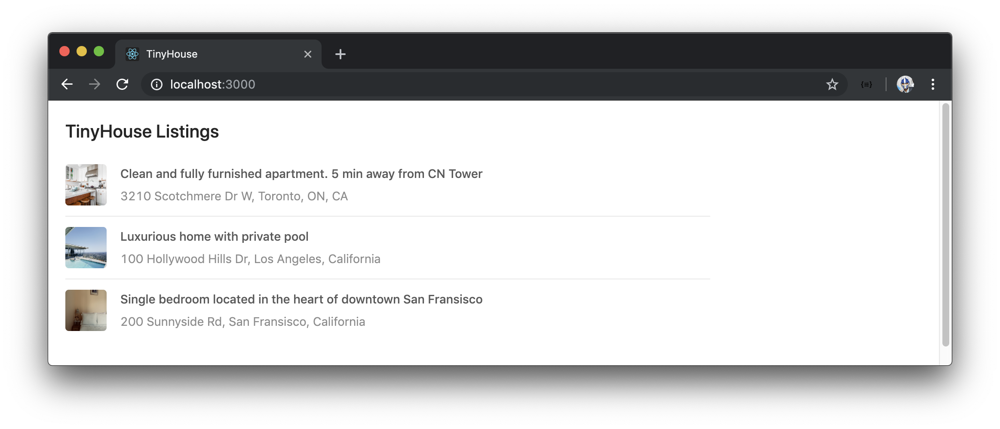

We're still missing the ability to delete a listing. The `<List.Item>` component can take an `actions` prop which can be an array of JSX elements that represent the actions that can be taken for a certain list item. We'll introduce this `actions` prop and attempt to place a single element value. Our element will be the [`<Button>`](https://ant.design/components/button/) component from Ant Design.

We'll import the `<Button>` component and place it as the first item in our array in the `actions` prop. The `<Button>` component will have an `onClick` prop that will have the button trigger the component `handleDeleteListing()` method when clicked. Ant Design's `<Button>` component also takes a `type` prop to control how the button is to appear. To get the primary blue color, we'll apply the value of `"primary"` to the `type` prop.

```tsx
// ...
import { Avatar, Button, List } from "antd";

// ...

export const Listings = ({ title }: Props) => {
  // ...

  const listingsList = listings ? (
    <List
      itemLayout="horizontal"
      dataSource={listings}
      renderItem={listing => (
        <List.Item
          actions={[
            <Button type="primary" onClick={() => handleDeleteListing(listing.id)}>
              Delete
            </Button>
          ]}
        >
          <List.Item.Meta
            title={listing.title}
            description={listing.address}
            avatar={<Avatar src={listing.image} shape="square" size={48} />}
          />
        </List.Item>
      )}
    />
  ) : null;

  // ...
};
```

A `Delete` button will now appear in each list item, and clicking it will allow us to delete the listing from the list!

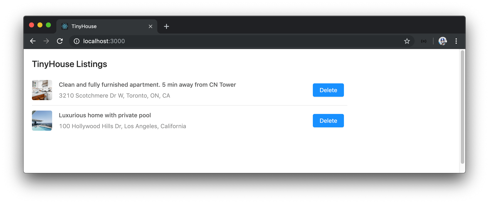

We won't make any more changes to the `<List>` component but look to optimize the other parts of our list.

### `<Spin>`

When we delete a listing, we're still presented with a `Deletion in progress...` header element at the bottom of our list. We can probably look to use a better loading indicator from Ant Design.

Ant Design offers a [component labeled `<Spin>`](https://ant.design/components/spin/) that helps display the loading state of a page or a section.

In the `Listings.tsx` component file, we'll import the `Spin` component module and wrap the inner contents of our component markup with the `<Spin>` component. To control when the `<Spin>` component is visible, we'll set its `spinning` prop to the value of `deleteListingLoading` which is the value that represents the loading state of our mutation request. We can also remove the `deleteListingLoadingMessage` element we've created before.

```tsx
// ...
import { Avatar, Button, List, Spin } from "antd";

// ...

export const Listings = ({ title }: Props) => {
  // ...

  return (
    <div className="listings">
      <Spin spinning={deleteListingLoading}>
        <h2>{title}</h2>
        {listingsList}
        {deleteListingErrorMessage}
      </Spin>
    </div>
  );
};
```

When deletion is in progress, we'll now be presented with a loading spinner.

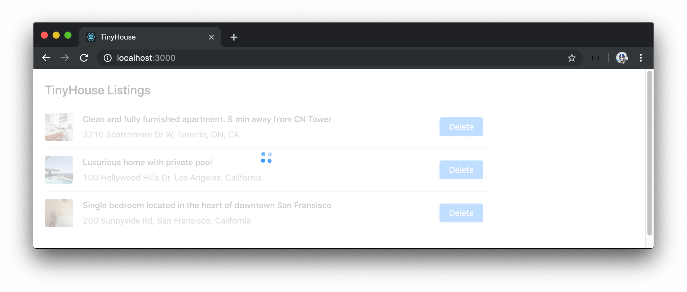

### `<Skeleton>`

When our parent `listings` query is being made, we have a simple `Loading...` message be shown. Let's look to display a skeleton UI instead. Ant Design has a [`<Skeleton>`](https://ant.design/components/skeleton/) component that can be used in multiple different ways. We'll stick with a simple approach by looking to render a custom component that uses the `<Skeleton>` element when the query is loading.

We'll keep our new component in a `components/` folder within the `Listings/` module to represent that it's a child component of `<Listings>`. We'll create the `components/` folder and a `ListingsSkeleton/` folder within that will contain a `ListingsSkeleton.tsx` file and an `index.ts` file.

```shell
client/
  src/
    sections/
      Listings/
        components/
          ListingsSkeleton/
            index.ts
            ListingsSkeleton.tsx
            // ...
```

In the `ListingsSkeleton.tsx` file, we'll import `React` as well as the `<Skeleton>` component from Ant Design. To get us started, we'll simply have the `<ListingsSkeleton>` component render the Ant Design `<Skeleton>` component directly.

```tsx
import React from "react";
import { Skeleton } from "antd";

export const ListingsSkeleton = () => {
  return <Skeleton />;
};
```

In the `ListingsSkeleton/index.ts` file, we'll re-export the `<ListingsSkeleton>` component.

```typescript
export * from "./ListingsSkeleton";
```

We'll also add an `index.ts` file in the `components/` folder and export the `<ListingsSkeleton>` component.

```typescript
export * from "./ListingsSkeleton";
```

In the `<Listings>` component, we'll import the newly created `ListingsSkeleton` component module from the child `components/` folder. When our query is in the `loading` state, we'll render the `<ListingsSkeleton>` component directly.

```tsx
// ...
import { ListingsSkeleton } from "./components";

// ...

export const Listings = ({ title }: Props) => {
  // ...

  if (loading) {
    return <ListingsSkeleton />;
  }

  // ...
};
```

When we head back to the browser and make a refresh to request the `listings` query, we'll see the `<ListingsSkeleton>` component be briefly rendered.

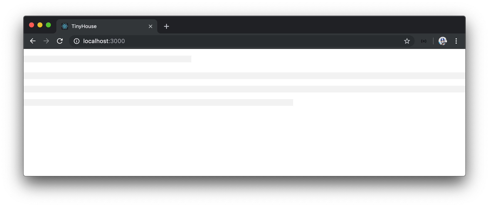

We'll add some margin and width constraints to the `<ListingsSkeleton>` component. To do so, we'll have the rendering of the `<ListingsSkeleton>` component in `<Listings>` be also wrapped with a div that has a class of `.listings`.

```tsx
// ...
import { ListingsSkeleton } from "./components";

// ...

export const Listings = ({ title }: Props) => {
  // ...

  if (loading) {
    return (
      <div className="listings">
        <ListingsSkeleton />
      </div>
    );
  }

  // ...
};
```

We'll now see that the skeleton UI is positioned more accordingly.

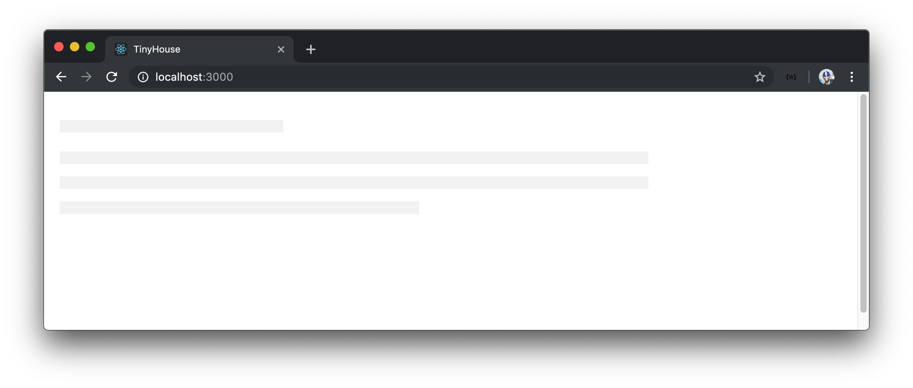

Let's now look to add the static title that we also see in the `<Listings>` component. We'll pass in the `title` available in `<Listing>` as a prop to `<ListingsSkeleton>` to ensure the title stays the same between them.

```tsx
// ...
import { ListingsSkeleton } from "./components";

// ...

export const Listings = ({ title }: Props) => {
  // ...

  if (loading) {
    return (
      <div className="listings">
        <ListingsSkeleton title={title} />
      </div>
    );
  }

  // ...
};
```

In the `ListingsSkeleton.tsx` file, we'll create a `Props` interface for the `<ListingsSkeleton>` component since we'll expect a `title` prop of type `string`. We'll use the `title` prop in a `<h2>` tag and wrap our return statement with a parent `<div>` element.

```tsx
import React from "react";
import { Skeleton } from "antd";

interface Props {
  title: string;
}

export const ListingsSkeleton = ({ title }: Props) => {
  return (
    <div>
      <h2>{title}</h2>
      <Skeleton />
    </div>
  );
};
```

We'll now be presented with a title at the top of our skeleton UI.

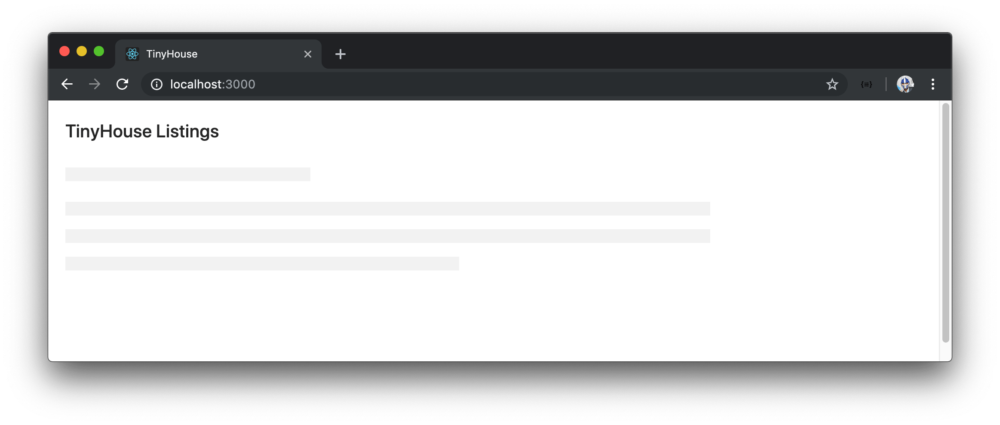

Let's make our `<ListingsSkeleton>` component resemble more of the list we intend to render. Ant Design's `<Skeleton>` component has a `paragraph` prop that takes an object and can help control the number of rows being displayed.

We'll edit the `<Skeleton>` component being rendered in `<ListingsSkeleton>` and specify a single row for `paragraph`. We'll also add the `active` prop to give our `<Skeleton>` the active blinking state.

```tsx
import React from "react";
import { Skeleton } from "antd";

interface Props {
  title: string;
}

export const ListingsSkeleton = ({ title }: Props) => {
  return (
    <div>
      <h2>{title}</h2>
      <Skeleton active paragraph={{ rows: 1 }} />
    </div>
  );
};
```

Our rendered `<Skeleton>` will now have single row after the header row.

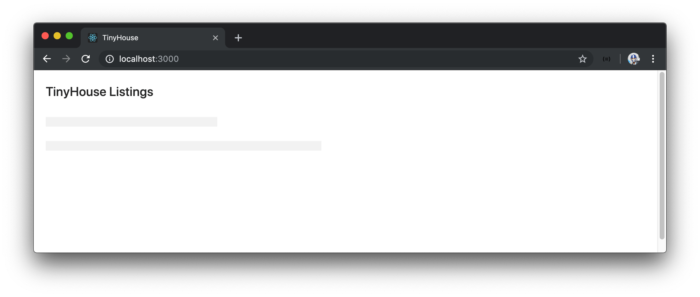

To mimic a list of three list items, we'll render two more identical `<Skeleton>` components in `<ListingsSkeleton>`.

```tsx
import React from "react";
import { Skeleton } from "antd";

interface Props {
  title: string;
}

export const ListingsSkeleton = ({ title }: Props) => {
  return (
    <div>
      <h2>{title}</h2>
      <Skeleton active paragraph={{ rows: 1 }} />
      <Skeleton active paragraph={{ rows: 1 }} />
      <Skeleton active paragraph={{ rows: 1 }} />
    </div>
  );
};
```

Ant Design provides a [`<Divider>` component](https://ant.design/components/divider/) that helps in displaying a divider between sections and text. In our `ListingsSkeleton.tsx` file, we'll import the `Divider` component module and place the `<Divider>` component between each `<Skeleton>` component.

```tsx
import React from "react";
import { Divider, Skeleton } from "antd";

interface Props {
  title: string;
}

export const ListingsSkeleton = ({ title }: Props) => {
  return (
    <div>
      <h2>{title}</h2>
      <Skeleton active paragraph={{ rows: 1 }} />
      <Divider />
      <Skeleton active paragraph={{ rows: 1 }} />
      <Divider />
      <Skeleton active paragraph={{ rows: 1 }} />
    </div>
  );
};
```

We'll now see a neat separation between each skeleton portion.

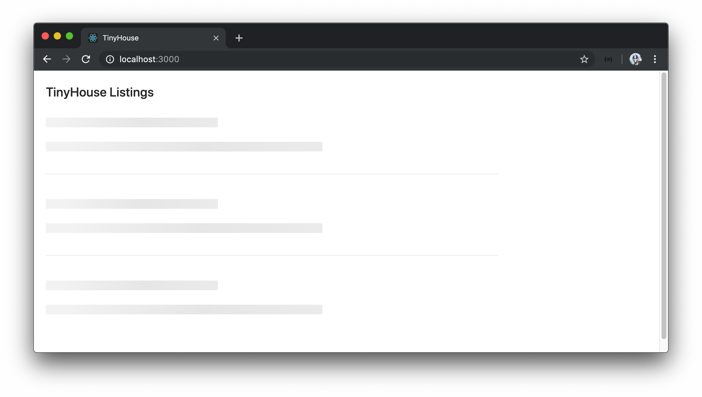

We can see that each skeleton paragraph portion adds a margin perhaps slightly larger than what we need to mimic our existing list. We can modify the styles Ant Design provides us directly if we want to. To see an example of this, we'll introduce a `ListingsSkeleton.css` file in a `styles/` folder within the `ListingsSkeleton/` folder.

```shell
client/
  src/
    sections/
      Listings/
        components/
          ListingsSkeleton/
            styles
              ListingsSkeleton.css
              // ...
```

In the `ListingsSkeleton.css` file, we'll directly modify the `.ant-divider-horizontal` class of our `<Divider>` component by providing a margin of `12px 0`.

```css
.listings-skeleton .ant-divider-horizontal {
  margin: 12px 0;
}
```

We'll further modify the `.ant-skeleton-paragraph` class generated by the `<Skeleton>` component to reduce the margin around the `<Skeleton>` paragraphs.

```css
.listings-skeleton .ant-skeleton-content .ant-skeleton-title + .ant-skeleton-paragraph {
  margin-top: 12px;
}

.listings-skeleton .ant-divider-horizontal {
  margin: 12px 0;
}
```

In the `ListingsSkeleton.tsx` file, we'll import the `ListingsSkeleton.css` file and apply the `.listings-skeleton` class in the parent rendered element of `<ListingsSkeleton>`.

```tsx
import React from "react";
import { Divider, Skeleton } from "antd";
import "./styles/ListingsSkeleton.css";

interface Props {
  title: string;
}

export const ListingsSkeleton = ({ title }: Props) => {
  return (
    <div className="listings-skeleton">
      <h2>{title}</h2>
      <Skeleton active paragraph={{ rows: 1 }} />
      <Divider />
      <Skeleton active paragraph={{ rows: 1 }} />
      <Divider />
      <Skeleton active paragraph={{ rows: 1 }} />
    </div>
  );
};
```

We'll now have the `<ListingsSkeleton>` component be a good resemblance to how our list will appear when data is available and three listing items are expected to be shown.

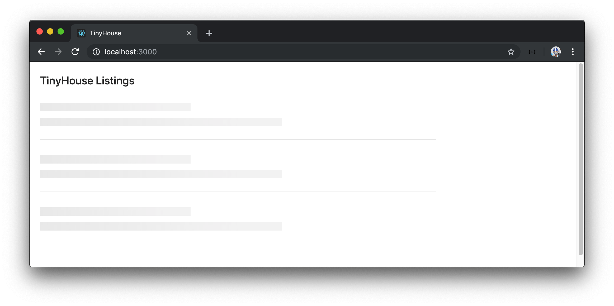

> It's important to note that modifying styles through custom means affects the intended styles brought forth by the Ant Design framework. There are also more sustainable ways to modify component styles in a global matter with which Ant Design provides [documentation](https://ant.design/docs/react/customize-theme) for.
>
> There are numerous different ways we could look to customize and create the skeleton layout of our list (e.g. the [`<List>` component has a `loading` prop](https://ant.design/components/list/#API) that shows a loading indicator while the contents of the list are being fetched). We've gone with this custom approach to get exposure to rendering child UI components and directly customizing the styles from Ant Design.

### `<Alert>`

#### `listings` query error

When our `listings` query fails, we've resorted to presenting a header tag that says `Uh oh! Something went wrong - please try again later :(`. Let's look to display this message within an alert banner of sorts. Ant Design provides an [`<Alert>` component](https://ant.design/components/alert/) to do just this.

We'll look to have this alert banner be shown at the top of the skeleton loading UI if our `listings` query ever fails. As a result, we'll slightly modify our `<ListingsSkeleton>` component to accept an `error` prop of type `boolean` with which we'll give a default parameter value of `false`. We'll import the `Alert` component module and conditionally show the `<Alert>` component when the `error` prop is true. Our `<Alert />` component will have the `type` prop given a value of `"error"` as well as the appropriate `message` prop.

```tsx
import React from "react";
import { Alert, Divider, Skeleton } from "antd";
import "./styles/ListingsSkeleton.css";

interface Props {
  title: string;
  error?: boolean;
}

export const ListingsSkeleton = ({ title, error = false }: Props) => {
  const errorAlert = error ? (
    <Alert
      type="error"
      message="Uh oh! Something went wrong :(. Please try again later."
    />
  ) : null;

  return (
    <div className="listings-skeleton">
      {errorAlert}
      <h2>{title}</h2>
      <Skeleton active paragraph={{ rows: 1 }} />
      <Divider />
      <Skeleton active paragraph={{ rows: 1 }} />
      <Divider />
      <Skeleton active paragraph={{ rows: 1 }} />
    </div>
  );
};
```

We'll introduce a `.listings-skeleton__alert` class in the `ListingsSkeleton.css` file to add a little margin below the rendered alert component.

```css
.listings-skeleton .listings-skeleton__alert {
  margin-bottom: 20px;
}
```

We'll apply the `.listings-skeleton__alert` class to the rendered `<Alert>` component in `<ListingsSkeleton>`.

The `ListingsSkeleton.tsx` file in its final state will look like the following:

```tsx
import React from "react";
import { Alert, Divider, Skeleton } from "antd";
import "./styles/ListingsSkeleton.css";

interface Props {
  title: string;
  error?: boolean;
}

export const ListingsSkeleton = ({ title, error = false }: Props) => {
  const errorAlert = error ? (
    <Alert
      type="error"
      message="Uh oh! Something went wrong :(. Please try again later."
      className="listings-skeleton__alert"
    />
  ) : null;

  return (
    <div className="listings-skeleton">
      {errorAlert}
      <h2>{title}</h2>
      <Skeleton active paragraph={{ rows: 1 }} />
      <Divider />
      <Skeleton active paragraph={{ rows: 1 }} />
      <Divider />
      <Skeleton active paragraph={{ rows: 1 }} />
    </div>
  );
};
```

In the `Listings.tsx` file, we'll render the `<ListingsSkeleton>` component with the `error` prop set to `true` when the query `error` property is `true`.

```tsx
// ...
import { ListingsSkeleton } from "./components";

// ...

export const Listings = ({ title }: Props) => {
  // ...

  if (error) {
    return (
      <div className="listings">
        <ListingsSkeleton title={title} error />
      </div>
    );
  }

  // ...
};
```

If our `listings` query ever fails, we'll now see an alert banner be shown at the top of our skeleton UI.

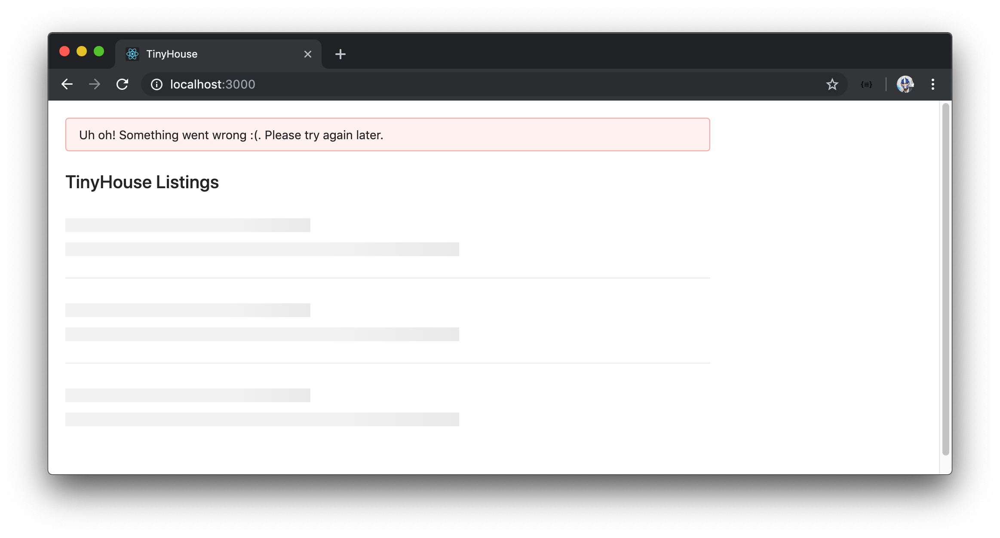

#### `deleteListing` mutation error

We'll attempt to show the `<Alert>` component if the `deleteListing` mutation ever fails. In this case, we'll look to have the `<Alert>` component be shown at the top of the rendered list in the `<Listings>` component.

In the `Listings.tsx` file, we'll import the `Alert` component module. We'll remove the `deleteListingErrorMessage` `const` variable we had before and instead have a `deleteListingErrorAlert` `const` variable that is assigned a value of the `<Alert>` component when the mutation has failed. We'll also add a `.listings__alert` class to the `<Alert>` component that is to be rendered.

```tsx
// ...
import { Alert, Avatar, Button, List, Spin } from "antd";

// ...

export const Listings = ({ title }: Props) => {
  // ...

  const deleteListingErrorAlert = deleteListingError ? (
    <Alert
      type="error"
      message="Uh oh! Something went wrong :(. Please try again later."
      className="listings__alert"
    />
  ) : null;

  return (
    <div className="listings">
      {deleteListingErrorAlert}
      <Spin spinning={deleteListingLoading}>
        <h2>{title}</h2>
        {listingsList}
      </Spin>
    </div>
  );
};
```

Our `Listings.tsx` file in its final state will look like the following:

```tsx
import React from "react";
import { gql } from "apollo-boost";
import { useQuery, useMutation } from "@apollo/react-hooks";
import { Alert, Avatar, Button, List, Spin } from "antd";
import { Listings as ListingsData } from "./__generated__/Listings";
import { ListingsSkeleton } from "./components";
import {
  DeleteListing as DeleteListingData,
  DeleteListingVariables
} from "./__generated__/DeleteListing";
import "./styles/Listings.css";

const LISTINGS = gql`
  query Listings {
    listings {
      id
      title
      image
      address
      price
      numOfGuests
      numOfBeds
      numOfBaths
      rating
    }
  }
`;

const DELETE_LISTING = gql`
  mutation DeleteListing($id: ID!) {
    deleteListing(id: $id) {
      id
    }
  }
`;

interface Props {
  title: string;
}

export const Listings = ({ title }: Props) => {
  const { data, loading, error, refetch } = useQuery<ListingsData>(LISTINGS);

  const [
    deleteListing,
    { loading: deleteListingLoading, error: deleteListingError }
  ] = useMutation<DeleteListingData, DeleteListingVariables>(DELETE_LISTING);

  const handleDeleteListing = async (id: string) => {
    await deleteListing({ variables: { id } });
    refetch();
  };

  const listings = data ? data.listings : null;

  const listingsList = listings ? (
    <List
      itemLayout="horizontal"
      dataSource={listings}
      renderItem={listing => (
        <List.Item
          actions={[
            <Button type="primary" onClick={() => handleDeleteListing(listing.id)}>
              Delete
            </Button>
          ]}
        >
          <List.Item.Meta
            title={listing.title}
            description={listing.address}
            avatar={<Avatar src={listing.image} shape="square" size={48} />}
          />
        </List.Item>
      )}
    />
  ) : null;

  if (loading) {
    return (
      <div className="listings">
        <ListingsSkeleton title={title} />
      </div>
    );
  }

  if (error) {
    return (
      <div className="listings">
        <ListingsSkeleton title={title} error />
      </div>
    );
  }

  const deleteListingErrorAlert = deleteListingError ? (
    <Alert
      type="error"
      message="Uh oh! Something went wrong :(. Please try again later."
      className="listings__alert"
    />
  ) : null;

  return (
    <div className="listings">
      {deleteListingErrorAlert}
      <Spin spinning={deleteListingLoading}>
        <h2>{title}</h2>
        {listingsList}
      </Spin>
    </div>
  );
};
```

In the `Listings.css` file, we'll add a `margin-bottom` property to the `.listings__alert` class.

```tsx
.listings .listings__alert {
  margin-bottom: 20px;
}
```

When we now delete a listing and if it ever fails, we'll receive an error alert at the top of our list.

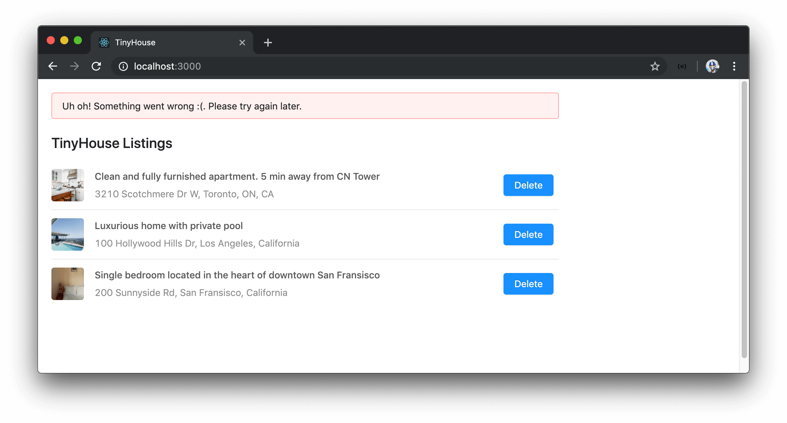

> Notice how we've maintained a similar pattern to how we handle query and mutation errors? When the query fails, we have no data to display so we simply display an error alert above the skeleton UI. Since we already have information be presented in the UI when the mutation fails, we resort to displaying an error alert above the existing list for a mutation error.

This brings us to the end of the lesson. By using Ant Design, we were able to leverage many different components from the framework to style and make our application more presentable!

Our application's core behavior is the same as what we had in the previous lesson.

- We make our query and mutation.
- We display a loading indicator of sorts when the query or mutation is in flight.
- We display an error alert when either the query or mutation fails.

We've been able to leverage Ant Design and utilize the styles and components Ant Design provides for each of the above scenarios. There are numerous different components we can use and it is up to the developer, the development team, and/or designers to discuss and address the intended UI behavior.

This officially concludes the development needed in Part I of this course! Bravo!
